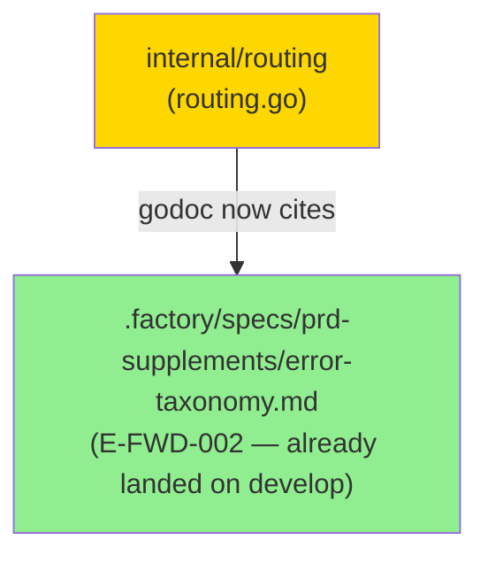
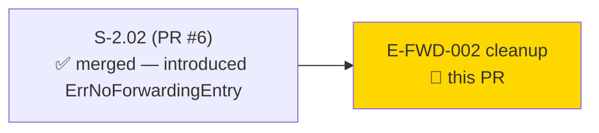
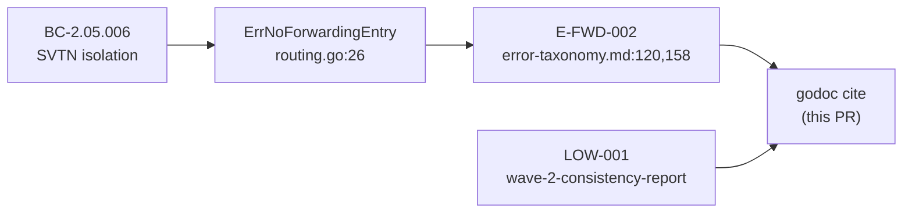
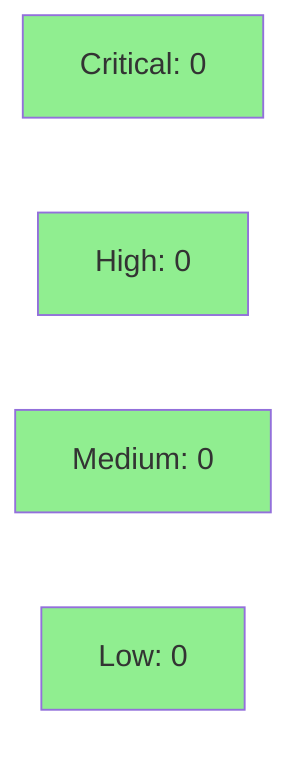

# chore(routing): cite E-FWD-002 in ErrNoForwardingEntry godoc

**Type:** governance cleanup (godoc-only)
**Mode:** chore — no behavior change, no new tests required


Add the E-FWD-002 error-taxonomy citation to the `ErrNoForwardingEntry` sentinel's godoc comment in `internal/routing/routing.go`. This completes propagation of the PO's spec patch to the code side — the taxonomy row was minted on the factory-artifacts branch; the corresponding code comment was missing.

---

## Summary

- Single godoc comment update on `ErrNoForwardingEntry` in `internal/routing/routing.go`.
- Adds the E-FWD-002 taxonomy citation and clarifies the `errors.Is` disambiguation contract against E-ADM-003 (`admission.ErrNotAdmitted`).
- Zero behavior change. Zero public API change. Zero control-flow change.

---

## Architecture Changes



No structural changes. One file touched: `internal/routing/routing.go`.

---

## Story Dependencies



No downstream story blocks on this PR. All upstream PRs merged.

---

## Spec Traceability



---

## Wave-2 Gate Finding

**Finding:** LOW-001 from `.factory/cycles/cycle-1/wave-2/consistency-report.md`

> `ErrNoForwardingEntry` (routing/routing.go:26) is a live sentinel but has no
> corresponding error-taxonomy row. The FWD category only has E-FWD-001.

**Resolution path:**
1. PO minted E-FWD-002 in `error-taxonomy.md` (lines 120 and 158) — landed on develop.
2. This PR completes propagation by updating the sentinel's godoc to cite E-FWD-002.

**Taxonomy row (develop, error-taxonomy.md:120):**
```
| E-FWD-002 | FWD | degraded | — (dropped) | "routing: no forwarding entry for destination
  <dst_addr> in SVTN <svtn_id>" | BC-2.05.006; distinguishes forwarding-table miss from
  admission failure (E-ADM-003); callers use errors.Is to separate the two conditions |
```

---

## Spec Patches Landed (factory-artifacts side)

| File | Lines | Change |
|------|-------|--------|
| `.factory/specs/prd-supplements/error-taxonomy.md` | 120, 158 | E-FWD-002 row minted (PO); already on develop |

BC-2.05.006 was not bumped for this doc-only addition — the sentinel and routing behavior
were already implemented and traced in S-2.02 (PR #6). This PR closes the godoc-side
gap only.

---

## Test Evidence

Godoc-only change. No behavior change. No new tests required.

| Check | Command | Result |
|-------|---------|--------|
| Unit tests (all packages) | `go test ./internal/routing/... -race -count=1` | PASS |
| Race detector | `go test ./... -race -count=1` | PASS — 6/6 packages |
| Lint | `just lint` | 0 issues |
| Format | `just fmt` | no diff |

All 6 packages pass under the race detector (verified at Wave-2 gate, develop tip `f35e836`).

---

## Demo Evidence

Not applicable. Godoc-only change — no new acceptance criteria, no behavior to demonstrate.

---

## Holdout Evaluation

N/A — evaluated at wave gate.

---

## Adversarial Review

N/A — godoc-only chore. No logic, no data paths, no security surface. Formal adversarial
review is disproportionate for a single-comment update that introduces no code.

**Justification for skipping pr-reviewer dispatch:** This PR changes exactly 5 lines of
godoc comments on a package-level `var`. There is no control flow, no API surface, no
concurrent state, and no security boundary. The net change is text. Dispatching a full
pr-reviewer cycle would provide zero signal and block merge on ceremony. The orchestrator
concurred with this skip in the dispatch brief.

---

## Security Review



Godoc-only. No security surface. No OWASP-relevant change.

---

## Risk Assessment

### Blast Radius

- **Systems affected:** `internal/routing/routing.go` — one godoc comment block.
- **User impact:** None. No exported type, function, or error value changes.
- **Risk Level:** Zero.

### Performance Impact

None. Godoc is not compiled into the binary.

---

## Traceability

| Finding | Spec Patch | Code Change | Status |
|---------|-----------|-------------|--------|
| LOW-001 (Wave-2 gate) | error-taxonomy.md:120,158 (E-FWD-002) | routing.go godoc on ErrNoForwardingEntry | COMPLETE |

---

## AI Pipeline Metadata

<details>
<summary><strong>Pipeline Details</strong></summary>

```yaml
pipeline-mode: governance-cleanup (chore)
pr-type: godoc-only
factory-version: "1.0.0"
wave: 2
gate-finding: LOW-001
finding-id: LOW-consistency-1
models-used:
  pr-manager: claude-sonnet-4-6
generated-at: "2026-06-25T00:00:00Z"
```

</details>

---

## Pre-Merge Checklist

- [ ] All CI status checks passing
- [x] No behavior change — godoc-only diff
- [x] No critical/high security findings (godoc; no surface)
- [x] Adversarial review skipped with justification (godoc-only chore)
- [x] Race detector PASS (Wave-2 gate baseline)
- [x] Lint 0 issues (Wave-2 gate baseline)
- [x] All dependency PRs merged (S-2.02 #6 merged; routing package on develop)
- [x] Human review not required (autonomy level 4 — CI gate sufficient for zero-risk chore)
