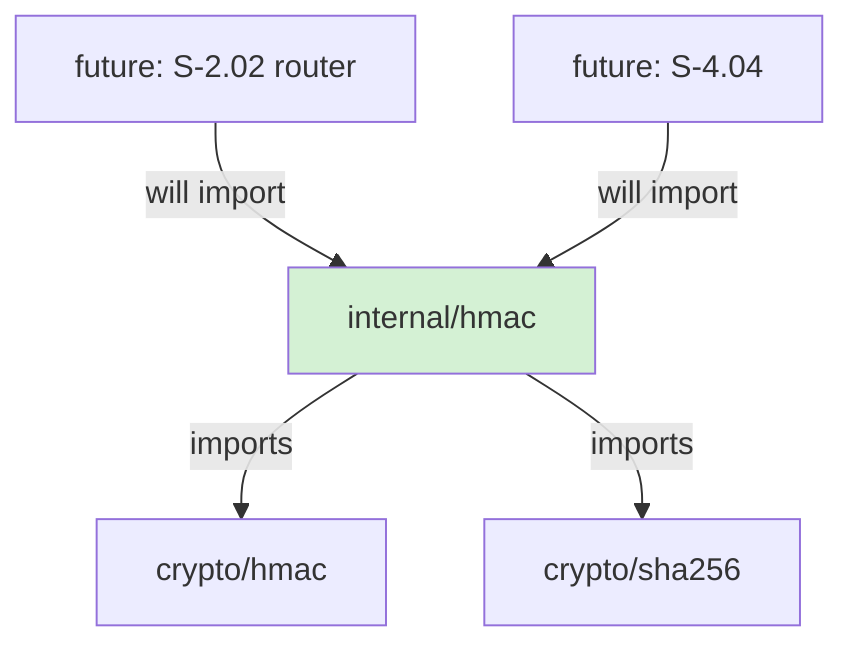
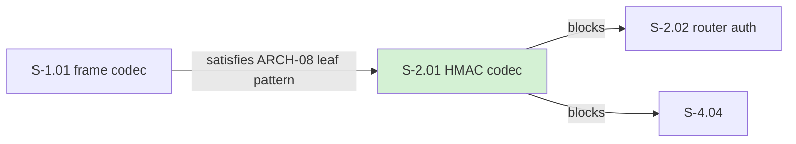
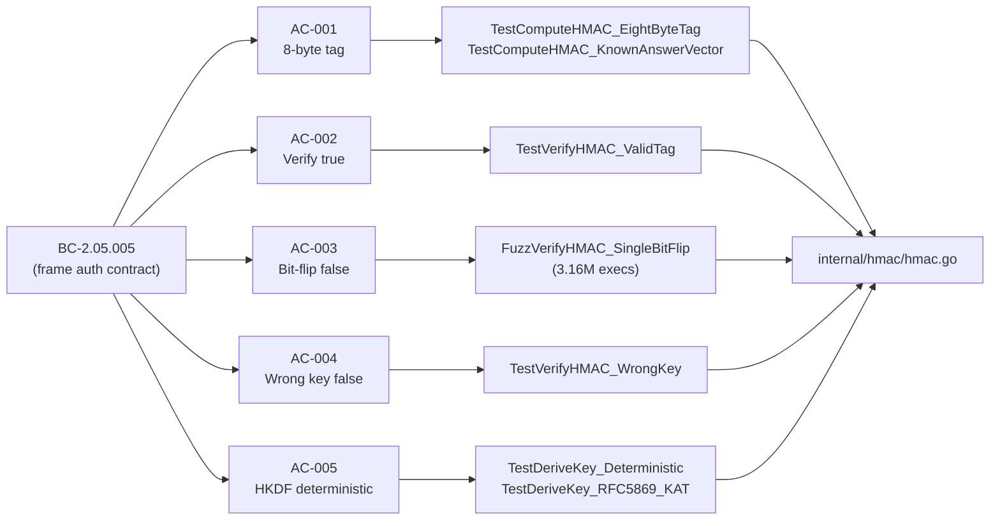

## Summary

- Implements `ComputeHMAC`, `VerifyHMAC`, and `DeriveKey` in `internal/hmac` — HMAC-SHA256 frame authentication with 8-byte (64-bit) truncated tag per ADR-001 and BC-2.05.005
- Per-(node, SVTN) forge-resistance via HKDF-SHA256: each `DeriveKey(nodeAdmissionPubkey, svtnID)` call produces a domain-isolated key; distinct pubkeys and SVTNs provably produce distinct keys (ARCH-04 §175-180)
- Constant-time verification via `crypto/hmac.Equal` — no timing oracle on tag comparison
- Inline HKDF (RFC 5869 Extract + single Expand) over `golang.org/x/crypto/hkdf` — the 32-byte single-block case is ~6 auditable lines; implementation pinned by RFC 5869 §A.1 KAT (`hkdf_internal_test.go:23-44`); ARCH-04 v1.1 documents the policy
- ARCH-08 leaf invariant enforced: `internal/hmac` imports only `crypto/hmac` + `crypto/sha256`; no internal/ imports, no `time.Now`, no I/O — pure-core

## Architecture Changes

## Story Dependencies

## Spec Traceability

## Acceptance Criteria Coverage

| AC | Description | Test(s) | Status |
|----|-------------|---------|--------|
| AC-001 | ComputeHMAC produces 8-byte HMAC-SHA256 tag | `TestComputeHMAC_EightByteTag`, `TestComputeHMAC_KnownAnswerVector` | PASS |
| AC-002 | VerifyHMAC returns true for matching tag | `TestVerifyHMAC_ValidTag` | PASS |
| AC-003 | VerifyHMAC returns false for any single-bit payload flip | `FuzzVerifyHMAC_SingleBitFlip` (3.16M execs, 10s) | PASS |
| AC-004 | VerifyHMAC returns false for wrong key | `TestVerifyHMAC_WrongKey` | PASS |
| AC-005 | DeriveKey uses HKDF-SHA256, deterministic | `TestDeriveKey_Deterministic`, `TestDeriveKey_RFC5869_KAT` | PASS |
| EC-001 | Empty frame bytes → valid 8-byte tag | `TestComputeHMAC_EmptyFrame` | PASS |
| EC-002 | All-zeros SVTN ID accepted | `TestDeriveKey_ZeroSVTN` | PASS |
| EC-003 | Zero/mismatched tag rejected without panic | `TestVerifyHMAC_ZeroTagRejected` | PASS |

## KAT Verification

| RFC | Vector | Test | Location | Status |
|-----|--------|------|----------|--------|
| RFC 4231 §4.2 | key=`"Jefe"`, data=`"what do ya want for nothing?"`, tag=`5bdcc146bf60754e` | `TestComputeHMAC_KnownAnswerVector` | `hmac_test.go:50-59` | PASS |
| RFC 5869 §A.1 | IKM=22×0x0b, salt=0x00..0x0c, info=0xf0..0xf9, L=42 (multi-block expand) | `TestDeriveKey_RFC5869_KAT` | `hkdf_internal_test.go:23-44` | PASS |

## Test Evidence

| Category | Result |
|----------|--------|
| `go test ./internal/hmac/...` | PASS — all unit + property tests |
| `go test -race -count=10 ./internal/hmac/...` | PASS — 10 consecutive runs, no races, no flakes |
| `just lint` | 0 issues |
| `FuzzVerifyHMAC_SingleBitFlip` (10s smoke) | 3,159,352 executions; 0 failures |
| `FuzzVerifyHMAC_TagBitFlip` (10s smoke) | 842,825 executions; 0 failures |
| `TestDeriveKey_DistinctPubkeysProduceDistinctKeys` | PASS (ARCH-04 §175-180 invariant) |
| `TestDeriveKey_DistinctSVTNsProduceDistinctKeys` | PASS (RFC 5869 §3.1 salt mixing) |

## Demo Evidence

Per-AC evidence captured at `.factory/cycles/cycle-1/S-2.01/demo-evidence/per-ac-evidence.md` (worktree tip `bf40e82`). All 5 ACs + 3 ECs + 2 KATs + 2 fuzz targets + race harness + 2 forge-resistance tests — all PASS.

## Adversary Convergence Summary

**12 passes; trajectory: 9 → 2 → 4 → 1 → 0 → 0 → 1 → 0 → 1 → 0 → 0 → 0**

BC-5.39.001 SATISFIED — 3 consecutive clean passes (10/11/12). 17 findings cumulative across passes 1/2/3/4/7/9; all resolved.

Reports: `.factory/cycles/cycle-1/S-2.01/adversary/pass-{01..12}.md`

## Security Review

This is a cryptographic module (`internal/hmac`). Security axes reviewed:

| Axis | Verdict |
|------|---------|
| Key leakage | No key material logged; no debug prints; pure-core — no I/O path exists |
| Timing oracle | `crypto/hmac.Equal` (constant-time); no early-return compare |
| RFC compliance | HMAC-SHA256 per RFC 2104 + RFC 4231 §4.2 KAT; HKDF per RFC 5869 §A.1 KAT (L=42 multi-block) |
| Truncation soundness | 64-bit tag — consistent with ADR-001; truncation is first 8 bytes of full HMAC-SHA256 output |
| Forge resistance | Per-(node, SVTN) key domain; distinct keys confirmed for distinct pubkeys and distinct SVTNs |
| Dependency attack surface | Stdlib only (`crypto/hmac`, `crypto/sha256`); zero external crypto dependencies |

_Full security review to be populated after security-reviewer sub-agent completes (step 4)._

## Holdout Evaluation

N/A — evaluated at wave gate.

## Adversarial Review

Completed — 12 adversary passes with BC-5.39.001 satisfied (3 consecutive clean). See convergence summary above.

## Risk Assessment

| Dimension | Assessment |
|-----------|-----------|
| Blast radius | Low — `internal/hmac` is a new leaf package; no existing callers yet |
| Performance impact | Negligible — pure computation; no allocations beyond key derivation |
| Rollback risk | Low — squash-merge; `internal/hmac` not yet imported by any non-test code |
| Security risk | Low — stdlib-only; RFC-pinned; KAT-verified; constant-time compare |

## AI Pipeline Metadata

| Field | Value |
|-------|-------|
| Pipeline mode | Greenfield VSDD cycle-1 |
| Story revision | 5 |
| Adversary passes | 12 |
| Models used | claude-sonnet-4-6 |
| Cycle | v1.0.0-greenfield |

## Files Changed

| File | Action | Purpose |
|------|--------|---------|
| `internal/hmac/hmac.go` | create | `ComputeHMAC`, `VerifyHMAC`, `DeriveKey`, `hkdfSHA256` |
| `internal/hmac/hmac_test.go` | create | Unit + property + KAT tests |
| `internal/hmac/fuzz_test.go` | create | `FuzzVerifyHMAC_SingleBitFlip`, `FuzzVerifyHMAC_TagBitFlip` |
| `internal/hmac/hkdf_internal_test.go` | create | RFC 5869 §A.1 KAT for unexported `hkdfSHA256` helper |
| `internal/hmac/example_test.go` | create | `ExampleComputeHMAC`, `ExampleVerifyHMAC` godoc examples |

## Cross-References

- drbothen/vsdd-factory#263 — filed mid-cycle for PO agent overreach; PR closed cleanly; not blocking
- BC-5.39.001 convergence — 3 consecutive clean adversary passes satisfy the mandatory gate

## Conscious Design Choices

**Inline HKDF over `golang.org/x/crypto/hkdf`:** The 32-byte single-block case requires exactly one Extract + one Expand iteration (~6 lines). Stdlib-only keeps `go.mod` clean; the RFC 5869 §A.1 KAT in `hkdf_internal_test.go:23-44` pins correctness. Story rev 2+ amended Library Requirements to permit this; ARCH-04 v1.1 documents the policy.

**Constant-time compare:** `crypto/hmac.Equal` is the canonical Go idiom for tag comparison. It calls `subtle.ConstantTimeCompare` internally — no manual loop needed.

**Pure-core / ARCH-08 leaf:** Only `crypto/hmac` + `crypto/sha256` imports; no internal/ imports; no `time.Now`, no I/O. Go vet enforces the import boundary at CI.

**Fuzz dual coverage:** Two fuzz targets retained — `FuzzVerifyHMAC_SingleBitFlip` (AC-003 wording: frame payload corruption) + `FuzzVerifyHMAC_TagBitFlip` (VP-005 canonical: tag forgery resistance). Pass-2 F-002 decision to cover both angles; both retained through all 12 adversary passes without objection.

## Spec Changes (Ride-Along)

Factory-artifacts branch (`be94426`) carries spec-only commits updated during the adversary cycle. BC-2.05.005 itself is untouched. Changes already merged to factory-artifacts:
- Story S-2.01 rev 5 (AC trace fixes, file structure table, library requirements amendment)
- VP-004/005/006 v1.1
- ARCH-04 v1.1 (HKDF dual-permit + KAT mandate)

These spec patches are in `.factory/` (gitignored from main module build); no Go source affected.

## Pre-Merge Checklist

- [x] PR description populated with traceability, test evidence, demo evidence
- [x] Demo evidence: per-AC evidence report exists with all ACs covered
- [x] Adversary convergence: BC-5.39.001 satisfied (3 consecutive clean)
- [x] `go test -race -count=10` clean
- [x] `just lint` 0 issues
- [x] `just fmt` applied
- [x] ARCH-08 leaf invariant: no internal/ imports
- [x] KATs: RFC 4231 §4.2 + RFC 5869 §A.1 both PASS
- [ ] CI checks passing
- [ ] Security review cleared
- [ ] PR reviewer approved
- [ ] All dependency PRs merged (S-1.01 — PR #1, merged)
