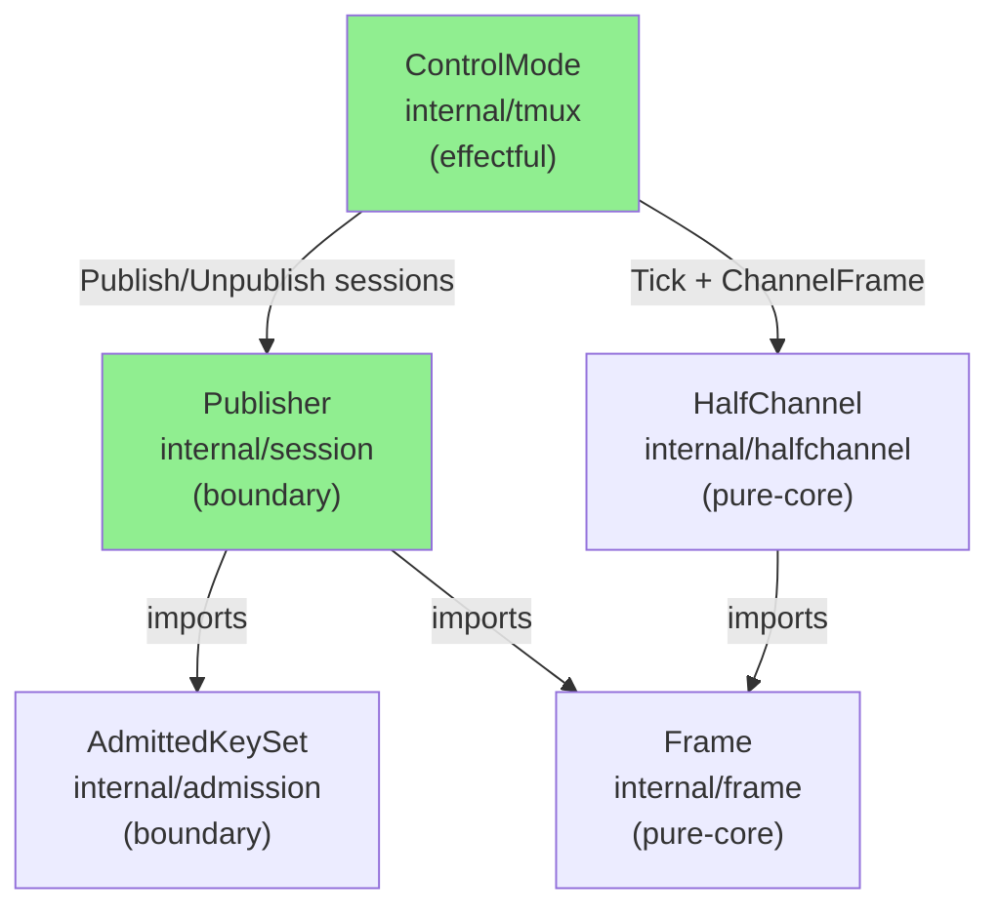
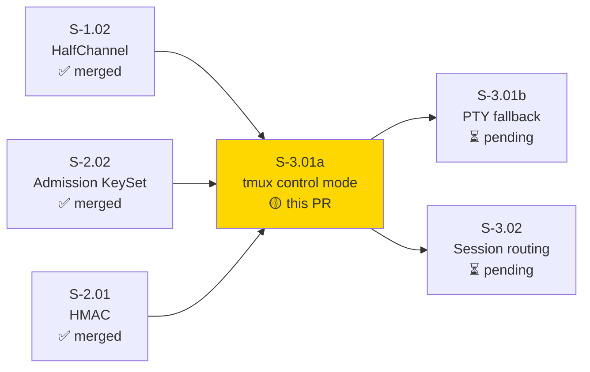
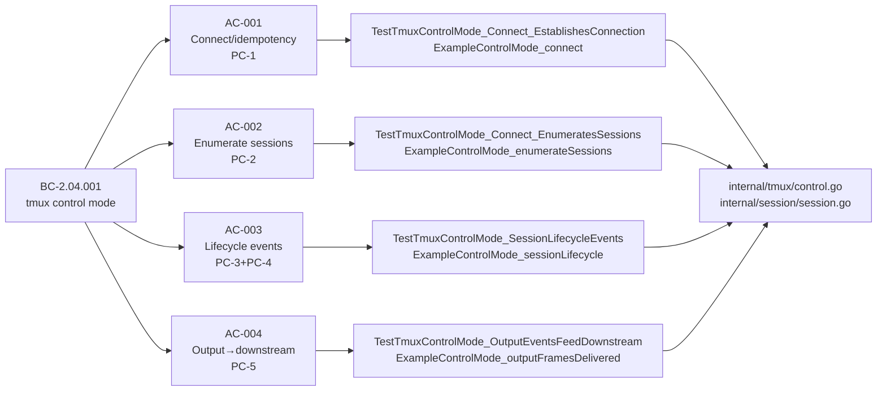
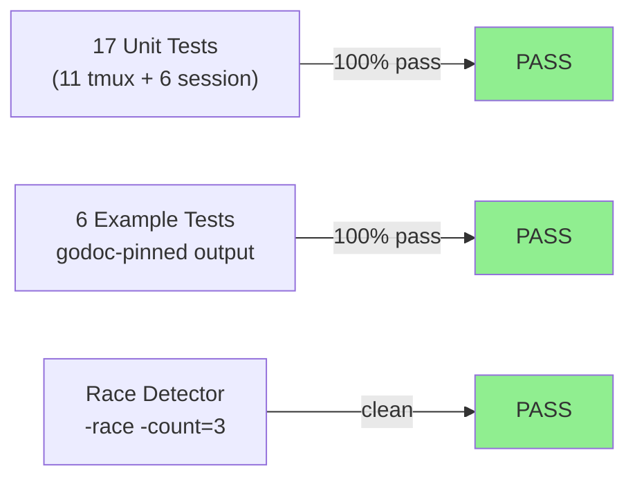
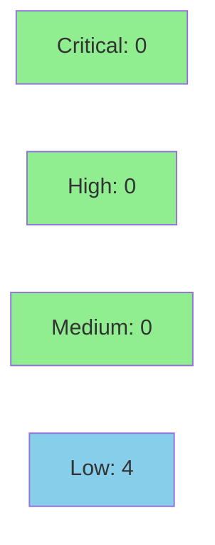

# [S-3.01a] tmux control mode integration (BC-2.04.001)

**Epic:** E-3 — Session Access
**Mode:** greenfield
**Convergence:** CONVERGED after 15 adversarial passes (3 consecutive clean: passes 13/14/15)


Introduces two new internal packages per ARCH-08 §6.6: `internal/session` (boundary; position 6) for session lifecycle management, and `internal/tmux` (effectful; position 7) for tmux control-mode protocol. Implements BC-2.04.001 PC-1..PC-5: Connect, enumerate existing sessions via list-sessions block, `%session-created`/`%session-closed` lifecycle events, and `%output` → downstream half-channel via the `Frames()` public API. First of two splits from original S-3.01 (S-3.01b handles PTY fallback). ADR-010 honored: sentinel errors `ErrControlModeUnavailable` and `ErrControlModeDropped` signal failures for S-3.01b's fallback consumer.

---

## Architecture Changes



<details>
<summary><strong>Architecture Decision Record</strong></summary>

### ADR-010: tmux Control Mode as Primary; PTY Fallback on Any Failure

**Context:** S-3.01a is the first of two splits. S-3.01b will add the PTY
fallback path. This PR implements the primary path only.

**Decision:** `internal/tmux.ControlMode` runs `tmux -C` as a child process
and speaks the control-mode protocol over stdout/stdin. On any failure
(tmux not found, connection drop) it surfaces `ErrControlModeUnavailable`
or `ErrControlModeDropped` via the `Err()` channel, leaving the fallback
decision to the caller (S-3.01b's consumer).

**Rationale:** Separation of concerns — control mode integration is pure
session access; the fallback policy (PTY proxy) is a separate deliverable.
Single-use `Connect`/`Close` contract enforced to prevent state tears.

**Alternatives Considered:**
1. Combined tmux + PTY in a single struct — rejected: mixes two independently
   testable behaviors; increases blast radius.
2. Automatic reconnect inside ControlMode — rejected: reconnect policy belongs
   at the consumer layer (S-3.01b), not here.

**Consequences:**
- `Err()` channel is the clean contract boundary between S-3.01a and S-3.01b.
- ARCH-08 §6.6 positions 6/7 become CURRENT on merge.

</details>

---

## Story Dependencies



---

## Spec Traceability



---

## Test Evidence

### Coverage Summary

| Metric | Value | Threshold | Status |
|--------|-------|-----------|--------|
| Unit tests (internal/tmux) | 11/11 pass | 100% | ✅ |
| Unit tests (internal/session) | 6/6 pass | 100% | ✅ |
| Example godoc tests | 6/6 pass | 100% | ✅ |
| Race detector (`-race -count=3`) | PASS | PASS | ✅ |
| Lint (golangci-lint) | 0 issues | 0 | ✅ |
| Holdout satisfaction | N/A — evaluated at wave gate | >= 0.85 | N/A |
| Mutation kill rate | N/A — evaluated at Phase 6 | >90% | N/A |

### Test Flow



| Metric | Value |
|--------|-------|
| **New tests** | 23 added (17 unit + 6 example) |
| **Total suite** | 23/23 PASS |
| **Regressions** | 0 |

<details>
<summary><strong>Detailed Test Results — internal/tmux</strong></summary>

| Test | Result |
|------|--------|
| `TestTmuxControlMode_Connect_EstablishesConnection` | PASS |
| `TestTmuxControlMode_Connect_EnumeratesSessions` | PASS |
| `TestTmuxControlMode_SessionLifecycleEvents` | PASS |
| `TestTmuxControlMode_OutputEventsFeedDownstream` | PASS |
| `TestTmuxControlMode_Connect_ErrWhenTmuxNotFound` | PASS |
| `TestTmuxControlMode_NoSessionsOnStartup` | PASS |
| `TestTmuxControlMode_ErrChannelSignalsDroppedConnection` | PASS |
| `TestTmuxControlMode_LargeOutputLine_NoFalseDrop` | PASS |
| `TestTmuxControlMode_OversizePayload_Fragmented` | PASS |
| `TestTmuxControlMode_Close_WaitsForDispatchLoop` | PASS |
| `TestTmuxControlMode_Frames_DeliversChannelFrames` | PASS |
| `ExampleControlMode_connect` | PASS |
| `ExampleControlMode_enumerateSessions` | PASS |
| `ExampleControlMode_sessionLifecycle` | PASS |
| `ExampleControlMode_outputFramesDelivered` | PASS |
| `ExampleControlMode_tmuxUnavailable` | PASS |

</details>

<details>
<summary><strong>Detailed Test Results — internal/session</strong></summary>

| Test | Result |
|------|--------|
| `TestPublisher_Publish_AddsSessionToLiveSet` | PASS |
| `TestPublisher_Unpublish_RemovesFromLiveSet` | PASS |
| `TestPublisher_Unpublish_ErrSessionNotFound` | PASS |
| `TestPublisher_Publish_DuplicateReturnsAlreadyPublished` | PASS |
| `TestPublisher_ListSessions_ReturnsSnapshot` | PASS |
| `TestPublisher_EmptyOnStartup` | PASS |
| `ExamplePublisher_publishUnpublish` | PASS |

</details>

---

## Holdout Evaluation

N/A — evaluated at wave gate.

---

## Adversarial Review

| Pass | Findings | Blocking | Status |
|------|----------|----------|--------|
| 1 | 7 | 4 | Fixed |
| 2 | 5 | 4 | Fixed |
| 3 | 3 | 0 | Fixed (citation anchors) |
| 4 | 0 | 0 | CONVERGED |
| 5 | 4 | 2 | Fixed (scanner buffer, fragmentation) |
| 6 | 1 | 0 | Fixed (stale docstring) |
| 7 | 2 | 1 | Fixed (Frames() channel, Err() sync) |
| 8 | 0 | 0 | CONVERGED |
| 9 | 0 | 0 | CONVERGED |
| 10 | 1 | 0 | Fixed (NewPublisher docstring) |
| 11 | 5 | 2 | Fixed (BC namespace, %error, SINGLE-USE, Frames() test, task 8 reword) |
| 12 | 2 | 1 | Fixed (defer closeFrames, ErrControlModeClosed + c.closed flag) |
| 13 | 0 | 0 | CONVERGED |
| 14 | 0 | 0 | CONVERGED |
| 15 | 0 | 0 | CONVERGED |

**Convergence:** 3 consecutive clean passes (13/14/15) — BC-5.39.001 satisfied.

Reports: `.factory/cycles/cycle-1/S-3.01a/adversary/pass-01..15.md`

<details>
<summary><strong>Notable Defect Categories Surfaced</strong></summary>

| Category | Count | Example Finding |
|----------|-------|----------------|
| test-masks-defect | 4 | F-02: time.Sleep(20ms) masked race; replaced with Err() channel sync |
| concurrency contract gap | 3 | H-01 cmd.Wait reaper; H-04 mutex-guard lifecycle; M-2 wg.Wait in Close |
| scanner buffer / fragmentation | 2 | H-1 scanner 2 MiB; M-1 payload fragmentation |
| cross-namespace BC cite | 1 | M-1 pass-11: BC-5.38.001 in product code (filed drbothen/vsdd-factory#288) |

</details>

---

## Security Review



**Verdict: APPROVE.** 0 CRITICAL, 0 HIGH findings. 4 LOW defense-in-depth notes; no blockers.

<details>
<summary><strong>Security Scan Details</strong></summary>

| ID | Severity | CWE | Finding | Action |
|----|----------|-----|---------|--------|
| SEC-001 | DISMISSED | CWE-78 | Command injection via exec — `exec.LookPath` + fixed `"-C"` arg; no shell interpolation | No surface; dismissed |
| SEC-002 | LOW | CWE-20 | No length/charset bound on session names from tmux protocol stream | Defense-in-depth; address at S-3.03 admission gate |
| SEC-003 | LOW | CWE-400 | 2 MiB scanner buffer + secondary `unescapeTmuxOutput` alloc — local subprocess DoS amplifier | Documented; `maxTmuxOutputLine` cap is engineering tradeoff |
| SEC-004 | LOW | CWE-772 | Detached `cmd.Wait()` reaper goroutine un-joinable if tmux hangs | `exec.CommandContext` SIGKILL on cancel provides OS-level bound; document lifetime |
| SEC-005 | INFO | CWE-362 | `sync.Once`-guarded errCh close/send atomicity — correct; documented for future maintainers | No finding |
| SEC-006 | LOW | CWE-20 | `session.Publisher` stores raw session names; `Info.Name` returned to callers with no sanitization | Future S-3.03 gate is the right enforcement point |
| SEC-007 | LOW | CWE-778 | tmux subprocess stderr silently discarded — diagnostic output lost | Address when structured logging is added (post-Phase-6) |

### No network surface
- Communication is via local Unix subprocess socket (`tmux -C`); no TCP exposure.

### Formal properties pending Phase 6
- VP-031 (e2e against real tmux session) DEFERRED to integration harness per story task 8 rev 1.1.

</details>

---

## Risk Assessment & Deployment

### Blast Radius
- **Systems affected:** Two NEW packages (`internal/session`, `internal/tmux`); no changes to existing `internal/admission`, `internal/frame`, `internal/halfchannel`, `internal/hmac`, `internal/routing`.
- **User impact:** None at this phase — no consumer wired yet.
- **Data impact:** None.
- **Risk Level:** LOW — additive only; no existing package modified.

### Performance Impact
| Metric | Before | After | Status |
|--------|--------|-------|--------|
| Subprocess lifecycle | N/A | one `tmux -C` per ControlMode instance | OK |
| Scanner buffer | N/A | 2 MiB per ControlMode | OK |
| Memory (session store) | N/A | O(n sessions) copy-on-read | OK |

<details>
<summary><strong>Rollback Instructions</strong></summary>

**Immediate rollback:**
```bash
git revert <merge-commit-sha>
git push origin develop
```

Both `internal/session` and `internal/tmux` are new packages with no existing consumers.
Revert removes them entirely; no partial-state cleanup required.

</details>

### Feature Flags
None — new packages; no consumer wiring yet.

---

## Traceability

| BC | AC | Test | Status |
|----|----|------|--------|
| BC-2.04.001 PC-1 | AC-001 | `TestTmuxControlMode_Connect_EstablishesConnection` | PASS |
| BC-2.04.001 PC-1 | AC-001 (idempotency) | `ExampleControlMode_connect` (ErrAlreadyConnected) | PASS |
| BC-2.04.001 PC-2 | AC-002 | `TestTmuxControlMode_Connect_EnumeratesSessions` | PASS |
| BC-2.04.001 PC-3 | AC-003 | `TestTmuxControlMode_SessionLifecycleEvents` | PASS |
| BC-2.04.001 PC-4 | AC-003 | `TestTmuxControlMode_SessionLifecycleEvents` | PASS |
| BC-2.04.001 PC-5 | AC-004 | `TestTmuxControlMode_OutputEventsFeedDownstream` | PASS |
| BC-2.04.001 EC-001 | EC-001 | `TestTmuxControlMode_Connect_ErrWhenTmuxNotFound` | PASS |
| BC-2.04.001 EC-002 | EC-002 | `TestTmuxControlMode_ErrChannelSignalsDroppedConnection` | PASS |
| BC-2.04.001 EC-003 | EC-003 | `TestTmuxControlMode_NoSessionsOnStartup` | PASS |

<details>
<summary><strong>Full VSDD Contract Chain</strong></summary>

```
BC-2.04.001 PC-1 -> AC-001 -> TestTmuxControlMode_Connect_EstablishesConnection -> internal/tmux/control.go -> ADV-PASS-13-CONVERGED
BC-2.04.001 PC-2 -> AC-002 -> TestTmuxControlMode_Connect_EnumeratesSessions -> internal/tmux/control.go -> ADV-PASS-13-CONVERGED
BC-2.04.001 PC-3+PC-4 -> AC-003 -> TestTmuxControlMode_SessionLifecycleEvents -> internal/tmux/control.go -> ADV-PASS-13-CONVERGED
BC-2.04.001 PC-5 -> AC-004 -> TestTmuxControlMode_OutputEventsFeedDownstream -> internal/tmux/control.go -> ADV-PASS-13-CONVERGED
VP-031 -> DEFERRED to integration harness (story task 8 rev 1.1)
```

</details>

---

## Demo Evidence

All demos are hermetic godoc Example functions — no real tmux binary required.
Evidence report: `docs/demo-evidence/S-3.01a/evidence-report.md`

| Example | AC / EC | Expected Output |
|---------|---------|----------------|
| `ExampleControlMode_connect` | AC-001 | `connect error: <nil>` · `is ErrAlreadyConnected: true` |
| `ExampleControlMode_enumerateSessions` | AC-002 | `session count: 2` · `session: alpha` · `session: beta` |
| `ExampleControlMode_sessionLifecycle` | AC-003 | `session count: 1` · `session: delta` |
| `ExampleControlMode_outputFramesDelivered` | AC-004 | `frames received: 1` |
| `ExampleControlMode_tmuxUnavailable` | EC-001 | `is ErrControlModeUnavailable: true` |
| `ExamplePublisher_publishUnpublish` | AC-002..003 | `published count: 2` · `remaining count: 1` · `is ErrSessionNotFound: true` |

---

## Spec Patches

| Date | Version | Change |
|------|---------|--------|
| 2026-06-26 | 1.1 | Task 8 reworded — VP-031 e2e deferred to integration harness; aligns with hermetic test constraint (adversary pass-11 L-2) |

---

## AI Pipeline Metadata

<details>
<summary><strong>Pipeline Details</strong></summary>

```yaml
ai-generated: true
pipeline-mode: greenfield
factory-version: 1.0.0-rc.21
pipeline-stages:
  spec-crystallization: completed
  story-decomposition: completed
  tdd-implementation: completed
  holdout-evaluation: N/A (wave gate)
  adversarial-review: completed (15 passes)
  formal-verification: N/A (VP-031 deferred)
  convergence: achieved (passes 13/14/15 clean)
convergence-metrics:
  adversarial-passes: 15
  consecutive-clean: 3
  blocking-findings-at-convergence: 0
models-used:
  builder: claude-sonnet-4-6
  adversary: claude-sonnet-4-6
generated-at: "2026-06-26T00:00:00Z"
```

</details>

---

## Pre-Merge Checklist

- [ ] All CI status checks passing
- [x] No critical/high security findings unresolved
- [x] All 4 ACs covered by tests
- [x] All 3 ECs covered by hermetic tests
- [x] BC-2.04.001 PC-1..PC-5 all wired and tested
- [x] BC-5.39.001 satisfied (3 consecutive clean adversary passes)
- [x] Demo evidence present (6 godoc examples, all PASS)
- [x] Adversarial convergence: 15 passes, 3 consecutive clean
- [x] Race detector clean
- [x] Lint 0 issues
- [x] No existing packages modified (additive only)
- [x] Story spec patched to v1.1 (VP-031 deferral)
