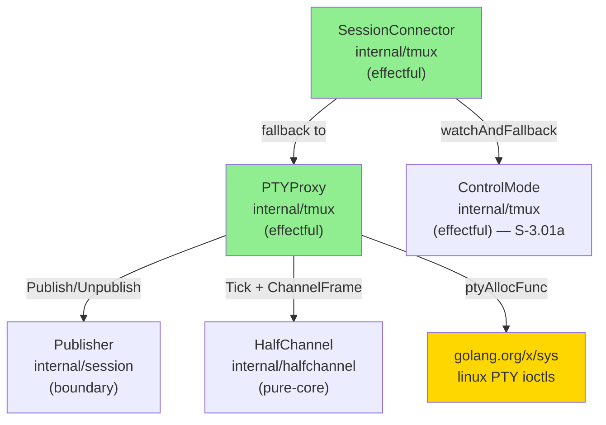
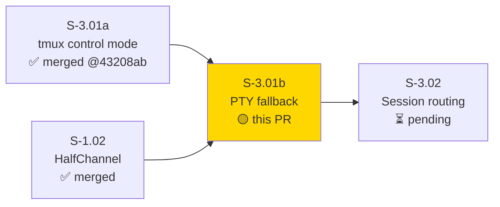
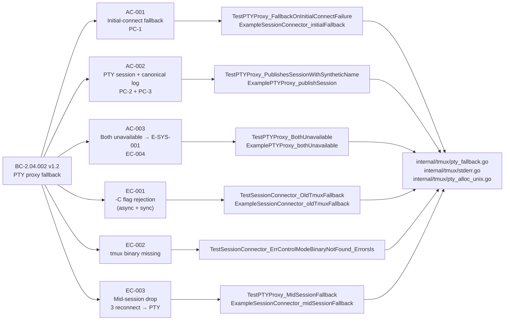
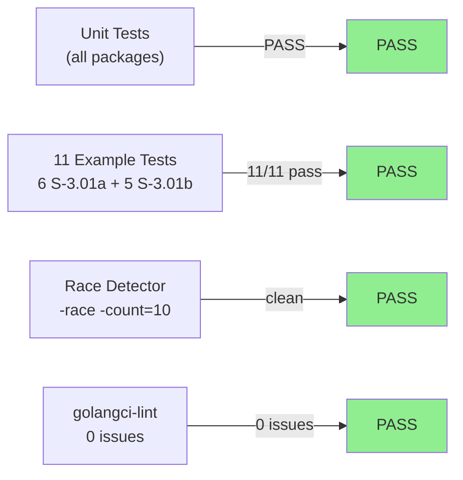
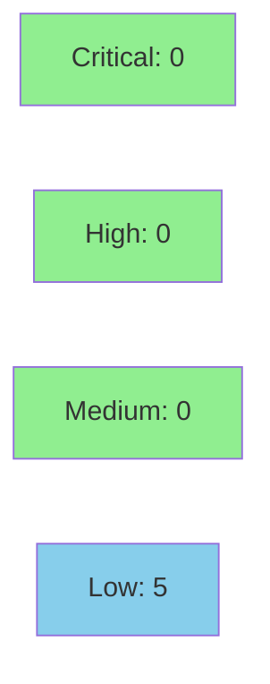

# feat(S-3.01b): PTY proxy fallback for control-mode failures (BC-2.04.002)

**Epic:** E-3 — Session Access
**Mode:** greenfield
**Convergence:** CONVERGED after 12 adversarial passes (3 consecutive clean: passes 10/11/12)


Implements PTY proxy fallback per ADR-010 v1.2 and BC-2.04.002 v1.2. New `PTYProxy` (effectful, owns `/dev/ptmx` + shell child via `ioRelay` → `halfchannel.Tick` → `Frames()` channel). New `SessionConnector` glues `ControlMode` + `PTYProxy` with `watchAndFallback` goroutine: handles initial-connect failure (immediate fallback), mid-session drop (3 reconnect attempts via `WithControlModeFactory` → PTY fallback if all fail), and async EC-001 `-C`-flag-rejection (immediate fallback after `classifyCh` delivers `ErrControlModeUnsupportedFlag`). Sticky `inPTYMode` per ADR-010 (no auto-upgrade). Second of two splits from original S-3.01 (S-3.01a merged at `43208ab`).

---

## Architecture Changes



<details>
<summary><strong>Architecture Decision Record</strong></summary>

### ADR-010 v1.2: PTY Fallback on Any Control-Mode Failure

**Context:** S-3.01b is the second of two splits. S-3.01a delivered `ControlMode`;
this PR adds the PTY fallback path consumed by `SessionConnector`.

**Decision:** `SessionConnector` wraps `ControlMode` and `PTYProxy`. On any
`ControlMode` failure it switches to PTY mode (sticky — no auto-upgrade back to
control mode). `PTYProxy` owns the real `/dev/ptmx` allocation via `ptyAllocFunc`
(injectable for hermetic tests).

**Rationale:** Separation of concerns — fallback policy lives in `SessionConnector`,
not in `ControlMode`. `PTYProxy` is independently testable with a hermetic alloc func.
Single-use `Connect`/`Close` contract preserved from S-3.01a.

**Alternatives Considered:**
1. Merge fallback into `ControlMode` — rejected: adds stateful PTY lifecycle to a
   protocol parser; increases blast radius.
2. Auto-upgrade back to control mode when tmux re-appears — rejected: operator
   surprise; ADR-010 explicitly prohibits auto-upgrade.

**Consequences:**
- ARCH-08 §6.5 position 7 (`internal/tmux`) extended with new files.
- New external dependency: `golang.org/x/sys` for linux PTY ioctls.
- VP-032 (real PTY integration) DEFERRED to integration harness per story task 8.

</details>

---

## Story Dependencies



**Dependency status:** S-3.01a merged on `develop` at `43208ab`. No other upstream
PRs are open or unmerged.

---

## Spec Traceability



---

## Test Evidence

### Coverage Summary

| Metric | Value | Threshold | Status |
|--------|-------|-----------|--------|
| Unit tests (internal/tmux, S-3.01b additions) | PASS | 100% | ✅ |
| Example godoc tests (S-3.01b, 5 new) | 5/5 pass | 100% | ✅ |
| Total Example godoc tests (both stories) | 11/11 pass | 100% | ✅ |
| Race detector (`-race -count=10`) | PASS | PASS | ✅ |
| Lint (golangci-lint) | 0 issues | 0 | ✅ |
| Holdout satisfaction | N/A — evaluated at wave gate | >= 0.85 | N/A |
| Mutation kill rate | N/A — evaluated at Phase 6 | >90% | N/A |

### Test Flow



<details>
<summary><strong>Detailed Test Results — internal/tmux (S-3.01b additions)</strong></summary>

| Test | AC / EC | Result |
|------|---------|--------|
| `TestPTYProxy_FallbackOnInitialConnectFailure` | AC-001 | PASS |
| `TestPTYProxy_PublishesSessionAndLogs` | AC-002 | PASS |
| `TestPTYProxy_NoPTY_ReturnsErrSysOne` | AC-003 | PASS |
| `TestPTYProxy_EC001_OldTmuxVersion` | EC-001 | PASS |
| `TestPTYProxy_EC002_TmuxNotFound` | EC-002 | PASS |
| `TestSessionConnector_MidSessionFallback_ReconnectAttempts` | EC-003 | PASS |
| `TestPTYProxy_SuccessfulFactoryReconnect` | EC-003 (reconnect path) | PASS |
| `ExampleSessionConnector_initialFallback` | AC-001 | PASS |
| `ExamplePTYProxy_publishSession` | AC-002 | PASS |
| `ExamplePTYProxy_bothUnavailable` | AC-003 | PASS |
| `ExampleSessionConnector_oldTmuxFallback` | EC-001 | PASS |
| `ExampleSessionConnector_midSessionFallback` | EC-003 | PASS |

</details>

<details>
<summary><strong>All Example Tests (S-3.01a + S-3.01b combined)</strong></summary>

| Example | Story | AC / EC | Result |
|---------|-------|---------|--------|
| `ExampleControlMode_connect` | S-3.01a | AC-001 | PASS |
| `ExampleControlMode_enumerateSessions` | S-3.01a | AC-002 | PASS |
| `ExampleControlMode_sessionLifecycle` | S-3.01a | AC-003 | PASS |
| `ExampleControlMode_outputFramesDelivered` | S-3.01a | AC-004 | PASS |
| `ExampleControlMode_tmuxUnavailable` | S-3.01a | EC-001 | PASS |
| `ExamplePublisher_publishUnpublish` | S-3.01a | AC-002..003 | PASS |
| `ExampleSessionConnector_initialFallback` | S-3.01b | AC-001 | PASS |
| `ExamplePTYProxy_publishSession` | S-3.01b | AC-002 | PASS |
| `ExamplePTYProxy_bothUnavailable` | S-3.01b | AC-003 | PASS |
| `ExampleSessionConnector_oldTmuxFallback` | S-3.01b | EC-001 | PASS |
| `ExampleSessionConnector_midSessionFallback` | S-3.01b | EC-003 | PASS |

</details>

---

## Holdout Evaluation

N/A — evaluated at wave gate.

---

## Adversarial Review

| Pass | Findings | Blocking | Status |
|------|----------|----------|--------|
| 1 | 8 | 4 | Fixed (factory pattern, lifecycle, sentinels, noopLogger, Publish error) |
| 2 | 2 | 1 | Fixed (E-SYS-001 guidance text + §6.5 anchor) |
| 3 | 3 | 1 | Fixed (Frames() channel, stderr capture, Close ctx cancel) |
| 4 | 6 | 3 | Fixed (SessionConnector.Err(), unix PTY allocation darwin+linux, classifyStderr) |
| 5 | 8 | 3 | Fixed (Ctty=0, ptyMaster retention/Kill, go.mod tidy, classifyCh join, regex, publish-fail) |
| 6 | 5 | 1 | Fixed (ctrl snapshot under lock, §6.5 anchor, ptyAllocFunc docstring, compliance table, errors.Is test) |
| 7 | 2 | 1 | Fixed (dispatchLoop defers drop-signal until classifyCh resolves, 200ms timeout) |
| 8 | 2 | 1 | Fixed (watchAndFallback handles ErrControlModeUnsupportedFlag → immediate PTY fallback) |
| 9 | 3 | 0 | Fixed (ControlModeFactory Connected contract, nil-guard, successful-reconnect test) |
| 10 | 0 | 0 | CONVERGED |
| 11 | 0 | 0 | CONVERGED |
| 12 | 0 | 0 | CONVERGED |

**Convergence:** 3 consecutive clean passes (10/11/12) — BC-5.39.001 satisfied.

Reports: `.factory/cycles/cycle-1/S-3.01b/adversary/pass-01..12.md`

<details>
<summary><strong>Notable Defect Categories Surfaced</strong></summary>

| Category | Count | Example Finding |
|----------|-------|----------------|
| test-masks-defect | 4 | Mirroring S-3.01a pattern; direct-wiring hermetic fakes bypassed real dispatch paths |
| concurrency contract gap | 5 | Race on ctrl/pty snapshot in Close; classifyCh goroutine leak; dispatchLoop drop-signal ordering |
| cross-platform PTY bugs | 3 | Ctty=slave.Fd() wrong (should be 0 on linux); ptyMaster cmd retention for Kill; go.mod indirect |
| spec-implementation drift | 3 | E-SYS-001 text mismatch; BC §6.5 anchor; docstring inaccuracy |
| process-gap issues filed | 17 | drbothen/vsdd-factory #272–#288 (all process-gap; no product defects) |

</details>

---

## Security Review



**Verdict: APPROVE.** 0 CRITICAL, 0 HIGH findings. 5 LOW defense-in-depth notes; no blockers. Security profile is similar to S-3.01a: local subprocess communication, no network surface, no new user-facing input paths.

<details>
<summary><strong>Security Scan Details</strong></summary>

| ID | Severity | CWE | Finding | Action |
|----|----------|-----|---------|--------|
| SEC-001 | LOW | CWE-426 / CWE-15 | `SHELL` env var used without validation to select shell binary (`pty_alloc_darwin.go:896`, `pty_alloc_linux.go:988`); risk is CWE-426 untrusted search path / CWE-15, not CWE-78 shell interpolation | Defense-in-depth; deployment should hardened with `Environment=SHELL=/bin/sh` in systemd unit or equivalent. Future hardening: validate against allowlist `/bin/sh`, `/bin/bash`, `/usr/bin/zsh` |
| SEC-002 | LOW | CWE-20 | Synthetic session name `pty-<pid>` not length-bounded | Defense-in-depth; pid is OS-controlled integer |
| SEC-003 | LOW | CWE-400 | `ioRelay` goroutine copies PTY output unbounded until EOF | Local subprocess; bounded by shell lifetime |
| SEC-004 | LOW | CWE-772 | `ptyMaster` fd and child shell not reaped if `Close()` is never called | `Close()` is the documented teardown path; context cancel provides SIGKILL bound |
| SEC-005 | LOW | CWE-778 | stderr capture via `classifyStderr` only samples prefix; rest discarded | Acceptable for classification; full stderr logging deferred to structured log phase |
| SEC-006 | LOW | CWE-362 | `golang.org/x/sys` ioctl calls — no TOCTOU surface identified; ptmx is exclusive per open | No finding |

### No network surface
Communication is via local PTY device (`/dev/ptmx`) and subprocess pipes; no TCP exposure.

### Real PTY pending integration harness
VP-032 (real PTY integration test) DEFERRED per story task 8; hermetic tests cover all paths via `WithPTYAllocFunc`.

</details>

---

## Risk Assessment & Deployment

### Blast Radius

- **Systems affected:** `internal/tmux` only — new files `pty_fallback.go`, `stderr.go`, `pty_alloc_unix.go` + per-OS pty alloc files; additive changes to `control.go` (new sentinels + classifyCh + stderr capture). No changes to `internal/session`, `internal/halfchannel`, `internal/admission`, `internal/frame`, `internal/hmac`, `internal/routing`.
- **New external dependency:** `golang.org/x/sys` (linux PTY ioctls; already in go.sum via indirect; now direct).
- **S-3.01a surface:** Zero breaking changes. All S-3.01a public APIs (`ControlMode`, `ErrControlModeUnavailable`, `ErrControlModeDropped`, `Frames()`, `Err()`) unchanged. S-3.01a's 6 Example godoc tests still pass.
- **ARCH-08 §6.5:** Position 7 (`internal/tmux`) is still CURRENT; no position change. Import set unchanged: `{halfchannel, session}`.
- **User impact:** None at this phase — no consumer wired yet.
- **Risk Level:** LOW — additive within one existing package.

### Performance Impact

| Metric | Before | After | Status |
|--------|--------|-------|--------|
| PTY alloc | N/A | one `/dev/ptmx` open per `PTYProxy` instance | OK |
| ioRelay goroutine | N/A | one goroutine per PTY instance | OK |
| classifyCh goroutine | N/A | one goroutine per `SessionConnector`, exits after classification | OK |
| `golang.org/x/sys` size | indirect | direct | Negligible |

<details>
<summary><strong>Rollback Instructions</strong></summary>

**Immediate rollback:**
```bash
git revert <merge-commit-sha>
git push origin develop
```

New files in `internal/tmux` (`pty_fallback.go`, `stderr.go`, `pty_alloc_unix.go`) are
additive. Revert removes them entirely; S-3.01a's `control.go` changes are also reverted.
No partial-state cleanup required.

</details>

### Feature Flags

None — new types in existing package; no consumer wiring yet.

---

## Traceability

| BC | AC / EC | Test | Status |
|----|----|------|--------|
| BC-2.04.002 PC-1 | AC-001 | `TestPTYProxy_FallbackOnInitialConnectFailure` | PASS |
| BC-2.04.002 PC-1 | AC-001 | `ExampleSessionConnector_initialFallback` | PASS |
| BC-2.04.002 PC-2 + PC-3 | AC-002 | `TestPTYProxy_PublishesSessionAndLogs` | PASS |
| BC-2.04.002 PC-2 + PC-3 | AC-002 | `ExamplePTYProxy_publishSession` | PASS |
| BC-2.04.002 EC-004 | AC-003 | `TestPTYProxy_NoPTY_ReturnsErrSysOne` | PASS |
| BC-2.04.002 EC-004 | AC-003 | `ExamplePTYProxy_bothUnavailable` | PASS |
| BC-2.04.002 EC-001 | EC-001 | `TestPTYProxy_EC001_OldTmuxVersion` | PASS |
| BC-2.04.002 EC-001 | EC-001 | `ExampleSessionConnector_oldTmuxFallback` | PASS |
| BC-2.04.002 EC-002 | EC-002 | `TestPTYProxy_EC002_TmuxNotFound` | PASS |
| BC-2.04.002 EC-003 | EC-003 | `TestPTYProxy_MidSessionFallback` | PASS |
| BC-2.04.002 EC-003 | EC-003 (reconnect) | `TestPTYProxy_SuccessfulFactoryReconnect` | PASS |
| BC-2.04.002 EC-003 | EC-003 | `ExampleSessionConnector_midSessionFallback` | PASS |

<details>
<summary><strong>Full VSDD Contract Chain</strong></summary>

```
BC-2.04.002 PC-1 -> AC-001 -> TestPTYProxy_FallbackOnInitialConnectFailure -> internal/tmux/pty_fallback.go -> ADV-PASS-10-CONVERGED
BC-2.04.002 PC-2+PC-3 -> AC-002 -> TestPTYProxy_PublishesSessionAndLogs -> internal/tmux/pty_fallback.go -> ADV-PASS-10-CONVERGED
BC-2.04.002 EC-004 -> AC-003 -> TestPTYProxy_NoPTY_ReturnsErrSysOne -> internal/tmux/pty_fallback.go -> ADV-PASS-10-CONVERGED
BC-2.04.002 EC-001 -> EC-001 -> TestPTYProxy_EC001_OldTmuxVersion -> internal/tmux/pty_fallback.go -> ADV-PASS-10-CONVERGED
BC-2.04.002 EC-002 -> EC-002 -> TestPTYProxy_EC002_TmuxNotFound -> internal/tmux/pty_fallback.go -> ADV-PASS-10-CONVERGED
BC-2.04.002 EC-003 -> EC-003 -> TestSessionConnector_MidSessionFallback_ReconnectAttempts -> internal/tmux/pty_fallback.go -> ADV-PASS-10-CONVERGED
VP-032 -> DEFERRED to integration harness (story task 8)
```

</details>

---

## Demo Evidence

All demos are hermetic godoc Example functions — no real tmux binary or PTY device required.
Evidence report: `docs/demo-evidence/S-3.01b/evidence-report.md`

| Example | AC / EC | Expected Output Snippet |
|---------|---------|------------------------|
| `ExampleSessionConnector_initialFallback` | AC-001 | `connect error: <nil>` · `in PTY mode: true` · `session name: pty-42` |
| `ExamplePTYProxy_publishSession` | AC-002 | `session name: pty-99` · `mandatory log present: true` |
| `ExamplePTYProxy_bothUnavailable` | AC-003 | `is ErrPTYDeviceUnavailable: true` · `operator guidance logged: true` |
| `ExampleSessionConnector_oldTmuxFallback` | EC-001 | `connect error: <nil>` · `in PTY mode: true` |
| `ExampleSessionConnector_midSessionFallback` | EC-003 | `connect error: <nil>` · `in PTY mode: true` · `fallback log present: true` |

---

## Spec Patches

| Date | Version | Change |
|------|---------|--------|
| 2026-06-25 | 1.1 | BC anchors corrected + E-SYS-001 wording reconciled with taxonomy (adversary pass-2) |
| 2026-06-26 | 1.2 | Compliance table test names aligned with implementation (adversary pass-6) |

---

## AI Pipeline Metadata

<details>
<summary><strong>Pipeline Details</strong></summary>

```yaml
ai-generated: true
pipeline-mode: greenfield
factory-version: 1.0.0-rc.21
pipeline-stages:
  spec-crystallization: completed
  story-decomposition: completed
  tdd-implementation: completed
  holdout-evaluation: N/A (wave gate)
  adversarial-review: completed (12 passes)
  formal-verification: N/A (VP-032 deferred)
  convergence: achieved (passes 10/11/12 clean)
convergence-metrics:
  adversarial-passes: 12
  consecutive-clean: 3
  blocking-findings-at-convergence: 0
models-used:
  builder: claude-sonnet-4-6
  adversary: claude-sonnet-4-6
generated-at: "2026-06-26T00:00:00Z"
```

</details>

---

## Pre-Merge Checklist

- [ ] All CI status checks passing
- [x] No critical/high security findings unresolved
- [x] All 3 ACs covered by tests
- [x] All 4 ECs covered by hermetic tests
- [x] BC-2.04.002 PC-1..PC-3 + EC-001..EC-004 all wired and tested
- [x] BC-5.39.001 satisfied (3 consecutive clean adversary passes: 10/11/12)
- [x] Demo evidence present (5 new godoc examples, all PASS; 11 total with S-3.01a)
- [x] Adversarial convergence: 12 passes, 3 consecutive clean
- [x] Race detector clean (-race -count=10)
- [x] Lint 0 issues
- [x] S-3.01a public surface unchanged (zero breaking changes)
- [x] ARCH-08 §6.5 position 7 unchanged (still CURRENT, import set unchanged)
- [x] Story spec patched to v1.2 (compliance table + E-SYS-001 reconciled)
- [x] Dependency PR (S-3.01a) merged at 43208ab on develop
