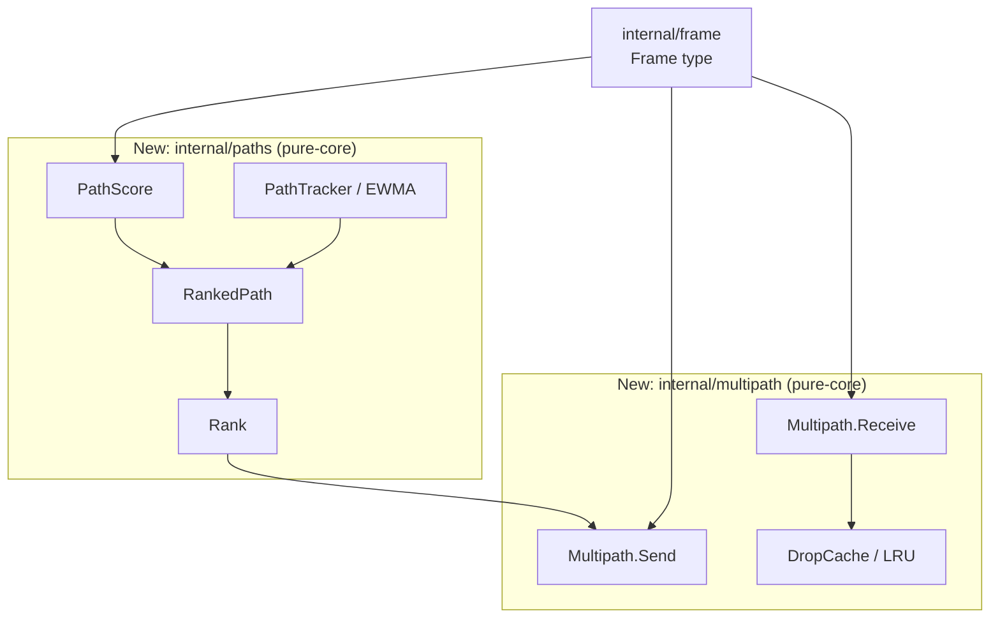
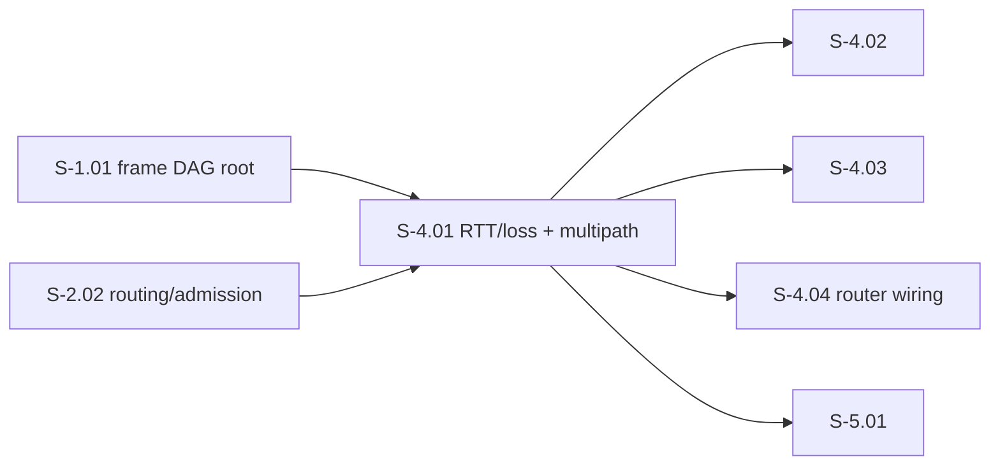
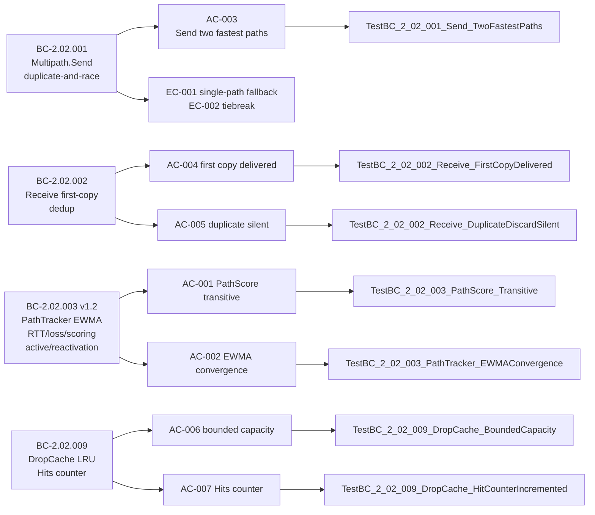

## Summary

Delivers S-4.01: per-path RTT/loss tracking (`internal/paths`) and duplicate-and-race dispatch (`internal/multipath`). These are new pure-core packages with no I/O — all 7 acceptance criteria satisfied, adversarial convergence achieved (BC-5.39.001: 3 consecutive 0C/0H passes), race detector clean.

**Story:** S-4.01 — Per-Path RTT/Loss Tracking and Duplicate-and-Race Dispatch
**Points:** 8
**Wave:** 4 | **Epic:** E-4

---

## Architecture Changes

**Blast radius:** New packages only — zero changes to existing code.
**Performance:** All hot-path operations are O(1) (DropCache lookup, Hits counter) or O(k log k) for path ranking where k ≤ configured path count (practically 2–8).

---

## Story Dependencies

Dependencies S-1.01 and S-2.02 are merged. Blockers S-4.02, S-4.03, S-4.04, S-5.01 are unblocked by this PR.

---

## Spec Traceability

---

## BC / AC Coverage Table

| AC | BC | Test | Status |
|----|-----|------|--------|
| AC-001 | BC-2.02.003 PC1 | `TestBC_2_02_003_PathScore_Transitive` + 6 additional PathScore tests | PASS |
| AC-002 | BC-2.02.003 PC2 | `TestBC_2_02_003_PathTracker_EWMAConvergence` | PASS |
| AC-003 | BC-2.02.001 PC1 | `TestBC_2_02_001_Send_TwoFastestPaths` + 4 additional Send tests | PASS |
| AC-004 | BC-2.02.002 PC1 | `TestBC_2_02_002_Receive_FirstCopyDelivered` | PASS |
| AC-005 | BC-2.02.002 PC2 | `TestBC_2_02_002_Receive_DuplicateDiscardSilent` | PASS |
| AC-006 | BC-2.02.009 PC1 | `TestBC_2_02_009_DropCache_BoundedCapacity` + 3 additional | PASS |
| AC-007 | BC-2.02.009 PC2 | `TestBC_2_02_009_DropCache_HitCounterIncremented` | PASS |

**7/7 ACs — all PASS**

---

## VP Traces

| VP | Description | Status |
|----|-------------|--------|
| VP-024 | Endpoint dedup by checksum — first-arrival-wins invariant (DI-009) | Covered by AC-004/AC-005 tests |
| VP-025 | EWMA RTT tracking convergence | Covered by AC-002 |
| VP-026 | PathScore transitivity (property test) | Covered by AC-001 + `TestBC_2_02_003_PathScore_PropertyTransitive_Manual` |
| VP-040 | End-to-end failover < 2s (e2e, `internal/testenv`) | **Deferred to integration harness** (see Out of Scope below) |
| VP-054 | End-to-end ACK-side-effect verification (e2e) | **Deferred to integration harness** (see Out of Scope below) |

Unit-level contribution to VP-040 is satisfied: 3-miss deactivation, reactivation on first successful probe (BC-2.02.003 v1.2 PC6), and `Rank` exclusion of inactive paths are all tested.

---

## Test Evidence

| Metric | Value |
|--------|-------|
| Total new tests | 50+ (internal/paths + internal/multipath) |
| All tests pass | yes (`just test` — all packages ok) |
| Lint findings | 0 (`just lint`) |
| Formatting | clean (`just fmt` — no changes) |
| Race detector | clean (`just test-race` — 0 DATA RACE) |
| Concurrency tests | 5 concurrent/race-specific tests |

**Race-tested concurrent surfaces:**
- `TestBC_2_02_003_PathTracker_ConcurrentOnProbeScore`
- `TestBC_2_02_002_Receive_ConcurrentFirstArrivalWins`
- `TestBC_2_02_009_DropCache_ConcurrentAddContains`
- `TestBC_2_02_001_Send_ConcurrentWithUpdatePaths`
- `TestBC_2_02_009_DropCache_HitCounterConcurrent`

---

## Demo Evidence

All 7 ACs recorded as test-transcript captures (precedent: S-W3.04 — pure-core library, no runnable binary surface).

Evidence committed at `ee75d83` under `docs/demo-evidence/S-4.01/`:

| AC | Transcript | Result |
|----|-----------|--------|
| AC-001 PathScore transitive | `AC-001-pathscore-transitive.txt` | PASS |
| AC-002 EWMA convergence | `AC-002-ewma-convergence.txt` | PASS |
| AC-003 Send two fastest paths | `AC-003-send-two-fastest-paths.txt` | PASS |
| AC-004 First copy delivered | `AC-004-first-copy-delivered.txt` | PASS |
| AC-005 Duplicate discard silent | `AC-005-duplicate-discard-silent.txt` | PASS |
| AC-006 DropCache bounded capacity | `AC-006-dropcache-bounded-capacity.txt` | PASS |
| AC-007 DropCache Hits counter | `AC-007-dropcache-hit-counter.txt` | PASS |
| Race detector full suite | `race-detector-full-suite.txt` | PASS — 0 races |

---

## Adversarial Convergence

**Status: CONVERGED** (BC-5.39.001 satisfied)

Three consecutive 0C/0H passes achieved at `aaff609` (passes 3, 4, 5 of 5).

| Pass | Lens | C | H | Verdict |
|------|------|---|---|---------|
| 1 | initial review | 2 | 4 | NOT_CONVERGED |
| 2 | post-fix re-review | 0 | 2 | NOT_CONVERGED |
| **3** | spec-conformance / dedup / RTT | **0** | **0** | **CONVERGED** |
| **4** | concurrency / lock discipline | **0** | **0** | **CONVERGED** |
| **5** | integration / edge-cases | **0** | **0** | **CONVERGED** |

Key fixes resolved in convergence loop:
- CWE-476 nil-tracker panic in `Rank()` — nil guard added (Pass 1, F-001)
- Wrong-behavior-pinned dedup test — endpoint dedup changed to checksum-only per VP-024/DI-009 (Pass 1, F-002)
- Dead `dropCache` field on `Multipath` struct removed; BC-2.02.009 router wiring deferred to S-4.04 (Pass 2, F-H1)
- DropCache hit counter + `Hits()` counter added for BC-2.02.009 PC2 (Pass 2, F-H2)

Full record: `.factory/cycles/cycle-1/S-4.01/adversary/CONVERGENCE.md`

---

## Security Review

**Scope:** New pure-core in-memory packages (`internal/paths`, `internal/multipath`). No network I/O, no deserialization from untrusted input at this layer, no authentication surface. OWASP Top 10 injection/auth categories structurally inapplicable at this layer.

**Findings:** No CRITICAL or HIGH. Three LOW, two INFO — none blocking.

| Finding | Severity | Notes |
|---------|----------|-------|
| SEC-001: CRC32 as dedup key (CWE-328) | LOW | Reliability boundary only — not a security boundary. Document in godoc before S-4.04 wiring. |
| SEC-002: `hits` int64 overflow (CWE-190) | LOW | Diagnostic counter; ~2^63 duplicate frames to trigger wrap. Document wrap behavior in `Hits()` godoc. |
| SEC-003: Unchecked type assertion in LRU eviction (CWE-617) | LOW | `oldest.Value.(dropEntry)` — invariant holds today; harden with comma-ok before S-4.04 hot-path wiring. |
| INFO-001: Constructor panics on invalid args | INFO | Test-validated pattern; deviation from "no panics in library code" rule acknowledged. |
| INFO-002: Payload aliasing on Receive | INFO | Caller contract; document that payload must not be mutated concurrently after calling Receive. |

**Confirmed present and correct:**
- No `unsafe` usage; no external dependencies added
- Nil-pointer guard in `Rank()` preventing CWE-476 panic (convergence loop F-001)
- TOCTOU fix: `AddIfAbsent` atomic check-and-insert
- Full lock coverage: `PathTracker.mu`, `DropCache.mu`, `Multipath.mu`
- Race detector: 0 DATA RACE

---

## Risk Assessment

| Dimension | Assessment |
|-----------|------------|
| Blast radius | Isolated — new packages only; zero changes to existing code |
| Rollback | Clean — delete `internal/paths` and `internal/multipath`; no existing callers |
| Data loss risk | None — in-memory pure-core; no persistence |
| Performance impact | None to existing paths; new code paths are O(1) cache lookup |
| Concurrency risk | Low — all shared state behind `sync.Mutex`; race detector clean |

---

## Out of Scope / Deferred

The following items are explicitly out of scope for S-4.01 per the product-owner's Pass-2 BC-2.02.009 scope ruling (`.factory/cycles/cycle-1/S-4.01/adjudications/pass2-bc009-scope.md`) and the story spec §Deferrals:

| Item | Deferred To | Notes |
|------|------------|-------|
| BC-2.02.009 router-side `OnFrameArrival`/forwarding compound-key drop-cache wiring | S-4.04 | `DropCache` is delivered as standalone primitive; router wiring belongs to `internal/routing` (S-4.04 ARCH-03 §Duplicate-and-Race) |
| BC-2.02.009 EC-005 collision-event logging | S-4.04 | `internal/multipath` is pure-core; effectful logging injected at router wiring layer per `internal/routing.WithLogger` pattern |
| VP-040 end-to-end failover-recovery < 2s timing assertion (`proof_method: e2e`) | Integration harness wave-gate | Requires `internal/testenv` multi-router harness; same disposition as VP-054 |
| VP-054 end-to-end ACK-side-effect verification | Integration harness wave-gate | Requires multi-router harness |
| BC-2.02.001 EC-003 queue-with-timeout + E-NET-002 | Future wave-4+ story | Queueing/timer management is effectful; nearest candidate S-BL.NI or wave-4 network ingress/egress story |
| S401-O3: BC-2.02.003 PC5 degraded-path flag (>200ms) | Quality-indicator story | Feeds BC-2.06.001/ARCH-03 quality-indicator subsystem; ranking already deprioritizes slow paths via score |

None of these deferrals blocks any S-4.01 AC.

---

## AI Pipeline Metadata

| Field | Value |
|-------|-------|
| Pipeline mode | greenfield TDD (VSDD cycle v1.0.0) |
| Phase | Phase 3 TDD implementation + Phase 5 adversarial review |
| Story delivery | `vsdd-factory:deliver-story` |
| Adversarial passes | 5 (convergence at pass 3) |

---

## Pre-Merge Checklist

- [x] PR description matches actual diff
- [x] All 7 ACs covered by demo evidence
- [x] Traceability chain complete (BC → AC → Test → Demo)
- [x] All adversarial findings addressed (0C/0H, 3-pass streak)
- [x] `just fmt` clean
- [x] `just lint` — 0 issues
- [x] `just test` — all packages pass
- [x] `just test-race` — race detector clean
- [x] No AI attribution in commit messages or PR description
- [x] SSH-signed commits
- [x] Feature branch targets `develop` (Gitflow)
- [ ] CI checks passing (pending push)
- [ ] PR reviewer approval
