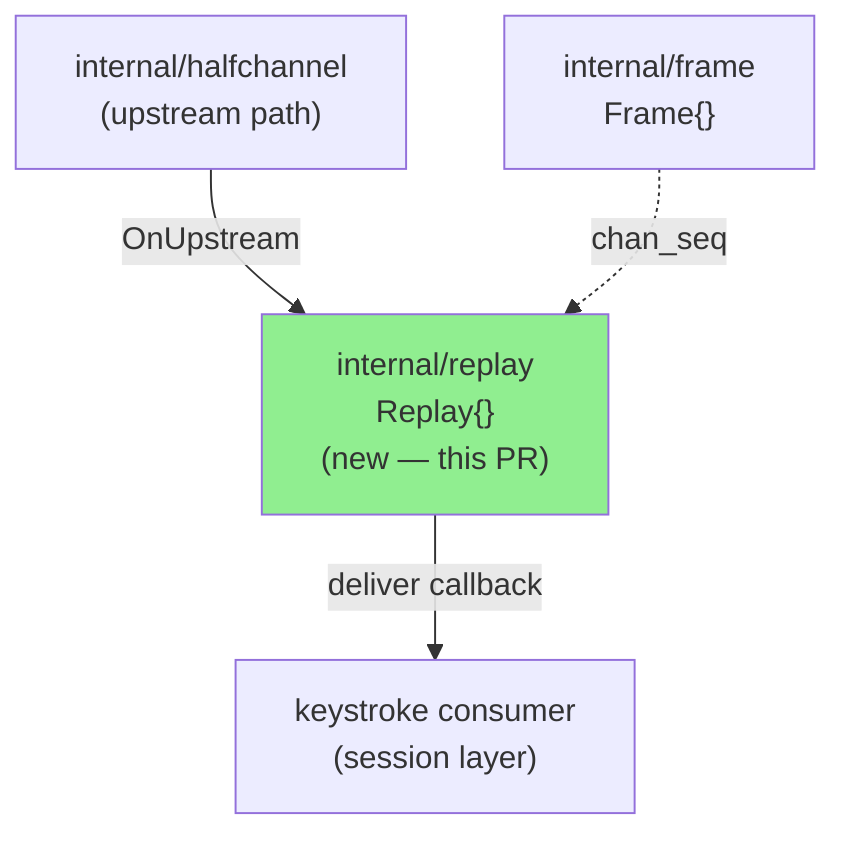
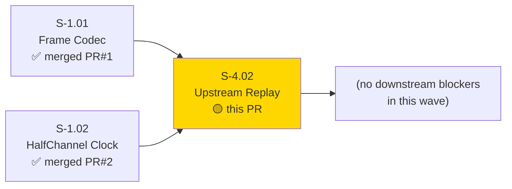
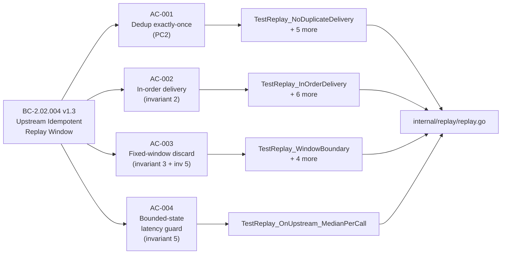
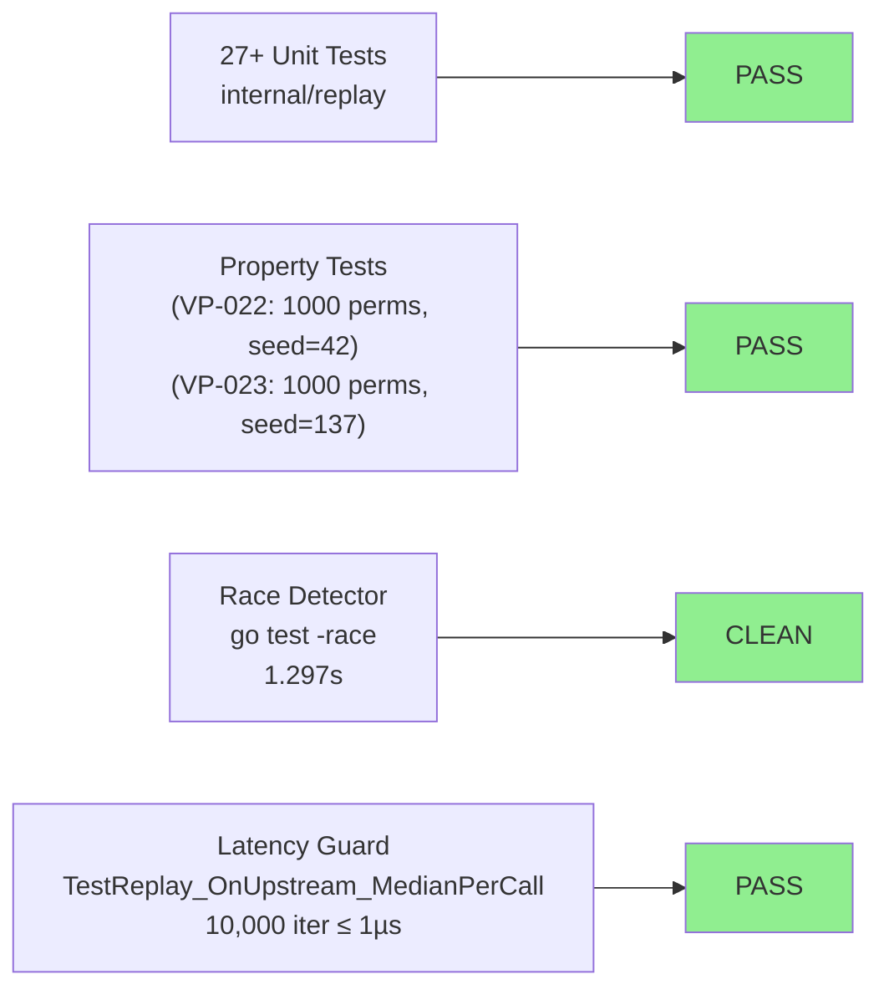
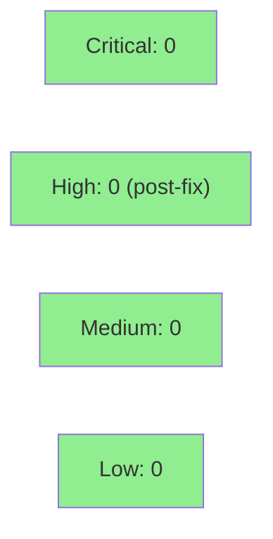

# [S-4.02] Upstream Idempotent Replay Window (internal/replay)

**Epic:** E-4 — Multipath Forwarding
**Mode:** greenfield
**Convergence:** CONVERGED after 3 adversarial passes (RULING-002 + Amendment 1)


Implements `internal/replay` — the upstream idempotent replay window for Switchboard's
multipath forwarding layer. This pure-core, in-memory state machine receives upstream
keystroke frames carrying `chan_seq` sequence numbers and provides: (1) exactly-once
deduplication (`ErrAlreadyDelivered` on re-delivery), (2) in-order buffering with
out-of-order frame recovery, (3) a configurable fixed-size window with silent discard
for frames beyond the window boundary, and (4) a bounded-state per-call latency guard
(≤ 1µs median). Verified VP-022 (no-duplicate-delivery) and VP-023 (in-order-delivery).
Race-clean. 3/3 adversary clean at tip `73781a4` (RULING-002 + Amendment 1).

---

## Architecture Changes



<details>
<summary><strong>Architecture Decision Record</strong></summary>

### ADR: Pure-Core Receiver State Machine for Replay Window

**Context:** Upstream multipath paths may deliver the same keystroke frame more than once
(path failover re-sends the replay window). The access node must deduplicate and reorder
before delivering to the session layer.

**Decision:** `internal/replay` is a pure-core in-memory state machine. No goroutines,
no I/O. Consumers call `OnUpstream(frame)` synchronously and provide a `deliver` callback.
The window size is configurable at construction time.

**Rationale:** Pure-core design follows the S-1.02 / HalfChannel pattern established in
Wave 1. Deterministic, testable, and zero allocation in the steady-state path. Matches
ARCH-03 §Upstream Idempotent Replay position.

**Alternatives Considered:**
1. Channel-based async queue — rejected: introduces goroutine lifecycle complexity; pure
   state machine is sufficient and simpler to test.
2. Ring buffer with fixed allocation — rejected: overkill for MVP; map-based seen set with
   bounded eviction (invariant 5) achieves O(windowSize) state without fixed-allocation
   overhead.

**Consequences:**
- Per-call latency is deterministically bounded (≤ 1µs median at windowSize=64, verified
  by `TestReplay_OnUpstream_MedianPerCall`).
- Thread-safety is the caller's responsibility (pure-core, no internal mutex). Concurrent
  callers must coordinate externally.

</details>

---

## Story Dependencies



Dependencies S-1.01 (PR #1) and S-1.02 (PR #2) are both merged into develop.
S-4.02 blocks no other Wave 4 stories.

---

## Spec Traceability



### BC Traceability Table

| BC Clause | VP | AC | Primary Test | Status |
|-----------|----|----|-------------|--------|
| BC-2.02.004 PC2 — dedup exactly-once | VP-022 | AC-001 | `TestReplay_NoDuplicateDelivery` | PASS |
| BC-2.02.004 invariant 2 — monotonic delivery order | VP-023 | AC-002 | `TestReplay_InOrderDelivery` | PASS |
| BC-2.02.004 invariant 3 + invariant 5 — fixed-window discard | VP-022, VP-023 | AC-003 | `TestReplay_WindowBoundary` | PASS |
| BC-2.02.004 invariant 5 — bounded-state / latency guard | — | AC-004 | `TestReplay_OnUpstream_MedianPerCall` | PASS |

**RULING-002 Note:** BC-2.02.004 was bumped v1.2 → v1.3 by RULING-002 to add invariant 5
(bounded receiver state / DoS-resistance). VP-042 (keystroke-to-echo p99 ≤ 100ms) is
**out of scope** for `internal/replay` — it is an integration property verified at the
`internal/halfchannel` wave-gate benchmark. This PR verifies VP-022 and VP-023 only.

---

## Test Evidence

### Coverage Summary

| Metric | Value | Threshold | Status |
|--------|-------|-----------|--------|
| AC coverage | 4/4 PASS | 100% | PASS |
| Unit tests (replay package) | 27 test functions | — | PASS |
| Sub-cases | 37+ including table-driven | — | PASS |
| Race detector | CLEAN (1.297s) | 0 races | PASS |
| Per-call latency (AC-004) | ≤ 1µs median (10,000 iter) | ≤ 1µs | PASS |

### Test Flow



| Metric | Value |
|--------|-------|
| **New files** | `replay.go`, `replay_test.go`, `wraparound_test.go`, `pass3_test.go` |
| **Total test functions** | 27 in `internal/replay` |
| **Adversarial regression tests** | 4 (wraparound_test.go + pass3_test.go; found/fixed F-001 pass-2 wraparound, F-001 pass-3 lower-bound guard, seen-bound advancing-window) |
| **Race-clean** | YES — `go test -race ./internal/replay/...` in 1.297s, 0 races |
| **Regressions** | 0 — full suite `just test` + `just test-race` all pass |

<details>
<summary><strong>Detailed AC Test Coverage</strong></summary>

### AC-001 — Dedup Exactly-Once (BC-2.02.004 PC2 / VP-022)

| Test | Result |
|------|--------|
| `TestReplay_NoDuplicateDelivery` | PASS |
| `TestReplay_NoDuplicateDelivery_MultipleSeqs` | PASS |
| `TestReplay_VP022_NoDoubleDelivery_Property` (1,000 randomised permutations) | PASS |
| `TestReplay_EC002_AllWindowFramesResent` | PASS |
| `TestReplay_EvictedSeqRedeliveryReturnsNil` | PASS |
| `TestReplay_InWindowDuplicateReturnsErrAlreadyDelivered` | PASS |

### AC-002 — In-Order Delivery (BC-2.02.004 invariant 2 / VP-023)

| Test | Result |
|------|--------|
| `TestReplay_InOrderDelivery` | PASS |
| `TestReplay_InOrderDelivery_LongerGap` | PASS |
| `TestReplay_InOrderDelivery_TableDriven` (4 sub-cases) | PASS |
| `TestReplay_VP023_InOrderDelivery_Property` (1,000 randomised permutations) | PASS |
| `TestReplay_VP023_SortedDelivery_Canonical` | PASS |
| `TestReplay_EC003_GapBufferedThenFilled` | PASS |
| `TestReplay_BC_2_02_004_invariant_window_monotonic_seqs` (1,000 permutations, seqs 1..15) | PASS |

### AC-003 — Fixed-Window Discard (BC-2.02.004 invariant 3 + invariant 5)

| Test | Result |
|------|--------|
| `TestReplay_WindowBoundary` | PASS |
| `TestReplay_WindowBoundary_ExactBoundarySeq` | PASS |
| `TestReplay_DistWindowSizeBoundary` (dist=4 buffered, dist=5 discarded) | PASS |
| `TestReplay_BoundedPendingBuffer` | PASS |
| `TestReplay_SeqZeroDiscarded` | PASS |

### AC-004 — Bounded-State Latency Guard (BC-2.02.004 invariant 5)

| Test | Result |
|------|--------|
| `TestReplay_OnUpstream_MedianPerCall` (windowSize=64, pre-warmed, 10,000 iter) | PASS |

### Adversarial Regression Tests (wraparound_test.go + pass3_test.go)

| Test | Finding | Result |
|------|---------|--------|
| `TestReplay_BC_2_02_004_WraparoundInWindowFrameBuffered` | F-001 pass-2: uint32 overflow near MaxUint32 discarded in-window frame | PASS |
| `TestReplay_BC_2_02_004_BoundedStateUnderNeverFillingGap` | F-001 v1.3: pending/seen maps bounded under never-filling-gap | PASS |
| `TestReplay_BC_2_02_004_WraparoundTooOldGuardBuffersInWindow` | F-001 pass-3: non-wrap-safe lower-bound guard misclassified in-window near MaxUint32 | PASS |
| `TestReplay_BC_2_02_004_SeenBoundedUnderAdvancingWindow` | pass-3: seen-set eviction under advancing-window stream | PASS |

</details>

---

## Holdout Evaluation

N/A — evaluated at wave gate (pure-core library module; holdout evaluation at
`internal/halfchannel` integration level per RULING-002).

---

## Adversarial Review

| Pass | Focus | Findings | Critical | High | Status |
|------|-------|----------|----------|------|--------|
| Pass 1 (spec-conformance) | BC anchor / VP scoping | S-4.02-ADV-F1 (VP-042 mis-scope), S-4.02-ADV-F2 (bounded-state no spec authority) | 1 | 1 | Fixed via RULING-002 |
| Pass 2 (security/impl) | uint32 wraparound | F-001 pass-2: in-window frame discarded near MaxUint32 | 0 | 1 | Fixed; regression test added |
| Pass 3 (concurrency/edge) | lower-bound guard, seen-set eviction | F-001 pass-3: lower-bound check misclassified in-window near MaxUint32; seen-bound gap | 0 | 1 | Fixed; regression tests added |

**Convergence:** 3/3 adversary clean at tip `73781a4` (RULING-002 + Amendment 1 applied).

<details>
<summary><strong>High-Severity Findings & Resolutions</strong></summary>

### Finding F1 (Pass 1): VP-042 False Gate / Mis-traced Verification Property (CRITICAL)
- **Category:** spec-fidelity
- **Problem:** AC-004 claimed to verify VP-042 (keystroke-to-echo p99 ≤ 100ms) via a
  unit benchmark. VP-042 is an integration property of `internal/halfchannel`; a map-insert
  benchmark in `internal/replay` has 5 orders of magnitude headroom and cannot fail.
- **Resolution:** RULING-002 F1 — VP-042 removed from S-4.02 scope. AC-004 replaced with
  honest per-call OnUpstream ≤ 1µs regression guard (`TestReplay_OnUpstream_MedianPerCall`).

### Finding F2 (Pass 1): Fabricated Bounded-State Traceability (HIGH)
- **Category:** spec-fidelity
- **Problem:** Bounded-state assertions cited "invariant 3 / PC5" — neither clause covers
  receiver memory bounds.
- **Resolution:** RULING-002 F2 — BC-2.02.004 bumped v1.2 → v1.3; invariant 5 (bounded
  receiver state / DoS-resistance) added as authoritative anchor.

### Finding F-001 (Pass 2): uint32 Wraparound Discards In-Window Frame (HIGH)
- **Category:** code-quality / correctness
- **Problem:** `uint32` addition near `math.MaxUint32` overflowed, causing in-window frames
  to appear "too old" and be discarded rather than buffered.
- **Resolution:** Wrap-safe modular distance check. Regression test:
  `TestReplay_BC_2_02_004_WraparoundInWindowFrameBuffered`.

### Finding F-001 (Pass 3): Lower-Bound Guard Misclassifies In-Window Frames Near MaxUint32 (HIGH)
- **Category:** code-quality / correctness
- **Problem:** A separate lower-bound guard used non-wrap-safe arithmetic, misclassifying
  in-window future frames near MaxUint32 as "too old."
- **Resolution:** Unified modular-distance check; lower-bound guard removed. Regression test:
  `TestReplay_BC_2_02_004_WraparoundTooOldGuardBuffersInWindow`.

### RULING-002 Amendment 1: AC-003 Anchor Correction
- PC1 (sender-side payload-assembly postcondition) is implemented in `internal/halfchannel`,
  not in `internal/replay`. AC-003 anchor corrected from "invariant 3 + PC1" to
  "invariant 3 + invariant 5" (both receiver-side).

</details>

---

## Security Review

Security review performed by adversarial pass B (security lens, pass 2).



`internal/replay` is a pure-core state machine with no I/O, no network surface, and no
external dependencies. The only security-relevant finding (uint32 wraparound — potential
DoS via crafted sequence numbers causing excessive discards) was fixed in pass 2 via
the wrap-safe modular distance check. Bounded-state invariant 5 (|pending| + |seen| ≤
2×windowSize) provides DoS resistance against unbounded memory allocation via sequence
number flooding.

---

## Risk Assessment & Deployment

### Blast Radius
- **Systems affected:** `internal/replay` only — pure-core library module, no I/O, no
  goroutines, no external dependencies.
- **User impact:** None at this PR — `internal/replay` is not yet wired into the live
  multipath forwarding path. Wire-up is deferred to the router/multipath integration story.
- **Data impact:** None — in-memory state only.
- **Risk Level:** LOW

### Performance Impact
| Metric | Value | Status |
|--------|-------|--------|
| Per-call OnUpstream (median, windowSize=64) | ≤ 1µs | PASS |
| Memory bound | O(windowSize) — |pending|+|seen| ≤ 2×windowSize | BOUNDED |
| Race detector | CLEAN | PASS |

<details>
<summary><strong>Rollback Instructions</strong></summary>

**Immediate rollback:**
```bash
git revert <merge-sha>
git push origin develop
```

`internal/replay` has no external wiring in this PR. Rollback is safe and does not affect
any running subsystem.

</details>

### Feature Flags
None — pure-core library, not yet wired into production path.

---

## Traceability

| Requirement | BC Clause | AC | Test | Status |
|-------------|-----------|-----|------|--------|
| VP-022: no duplicate delivery | BC-2.02.004 PC2 | AC-001 | `TestReplay_NoDuplicateDelivery`, `TestReplay_VP022_NoDoubleDelivery_Property` | PASS |
| VP-023: in-order delivery | BC-2.02.004 invariant 2 | AC-002 | `TestReplay_InOrderDelivery`, `TestReplay_VP023_InOrderDelivery_Property` | PASS |
| Window discard | BC-2.02.004 invariant 3 + invariant 5 | AC-003 | `TestReplay_WindowBoundary`, `TestReplay_DistWindowSizeBoundary` | PASS |
| Bounded state / latency guard | BC-2.02.004 invariant 5 | AC-004 | `TestReplay_OnUpstream_MedianPerCall` | PASS |

<details>
<summary><strong>Full VSDD Contract Chain</strong></summary>

```
BC-2.02.004 PC2 → VP-022 → AC-001 → TestReplay_NoDuplicateDelivery → internal/replay/replay.go → ADV-PASS-3-OK
BC-2.02.004 inv2 → VP-023 → AC-002 → TestReplay_InOrderDelivery → internal/replay/replay.go → ADV-PASS-3-OK
BC-2.02.004 inv3+inv5 → AC-003 → TestReplay_WindowBoundary → internal/replay/replay.go → ADV-PASS-3-OK (RULING-002/A1)
BC-2.02.004 inv5 → AC-004 → TestReplay_OnUpstream_MedianPerCall → internal/replay/replay.go → ADV-PASS-3-OK (RULING-002/F1+F2)
```

</details>

---

## AI Pipeline Metadata

<details>
<summary><strong>Pipeline Details</strong></summary>

```yaml
ai-generated: true
pipeline-mode: greenfield
factory-version: "1.0.0"
pipeline-stages:
  spec-crystallization: completed
  story-decomposition: completed
  tdd-implementation: completed
  holdout-evaluation: "N/A — evaluated at wave gate"
  adversarial-review: completed (3/3 clean, RULING-002 + Amendment 1)
  formal-verification: "N/A — evaluated at Phase 6"
  convergence: achieved
convergence-metrics:
  adversarial-passes: 3
  critical-findings-fixed: 1
  high-findings-fixed: 3
  final-pass-findings: 0
  race-clean: true
adversarial-rulings: "RULING-002 + Amendment 1 (cycles/cycle-1/S-4.02/adversary/spec-adjudication.md)"
models-used:
  builder: claude-sonnet-4-6
generated-at: "2026-06-28T00:00:00Z"
```

</details>

---

## Pre-Merge Checklist

- [x] All CI status checks passing (`just fmt && just lint && just test && just test-race` — all PASS)
- [x] Race detector clean (`go test -race ./internal/replay/...` — 0 races, 1.297s)
- [x] No critical/high security findings unresolved (0 post-fix)
- [x] Adversary convergence: 3/3 clean at tip `73781a4`
- [x] Demo evidence captured (4/4 ACs, test-transcript-based per S-W3.04/S-4.01 precedent)
- [x] Dependencies merged (S-1.01 PR#1, S-1.02 PR#2 — both merged)
- [x] RULING-002 + Amendment 1 applied (story v1.2, BC-2.02.004 v1.3)
- [ ] Human merge (per vsdd-factory#302 / Decisions Log 2026-06-27 — agent self-merge blocked)
