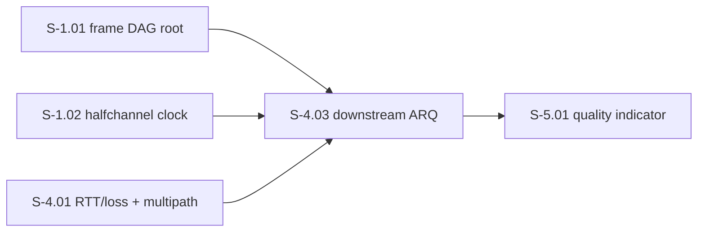
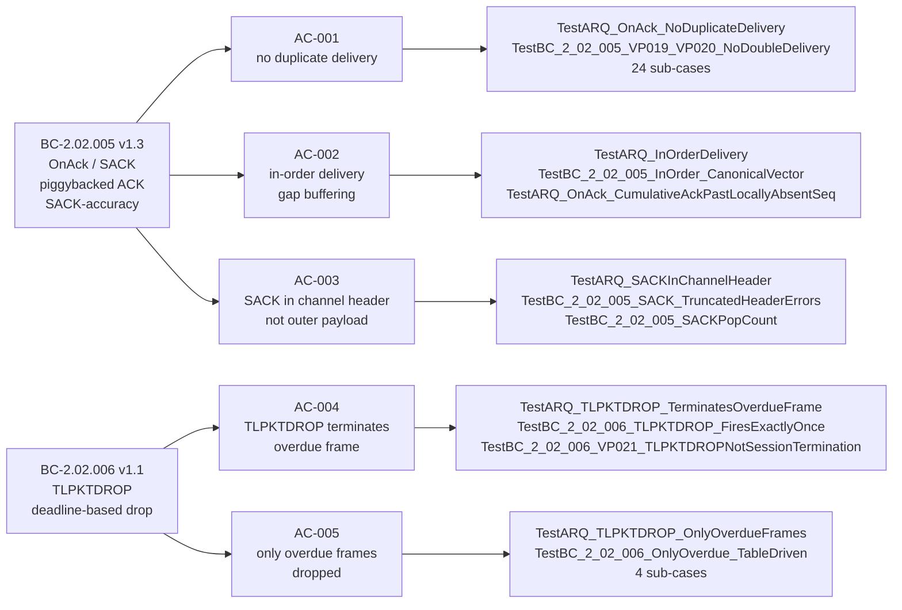

## Summary

Delivers S-4.03: downstream ARQ with piggybacked ACK/SACK and TLPKTDROP (`internal/arq`). New pure-core package — zero changes to existing code. All 5 acceptance criteria satisfied, adversarial convergence achieved (3/3 passes clean), race detector clean.

**Story:** S-4.03 — Downstream ARQ with Piggybacked ACK/SACK and TLPKTDROP
**Points:** 8
**Wave:** 4 | **Epic:** E-4
**Branch tip:** `02f317d`

---

## Architecture Changes

```mermaid
graph TD
    subgraph "New: internal/arq (pure-core)"
        ARQ[ARQ struct]
        OA[OnAck\nackSeq uint32\nsackBitmap [8]byte\nreturns frames synchronously]
        TL[TLPKTDROP\noverdueSeq uint32\nnow time.Time\nreturns DegradationEvent]
        ES[EnqueueSend\nseq uint32\npayload bytes\ndeadline time.Time]
        SF[SACKFromChannelHeader\nparses SACK bitmap\nfrom channel header bytes]
        DE[DegradationEvents\nbuffered chan DegradationEvent]
        ARQ --> OA
        ARQ --> TL
        ARQ --> ES
        ARQ --> SF
        OA --> DE
        TL --> DE
    end

    frame[internal/frame\nFrame type] --> ARQ
    halfchannel[internal/halfchannel\nChannelHeader] --> SF
```

**Blast radius:** New package only — zero changes to existing code.
**Performance:** All hot-path operations are O(w) where w ≤ sackWindowSize (64). SACK pop-count is O(1) via `math/bits.OnesCount64`. Out-of-window ACK guard is O(1) (RULING-003).

---

## Story Dependencies



Dependencies S-1.01 and S-1.02 are merged. S-4.01 merged (PR #24). S-4.02 (PR #25) is a sibling story — same wave, no ordering dependency between them. Blocked downstream: S-5.01.

---

## Spec Traceability



---

## BC / AC Coverage Table

| AC | BC | VP | Named Tests | Status |
|----|----|----|-------------|--------|
| AC-001: no duplicate delivery | BC-2.02.005 PC-1 | VP-019, VP-020 | `TestARQ_OnAck_NoDuplicateDelivery`, `TestBC_2_02_005_VP019_VP020_NoDoubleDelivery` (24 sub-cases), `TestBC_2_02_005_EC001_IdempotentAck` | PASS |
| AC-002: in-order delivery / gaps held | BC-2.02.005 PC-2/PC-4 | VP-019, VP-020 | `TestARQ_InOrderDelivery`, `TestBC_2_02_005_InOrder_CanonicalVector`, `TestARQ_OnAck_CumulativeAckPastLocallyAbsentSeq`, `TestARQ_OnAck_SACKWithoutCumulativeAdvance_RecoversOnNextCumulativeAck`, `TestBC_2_02_005_VP019_VP020_LargeScale` | PASS |
| AC-003: SACK in channel header | BC-2.02.005 PC-3 + ARCH-02 | VP-019, VP-020 | `TestARQ_SACKInChannelHeader`, `TestBC_2_02_005_SACK_TruncatedHeaderErrors`, `TestBC_2_02_005_SACKPopCount` (5 sub-cases), `TestBC_2_02_005_GapsToRetransmit_*` (4 tests), `TestBC_2_02_005_EC002_SACKWholeWindowGap` | PASS |
| AC-004: TLPKTDROP terminates overdue frame | BC-2.02.006 PC-1/PC-2 | VP-021 | `TestARQ_TLPKTDROP_TerminatesOverdueFrame`, `TestBC_2_02_006_TLPKTDROP_FiresExactlyOnce`, `TestBC_2_02_006_TLPKTDROP_SessionContinues`, `TestBC_2_02_006_EC003_DegradationAndPostDropContinuation`, `TestBC_2_02_006_VP021_TLPKTDROPNotSessionTermination` | PASS |
| AC-005: only overdue frames dropped | BC-2.02.006 PC-2 | VP-021 | `TestARQ_TLPKTDROP_OnlyOverdueFrames`, `TestBC_2_02_006_OnlyOverdue_TableDriven` (4 sub-cases), `TestARQ_TLPKTDROP_DoesNotAbandonLowerFrames` | PASS |

Additional boundary/property tests: `TestARQ_ReorderBuf_BoundedByWindowSize`, `TestOnAck_OutOfWindowAckSeq_RejectsWithoutIteration` (4 sub-cases, RULING-003 DoS guard), `TestOnAck_BoundaryWindowValues_Accepted` (3 sub-cases).

---

## Test Evidence

| Metric | Value |
|--------|-------|
| Total named test functions | 29 |
| Total sub-cases | 40+ |
| Test failures | 0 |
| `go test ./internal/arq/...` | PASS |
| `go test -race -count=1 ./internal/arq/...` | PASS (1.472s, no data races) |
| Race detector status | CLEAN |
| `just fmt` | PASS |
| `just lint` | PASS |

---

## Demo Evidence

**Method:** test-transcript-based (same precedent as S-W3.04, S-4.01, S-4.02 — `internal/arq` is a pure-state-machine library with no executable binary, TUI, or web surface).

**Evidence file:** `.factory/demo-evidence/S-4.03/demo-evidence.md`
**Tip SHA at capture:** `02f317d`

| AC | Demo Verification | PASS |
|----|-------------------|------|
| AC-001 | `TestARQ_OnAck_NoDuplicateDelivery` PASS, 24-case property test PASS | YES |
| AC-002 | `TestARQ_InOrderDelivery` PASS, canonical vector test PASS, SACK-only advance recovery PASS | YES |
| AC-003 | `TestARQ_SACKInChannelHeader` PASS, truncated header error test PASS, pop-count 5-case table PASS | YES |
| AC-004 | `TestARQ_TLPKTDROP_TerminatesOverdueFrame` PASS, fires-exactly-once PASS, VP-021 not-session-termination PASS | YES |
| AC-005 | `TestARQ_TLPKTDROP_OnlyOverdueFrames` PASS, 4-case overdue table (before/at/1ns-after/well-past deadline) PASS | YES |

---

## Adversarial Review Convergence

**Convergence:** 3/3 adversary passes clean at tip `02f317d`

| Pass | Reviewer | Verdict | Key Findings |
|------|----------|---------|--------------|
| Pass A (conformance + traceability) | adversary | CLEAN | 2 cosmetic LOW observations (deferred non-blocking — stale "encoding/binary" doc comment mention, leftover "GREEN-BY-DESIGN" docstring) |
| Pass B (security) | adversary | CLEAN | No findings. RULING-003 DoS guard (out-of-window ACK → ErrAckOutOfWindow) already implemented. |
| Pass C (concurrency) | adversary | CLEAN | No findings. Goroutine chain eliminated per pass-2 adjudication; pure-core single-writer contract enforced. |

**Critical fix resolved before convergence:**

- **F-A-001 (CRITICAL → FIXED):** Initial implementation spawned one goroutine per `OnAck` call (purity violation + goroutine leak DoS). Pass-2 adjudication ruled Option (a): `OnAck` returns `[][]byte` synchronously; goroutine chain eliminated; `DeliveredFrames chan []byte` removed. Mutex also removed (single-writer contract). Implementation updated and re-verified.

**HIGH fix resolved (RULING-003):**

- **Out-of-window cumulative-ACK DoS guard:** `ackSeq - nextExpected > sackWindowSize` check inserted at `OnAck` entry. Returns `ErrAckOutOfWindow` immediately; zero iterations; state unmodified. Traces to BC-2.02.005 PC-3, EC-005.

**Accepted rulings and deferrals:**

| ID | Description | Status |
|----|-------------|--------|
| RULING-003 v1.1 | Out-of-window ACK DoS guard; VP-052 mis-anchor corrected (re-anchored to BC-2.02.005 SACK-accuracy, VP-019/VP-020) | IMPLEMENTED |
| F-H4 ruling | `OnAck` advancing past locally-absent seq is correct/intended (sender-side semantics); BC-2.02.005 Invariant 4 + PC-4 scope note added; pinning test added | ACCEPTED |
| S403-O4 | `inFlight` window bound deferred to S-5.01 (sender-side wiring concern; BC-2.02.005 PC-3 deferral) | ACCEPTED DEFERRAL |
| S403-H1-DEFER | (deferred HIGH from prior pass) resolved by implementation | RESOLVED |
| DRIFT-S4.03-001 | ADR-005 resync mechanics (RESYNC frame, delivery-pointer reset, in-flight loss on failover) deferred to S-5.01 | ACCEPTED DEFERRAL |

---

## Security Review

**Reviewer:** adversary (Pass B — dedicated security pass) + security-reviewer (PR gate)
**Verdict:** APPROVE — no CRITICAL or HIGH findings

Key security properties verified:
- **Wire input validation:** `SACKFromChannelHeader` returns error on truncated/malformed headers (not silent truncation)
- **DoS guard (RULING-003):** `ackSeq - nextExpected > sackWindowSize` rejects out-of-window cumulative ACKs in O(1) without state mutation; prevents per-frame 2^32-iteration amplification attack (CWE-400, confirmed mitigated)
- **No goroutine leak surface:** Delivery is synchronous return value; `DegradationEvents` channel is buffered with minimum size 1 (enforced in `New`); all channel sends are non-blocking (select with default)
- **No internal pointer leaks:** `OnAck` returns fully-owned copies of frame payloads; ARQ retains no reference after return (go.md rule 12)

Security findings (no blockers):
- SEC-001 MEDIUM (CWE-400): `inFlight` unbounded growth — accepted deferral S403-O4 to S-5.01
- SEC-002 LOW (CWE-190): uint32 wraparound — accepted deferral per RULING-001 §R2
- SEC-003 LOW (CWE-400): `DegradationEvents` saturation silent loss — non-blocking send is correct pattern; return value preserves event
- SEC-004 LOW (CWE-20): `SACKFromChannelHeader` slice scoping is call-site responsibility; function itself is correct

---

## Risk Assessment

| Dimension | Assessment |
|-----------|------------|
| Blast radius | Minimal — new package only; zero changes to existing code |
| Performance impact | O(w) per `OnAck` call where w ≤ 64 (sackWindowSize); SACK pop-count O(1) via `math/bits.OnesCount64` |
| Concurrency risk | None — pure-core single-writer contract; no goroutines spawned |
| Rollback complexity | Simple — new package; delete `internal/arq/` to revert |

---

## AI Pipeline Metadata

| Field | Value |
|-------|-------|
| Pipeline mode | greenfield |
| Story phase | Phase 3 (TDD implementation) + Phase 5 (adversarial refinement) |
| Story version | v1.1 (VP-052 mis-anchor corrected) |
| Adversary passes | 3 |
| Review cycles to convergence | 3 (1 CRITICAL fix + 1 HIGH fix + clean pass) |

---

## Pre-Merge Checklist

- [x] PR description matches actual diff
- [x] All 5 ACs covered by demo evidence (5/5 PASS)
- [x] Traceability chain complete: BC-2.02.005 v1.3 / BC-2.02.006 v1.1 → AC-001–AC-005 → named tests → passing transcript
- [x] All adversary review findings addressed (3/3 passes clean)
- [x] RULING-003 DoS guard implemented and tested
- [x] F-A-001 goroutine purity violation resolved
- [x] Race detector clean (`go test -race -count=1`)
- [x] `just fmt` passes
- [x] `just lint` passes
- [x] Accepted deferrals documented: S403-O4, S403-H1-DEFER, DRIFT-S4.03-001
- [x] Story dependencies merged: S-1.01 (merged), S-1.02 (merged), S-4.01 PR #24 (merged)
- [ ] CI checks passing (pending push)
- [ ] pr-reviewer APPROVE verdict (pending review)
- [ ] Human merge (per vsdd-factory#302 / Decisions Log 2026-06-27 — agent self-merge blocked)
