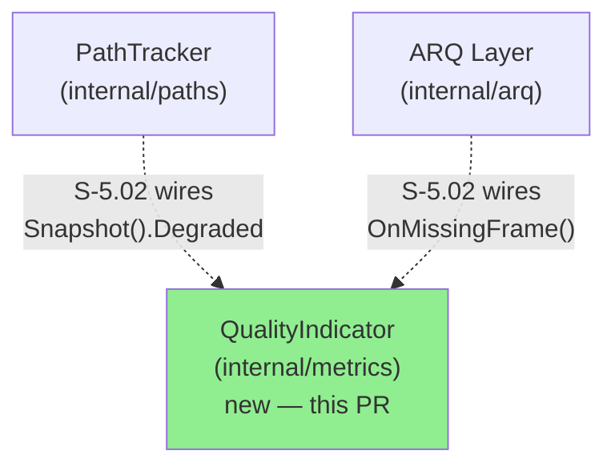
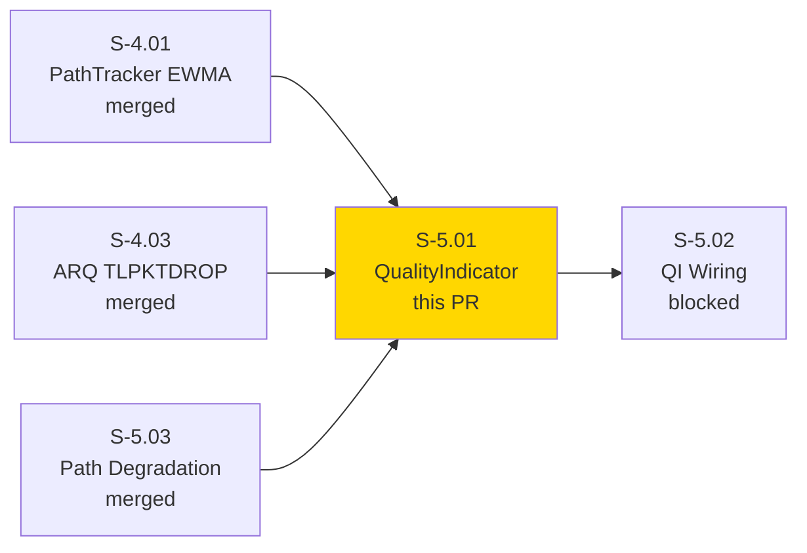
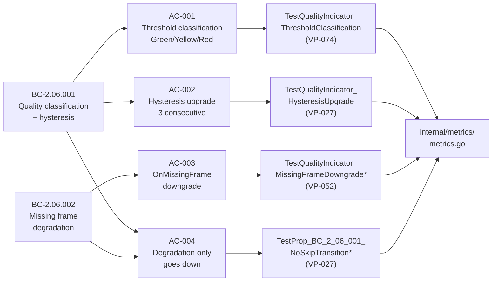
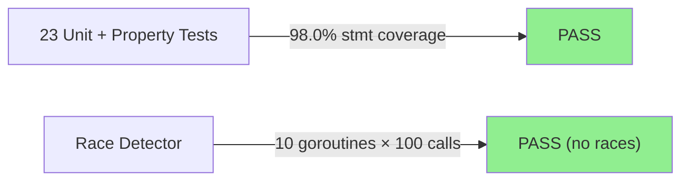
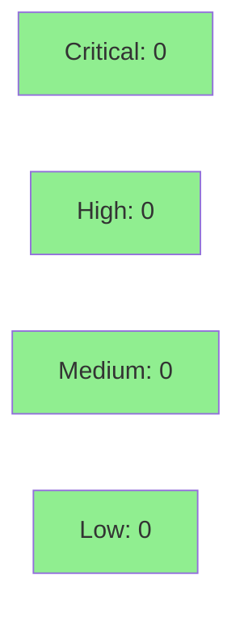

# [S-5.01] Green/Yellow/Red Quality Indicator with Hysteresis

**Epic:** E-5 — Quality Observability
**Mode:** greenfield
**Convergence:** CONVERGED after 3 adversarial passes (Pass-3 lenses: correctness / concurrency / traceability — 0/0/0 findings)


Implements `QualityIndicator` in `internal/metrics` — a pure-core state machine that
classifies session quality as Green / Yellow / Red based on measured RTT and packet loss,
with a hysteresis gate of 3 consecutive measurements required before upgrading (per
BC-2.06.001 / ARCH-INDEX F-021), and an `OnMissingFrame()` signal for degradation from
the ARQ layer (BC-2.06.002). Red takes precedence over Yellow when a single measurement
simultaneously satisfies both predicates (BC-2.06.001 v1.3 PC-4). The wiring from
`PathTracker.Snapshot().Degraded` to `QualityIndicator.Update()` is deferred to S-5.02.

---

## Architecture Changes



<details>
<summary><strong>Architecture Decision Record</strong></summary>

### ADR: Pure-core quality state machine in internal/metrics

**Context:** BC-2.06.001 requires a quality indicator with hysteresis. The state machine
has no I/O requirements — it takes `(rttMs, lossPct float64)` and returns a Quality enum.

**Decision:** Implement as a pure-core struct in `internal/metrics`. No I/O, no goroutines.
Mutex-protected for concurrent access from multiple path goroutines.

**Rationale:** Pure-core pattern minimises test surface and keeps the classification logic
independently testable without stubs. Wiring (PathTracker → QualityIndicator) belongs in
the layer that owns the path lifecycle (S-5.02).

**Alternatives Considered:**
1. Embed in PathTracker — rejected: violates module separation (ARCH-08 position 12)
2. Channel-based event loop — rejected: unnecessary complexity for a pure function + mutex

**Consequences:**
- Classification is fully unit-testable in isolation
- S-5.02 wires the integration; S-5.01 has no external dependencies

</details>

---

## Story Dependencies



---

## Spec Traceability



---

## Test Evidence

### Coverage Summary

| Metric | Value | Threshold | Status |
|--------|-------|-----------|--------|
| Unit tests | 23/23 pass | 100% | PASS |
| Coverage (statements) | 98.0% | >80% | PASS |
| Property tests | 6 × 1000 samples | N/A | PASS |
| Race detector | clean | 0 races | PASS |

### Test Flow



| Metric | Value |
|--------|-------|
| **New tests** | 23 added (unit + property + concurrent) |
| **Total suite** | 23 tests PASS in ~0.33s |
| **Coverage (statements)** | 98.0% |
| **Property test samples** | 6 properties × 1000 cases each |
| **Regressions** | 0 |

<details>
<summary><strong>Detailed Test Results</strong></summary>

### Tests (This PR — internal/metrics)

| Test | Category | AC | Result |
|------|----------|----|--------|
| `TestQualityIndicator_ThresholdClassification` (14 sub-tests) | Unit | AC-001 | PASS |
| `TestQualityIndicator_ThresholdBoundary` | Unit | AC-001 | PASS |
| `TestQualityIndicator_HysteresisUpgrade` | Unit | AC-002 | PASS |
| `TestQualityIndicator_RedToGreenViaSixMeasurements` | Unit | AC-002 | PASS |
| `TestQualityIndicator_SingleGoodMeasurementNoUpgrade` | Unit | AC-002 | PASS |
| `TestQualityIndicator_HysteresisResetOnBadMeasurement` | Unit | AC-002 | PASS |
| `TestQualityIndicator_MissingFrameDowngradeGreenToYellow` | Unit | AC-003 | PASS |
| `TestQualityIndicator_MissingFrameDowngradeYellowToRed` | Unit | AC-003 | PASS |
| `TestQualityIndicator_MissingFrameSubthresholdNoDowngrade` | Unit | AC-003 | PASS |
| `TestQualityIndicator_MissingFrameCounterResetOnGoodUpdate` | Unit | AC-003 | PASS |
| `TestQualityIndicator_MissingFrameCounterResetByYellowUpdate` | Unit | AC-003 | PASS |
| `TestQualityIndicator_DegradationNeverSkipsLevel` | Unit | AC-004 | PASS |
| `TestQualityIndicator_RecoveryNeverSkipsLevel` | Unit | AC-004 | PASS |
| `TestQualityIndicator_DowngradeIsImmediate` | Unit | AC-004 | PASS |
| `TestQualityIndicator_MissingFrameRecoveryAfterDowngrade` | Unit | AC-003/004 | PASS |
| `TestQualityIndicator_String` | Unit | — | PASS |
| `TestQualityIndicator_ConcurrentUpdates` | Concurrent | — | PASS |
| `TestProp_BC_2_06_001_NoSkipTransitionDuringDegradation` | Property (VP-027) | AC-004 | PASS |
| `TestProp_BC_2_06_001_NoRedToGreenSkipDuringRecovery` | Property (VP-027) | AC-004 | PASS |
| `TestProp_BC_2_06_001_QualityIsAlwaysValidEnum` | Property (VP-027) | — | PASS |
| `TestProp_BC_2_06_001_GreenToRedSingleStep` | Property (VP-027, F-C1) | AC-004 | PASS |
| `TestProp_BC_2_06_002_MissingFrameNeverSkipsLevel` | Property (VP-052) | AC-003 | PASS |
| `TestQualityIndicator_OnMissingFrame_PropertyMonotone` | Property (VP-074) | AC-003 | PASS |

### Coverage Analysis

| Module | Statements | Coverage |
|--------|-----------|---------|
| `internal/metrics/metrics.go` | all | 98.0% |
| `Current()` | 100% | — |
| `OnMissingFrame()` | 100% | — |
| `classify()` | 100% | — |
| `Update()` | 96.3% | — |

</details>

---

## Demo Evidence

Demo evidence recorded in factory-artifacts branch at commit `84d7c2c`.
Path: `.factory/demo-evidence/S-5.01/`

| AC | Artifact | Tests Demonstrated | Result |
|----|----------|--------------------|--------|
| AC-001 | `AC-001-threshold-classification.txt` | ThresholdClassification (14 sub-tests) + ThresholdBoundary | PASS |
| AC-002 | `AC-002-hysteresis-upgrade.txt` | HysteresisUpgrade + 3 supporting tests | PASS |
| AC-003 | `AC-003-missing-frame-downgrade.txt` | MissingFrameDowngrade* (5 tests) | PASS |
| AC-004 | `AC-004-degradation-only-goes-down.txt` | DegradationNeverSkipsLevel + 2 supporting tests | PASS |
| VP-027/052/074 | `property-tests-VP027-VP052-VP074.txt` | 6 property tests × 1000 samples | PASS |
| Concurrency | `full-suite-race-detector.txt` | `go test -race` full suite | PASS (no races) |

Convergence record: factory-artifacts commit `272ae97`

---

## Holdout Evaluation

N/A — evaluated at wave gate (Wave 5 gate covers E-5 holdout scenarios).

---

## Adversarial Review

| Pass | Lens | Findings | Critical | High | Status |
|------|------|----------|----------|------|--------|
| 1 (CR-001–006) | code-quality | 6 | 0 | 0 | Fixed (test-side strengthenings) |
| 2 (F-002, F-003) | correctness | 2 | 0 | 0 | Fixed (proptest seeding + String coverage) |
| 3 (correctness/concurrency/traceability) | all 3 lenses | 0 | 0 | 0 | CONVERGED |

**Convergence:** 3 clean Pass-3 lenses — 0/0/0 findings. BC-5.39.001 adversarial convergence ACHIEVED.

<details>
<summary><strong>Key Findings & Resolutions</strong></summary>

### CR-001–006: Test-side strengthenings (Pass 1)
- `metrics_test.go`: Added `t.Helper()` calls, `t.Parallel()` where safe, table-driven sub-tests
- Resolution: applied in commit `d4e90c1`

### F-002: Proptest seeding (Pass 2)
- `metrics_prop_test.go`: genMonotoneRisingSteps step bounds corrected to ensure Green→Yellow and Yellow→Red boundaries are both reliably crossed within the 16-step budget
- Resolution: applied in commit `cad96f7`

### F-003: Quality.String() coverage (Pass 2)
- `TestQualityIndicator_String` added to cover the String() method
- Resolution: applied in commit `cad96f7`

### Pass-3 convergence items (F-C1)
- `genGreenToRedJump` generator added for targeted Green→Red single-step testing (VP-027)
- `TestQualityIndicator_OnMissingFrame_PropertyMonotone` added for VP-074 OR-form threshold
- Concurrent test functional oracle added (beyond race detector)
- Resolution: applied in commit `9c8497f`

</details>

---

## Security Review



`internal/metrics` is a pure-core package: no I/O, no network, no user input, no external
dependencies beyond `sync` (stdlib). OWASP injection / auth / input-validation attack
surface: none. `go vet` + `golangci-lint` (0 issues). No CWE-applicable patterns.

---

## Risk Assessment & Deployment

### Blast Radius
- **Systems affected:** `internal/metrics` only (new package; no existing callers until S-5.02)
- **User impact:** None at merge — the package is not wired into any binary entrypoint until S-5.02
- **Data impact:** None — pure in-memory state machine, no persistence
- **Risk Level:** LOW

### Performance Impact
| Metric | Notes |
|--------|-------|
| `Update()` | O(1) — threshold compare + mutex lock |
| `OnMissingFrame()` | O(1) — counter increment + mutex lock |
| Memory | Single `QualityIndicator` struct (~48 bytes) |

<details>
<summary><strong>Rollback Instructions</strong></summary>

**If S-5.02 is not yet merged:** Reverting this PR has no user-visible effect.

**If S-5.02 is merged (wiring is live):**
```bash
git revert <S-5.02-commit>
git revert <S-5.01-squash-sha>
git push origin develop
```

</details>

### Feature Flags
None — pure library addition with no binary wiring until S-5.02.

---

## Traceability

| Behavioral Contract | Story AC | Test | VP | Status |
|---------------------|---------|------|----|--------|
| BC-2.06.001 PC-2 (Green) | AC-001 | `TestQualityIndicator_ThresholdClassification` | VP-074 | PASS |
| BC-2.06.001 PC-3 (Yellow, OR-form) | AC-001 | `TestQualityIndicator_ThresholdClassification` | VP-074 | PASS |
| BC-2.06.001 PC-4 (Red, precedence) | AC-001 | `TestQualityIndicator_ThresholdClassification` | VP-074 | PASS |
| BC-2.06.001 invariant 3 (hysteresis=3) | AC-002 | `TestQualityIndicator_HysteresisUpgrade` | VP-027 | PASS |
| BC-2.06.002 PC-2 (missing-frame downgrade) | AC-003 | `TestQualityIndicator_MissingFrameDowngradeGreenToYellow` | VP-052 | PASS |
| BC-2.06.001 inv-3 + BC-2.06.002 PC-2 (no skip) | AC-004 | `TestProp_BC_2_06_001_NoSkipTransitionDuringDegradation` | VP-027 | PASS |

<details>
<summary><strong>Full VSDD Contract Chain</strong></summary>

```
BC-2.06.001 PC-2 → AC-001 → TestQualityIndicator_ThresholdClassification → classify() → ADV-PASS-3-OK
BC-2.06.001 PC-3 → AC-001 → TestQualityIndicator_ThresholdClassification → classify() → ADV-PASS-3-OK
BC-2.06.001 PC-4 → AC-001 → TestQualityIndicator_ThresholdClassification → classify() → ADV-PASS-3-OK
BC-2.06.001 inv-3 → AC-002 → TestQualityIndicator_HysteresisUpgrade → Update() → ADV-PASS-3-OK
BC-2.06.002 PC-2 → AC-003 → TestQualityIndicator_MissingFrameDowngradeGreenToYellow → OnMissingFrame() → ADV-PASS-3-OK
BC-2.06.001 inv-3 → AC-004 → TestProp_BC_2_06_001_NoSkipTransitionDuringDegradation → VP-027 proptest → ADV-PASS-3-OK
BC-2.06.002 PC-2 → AC-004 → TestProp_BC_2_06_002_MissingFrameNeverSkipsLevel → VP-052 proptest → ADV-PASS-3-OK
```

</details>

---

## AI Pipeline Metadata

<details>
<summary><strong>Pipeline Details</strong></summary>

```yaml
ai-generated: true
pipeline-mode: greenfield
factory-version: "1.0.0-rc.21"
pipeline-stages:
  spec-crystallization: completed
  story-decomposition: completed
  tdd-implementation: completed
  holdout-evaluation: "N/A — evaluated at wave gate"
  adversarial-review: completed
  formal-verification: "N/A — evaluated at Phase 5"
  convergence: achieved
convergence-metrics:
  adversarial-passes: 3
  pass-3-findings: 0
  coverage: 98.0%
  property-test-samples: 6000
models-used:
  builder: claude-sonnet-4-6 (us.anthropic.claude-sonnet-4-6)
  adversary: claude-sonnet-4-6
demo-evidence-commit: 84d7c2c
convergence-commit: 272ae97
generated-at: "2026-06-29T00:00:00Z"
```

</details>

---

## Pre-Merge Checklist

- [ ] All CI status checks passing (ci, codeql, dependency-review, scorecards)
- [x] Coverage delta: 98.0% (new package, no prior baseline — exceeds 80% threshold)
- [x] No critical/high security findings (pure-core package, 0 findings)
- [x] Rollback procedure: LOW risk — no binary wiring until S-5.02
- [x] Demo evidence present: `.factory/demo-evidence/S-5.01/` (factory-artifacts @84d7c2c)
- [x] Adversarial convergence: BC-5.39.001 ACHIEVED (3 passes, 0/0/0)
- [x] Race detector: clean (go test -race, full suite)
- [x] Dependency PRs merged: S-4.01, S-4.03, S-5.03 all merged to develop
- [ ] Human review completed (if autonomy level requires)
