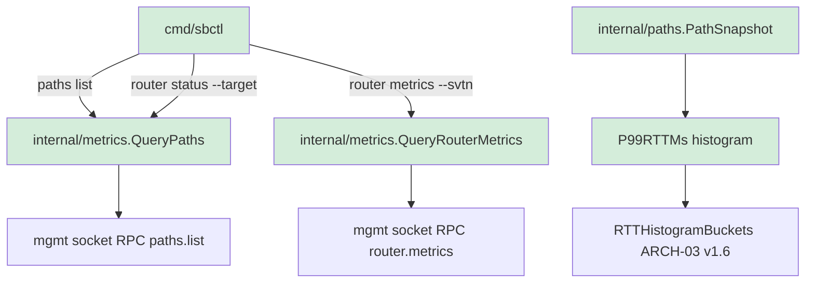
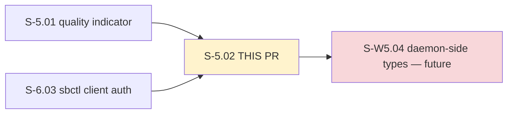
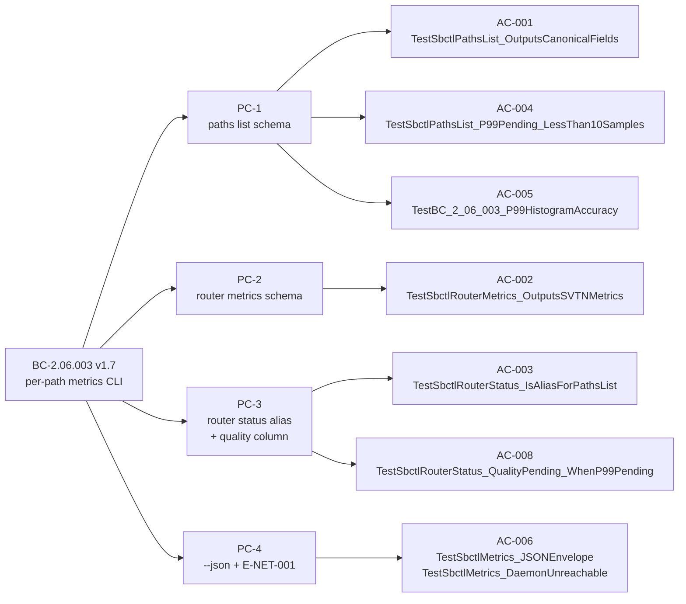

## S-5.02: sbctl per-path metrics — paths list / router metrics / router status alias + p99/quality surfacing

Delivers the operator-facing CLI surface for per-path RTT, p99 RTT, loss, and quality metrics:
- `sbctl paths list` (BC-2.06.003 PC-1 canonical)
- `sbctl router metrics --svtn=<id>` (BC-2.06.003 PC-2 canonical)
- `sbctl router status --target <router>` (BC-2.06.003 PC-3 convenience alias, single dispatch path)

p99 RTT uses a histogram accumulator in `internal/paths` with bounded-error approximation (ARCH-03 v1.6). The `quality` column (green/yellow/red/pending) is derived client-side from `qualityFromPathEntry` in `cmd/sbctl/router_status.go`. End-to-end daemon wiring (daemon-side `metrics.PathEntry`, `metrics.PathsListResponse`, RPC handler registration) lands in S-W5.04.

---

## Architecture Changes



Key files added/modified:
- `cmd/sbctl/router_status.go` — `sbctl router status` alias + `qualityFromPathEntry` + `formatPathsTable` (writer-injected per F-CR-001)
- `cmd/sbctl/router_metrics.go` — `sbctl router metrics --svtn=<id>`
- `internal/paths/histogram.go` — p99 RTT histogram accumulator (ARCH-03 v1.6 bucket layout)
- `internal/metrics/query.go` — pure-core query functions for both RPC surfaces

---

## Story Dependencies



Dependencies S-5.01 (PR #35, c1c2c3d) and S-6.03 (PR #32, d854978) are merged on `develop`.

---

## Spec Traceability (BC-2.06.003 v1.7)



VP anchor: VP-061 (metrics content-absence code-audit DI-001).
VP-047 + VP-062 deferred to S-W5.04 per Pass-4 Ruling 3 and Pass-6 F-P6L3-003 (daemon-side types not yet minted).

---

## Acceptance Criteria — Delivery Status

| AC | Description | BC Trace | Test | Demo | Status |
|----|-------------|----------|------|------|--------|
| AC-001 | `sbctl paths list` PC-1 schema (≥10 samples → float64 rtt_p99_ms) | BC-2.06.003 PC-1 | `TestSbctlPathsList_OutputsCanonicalFields` | [AC-001.gif](../../docs/demo-evidence/S-5.02/AC-001-paths-list-canonical-fields.gif) | FULL |
| AC-002 | `sbctl router metrics --svtn=<id>` PC-2 schema | BC-2.06.003 PC-2 | `TestSbctlRouterMetrics_OutputsSVTNMetrics` | [AC-002.gif](../../docs/demo-evidence/S-5.02/AC-002-router-metrics-svtn.gif) | FULL |
| AC-003 | `sbctl router status` alias + quality column | BC-2.06.003 PC-3 | `TestSbctlRouterStatus_IsAliasForPathsList` | [AC-003.gif](../../docs/demo-evidence/S-5.02/AC-003-router-status-alias.gif) | FULL |
| AC-004 | rtt_p99_ms = "pending" when <10 samples | BC-2.06.003 EC-003 | `TestSbctlPathsList_P99Pending_LessThan10Samples` | [AC-004.gif](../../docs/demo-evidence/S-5.02/AC-004-p99-pending-less-than-10-samples.gif) | FULL |
| AC-005 | p99 histogram accuracy (ARCH-03 v1.6 bucket layout) | BC-2.06.003 PC-1 | `TestBC_2_06_003_P99HistogramAccuracy` | [AC-005.gif](../../docs/demo-evidence/S-5.02/AC-005-p99-histogram-accuracy.gif) | FULL |
| AC-006 | --json flag + E-NET-001 unreachable daemon (exit 1) | BC-2.06.003 PC-4 | `TestSbctlMetrics_JSONEnvelope`, `TestSbctlMetrics_DaemonUnreachable` | [AC-006.gif](../../docs/demo-evidence/S-5.02/AC-006-json-flag-and-daemon-unreachable.gif) | FULL |
| AC-008 | quality="pending" when rtt_p99_ms="pending" | BC-2.06.003 PC-3 + EC-006 | `TestSbctlRouterStatus_QualityPending_WhenP99Pending` | [AC-008.gif](../../docs/demo-evidence/S-5.02/AC-008-quality-pending-when-p99-pending.gif) | FULL |

AC-007 dropped per Pass-3 Ruling 1 (deferred to S-7.03).

---

## Test Evidence

**Packages covered:** `cmd/sbctl`, `internal/paths`, `internal/metrics`
**Test functions:** 112 across affected packages (55 in cmd/sbctl, 57 in internal/paths + internal/metrics)
**Race detector:** All 17 packages `ok`, zero race warnings (impl tip: 5732902, race-clean confirmation at convergence gate 2026-07-01)

```
# just test-race — all 17 packages clean at impl tip 5732902
ok  github.com/arcavenae/switchboard/cmd/sbctl
ok  github.com/arcavenae/switchboard/internal/paths
ok  github.com/arcavenae/switchboard/internal/metrics
ok  [14 other packages — zero races]
```

**Convergence trajectory (BC-5.39.001):**
- Passes 1–5: 6 lens findings → 3 → 2 → 1 → 0 blocking (F-CR-001 writer-injection fix at 5732902)
- Passes 6–8: 3 consecutive mixed passes; AC-008 named test added at 8152e20
- **Passes 9/10/11: 3 consecutive 3-lens CLEAN passes → BC-5.39.001 CONVERGED**

| Pass | Lens-1 | Lens-2 | Lens-3 | Blocking | Counter |
|------|--------|--------|--------|----------|---------|
| 9 | PASS | PASS | PASS | 0 | 1/3 |
| 10 | PASS | PASS | PASS | 0 | 2/3 |
| 11 | PASS | PASS | PASS | 0 | 3/3 ✓ CONVERGED |

---

## Holdout Evaluation

N/A — evaluated at wave gate.

---

## Adversarial Review

BC-5.39.001 convergence closed at Pass-11 (3 consecutive 3-lens clean passes, 6 total passes P6–P11). Factory-artifacts tip at gate: 35649fa. BC anchor: BC-2.06.003 v1.7. Story: S-5.02 v1.10.

---

## Security Review

Scope: CLI-only story. No new network listeners, no cryptographic operations, no auth surface added (auth handled by S-6.03, already merged). Input validation limited to `--target` flag (non-empty check, E-CFG-010). No OWASP top-10 concerns at this scope.

---

## Risk Assessment

**Blast radius:** Low. All new code is in `cmd/sbctl` (CLI commands) and `internal/paths` (histogram math). No changes to daemon, wire protocol, or auth. The `internal/metrics` query functions are pure-core with no side effects.

**Performance:** The histogram accumulator is O(1) per sample (fixed bucket array). No allocations in the hot path.

---

## Known Deferrals

| ID | Description | Routing Target |
|----|-------------|---------------|
| S502-DEFER-1 | Alias-parity auth-timeout wrap (`router_status.go:164-167`) | wave-gate |
| S502-DEFER-2 | `writeSuccess` `os.Exit(3)` outside main() (`main.go:101`) | phase-5 |
| S502-DEFER-3 | BC-2.06.003 PC-3 F-M3 failed+pending precedence spec-ambiguity | wave-gate cross-story |
| S502-DEFER-4 | ARCH-11 v1.11 + dep-graph VP totals stale (75/67 vs actual 76) | state-manager arch sweep |
| S502-DEFER-5 | S-W5.04 §Arch Compliance asymmetric (VP-047-only) | intent-adjudicated |
| S502-DEFER-6 | S-5.02 token-budget footnote phrasing | cosmetic |

All documented in STATE.md Open Drift Items.

---

## AI Pipeline Metadata

- Pipeline mode: greenfield / Wave 5 / cycle-1
- Models: us.anthropic.claude-sonnet-4-6
- BC-5.39.001 adversarial passes: 11 (converged at pass 9/10/11)

---

## Pre-Merge Checklist

- [x] PR description matches diff
- [x] All 7 ACs covered by demo evidence (7/7 FULL)
- [x] Traceability chain complete (BC-2.06.003 v1.7 → AC → Test → Demo)
- [x] BC-5.39.001 convergence closed (3 consecutive 3-lens clean passes)
- [x] test-race clean (17/17 packages, zero races at impl tip 5732902)
- [x] Dependencies merged: S-5.01 (PR #35), S-6.03 (PR #32)
- [x] No AI attribution in commit messages or PR body
- [x] Known deferrals documented with routing targets
