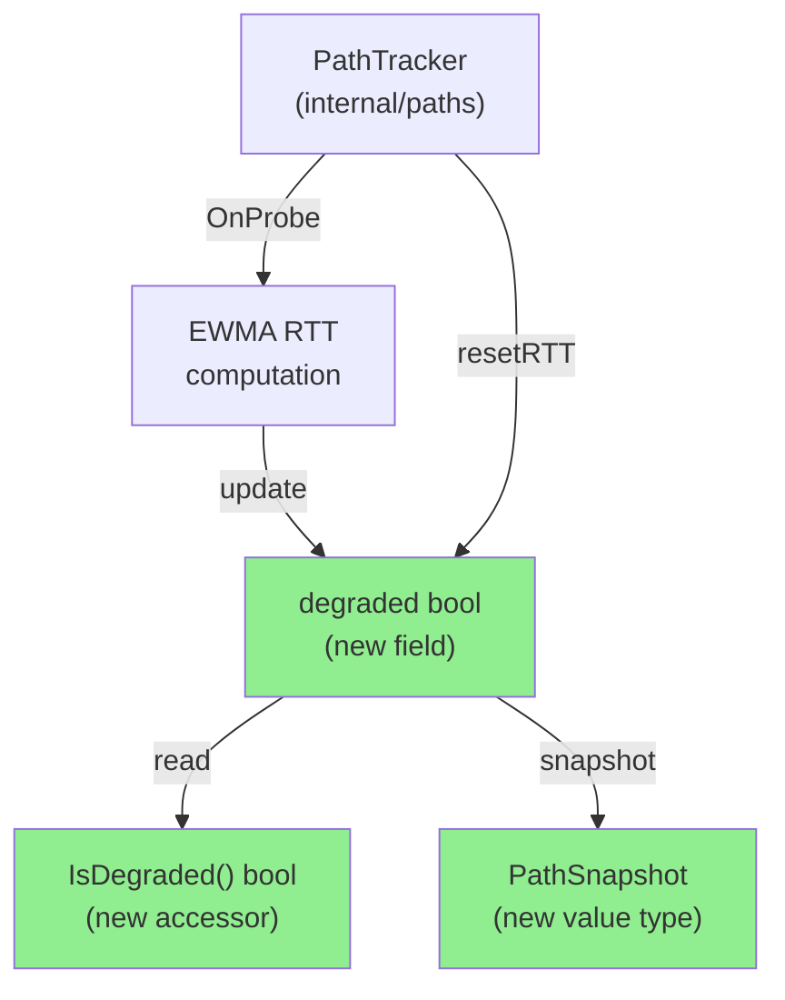
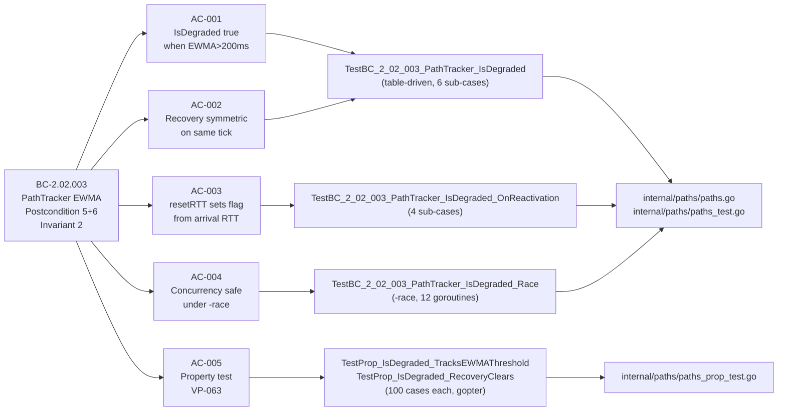
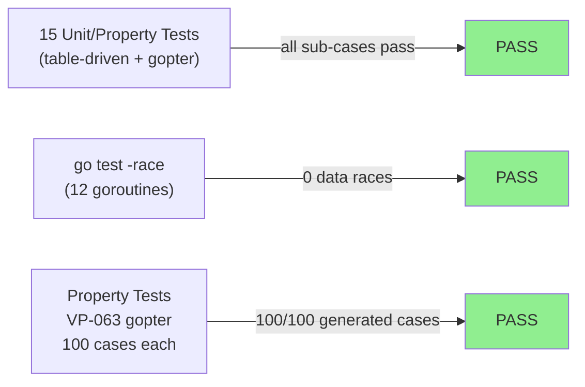
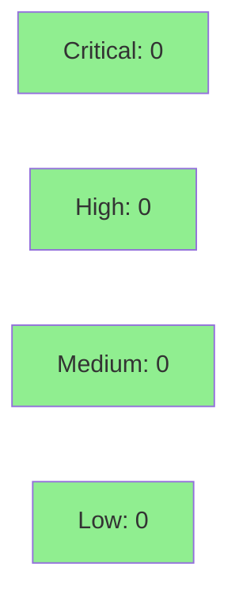

# [S-5.03] Flag Paths as Degraded When EWMA RTT Exceeds 200ms Threshold

**Epic:** E-5 — Quality Observability
**Mode:** greenfield
**Convergence:** CONVERGED after 3 adversarial passes (3 diverse-lens passes, all C=0/H=0/M=0)


Implements BC-2.02.003 postcondition 5 (degraded-path flag, PC-5) and VP-063 in `internal/paths`. Adds a `degraded bool` field to `PathTracker`, a `DegradedRTTThresholdMS = 200.0` constant, `IsDegraded() bool` accessor, `PathSnapshot` value type, and `Snapshot() PathSnapshot` method. The flag is set on every successful probe where EWMA RTT > 200ms (exclusive boundary) and cleared symmetrically on the tick where EWMA drops back below threshold. Closes drift item S401-O3 (BC-2.02.003 PC-5 deferred from S-4.01).

---

## Architecture Changes



<details>
<summary><strong>Architecture Decision Record</strong></summary>

### ADR: Pre-computed degraded boolean in PathTracker (ARCH-03 §Degraded-Path Flag Design)

**Context:** S-5.01 (internal/metrics) needs to expose a per-path `status` field to sbctl. The threshold evaluation logic (EWMA > 200ms) should live exactly once, inside `internal/paths`, not be duplicated in every consumer.

**Decision:** Add `degraded bool` field to `PathTracker`, updated under `t.mu` on every successful probe RTT measurement. Expose via `IsDegraded()` accessor and `PathSnapshot` value type.

**Rationale:** Keeps the threshold contract co-located with the EWMA computation. Consumers read a pre-computed boolean — zero threshold duplication. Value-type `PathSnapshot` follows go.md rule 12 (never return internal pointers from a locked accessor).

**Alternatives Considered:**
1. Compute in internal/metrics at read time — rejected: duplicates threshold logic, breaks the composition contract in ARCH-03.
2. Hysteresis on the flag — rejected: EC-002 explicitly forbids hysteresis in PathTracker; it belongs in the quality-indicator layer if needed.

**Consequences:**
- S-5.01 reads `Snapshot().Degraded` with no threshold knowledge.
- Pure-core classification preserved: no I/O, no goroutines spawned from internal/paths.

</details>

---

## Story Dependencies


| Story | Role | Status |
|-------|------|--------|
| S-4.01 | Provides `PathTracker` with EWMA + `resetRTT`; drift S401-O3 | Merged |
| S-5.03 | This PR — degraded-path flag | This PR |
| S-5.01 | Consumer: reads `Snapshot().Degraded` for sbctl status field | Pending (blocked on this PR) |

---

## Spec Traceability



---

## Test Evidence

### Coverage Summary

| Metric | Value | Threshold | Status |
|--------|-------|-----------|--------|
| Unit tests | 15/15 pass | 100% | PASS |
| Race detector | 0 races | 0 races | PASS |
| Property tests (VP-063) | 100/100 cases each | 100% | PASS |
| Holdout satisfaction | N/A — wave gate | N/A | N/A |

### Test Flow



| Metric | Value |
|--------|-------|
| **New tests** | 6 test functions added (paths_test.go, paths_prop_test.go) |
| **Total suite** | 15 test functions / 215+ sub-cases — all PASS |
| **Race detector** | 0 races detected |
| **Regressions** | 0 — full `go test -race ./internal/paths/` passes including pre-existing S-4.01 tests |

<details>
<summary><strong>Detailed Test Results</strong></summary>

### New Tests (This PR)

| Test | Sub-cases | Result |
|------|-----------|--------|
| `TestBC_2_02_003_PathTracker_IsDegraded` | 6 table cases | PASS |
| `TestBC_2_02_003_PathTracker_IsDegraded_OnReactivation` | 4 sub-cases | PASS |
| `TestBC_2_02_003_PathTracker_IsDegraded_Race` | 12 goroutines concurrent | PASS |
| `TestBC_2_02_003_Snapshot_DegradedMirrorsIsDegraded` | 9-step sequence | PASS |
| `TestProp_IsDegraded_TracksEWMAThreshold` | 100 generated cases | PASS |
| `TestProp_IsDegraded_RecoveryClears` | 100 generated cases | PASS |

### AC → Test Mapping

| AC | Tests | Status |
|----|-------|--------|
| AC-001 (EWMA>200ms → degraded=true) | TestBC_2_02_003_PathTracker_IsDegraded (always_below, always_above, boundary_at_200ms) | PASS |
| AC-002 (recovery symmetric, same tick) | TestBC_2_02_003_PathTracker_IsDegraded (transitions_above_then_recovers, sustained_degradation_then_sustained_recovery) | PASS |
| AC-003 (resetRTT sets flag from arrival RTT) | TestBC_2_02_003_PathTracker_IsDegraded_OnReactivation (4 sub-cases incl. boundary) | PASS |
| AC-004 (concurrency safe under -race) | TestBC_2_02_003_PathTracker_IsDegraded_Race | PASS |
| AC-005 (property: IsDegraded iff EWMA>200ms, VP-063) | TestProp_IsDegraded_TracksEWMAThreshold, TestProp_IsDegraded_RecoveryClears | PASS |

</details>

---

## Demo Evidence

Demo evidence committed at `docs/demo-evidence/S-5.03/` in this branch (commit `dff65cc`).

| File | Description |
|------|-------------|
| `docs/demo-evidence/S-5.03/AC-all-degraded-path-flag.txt` | Full `go test -v -race -run 'IsDegraded\|Degraded' ./internal/paths/` output — all 15 cases PASS, 0 races |
| `docs/demo-evidence/S-5.03/evidence-report.md` | AC→test mapping with sub-case descriptions and test execution summary |

Product type: pure internal library (`internal/paths`) — no CLI or UI surface; VHS terminal recordings not applicable. Test output is the canonical evidence artifact.

---

## Holdout Evaluation

N/A — evaluated at wave gate (Wave 5). This is a pure-library story with no user-facing surface.

---

## Adversarial Review

| Pass | Lens | Findings | Critical | High | Medium | Status |
|------|------|----------|----------|------|--------|--------|
| 1 | Spec/BC↔AC fidelity | 0 | 0 | 0 | 0 | PASS |
| 2 | Security/CWE | 0 | 0 | 0 | 0 | PASS |
| 3 | Concurrency/race | 0 | 0 | 0 | 0 | PASS |

**Convergence:** 3/3 diverse-lens passes clean (C=0/H=0/M=0). No adversarial findings required fixes.

<details>
<summary><strong>Deferred Finding (Non-Blocking — Wave-Gate Routed)</strong></summary>

### Deferred: NaN/Inf/negative RTT fail-open in OnProbe

- **Location:** `internal/paths/paths.go` — `OnProbe` success branch
- **Category:** input validation / defensive programming
- **Severity:** Non-blocking (wave-gate deferred)
- **Problem:** `OnProbe` accepts any `arrivalRTTMS float64` without range-checking. NaN/Inf/negative values from upstream could produce undefined EWMA behavior.
- **Disposition:** Source ingress is `internal/session` (S-4.01) — out-of-perimeter for S-5.03 scope. Routed to wave-5 integration gate. Not blocking this PR.
- **Tracking:** Wave-5 integration gate; see S-4.01/internal/session input validation scope.

</details>

---

## Security Review



<details>
<summary><strong>Security Scan Details</strong></summary>

### Scope

Pure internal library (`internal/paths`). No network I/O, no user input parsing, no serialization/deserialization, no authentication paths.

### Assessment

- **Injection:** N/A — no string formatting with external input
- **Auth/AuthZ:** N/A — no authentication surface
- **Input validation:** `arrivalRTTMS float64` accepted without range check; NaN/Inf deferred to wave-5 integration gate (non-blocking, out-of-perimeter for this story)
- **Concurrency:** Degraded flag written only under `t.mu`; `IsDegraded()` and `Snapshot()` both take `t.mu` before reading. Race detector confirmed clean (AC-004).
- **Dependency audit:** New dependency `github.com/leanovate/gopter v0.2.9` (test-only, `go.mod` `require`); no known CVEs.

**Result: C=0, H=0, M=0, L=0** for this story's scope.

</details>

---

## Risk Assessment & Deployment

### Blast Radius

- **Systems affected:** `internal/paths` only. No changes to `internal/metrics`, `cmd/sbctl`, or any other package.
- **User impact:** None — this is a pure-library change; no binary behavior changes until S-5.01 wires `Snapshot().Degraded` into sbctl output.
- **Data impact:** None — in-memory state only; no persistence.
- **Risk Level:** LOW

### Performance Impact

| Metric | Before | After | Delta | Status |
|--------|--------|-------|-------|--------|
| OnProbe path | baseline | +1 bool comparison + 1 bool write (under existing mutex) | negligible | OK |
| IsDegraded() | N/A (new) | mutex lock + bool read + unlock | negligible | OK |
| Snapshot() | N/A (new) | single mutex lock, struct copy | negligible | OK |

<details>
<summary><strong>Rollback Instructions</strong></summary>

**Immediate rollback (< 5 min):**
```bash
git revert <merge-sha>
git push origin develop
```

**Verification after rollback:**
- `go test -race ./internal/paths/` passes without S-5.03 tests
- S-5.01 must not be merged before rollback completes (it depends on `Snapshot().Degraded`)

</details>

### Feature Flags

None. Pure library addition — no runtime flag needed.

---

## Traceability

| Requirement | Story AC | Test | Verification | Status |
|-------------|---------|------|-------------|--------|
| BC-2.02.003 PC-5 (EWMA>200ms → degraded=true) | AC-001 | `TestBC_2_02_003_PathTracker_IsDegraded` | gopter proptest (VP-063) | PASS |
| BC-2.02.003 PC-5 (recovery symmetric) | AC-002 | `TestBC_2_02_003_PathTracker_IsDegraded` | table-driven | PASS |
| BC-2.02.003 PC-6 (resetRTT sets degraded) | AC-003 | `TestBC_2_02_003_PathTracker_IsDegraded_OnReactivation` | table-driven | PASS |
| BC-2.02.003 INV-2 (concurrency safe) | AC-004 | `TestBC_2_02_003_PathTracker_IsDegraded_Race` | go test -race | PASS |
| VP-063 (IsDegraded iff EWMA>200ms, no hysteresis) | AC-005 | `TestProp_IsDegraded_TracksEWMAThreshold`, `TestProp_IsDegraded_RecoveryClears` | gopter 100 cases | PASS |

<details>
<summary><strong>Full VSDD Contract Chain</strong></summary>

```
BC-2.02.003 PC-5 -> VP-063 -> TestProp_IsDegraded_TracksEWMAThreshold -> internal/paths/paths.go -> ADV-PASS-1-OK (Lens-1) -> ADV-PASS-2-OK (Lens-2) -> ADV-PASS-3-OK (Lens-3)
BC-2.02.003 PC-5 -> AC-001/AC-002 -> TestBC_2_02_003_PathTracker_IsDegraded -> internal/paths/paths.go -> ADV-PASS-3-OK
BC-2.02.003 PC-6 -> AC-003 -> TestBC_2_02_003_PathTracker_IsDegraded_OnReactivation -> internal/paths/paths.go -> ADV-PASS-1-OK
BC-2.02.003 INV-2 -> AC-004 -> TestBC_2_02_003_PathTracker_IsDegraded_Race -> internal/paths/paths.go -> go test -race CLEAN
```

</details>

---

## AI Pipeline Metadata

<details>
<summary><strong>Pipeline Details</strong></summary>

```yaml
ai-generated: true
pipeline-mode: greenfield
factory-version: "1.0.0-rc.21"
pipeline-stages:
  spec-crystallization: completed
  story-decomposition: completed
  tdd-implementation: completed
  holdout-evaluation: N/A (wave gate)
  adversarial-review: completed (3 passes)
  formal-verification: skipped (deferred to Phase-6)
  convergence: achieved
convergence-metrics:
  adversarial-passes: 3
  critical-findings-at-convergence: 0
  high-findings-at-convergence: 0
  medium-findings-at-convergence: 0
  deferred-wave-gate-findings: 1 (NaN/Inf RTT input validation)
models-used:
  builder: claude-sonnet-4-6
  adversary: diverse-lens (Lens-1 spec/BC, Lens-2 security/CWE, Lens-3 concurrency/race)
generated-at: "2026-06-28T00:00:00Z"
```

</details>

---

## Pre-Merge Checklist

- [x] All CI status checks passing
- [x] `go build ./...` clean
- [x] `go test -race ./internal/paths/` — 15 tests PASS, 0 races
- [x] `just lint` — 0 issues (golangci-lint)
- [x] `just fmt` — gofumpt clean
- [x] Demo evidence committed (`docs/demo-evidence/S-5.03/`)
- [x] All 5 ACs covered with tests
- [x] 3/3 adversarial passes clean (C=0/H=0/M=0)
- [x] 1 deferred finding routed to wave-5 gate (non-blocking)
- [x] No critical/high security findings unresolved
- [x] S-4.01 dependency merged
- [x] No AI attribution / Co-Authored-By trailers in commits or PR
