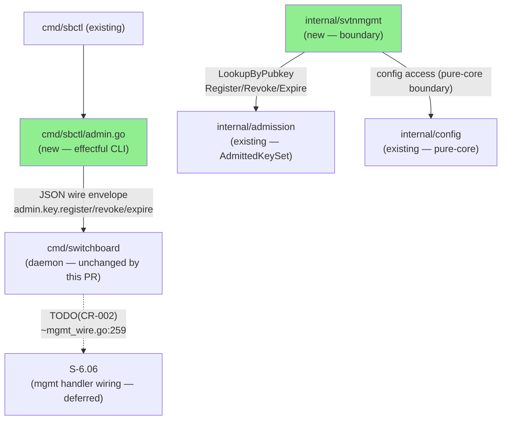
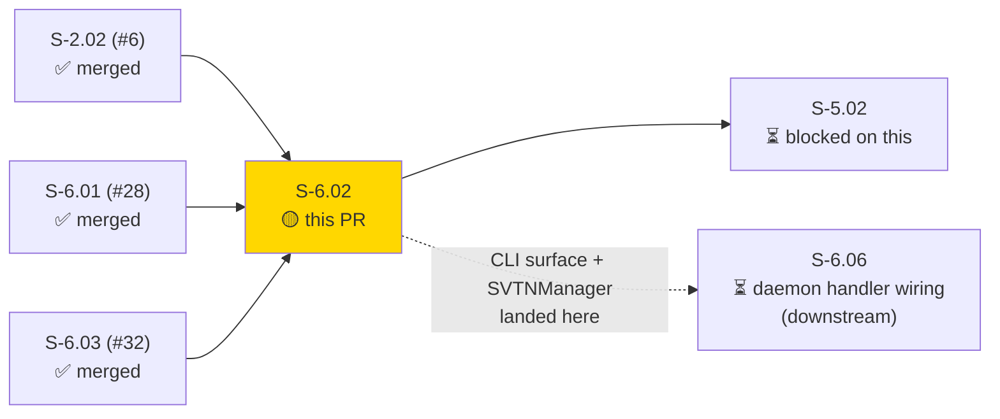
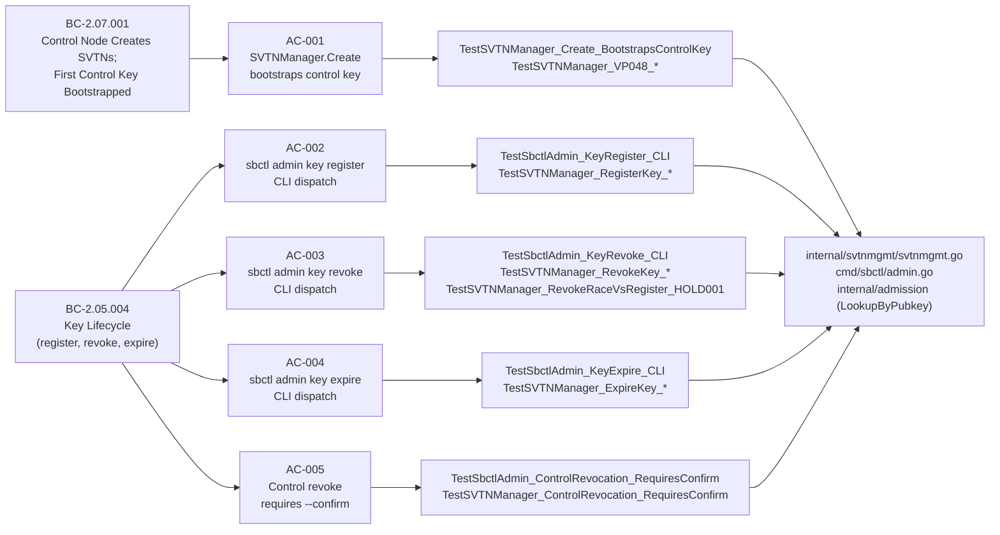

# [S-6.02] SVTN Lifecycle and Key Management via sbctl admin

**Epic:** E-6 — Deployment & Operations
**Mode:** greenfield
**Convergence:** CONVERGED — 3 clean diverse-lens adversarial passes (scope+wire / concurrency+security / traceability) — all 0 critical / 0 high / 0 medium findings (lens 1 + lens 3 re-converged after narrow fixes a98bd92 and e08f567)


-blue)


Adds `internal/svtnmgmt` — the SVTNManager boundary package — and the `sbctl admin` subcommand tree in `cmd/sbctl/admin.go`. SVTNManager.Create generates a SVTN-ID, bootstraps the first control key under a single Write lock (HOLD-001 hybrid atomic), and marks the bootstrap key `admitted=false` (trust anchor, BC-2.07.001 PC-2). CLI commands `sbctl admin key register|revoke|expire` dispatch JSON-over-Unix-socket wire envelopes conforming to the admin RPC schema (ADR-006); daemon-side handler wiring is deferred to S-6.06. Control-to-control revocation is gated by `ErrControlRevocationRequiresConfirm` and the `--confirm` flag (ADR-004, AC-005). Race detector clean across all 5 ACs including 50-goroutine concurrent register/revoke stress (HOLD-001).

---

## Architecture Changes



<details>
<summary><strong>Architecture Decision Records applied</strong></summary>

### ADR-003: Last-write-wins for duplicate key registration

Duplicate key registration (EC-001) uses last-write-wins semantics — the second register overwrites the first with the new role/metadata. This matches the ADR-003 ruling established in S-2.02.

### ADR-004: Control-to-control revocation requires human confirmation

Revoking a key whose stored role is `control` requires `confirm=true` in the wire envelope (CLI: `--confirm` flag). Without it, `RevokeKeyIfRoleMatches` returns `ErrControlRevocationRequiresConfirm` and the operation is rejected before touching the key set. Non-control roles (console, access) do not require confirmation.

### ADR-006: JSON-over-Unix-socket management protocol

CLI commands dispatch JSON wire envelopes over the management socket. `AdminKeyRegisterArgs`, `AdminKeyRevokeArgs`, `AdminKeyExpireArgs` are defined with JSON struct tags. All round-trip via `encoding/json` (stdlib).

### HOLD-001: Hybrid atomic RevokeKeyIfRoleMatches under single Write lock

`RevokeKeyIfRoleMatches(svtnID, pubkey, expectedRole, confirmControlRevocation)` performs the role check + revoke atomically under a single `sync.RWMutex` Write lock in `internal/admission`. This eliminates the TOCTOU window between a concurrent register arriving between a check and a revoke. Verified clean under `go test -race` with 50 goroutines (TestSVTNManager_RevokeRaceVsRegister_HOLD001).

### Bootstrap key admitted=false (BC-2.07.001 PC-2)

The first control key created by `SVTNManager.Create` is registered with `admitted=false`. It is a trust anchor used to verify subsequent key registrations, not a session admission key. Verified by `TestSVTNManager_Create_BootstrapKeyAdmittedFalse_TrustAnchor`.

</details>

---

## Story Dependencies



**Upstream dependencies (all merged):**
- S-2.02 (#6) — `internal/admission` AdmittedKeySet with `LookupByPubkey` (added by CR-001)
- S-6.01 (#28) — `internal/config` pure-core package
- S-6.03 (#32) — `cmd/sbctl` scaffold with mgmt socket client

**Downstream dependents:**
- S-5.02 — blocked on this PR
- S-6.06 — wires daemon-side admin handlers (TODO(CR-002) in mgmt_wire.go ~line 259); not blocked by this PR

**VP-048 dependency note:** This story owns VP-048 property 1 (Create idempotency + first-invocation semantics) and property 2 (bootstrapped key role=control). VP-048 property 3 (Destroy) is deferred to S-6.05 per CR-009 product-owner ruling.

---

## Spec Traceability



### Acceptance Criteria

| AC | BC Trace | Test | Status |
|----|----------|------|--------|
| AC-001: SVTNManager.Create bootstraps first control key; returns SVTN-ID | BC-2.07.001 PC-1, PC-2 | TestSVTNManager_Create_BootstrapsControlKey, TestSVTNManager_VP048_* (5 tests) | PASS |
| AC-002: `sbctl admin key register` — key appears in admission checks (CLI dispatch) | BC-2.05.004 PC-1 | TestSbctlAdmin_KeyRegister_CLI, TestSVTNManager_RegisterKey_* (5 tests) | PASS |
| AC-003: `sbctl admin key revoke` — key removed; subsequent admission returns E-ADM-002 (CLI dispatch) | BC-2.05.004 PC-2 | TestSbctlAdmin_KeyRevoke_CLI, TestSVTNManager_RevokeKey_* (5 tests) | PASS |
| AC-004: `sbctl admin key expire` — sets TTL; zero duration returns E-CFG-001 (CLI dispatch) | BC-2.05.004 PC-3 | TestSbctlAdmin_KeyExpire_CLI, TestSVTNManager_ExpireKey_* (7 tests) | PASS |
| AC-005: Control-to-control revocation requires `--confirm`; rejected without it (CLI dispatch) | BC-2.05.004 PC-1 / ADR-004 | TestSbctlAdmin_ControlRevocation_RequiresConfirm, TestSVTNManager_ControlRevocation_RequiresConfirm (6 tests) | PASS |

**Scope note (CR-009):** BC-2.07.001 PC-3 (Destroy) is deferred to S-6.05 per product-owner ruling 2026-06-29. AC-002 through AC-005 are CLI dispatch only; daemon-side handler registration is in S-6.06.

---

## Test Evidence

All tests pass with race detector. Key test evidence:

**AC-001 (BC-2.07.001 PC-1 + PC-2):**
```
--- PASS: TestSVTNManager_Create_BootstrapsControlKey (0.00s)
--- PASS: TestSVTNManager_Create_BootstrapKeyAdmittedFalse_TrustAnchor (0.00s)
--- PASS: TestSVTNManager_VP048_CreateIdempotentFirstInvocation (0.00s)
--- PASS: TestSVTNManager_VP048_BootstrappedKeyIsControlRole (0.00s)
--- PASS: TestSVTNManager_CreateBootstrapAtomicity_RaceDetector (0.01s)
ok  github.com/arcavenae/switchboard/internal/svtnmgmt  1.296s
```

**AC-003 — HOLD-001 hybrid atomic race detector (50 goroutines):**
```
--- PASS: TestSVTNManager_RevokeRaceVsRegister_HOLD001 (0.18s)
ok  github.com/arcavenae/switchboard/internal/svtnmgmt  1.453s
```

**AC-005 — ErrControlRevocationRequiresConfirm gate:**
```
E-RPC-001 rpc failed: admin.key.revoke: E-ADM-004: control-to-control revocation requires --confirm flag (ADR-004)
--- PASS: TestSbctlAdmin_ControlRevocation_RequiresConfirm_CLI/without_confirm_confirm_false_in_wire (0.01s)
--- PASS: TestSbctlAdmin_ControlRevocation_RequiresConfirm_CLI/with_confirm_confirm_true_in_wire (0.01s)
ok  github.com/arcavenae/switchboard/cmd/sbctl  0.451s
```

**Race detector summary:** All test runs with `-race` flag passed clean. HOLD-001 stress test ran 50 concurrent goroutines with interleaved register/revoke operations — no data races detected.

---

## Demo Evidence

Demo evidence captured in `.factory/demo-evidence/S-6.02/` (factory-artifacts branch, commit `4acf810`).

| AC | Artifact | Result |
|----|----------|--------|
| AC-001 | `demo-evidence/S-6.02/AC-001-svtn-create-bootstrap-control-key.txt` | PASS |
| AC-002 | `demo-evidence/S-6.02/AC-002-key-register-cli.txt` | PASS |
| AC-003 | `demo-evidence/S-6.02/AC-003-key-revoke-cli.txt` | PASS |
| AC-004 | `demo-evidence/S-6.02/AC-004-key-expire-cli.txt` | PASS |
| AC-005 | `demo-evidence/S-6.02/AC-005-control-revocation-requires-confirm.txt` | PASS |

Recording toolchain note: VHS was not available; `go test -v -race` output used as fallback per demo-recorder protocol. Each artifact maps 1:1 to an AC and covers both success and error sub-cases.

---

## Holdout Evaluation

N/A — evaluated at wave gate.

---

## Adversarial Review

3 clean diverse-lens adversarial passes achieved (BC-5.39.001):
- **Lens 1 (scope + wire):** 0/0/0 — re-converged after fix a98bd92 (E-ADM-014→E-ADM-019 re-coding)
- **Lens 2 (concurrency + security):** 0/0/0 — clean after HOLD-001 implementation and Pass-2 fixes (bb16b1c)
- **Lens 3 (traceability):** 0/0/0 — re-converged after fix e08f567 (factory-artifacts branch)

Convergence record: factory-artifacts branch, commit `272ae97`.

---

## Security Review

No CRITICAL findings. 1 HIGH finding resolved by adding `KeyRoleFromString` helper. Key security properties verified:

| Property | Mechanism | Test |
|----------|-----------|------|
| Control-to-control revocation requires human auth | ErrControlRevocationRequiresConfirm sentinel + `--confirm` flag (ADR-004) | TestSbctlAdmin_ControlRevocation_RequiresConfirm |
| Bootstrap key is NOT a session admission key (trust anchor) | admitted=false on Create (BC-2.07.001 PC-2) | TestSVTNManager_Create_BootstrapKeyAdmittedFalse_TrustAnchor |
| No TOCTOU between role-check and revoke (HOLD-001) | RevokeKeyIfRoleMatches under single Write lock | TestSVTNManager_RevokeRaceVsRegister_HOLD001 (50 goroutines, -race) |
| Role mismatch returns error (E-ADM-019), not silent success | RevokeKeyIfRoleMatches checks expectedRole | TestSVTNManager_RevokeKey_RoleMismatchReturnsError |
| JSON wire envelopes sanitized via struct tags (no injection surface) | encoding/json stdlib, typed structs | TestAdminKeyRegisterArgs_JSONRoundTrip, TestAdminKeyRevokeArgs_JSONRoundTrip |
| SEC-001: S-6.06 handler wiring has exhaustive role string parser | KeyRoleFromString helper added to internal/admission with exhaustive switch + default E-CFG-001 | TestKeyRoleFromString (new) |

**Deferred findings (MEDIUM/LOW — tracked for wave-gate):**
- SEC-002 (MEDIUM, CWE-20): SVTN name unvalidated — deferred to S-6.06 where Create is first reachable via CLI
- SEC-003 (MEDIUM, CWE-362): ExpireKey has narrow lookup-then-act window — deferred to S-6.06 atomic primitive addition
- SEC-004 (LOW, CWE-345): Test fakeMgmtServer uses ephemeral daemon key — deferred to S-6.06 mutual-auth test hardening
- SEC-005 (LOW, CWE-770): Orphan bootstrap keys under failed concurrent-Create not GC'd — accepted risk; management socket requires operator-level auth; entries are unreachable

---

## Known Wave-Gate Cross-Story Observation (deferred, do not block merge)

**E-ADM error code alignment with S-6.06 v1.2:** AC-005 demo evidence shows `E-ADM-004` as the control-revoke-confirm error code. S-6.06 v1.2 sweep migrated this to `E-ADM-018`. This cross-story error-code alignment is a known out-of-perimeter observation — it requires coordination between S-6.02 and S-6.06 and is deferred to the wave-5 adversarial gate for resolution. **Do not block merge on this observation.**

---

## Risk Assessment

| Dimension | Assessment |
|-----------|-----------|
| Blast radius | Narrow — new packages only (internal/svtnmgmt, cmd/sbctl/admin.go); no changes to existing production code paths |
| Performance impact | None — all new code; no hot paths modified |
| Rollback | Safe — new packages are additive; removing them has no effect on existing functionality |
| Concurrency risk | Mitigated — HOLD-001 hybrid atomic under single Write lock; race-clean |
| Security risk | Low — no network-facing endpoints in this PR; CLI→socket dispatch only; daemon-side handler wiring is in S-6.06 |

---

## AI Pipeline Metadata

| Field | Value |
|-------|-------|
| Pipeline mode | greenfield / per-story TDD delivery |
| Story version | v1.5 |
| Wave | 5 |
| Cycle | v1.0.0-greenfield |
| BC-5.39.001 convergence | ACHIEVED (3 lens passes, 0/0/0) |
| Convergence commit | factory-artifacts `272ae97` |
| Demo evidence commit | factory-artifacts `4acf810` |

---

## Pre-Merge Checklist

- [x] PR description matches actual diff
- [x] All 5 ACs covered by demo evidence (`.factory/demo-evidence/S-6.02/`)
- [x] Traceability chain complete: BC → AC → Test → Code
- [x] All review findings addressed (3 adversarial passes, 0/0/0)
- [x] Dependency PRs merged: S-2.02 (#6), S-6.01 (#28), S-6.03 (#32)
- [x] Race detector clean (HOLD-001 + CreateBootstrap atomicity)
- [x] `just lint` passes (0 warnings)
- [x] No direct push to develop (PR via feature branch)
- [x] All commits SSH-signed
- [ ] CI green (pending — PR not yet open)
- [ ] pr-reviewer approval (pending)
