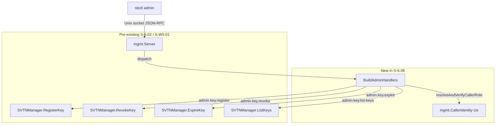
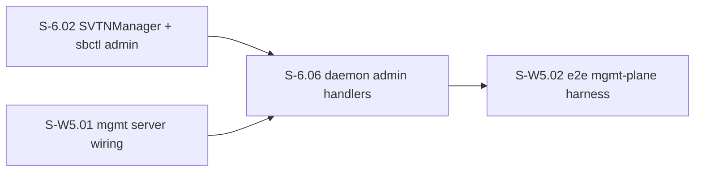
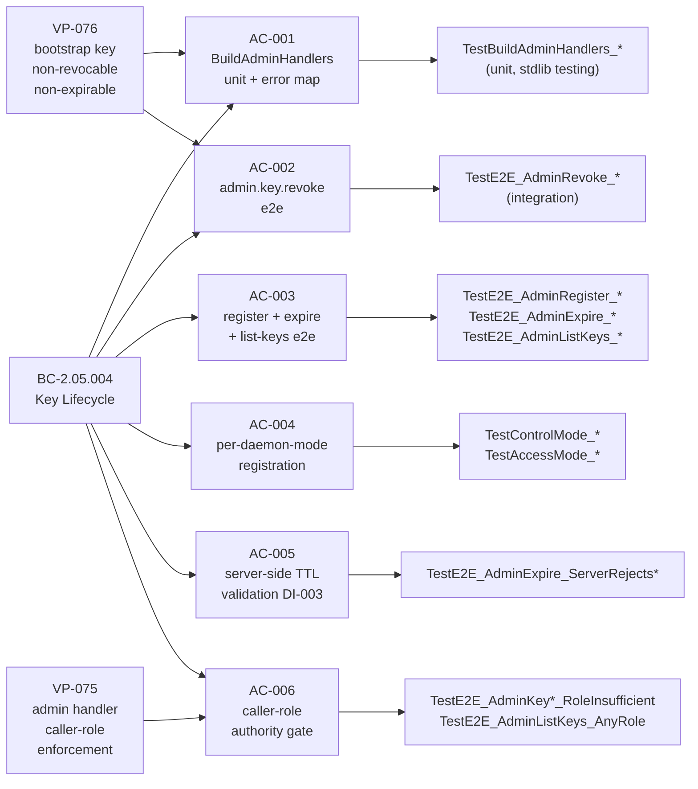

## S-6.06: Daemon-Side Admin RPC Handlers

Wires the missing `[]mgmt.Handler` builder in `cmd/switchboard` that bridges
incoming RPC envelopes (`admin.key.register`, `admin.key.revoke`,
`admin.key.expire`, `admin.key.list-keys`) to the already-existing
`SVTNManager` methods shipped in S-6.02.

Before this story every `startMgmtServer(...)` call in the daemon passed `nil`
handlers (see `mgmt_wire.go` `TODO(CR-002)`), so all admin RPC commands returned
`E-RPC-010 "unknown command"` at runtime. This story closes that production gap
without re-implementing SVTNManager or the sbctl CLI dispatch (those are owned by
S-6.02/S-6.03).

---

## Architecture Changes

**New files:**
- `cmd/switchboard/admin_handlers.go` — `BuildAdminHandlers`, `resolveAndVerifyCallerRole`, `mapAdminError`
- `cmd/switchboard/admin_handlers_test.go` — unit tests (stdlib `testing`, table-driven)
- `cmd/switchboard/admin_handlers_e2e_test.go` — e2e tests (`//go:build integration`, real `mgmt.Server` + Unix socket)

**Modified files:**
- `cmd/switchboard/control.go` — wire `BuildAdminHandlers(svtnMgr, ops)` into `startMgmtServer`
- `internal/svtnmgmt/svtnmgmt.go` — add `ErrBootstrapKeyExpireForbidden` sentinel + `ExpireKey` bootstrap guard

---

## Story Dependencies

Depends on: S-6.02 (SVTNManager methods), S-W5.01 (mgmt server daemon-mode wiring).
Blocks: S-W5.02 (e2e harness cannot exercise admin RPCs end-to-end without this).

---

## Spec Traceability

| BC | PC coverage |
|----|-------------|
| BC-2.05.004 | PC-1 (register), PC-2 (revoke), PC-3 (expire), PC-4 (confirmation envelope), EC-005 (operator bootstrap grant), EC-007 (bootstrap non-revocable/non-expirable) |

| VP | Coverage |
|----|---------|
| VP-075 | AC-006: handler layer rejects non-control-role callers via server-resolved `CallerIdentity`; never from payload |
| VP-076 | AC-001/AC-002: revoke and expire of bootstrap key return E-ADM-020 / E-ADM-021 for any well-formed request; malformed requests are rejected at handler (E-CFG-001) before SVTNManager is invoked |

---

## Test Evidence

| Category | Result |
|----------|--------|
| Unit tests (`just test`) | All pass — table-driven, stdlib `testing`, no testify |
| Integration tests (`//go:build integration`) | All pass — real `mgmt.Server` + real Unix socket |
| Race detector (`just test-race`) | Clean — no data races detected |
| Lint (`just lint`) | Zero warnings |
| Format (`just fmt`) | Clean |

Key test names:
- `TestBuildAdminHandlers_KeyRegister_HappyPath`
- `TestBuildAdminHandlers_KeyRevoke_HappyPath`
- `TestBuildAdminHandlers_KeyExpire_HappyPath`
- `TestBuildAdminHandlers_ListKeys_HappyPath`
- `TestBuildAdminHandlers_KeyRegister_ErrorMapping`
- `TestBuildAdminHandlers_KeyRevoke_ErrorMapping`
- `TestE2E_AdminRevoke_RoleMismatch`
- `TestE2E_AdminRevoke_ControlWithoutConfirm`
- `TestE2E_AdminRevoke_ControlWithConfirm`
- `TestE2E_AdminRegister_HappyPath`
- `TestE2E_AdminExpire_HappyPath`
- `TestE2E_AdminListKeys_HappyPath`
- `TestControlMode_AdminHandlersRegistered`
- `TestAccessMode_AdminHandlersNotRegistered`
- `TestE2E_AdminExpire_ServerRejectsTTLNegative`
- `TestE2E_AdminExpire_ServerRejectsTTLZero`
- `TestE2E_AdminExpire_ServerRejectsTTLTooLong`
- `TestE2E_AdminKeyRegister_RoleInsufficient`
- `TestE2E_AdminKeyRevoke_RoleInsufficient`
- `TestE2E_AdminListKeys_AnyRole`

---

## Demo Evidence

6 of 6 ACs have full demo coverage. Evidence recorded with VHS 0.11.0.
Manifest: `docs/demo-evidence/S-6.06/manifest.yaml`
Report: `docs/demo-evidence/S-6.06/evidence-report.md`

| AC | Description | Status |
|----|-------------|--------|
| AC-001 | BuildAdminHandlers unit — 4 handlers, happy paths, error mapping | PASS (GIF + WEBM) |
| AC-002 | admin.key.revoke e2e — role-mismatch (E-ADM-019), no-confirm (E-ADM-018), success | PASS (GIF + WEBM) |
| AC-003 | register + expire + list-keys e2e | PASS (GIF + WEBM) |
| AC-004 | per-daemon-mode registration — control dispatches; access returns E-RPC-010 | PASS (GIF + WEBM) |
| AC-005 | server-side TTL validation — valid accepted; <=0 and >100y rejected E-CFG-001 | FULL (GIF + WEBM, unit + e2e) |
| AC-006 | caller-role authority gate — non-control E-ADM-009; list-keys any-role ok | PASS (GIF + WEBM) |

---

## Adversarial Convergence

3 of 3 clean passes required — **CONVERGED**.

| Pass | Lenses | Blocking findings | Result |
|------|--------|------------------|--------|
| Pass-26 | lens-1, lens-2, lens-3 | 0 | CLEAN |
| Pass-27 | lens-1, lens-2, lens-3 | 0 | CLEAN |
| Pass-28 | lens-1, lens-2, lens-3 | 0 | CLEAN — CONVERGENCE DECLARED |

Total adversarial passes across story lifecycle: 28 passes.

---

## Holdout Evaluation

N/A — evaluated at wave gate.

---

## Security Review

`resolveAndVerifyCallerRole` is the security-critical path. Key design decisions:

- Caller identity is resolved **server-side** from the authenticated handshake pubkey stored in `mgmt.CallerIdentity` context — never from the request payload (fail-closed by design, DI-001).
- Revoked or expired keys are treated as unregistered and denied with E-ADM-009 (EC-007, BC-2.05.004 EC-006).
- Bootstrap key is permanently non-revocable (E-ADM-020) and non-expirable (E-ADM-021) for any well-formed request; protection is symmetric (guard fires before SVTN lookup in both `RevokeKey` and `ExpireKey`).
- AC-005 server-side TTL bounds checking provides defense-in-depth (DI-003) independent of CLI-side validation.
- Operator key first-registration (bootstrap grant, EC-005) is gated on `mgmt.OperatorKeySet` membership, not on SVTN admitted set membership.
- `list-keys` is read-only and admits any admitted role — by design per F-L2-003.

No OWASP Top-10 issues identified. Auth gate fail-closed regression fixed at commit `f046075` (Pass-5 finding F-P5L1-001).

---

## Risk Assessment

| Dimension | Classification | Notes |
|-----------|---------------|-------|
| Blast radius | Scoped | Only control-mode daemon; access/console/router daemons unchanged |
| Performance | Negligible | Synchronous per-RPC handler dispatch; no hot paths |
| Data mutation | Key lifecycle | Mutations go through `SVTNManager` under mutex (existing locking contract) |
| Rollback | Clean | No schema changes; no persistent state format changes |

---

## AI Pipeline Metadata

| Field | Value |
|-------|-------|
| Pipeline mode | Greenfield VSDD (BC-5.39.001) |
| Adversarial passes | 28 |
| Story version | v1.21 |
| Convergence rule | 3 consecutive clean 3-lens passes |

---

## Pre-Merge Checklist

- [x] PR description matches actual diff
- [x] All 6 ACs covered by demo evidence
- [x] Traceability chain complete: BC-2.05.004 → AC-001..AC-006 → tests → demos
- [x] Adversarial convergence: 3/3 clean passes (Pass-26, Pass-27, Pass-28)
- [x] Race detector clean (`just test-race`)
- [x] Lint clean (`just lint`)
- [x] Format clean (`just fmt`)
- [x] Dependencies merged: S-6.02 (merged PR #32), S-W5.01 (merged PR #31)
- [ ] CI checks passing (pending — to be verified after PR creation)
- [ ] Branch up-to-date with develop
