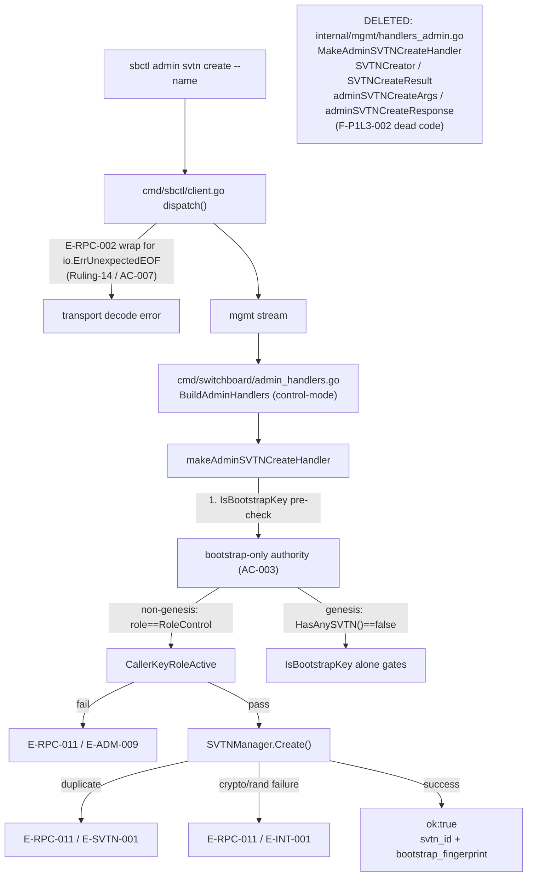
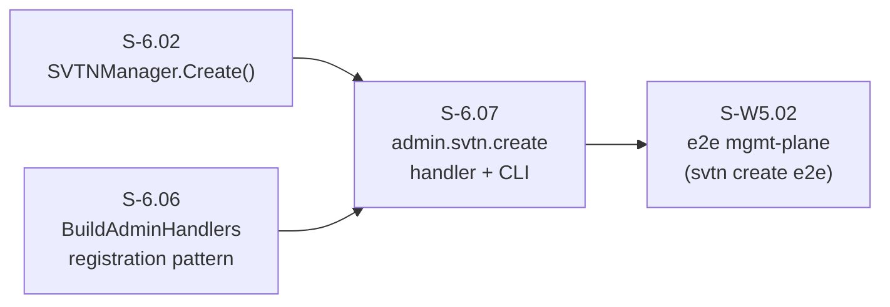
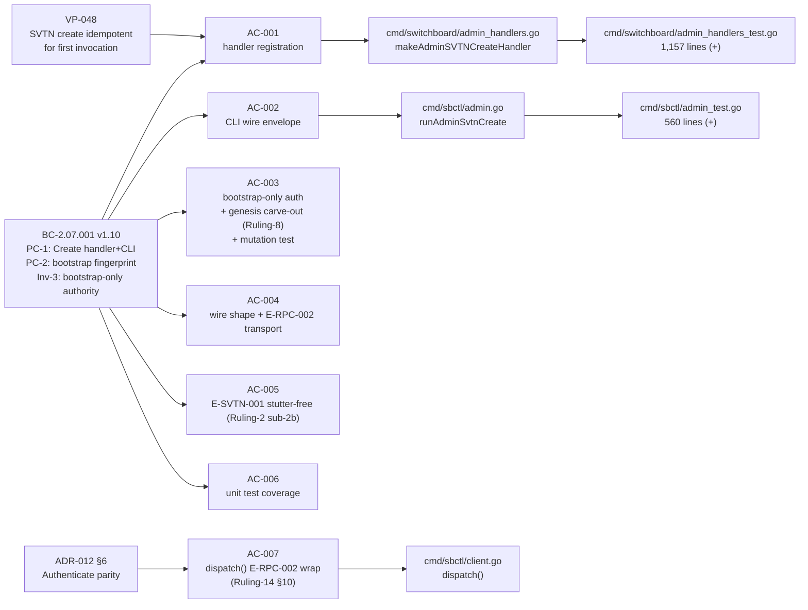

## Summary

Registers the `admin.svtn.create` RPC handler in `BuildAdminHandlers` (control-mode daemon only) and wires the `sbctl admin svtn create --name=<svtn-name>` CLI subcommand. Enforces bootstrap-only authority per BC-2.07.001 Inv-3 (tightened under Ruling-2 Option A): only the daemon bootstrap key with `RoleControl` may invoke the handler on the non-genesis path; on genesis (`HasAnySVTN() == false`) the bootstrap key alone gates. Closes the RPC-reachability gap identified in S-6.02 lens3 F-003/F-010 (BC-2.07.001 PC-1 had no end-to-end surface). Also adds symmetric `E-RPC-002` wrapping for `io.ErrUnexpectedEOF` on `dispatch()` response decode per Ruling-14 / ADR-012 §6 Authenticate parity (AC-007).

**26 commits** | **31 files changed** | **+2,636 / -82 lines**

---

## Acceptance Criteria

| ID | Criterion | Status |
|----|-----------|--------|
| AC-001 | `BuildAdminHandlers` registers `"admin.svtn.create"` (control-mode only); dispatches to `SVTNManager.Create()` | Implemented + tested |
| AC-002 | `sbctl admin svtn create --name=<name>` sends `{"command":"admin.svtn.create","args":{"name":"<name>"}}`, prints `svtn_id` + `bootstrap_fingerprint` on success | Implemented + tested |
| AC-003 | Bootstrap-only authority: `IsBootstrapKey` pre-check BEFORE `resolveAndVerifyCallerRole`; `RoleControl` guard on non-genesis path; `E-ADM-009` with `"key <fp> has role <role>"` on failure; genesis carve-out (`HasAnySVTN()==false`) | Implemented + tested + mutation test |
| AC-004 | Success response: `ok:true`, `data.svtn_id` (hex), `data.bootstrap_fingerprint` (SHA256:base64 verbatim from `BootstrapFingerprint()`); E-RPC-002 transport decode errors not prefixed | Implemented + tested |
| AC-005 | Duplicate name: `{code:"E-RPC-011", message:"E-SVTN-001: SVTN already exists: <name>"}` where `<name>` is from call args (no stutter); `E-ADM-004` NOT used | Implemented + tested |
| AC-006 | Unit tests: bootstrap-key+RoleControl succeeds; non-bootstrap control key → E-ADM-009; non-control-role → E-ADM-009; duplicate → E-SVTN-001; args-validation matrix (nil/empty/whitespace/control-chars/U+2028/U+2029/>255 bytes → E-CFG-001) | Implemented |
| AC-007 | `dispatch()` wraps `io.ErrUnexpectedEOF` → `E-RPC-002: message too large`; `errors.Is` arm before generic return; `TestSbctlAdmin_OversizedRPCResponse_ReturnsE_RPC_002` green | Implemented + tested |

---

## Architecture Changes



---

## Story Dependencies



S-6.02 (merged #31-adjacent) and S-6.06 (merged #32-adjacent) are upstream dependencies. Both must be merged before this PR.

---

## Spec Traceability



---

## Wire Envelope Contract (Ruling-11 / Ruling-12)

| Error Origin | Envelope `code` | `message` prefix | Test |
|-------------|-----------------|------------------|------|
| Authority failure (handler) | `E-RPC-011` | `E-ADM-009: insufficient authority for operation admin.svtn.create: key <fp> has role <role>` | `TestAdminSVTNCreate_NonBootstrapControlKey_RejectsWithEADM009` |
| Duplicate name (handler) | `E-RPC-011` | `E-SVTN-001: SVTN already exists: <name>` | `TestAdminSVTNCreate_DuplicateName_E_SVTN_001` |
| Args validation (handler) | `E-RPC-011` | `E-CFG-001: <detail>` | `TestAdminSVTNCreate_ArgsValidation_E_CFG_001_Exhaustive` |
| crypto/rand failure (handler) | `E-RPC-011` | `E-INT-001: admin.svtn.create: <detail>` | `TestAdminSVTNCreate_CryptoRandFailure_E_INT_001` |
| Transport decode (mgmt layer) | `E-RPC-002` | (no prefix — transport) | `TestSbctlAdmin_OversizedRPCResponse_ReturnsE_RPC_002` |
| CLI re-wrap | `E-RPC-001` | (top-level bucket, Ruling-13) | CLI integration tests |

---

## Rulings Applied

| Ruling | Effect |
|--------|--------|
| Ruling-2 Option A | Bootstrap-only authority — cross-SVTN control-role keys explicitly rejected |
| Ruling-2 sub-2b | Stutter-free E-SVTN-001: `<name>` from call args, not `err.Error()` wrap |
| Ruling-8 | Genesis carve-out: `role == RoleControl` check only when `HasAnySVTN() == true` |
| Ruling-10 | `SeedSVTNWithoutBootstrapKey` relocated to `internal/svtnmgmttest/helpers.go`; production `InsertRawSVTN` guarded by `testing.Testing()` with `// SECURITY:` docstring |
| Ruling-11 | Two-level envelope: E-RPC-011 + message-prefix for handler errors; transport code direct |
| Ruling-12 §1-2 | Universality: all handler-code families use E-RPC-011; `"unregistered"` role fallback |
| Ruling-13 | CLI top-level `error.code = E-RPC-001` bucket; discrimination via message prefix |
| Ruling-14 §10 | `dispatch()` wraps `io.ErrUnexpectedEOF` → `E-RPC-002: message too large` per ADR-012 §6 |

---

## Dead Code Deletion (F-P1L3-002)

The following symbols in `internal/mgmt/handlers_admin.go` were deleted as dead code (live path is `cmd/switchboard/admin_handlers.go`):
- `MakeAdminSVTNCreateHandler`
- `SVTNCreator` (interface)
- `SVTNCreateResult`
- `adminSVTNCreateArgs`
- `adminSVTNCreateResponse`

---

## Test Evidence

All 17 packages pass:

```
ok  github.com/arcavenae/switchboard/cmd/sbctl          (cached)
ok  github.com/arcavenae/switchboard/cmd/switchboard    (cached)
ok  github.com/arcavenae/switchboard/internal/admission (cached)
ok  github.com/arcavenae/switchboard/internal/arq       (cached)
ok  github.com/arcavenae/switchboard/internal/config    (cached)
ok  github.com/arcavenae/switchboard/internal/frame     (cached)
ok  github.com/arcavenae/switchboard/internal/halfchannel (cached)
ok  github.com/arcavenae/switchboard/internal/hmac      (cached)
ok  github.com/arcavenae/switchboard/internal/metrics   (cached)
ok  github.com/arcavenae/switchboard/internal/mgmt      (cached)
ok  github.com/arcavenae/switchboard/internal/multipath (cached)
ok  github.com/arcavenae/switchboard/internal/paths     (cached)
ok  github.com/arcavenae/switchboard/internal/replay    (cached)
ok  github.com/arcavenae/switchboard/internal/routing   (cached)
ok  github.com/arcavenae/switchboard/internal/session   (cached)
ok  github.com/arcavenae/switchboard/internal/svtnmgmt  (cached)
ok  github.com/arcavenae/switchboard/internal/tmux      (cached)
```

**No failures. No race conditions (`go test -race ./...` clean).**

### Key Tests Added

| Test | Coverage |
|------|----------|
| `TestAdminSVTNCreate_BootstrapKeyRoleControl_Succeeds` | AC-001/AC-004 success path |
| `TestAdminSVTNCreate_NonBootstrapControlKey_RejectsWithEADM009` | AC-003 bootstrap pre-check |
| `TestAdminSVTNCreate_CrossSVTN_RejectsWithEADM009` | AC-003 cross-SVTN rejection, `Create` not called |
| `TestAdminSVTNCreate_GenesisPath_BootstrapKeyOnly` | AC-003 genesis carve-out (Ruling-8) |
| `TestAdminSVTNCreate_MutationTest_RoleControlCheckMustFireIndependently` | AC-003 mutation test (role gate independently effective) |
| `TestAdminSVTNCreate_DuplicateName_E_SVTN_001` | AC-005 stutter-free duplicate-name error |
| `TestAdminSVTNCreate_CryptoRandFailure_E_INT_001` | EC-005 non-duplicate Create() failure → E-INT-001 |
| `TestAdminSVTNCreate_ArgsValidation_E_CFG_001_Exhaustive` | AC-006 args matrix (nil/empty/whitespace/ctrl/U+2028/U+2029/>255 bytes) |
| `TestSbctlAdmin_OversizedRPCResponse_ReturnsE_RPC_002` | AC-007 dispatch decode E-RPC-002 wrap |

---

## Demo Evidence

| AC | Description | Recording |
|----|-------------|-----------|
| AC-001 | Handler registration (control-mode, 5 total) |  |
| AC-002 | CLI wire envelope: `svtn_id` + `bootstrap_fingerprint` |  |
| AC-003 | Bootstrap-only authority: E-ADM-009 + genesis + mutation test |  |
| AC-004 | Wire shape: hex `svtn_id`, SHA256:base64 fingerprint |  |
| AC-005 | Duplicate name E-SVTN-001 stutter-free; non-dup E-INT-001 |  |
| AC-006 | Exhaustive args validation E-CFG-001 matrix |  |
| AC-007 | dispatch() E-RPC-002 wrap on oversized response (Ruling-14) |  |

All 7 ACs recorded. Evidence report: `docs/demo-evidence/S-6.07/evidence-report.md`

---

## Convergence Receipts

| Pass | Lenses | Result | Note |
|------|--------|--------|------|
| P16 | L1 + L2 + L3 | CLEAN | Clean-pass #1/3 |
| P17 | L1 + L2 + L3 | CLEAN | Clean-pass #2/3 |
| P18 | L1 + L2 + L3 | CLEAN | Clean-pass #3/3 — BC-5.39.001 CONVERGED |

18 adversarial passes total. 3/3 consecutive clean fresh-context passes with zero blocking findings.

---

## Holdout Evaluation

N/A — evaluated at wave gate.

---

## Adversarial Review

3/3 consecutive clean passes (P16/P17/P18) per BC-5.39.001. Zero blocking findings at convergence.

---

## Security Review

No CRITICAL or HIGH findings. Three findings from independent security scan:

| ID | Severity | Title | Disposition |
|----|----------|-------|-------------|
| SEC-001 | MEDIUM | Operator-supplied SVTN name echoed in E-INT-001 error message | Mitigated: `validateSVTNName` strips control chars before this path; operator-supplied identifier acceptable per pattern |
| SEC-002 | LOW | `InsertRawSVTN` exported on production type | Accepted by design; `testing.Testing()` guard + `panic()` fallback present; only called from `_test.go` files |
| SEC-003 | LOW | `daemon_sig` not verified in client handshake | Pre-existing TOFU deferral (S-6.03 AC-002, ARCH-12); not introduced by this PR |

Controls verified clean:
- Bootstrap-only authority: `IsBootstrapKey` pre-check fires BEFORE `resolveAndVerifyCallerRole` — no bypass via same-named SVTN (EC-004/F-P2L1-001)
- Genesis carve-out (Ruling-8): `HasAnySVTN()==false` path; bootstrap key alone gates; role fallback `"unregistered"` per Ruling-12 §2
- Dead code deleted from `internal/mgmt/handlers_admin.go` — no reachable dead surface (F-P1L3-002)
- `InsertRawSVTN` guarded by `testing.Testing()` with `// SECURITY:` docstring (Ruling-10); no non-test file imports `svtnmgmttest`
- Input validation: `validateSVTNName` enforces UTF-8, no control chars (Cc/Zl/Zp), ≤255 bytes — orders `utf8.ValidString` before rune range loop (avoids U+FFFD silent substitution)
- No new external dependencies (stdlib only); no `internal/mgmt` → `cmd/sbctl` import (module boundary clean)

---

## Risk Assessment

- **Blast radius:** Additive only. `BuildAdminHandlers` gains one new handler entry (control-mode only). No existing handler logic modified. Dead code removal is net-negative in surface area.
- **Performance impact:** Negligible. Handler adds one `IsBootstrapKey` lookup (map O(1)) before `SVTNManager.Create()`.
- **Rollback:** Safe. `admin.svtn.create` was previously unregistered (no existing callers). Removing the handler registration reverts to the pre-S-6.07 state.

---

## AI Pipeline Metadata

- Pipeline mode: VSDD feature-mode (per-story TDD delivery)
- Story version: v1.13
- Adversarial passes: 18 (P1–P18); convergence at P18 (3/3 clean)
- Models: orchestrator + adversary diversity ensemble

---

## Pre-Merge Checklist

- [x] PR description populated with traceability, test evidence, and demo evidence
- [x] Demo evidence present (7/7 ACs recorded, evidence-report.md present)
- [x] Dead code deleted (F-P1L3-002)
- [x] Bootstrap-only authority enforced (AC-003 / Ruling-2 Option A)
- [x] Genesis carve-out implemented (Ruling-8)
- [x] Stutter-free duplicate-name error (AC-005 / Ruling-2 sub-2b)
- [x] E-INT-001 for non-duplicate Create() failures (EC-005 / F-P2L1-004)
- [x] dispatch() E-RPC-002 wrap (AC-007 / Ruling-14)
- [x] Mutation test for role gate independence (AC-003)
- [x] SeedSVTNWithoutBootstrapKey relocated to internal/svtnmgmttest (Ruling-10)
- [x] All 17 packages pass (go test ./... + go test -race ./...)
- [x] BC-5.39.001 convergence achieved (3/3 clean passes P16/P17/P18)
- [x] Dependencies S-6.02 and S-6.06 merged upstream
