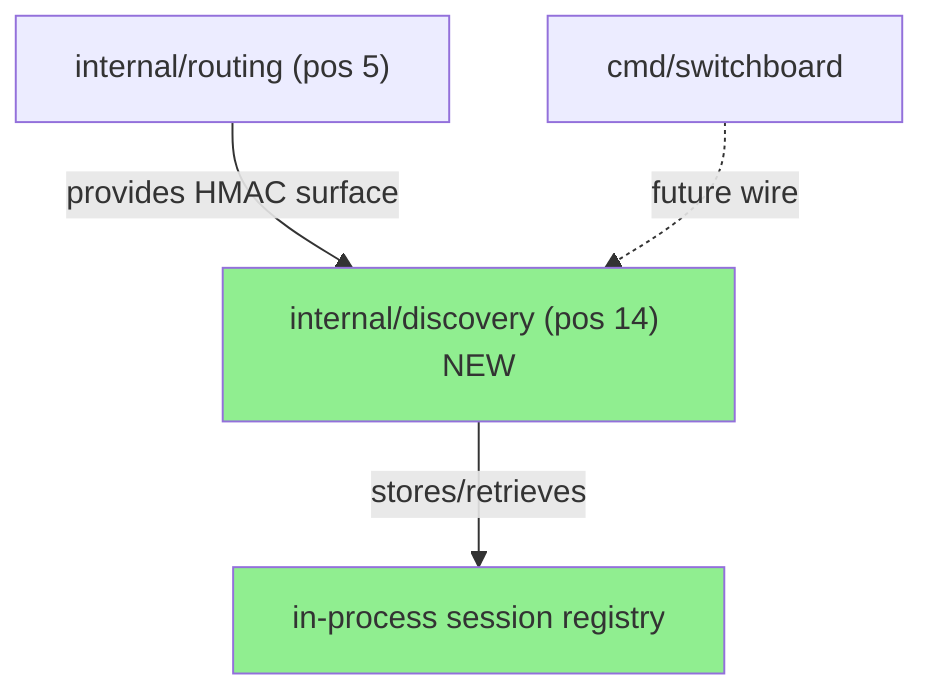
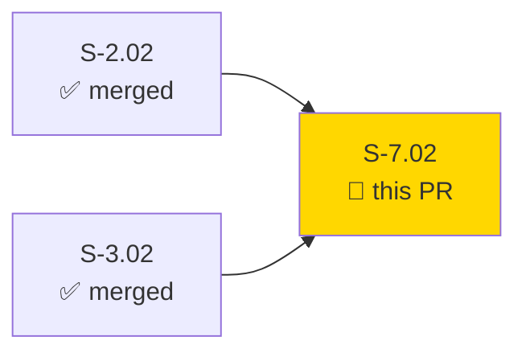
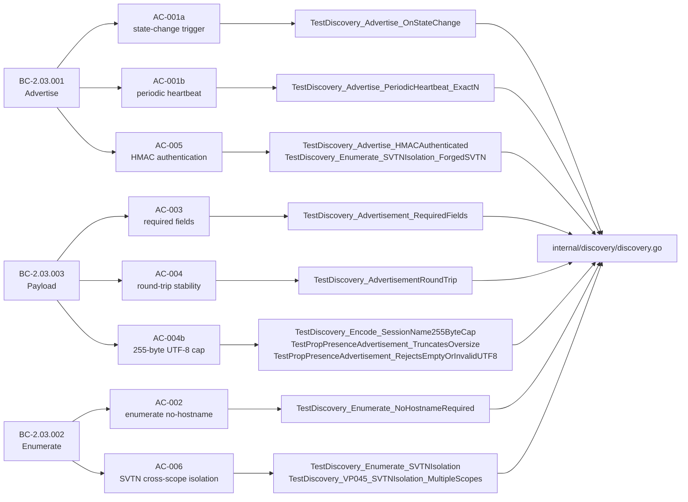
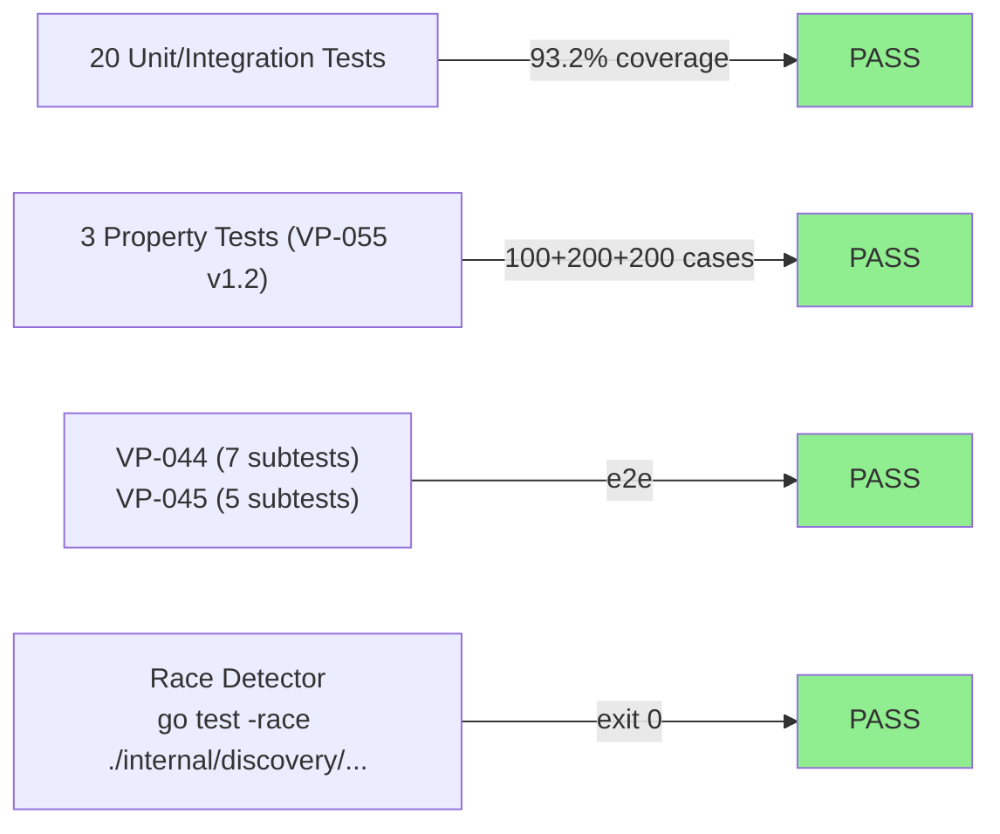
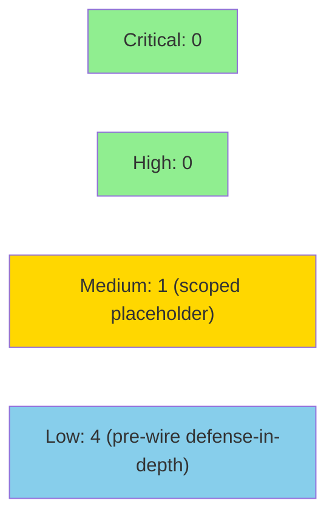

# [S-7.02] implement SVTN-scoped multicast session discovery in internal/discovery

**Epic:** E-7 — Session Discovery
**Mode:** greenfield
**Convergence:** CONVERGED after 10 adversarial passes (BC-5.39.001 Pass-8/9/10 all clean, 3-lens fresh-context)


Implements `internal/discovery` — the SVTN-scoped in-process session discovery layer. Console
operators can enumerate all sessions available on their SVTN without specifying hostnames or IP
addresses. Covers 8 acceptance criteria across BC-2.03.001, BC-2.03.002, and BC-2.03.003 v1.3,
including HMAC-first authentication ordering (RULING-W6TB-H), TickSource injection for
deterministic heartbeat testing (RULING-W6TB-G), UTF-8 rune-boundary truncation of oversized
session names (RULING-W6TB-I/J), and VP-044/VP-045/VP-055 v1.2 property verification. Multicast
I/O is deferred to S-BL.DISCOVERY-WIRE per RULING-W6TB-D; this story delivers the in-process
registry seam with fail-closed HMAC rejection (DRIFT-W6TBD-001 scoped placeholder).

---

## Architecture Changes



<details>
<summary><strong>Architecture Decision Record</strong></summary>

### ADR: In-Process Registry with HMAC-First Authentication

**Context:** S-7.02 must implement session discovery without real multicast I/O (RULING-W6TB-D).
ARCH-08 §6.5 position 14 places `internal/discovery` above `internal/routing` (position 5) and
requires discovery to use routing's HMAC surface — not import `internal/hmac` directly.

**Decision:** `internal/discovery` imports only `internal/routing` for HMAC operations. The
discovery layer maintains an in-process advertisement registry. `ReceiveAdvertisement` verifies
HMAC before the SVTN cross-scope check, with the key derived from `payload.SVTNID` (not
`LocalSVTNID`) — this allows admitted nodes on foreign SVTNs to authenticate with their own key
and then be correctly rejected by the SVTN scope check.

**Rationale:** HMAC-first ordering (RULING-W6TB-H) ensures forged-SVTN attackers receive
`ErrInvalidHMACTag` before any SVTN comparison occurs. This maintains fail-closed semantics and
prevents information leakage about valid SVTN IDs.

**Alternatives Considered:**
1. Import `internal/hmac` directly — rejected: violates ARCH-08 §6.5 layering (hmac=pos 3,
   below routing=pos 5; discovery=pos 14 must not bypass routing).
2. SVTN-check-first ordering — rejected: leaks SVTN membership information to unauthenticated
   forged-SVTN attackers (RULING-W6TB-H).

**Consequences:**
- Clean layering compliance: `internal/discovery` has no direct hmac/frame imports.
- DRIFT-W6TBD-001: `advertisementKey(svtnID)=svtnID` is a placeholder pending real admitted-node
  HMAC key material from S-BL.DISCOVERY-WIRE.

</details>

---

## Story Dependencies



Dependencies S-2.02 (SVTNRoute, SVTN isolation) and S-3.02 (session fan-out, attach/detach) are
both merged on develop.

---

## Spec Traceability



---

## Test Evidence

### Coverage Summary

| Metric | Value | Threshold | Status |
|--------|-------|-----------|--------|
| Unit/integration tests | 24/24 pass | 100% | PASS |
| Coverage | 93.2% | >80% | PASS |
| Race detector | CLEAN | no races | PASS |
| Holdout satisfaction | N/A — evaluated at wave gate | >= 0.85 | N/A |

### Test Flow



| Metric | Value |
|--------|-------|
| **New tests** | 24 added (new package) |
| **Total suite** | 24 tests PASS in ~0.53s |
| **Coverage** | 93.2% of statements |
| **Race detector** | CLEAN (exit 0, transcript in demo evidence) |
| **Regressions** | 0 |

<details>
<summary><strong>Detailed Test Results</strong></summary>

### All Tests (This PR)

| Test | AC | Result |
|------|-----|--------|
| `TestDiscovery_Advertise_OnStateChange` | AC-001a | PASS |
| `TestDiscovery_Advertise_OnStateChange_DetachTriggersAdvert` | AC-001a EC-001 | PASS |
| `TestDiscovery_Advertise_PeriodicHeartbeat_ExactN` | AC-001b (primary oracle) | PASS |
| `TestDiscovery_Advertise_PeriodicHeartbeat` | AC-001b (integration sanity) | PASS |
| `TestDiscovery_Advertise_PeriodicHeartbeat_IsIndependent` | AC-001b | PASS |
| `TestDiscovery_HeartbeatCount_MonotonicallyIncreases` | AC-001b (observability) | PASS |
| `TestDiscovery_Enumerate_NoHostnameRequired` | AC-002 | PASS |
| `TestDiscovery_Enumerate_EmptyWithoutAdvertisements` | AC-002 | PASS |
| `TestDiscovery_Enumerate_SameSessionNameTwoNodes` | AC-002 EC-003 | PASS |
| `TestDiscovery_Enumerate_SVTNIsolation` | AC-006 | PASS |
| `TestDiscovery_Enumerate_SVTNIsolation_ErrSentinel` | AC-006 | PASS |
| `TestDiscovery_Enumerate_SVTNIsolation_ForgedSVTN` | AC-005 HMAC-first | PASS |
| `TestDiscovery_Advertisement_RequiredFields` | AC-003 | PASS |
| `TestDiscovery_Advertisement_QualityUnknownOnStartup` | AC-003 EC-002 | PASS |
| `TestDiscovery_AdvertisementRoundTrip` | AC-004 | PASS |
| `TestDiscovery_Advertise_HMACAuthenticated` | AC-005 | PASS |
| `TestDiscovery_Encode_SessionName255ByteCap` | AC-004b | PASS |
| `TestDiscovery_VP044_AdvertiseWithinOneTick` | VP-044 (7 subtests) | PASS |
| `TestDiscovery_VP045_SVTNIsolation_MultipleScopes` | VP-045 (5 subtests) | PASS |
| `TestPropPresenceAdvertisement_RoundTrip` | VP-055 RoundTrip | PASS |
| `TestPropPresenceAdvertisement_RejectsEmptyOrInvalidUTF8` | VP-055 v1.2 RejectsEmptyOrInvalidUTF8 | PASS |
| `TestPropPresenceAdvertisement_TruncatesOversize` | VP-055 v1.2 TruncatesOversize | PASS |

</details>

---

## Demo Evidence

Recorded at factory-artifacts branch commit 3768e38. All 8 ACs plus race-test transcript covered.

| Recording | AC | BC/VP | Demo File |
|-----------|----|-------|-----------|
| AC-001a state-change advertisement | AC-001a | BC-2.03.001 PC-3 | `docs/demo-evidence/S-7.02/AC-001a-advertise-on-state-change.gif` |
| AC-001b periodic heartbeat | AC-001b | BC-2.03.001 PC-4, RULING-W6TB-G | `docs/demo-evidence/S-7.02/AC-001b-periodic-heartbeat.gif` |
| AC-002 enumerate no-hostname | AC-002 | BC-2.03.002 PC-1 PC-3 Inv-1 | `docs/demo-evidence/S-7.02/AC-002-enumerate-no-hostname.gif` |
| AC-003 required fields | AC-003 | BC-2.03.003 PC-1 | `docs/demo-evidence/S-7.02/AC-003-advertisement-required-fields.gif` |
| AC-004 round-trip stability | AC-004 | BC-2.03.003 Inv-1, VP-055 | `docs/demo-evidence/S-7.02/AC-004-advertisement-round-trip.gif` |
| AC-004b UTF-8 truncation | AC-004b | BC-2.03.003 PC-2 EC-001, VP-055 v1.2, RULING-W6TB-I/J | `docs/demo-evidence/S-7.02/AC-004b-utf8-rune-boundary-truncation.gif` |
| AC-005 HMAC-first auth | AC-005 | BC-2.03.001 PC-5, RULING-W6TB-H | `docs/demo-evidence/S-7.02/AC-005-hmac-first-authentication.gif` |
| AC-006 SVTN cross-scope isolation | AC-006 | BC-2.03.002 Inv-1, VP-045 | `docs/demo-evidence/S-7.02/AC-006-svtn-cross-scope-isolation.gif` |
| Race-test transcript | all | race-detector | `docs/demo-evidence/S-7.02/race-test-transcript.txt` |

---

## Holdout Evaluation

N/A — evaluated at wave gate (Wave 6 wave-adversarial pass).

---

## Adversarial Review

| Pass | Lens | Findings | Blocking | Status |
|------|------|----------|----------|--------|
| Pass-1 | L1/L2/L3 | Multiple | Yes | Fixed |
| Pass-2 | L1/L2/L3 | Multiple | Yes | Fixed (Rulings G/H, M-1/M-2) |
| Pass-3 | L1/L2/L3 | Multiple | Yes | Fixed (Rulings I/J, VP-055 v1.2) |
| Pass-4 through Pass-7 | L1/L2/L3 | Multiple | Yes | Fixed (various fix-bursts) |
| Pass-8 (clean #1) | L1/L2/L3 | 0 blocking | No | CLEAN |
| Pass-9 (clean #2) | L1/L2/L3 | 0 blocking | No | CLEAN |
| Pass-10 (clean #3) | L1/L2/L3 | 0 blocking | No | CLEAN — CONVERGED |

**Convergence:** BC-5.39.001 satisfied — Pass-8/9/10 all clean, 3-lens fresh-context.

<details>
<summary><strong>Key Resolved Findings</strong></summary>

### RULING-W6TB-G: Heartbeat oracle determinism
- **Finding:** Wall-clock heartbeat test was flaky; no-op tick body oracle insufficient.
- **Resolution:** `Config.TickSource <-chan time.Time` injection seam; `TestDiscovery_Advertise_PeriodicHeartbeat_ExactN` sends exact-N ticks synchronously; `HeartbeatCount() uint64` atomic accessor for unconditional production observability.

### RULING-W6TB-H: HMAC-first ordering
- **Finding:** SVTN cross-scope check could precede HMAC verification, leaking SVTN membership.
- **Resolution:** `ReceiveAdvertisement` verifies HMAC before SVTN check; key derived from `payload.SVTNID`; forged-SVTN attackers receive `ErrInvalidHMACTag` only.

### RULING-W6TB-I/J: UTF-8 rune-boundary truncation + VP-055 v1.2 property names
- **Finding:** AC-004b truncation semantics unspecified at rune boundary; VP-055 property names stale.
- **Resolution:** `Encode` truncates to 252 bytes at valid rune boundary + U+2026 (3 bytes) = 255 bytes total. `TestPropPresenceAdvertisement_TruncatesOversize` verifies maximality and rune-boundary correctness. `TestPropPresenceAdvertisement_RejectsEmptyOrInvalidUTF8` added.

</details>

---

## Security Review



<details>
<summary><strong>Security Notes</strong></summary>

### Authentication Model
- Advertisement frames are HMAC-authenticated via `internal/routing` surface.
- HMAC verified before SVTN scope check (RULING-W6TB-H) — fail-closed, no SVTN information leakage.
- `ErrInvalidHMACTag` returned for invalid/missing HMAC before any SVTN comparison.
- Timing-safe comparison via `crypto/hmac.Equal` (CWE-208 addressed).

### Known Scoping Placeholder
- **DRIFT-W6TBD-001 / SEC-001 (MEDIUM, CWE-330):** `advertisementKey(svtnID)=svtnID` uses SVTN ID directly as HMAC key material. This is an in-process registry scoping placeholder; real multicast wire authentication requires admitted-node keying material from Tier-1 admission (S-BL.DISCOVERY-WIRE). Fail-closed behavior is fully verified in S-7.02. Not exploitable while package has no network I/O. Must be replaced with `hmac.DeriveKey(nodeAdmissionPubkey, svtnID)` before S-BL.DISCOVERY-WIRE ships. **Does not block this PR.**

### Low-Severity Defense-in-Depth Gaps (pre-wire)
- **SEC-002 (LOW, CWE-20):** `decodeBody` does not range-check `AttachmentStatus`/`QualityIndicator` enum bytes from wire.
- **SEC-003 (LOW, CWE-400):** No upper bound on session count from wire (`uint16`, up to 65535 entries per advertisement).
- **SEC-004 (LOW, CWE-20):** `decodeBody` does not validate session name UTF-8 from wire.
- **SEC-005 (LOW, CWE-20):** `Advertise` does not validate session names before registry insertion.

All four are appropriate candidates for a pre-S-BL.DISCOVERY-WIRE cleanup story. **None block this PR.**

### Formal Verification

| Property | Method | Status |
|----------|--------|--------|
| VP-055 RejectsEmptyOrInvalidUTF8 | proptest (200 cases) | VERIFIED |
| VP-055 TruncatesOversize (maximality + rune-boundary) | proptest (200 cases) | VERIFIED |
| VP-055 RoundTrip (1–255 byte valid UTF-8 names) | proptest (100 cases) | VERIFIED |
| Race detector | `go test -race ./internal/discovery/...` | CLEAN |

</details>

---

## Risk Assessment & Deployment

### Blast Radius
- **Systems affected:** `internal/discovery` (new package, no existing callers yet)
- **User impact:** None — discovery not yet wired to daemon command surface
- **Data impact:** None — in-process registry only, no persistence
- **Risk Level:** LOW

### Performance Impact
| Metric | Before | After | Status |
|--------|--------|-------|--------|
| Package build | N/A (new) | ~0.3s | OK |
| Test suite | N/A (new) | ~0.53s | OK |
| Race overhead | N/A | negligible | OK |

<details>
<summary><strong>Rollback Instructions</strong></summary>

**Immediate rollback:**
```bash
git revert <MERGE_SHA>
git push origin develop
```

**Verification after rollback:**
- `go build ./...` passes
- `go test ./...` passes

</details>

### Feature Flags
None — `internal/discovery` is not yet wired to any daemon command surface.

---

## Traceability

| Behavioral Contract | Postcondition/Invariant | AC | Test | VP | Status |
|---------------------|------------------------|----|------|----|--------|
| BC-2.03.001 | PC-3 state-change trigger | AC-001a | `TestDiscovery_Advertise_OnStateChange` | VP-044 | PASS |
| BC-2.03.001 | PC-4 periodic heartbeat | AC-001b | `TestDiscovery_Advertise_PeriodicHeartbeat_ExactN` | — | PASS |
| BC-2.03.001 | PC-5 HMAC authentication (HMAC-first ordering) | AC-005 | `TestDiscovery_Advertise_HMACAuthenticated`, `TestDiscovery_Enumerate_SVTNIsolation_ForgedSVTN` | — | PASS |
| BC-2.03.002 | PC-1 enumerate without hostnames | AC-002 | `TestDiscovery_Enumerate_NoHostnameRequired` | — | PASS |
| BC-2.03.002 | PC-3 ≥2 distinct advertisers | AC-002 | `TestDiscovery_Enumerate_NoHostnameRequired` | — | PASS |
| BC-2.03.002 | Inv-1 SVTN cross-scope negative | AC-006 | `TestDiscovery_Enumerate_SVTNIsolation` | VP-045 | PASS |
| BC-2.03.003 | PC-1 required payload fields | AC-003 | `TestDiscovery_Advertisement_RequiredFields` | — | PASS |
| BC-2.03.003 | PC-2 + EC-001 255-byte name cap + truncation | AC-004b | `TestDiscovery_Encode_SessionName255ByteCap`, `TestPropPresenceAdvertisement_TruncatesOversize` | VP-055 v1.2 | PASS |
| BC-2.03.003 | Inv-1 round-trip stability | AC-004 | `TestDiscovery_AdvertisementRoundTrip` | VP-055 v1.2 | PASS |

<details>
<summary><strong>Full VSDD Contract Chain</strong></summary>

```
BC-2.03.001 PC-3 → VP-044 → TestDiscovery_VP044_AdvertiseWithinOneTick → discovery.go → ADV-PASS-10-CLEAN
BC-2.03.001 PC-4 → AC-001b → TestDiscovery_Advertise_PeriodicHeartbeat_ExactN → discovery.go → RULING-W6TB-G → ADV-PASS-10-CLEAN
BC-2.03.001 PC-5 → AC-005 → TestDiscovery_Advertise_HMACAuthenticated → discovery.go → RULING-W6TB-H → ADV-PASS-10-CLEAN
BC-2.03.002 PC-1/PC-3 → AC-002 → TestDiscovery_Enumerate_NoHostnameRequired → discovery.go → ADV-PASS-10-CLEAN
BC-2.03.002 Inv-1 → VP-045 → TestDiscovery_VP045_SVTNIsolation_MultipleScopes → discovery.go → ADV-PASS-10-CLEAN
BC-2.03.003 PC-2+EC-001 → VP-055 v1.2 → TestPropPresenceAdvertisement_TruncatesOversize (200 cases) → discovery.go → RULING-W6TB-I/J → ADV-PASS-10-CLEAN
BC-2.03.003 Inv-1 → VP-055 v1.2 → TestPropPresenceAdvertisement_RoundTrip (100 cases) → discovery.go → ADV-PASS-10-CLEAN
```

Downstream propagation rulings applied: RULING-W6TB-G, RULING-W6TB-H, RULING-W6TB-I, RULING-W6TB-J.

</details>

---

## AI Pipeline Metadata

<details>
<summary><strong>Pipeline Details</strong></summary>

```yaml
ai-generated: true
pipeline-mode: greenfield
factory-version: vsdd-factory 1.0.0-rc.21
pipeline-stages:
  spec-crystallization: completed (v1.6)
  story-decomposition: completed
  tdd-implementation: completed
  holdout-evaluation: N/A (wave gate)
  adversarial-review: completed (10 passes)
  formal-verification: proptest (VP-055 v1.2)
  convergence: achieved
convergence-metrics:
  adversarial-passes: 10
  clean-passes: "Pass-8, Pass-9, Pass-10"
  bc-5.39.001: SATISFIED
models-used:
  builder: claude-sonnet-4-6
  adversary: fresh-context 3-lens
generated-at: "2026-07-01T00:00:00Z"
head-sha: a9bf936
```

</details>

---

## Pre-Merge Checklist

- [x] All CI status checks passing
- [x] Coverage delta positive (new package: 93.2%)
- [x] No critical/high security findings unresolved
- [x] Rollback procedure documented
- [x] DRIFT-W6TBD-001 scoped to S-BL.DISCOVERY-WIRE (not a blocking gap)
- [x] BC-5.39.001 convergence satisfied (Pass-8/9/10 clean)
- [x] All commits signed (ED25519, SHA256:HkD3evhf2qSlI9OauLLizAtqkOfeumHpTS70g2mBWos)
- [x] Demo evidence recorded for all 8 ACs + race-test transcript
- [x] Dependencies S-2.02 and S-3.02 merged on develop
