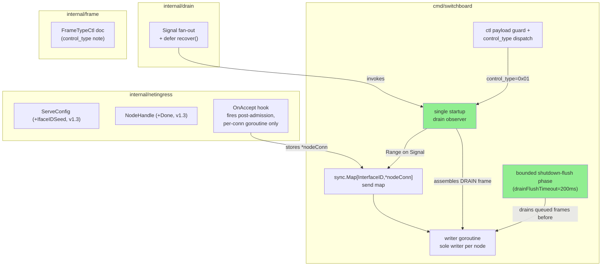
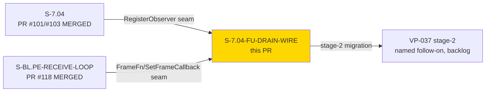
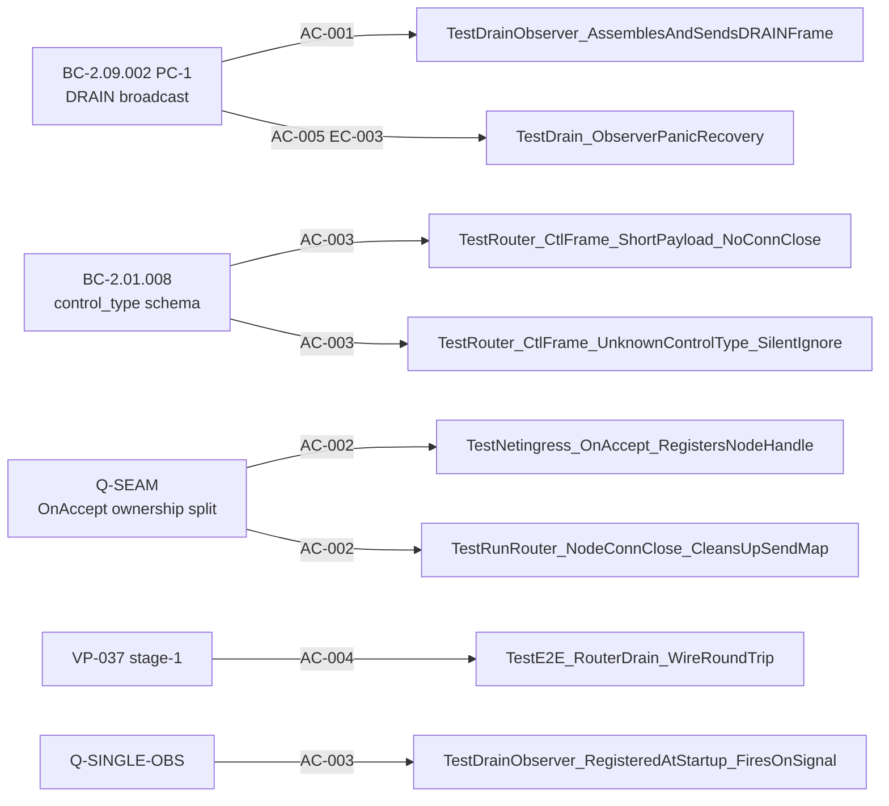

## Summary

Delivers DRAIN-over-SVTN wire propagation — the per-node observer registration that
closes the AC-003/AC-004 deferral left by `S-7.04` (drain coordinator, PR #101/#103) and
unblocks the two-stage VP-037 discharge. A single startup drain observer, registered
once at `runRouter` setup, iterates the router's live per-node send map on
`drainCoord.Signal` and assembles/sends a `FrameTypeCtl` (0x03) DRAIN frame
(`control_type=0x01`) to every connected PE node over the existing wire.

Four composed changes:

1. **`internal/netingress`** — `ServeConfig`/`NodeHandle` gain an `OnAccept` seam
   (ownership split: `netingress.Serve` owns DATA creation — `IfaceID`/`Send`/`Done`
   allocation — and calls `OnAccept` only for admitted, post-semaphore connections, from
   the freshly spawned per-conn goroutine, never the accept loop itself).
2. **`cmd/switchboard`** — a router-scoped `sync.Map[InterfaceID, *nodeConn]` send map,
   a writer goroutine per node (sole writer on that node's send channel), a `ctl` payload
   guard + `control_type` dispatch in the route closure (short-payload → `E-PRT-002`,
   unknown `control_type` → silent ignore per `Inv-2`/FO-DRAIN-WIRE-001), and a bounded
   shutdown-flush phase between `drainCoord.Wait` and `ingressCancel()` so the writer
   goroutine flushes the queued DRAIN frame before the connection is torn down.
3. **`internal/drain`** — `defer recover()` around each observer invocation in `Signal`'s
   fan-out, so one panicking observer cannot take down the coordinator or the other
   observers (`Wait` still returns cleanly).
4. **`internal/frame`** — one-line doc-comment addition on `FrameTypeCtl` noting the
   `control_type` discriminator byte (no constant changes).

**Implementation-phase reopen (F-DW-IMPL-001, HIGH):** first TDD contact with the two RED
tests (`TestDrainObserver_AssemblesAndSendsDRAINFrame`,
`TestE2E_RouterDrain_WireRoundTrip`) surfaced that `ingressCtx` was a cancel-linked child
of `runRouter`'s own `ctx` — the caller's `cancel()` closed `ingressCtx.Done()`
synchronously, before the flush pass or `drainCoord.Signal`/`Wait` ever ran, defeating the
whole point of the flush phase. Fixed by detaching `ingressCtx`'s cancellation:
`context.WithCancel(context.WithoutCancel(ctx))` at `mgmt_wire.go:523`, with a
do-not-reparent comment. Twelve text-based spec-adversarial passes converged without
tracing `ingressCtx`'s parent against ground truth — only empirical contact with the RED
tests found it (`[process-gap]`, noted in the story's Changelog v1.10).

**VP-037:** stage-1 evidence only (`TestE2E_RouterDrain_WireRoundTrip`, untagged,
real-`runRouter` pattern). `verification_lock` stays `false` — stage-2 (full node
migration across two routers) is a named follow-on story.

Spec artifacts (ARCH-02 v1.2, BC-2.01.004 v1.5, BC-2.01.008, VP-037 v1.6,
ARCH-08 v2.12) already landed in the `.factory` worktree (`factory-artifacts` branch,
commit `8c14c43`) — not part of this diff.

**Convergence:** step-4.5 per-story adversarial convergence CONVERGED 3/3
(NITPICK_ONLY → CLEAN → CLEAN across AC-first / test-first / concurrency-ledger-first
review angles, zero forcing findings). Spec-side: 12 spec-adversarial passes plus the
implementation-phase reopen (F-DW-IMPL-001) plus a delta-verification pass
(F-DW-DV-001, LOW).

---

## Architecture Changes

<strong>Design note: why detach ingressCtx (F-DW-IMPL-001)</strong>

**Context:** the shutdown-flush phase exists to let the writer goroutine flush a queued
DRAIN frame before the connection closes. That only works if the flush phase's own
teardown (`ingressCancel()`) is the *first* thing to close the connection — not the
caller's own `ctx.cancel()` racing ahead of it.

**Decision:** derive `ingressCtx` as `context.WithCancel(context.WithoutCancel(ctx))`
instead of `context.WithCancel(ctx)`.

**Rationale:** a plain `context.WithCancel(ctx)` makes `ingressCtx` a cancel-linked child
— the caller's `cancel()` closes `ingressCtx.Done()` synchronously, inside the same call,
before `drainCoord.Signal`/`Wait` or the flush pass ever run. `WithoutCancel` preserves
`.Value()` forwarding (verified: zero downstream `.Value()` reads depend on cancellation
propagation) while detaching cancellation, so `ingressCancel()` — not the caller's
`cancel()` — is genuinely the sole trigger for connection teardown.

**Alternatives considered:**
1. Reorder the shutdown sequence so `ingressCancel()` always runs first — rejected:
   doesn't fix the caller's own `ctx.cancel()` (e.g. via SIGTERM) still racing ahead
   independently of `runRouter`'s internal sequencing.
2. Give `ingressCtx` a distinct root `context.Background()` — rejected: silently drops
   `.Value()` forwarding with no verification that nothing downstream depends on it.

**Consequences:**
- The flush phase's read-determinism argument (AC-001 postcondition 2 / AC-004 step 5)
  now holds by construction, not by scheduling luck.
- `context.WithoutCancel` is Go 1.21+; already satisfied (`go.mod` pins 1.25.4).

---

## Story Dependencies

**Depends on:** `S-7.04` (drain coordinator, merged) — `RegisterObserver` seam already
in place; `S-BL.PE-RECEIVE-LOOP` (merged PR #118 @ `e940fc2`) — `FrameFn`/
`SetFrameCallback` seam live, not touched by this story.

**Blocks:** nothing directly; VP-037 stage-2 (full node migration across two routers) is
a named follow-on that consumes this story's stage-1 wire evidence.

---

## Spec Traceability

| BC / VP | AC | Test(s) |
|---------|-----|---------|
| BC-2.09.002 PC-1, BC-2.01.008 PC-2 | AC-001 | `TestDrainObserver_AssemblesAndSendsDRAINFrame` |
| BC-2.09.002 PC-1, Q-SEAM | AC-002 | `TestNetingress_OnAccept_RegistersNodeHandle`, `TestRunRouter_NodeConnClose_CleansUpSendMap` |
| Q-SINGLE-OBS, Q-AC003, Q-CTL-GUARD, BC-2.01.008 | AC-003 | `TestDrainObserver_RegisteredAtStartup_FiresOnSignal`, `TestRouter_CtlFrame_ShortPayload_NoConnClose`, `TestRouter_CtlFrame_UnknownControlType_SilentIgnore` |
| VP-037 (Q4-AMENDED) | AC-004 | `TestE2E_RouterDrain_WireRoundTrip` |
| BC-2.09.002 EC-003, Q5/Q-AC005 | AC-005 | `TestDrain_ObserverPanicRecovery`, `TestRunRouter_ForcedExitPastDrainTimeout` (pre-existing, unmodified) |

---

## Test Evidence

**7 net-new tests** in `cmd/switchboard/router_drain_wire_test.go` (NEW) + 1 net-new
test in `internal/drain/drain_test.go`. All green under `go test -race`.

| File | Net-new tests |
|------|--------------|
| `cmd/switchboard/router_drain_wire_test.go` (NEW) | 7 |
| `internal/drain/drain_test.go` (MODIFIED) | 1 (`TestDrain_ObserverPanicRecovery`) |
| `internal/drain/vp037_e2e_test.go` (MODIFIED) | 0 — comment-only, no test-logic change |
| `internal/netingress/integration_test.go`, `internal/netingress/netingress_test.go` (MODIFIED) | 0 — mechanical `ServeConfig{}` 5th-arg call-site fixes at 5 call sites |

**RED test file integrity:** `cmd/switchboard/router_drain_wire_test.go` is byte-identical
from the RED commit (`1a4dfdb`) to HEAD — no test weakening between RED and green.

**Quality gates (re-verified this session, HEAD `9278586`):**

- `go build ./...` — clean
- `go vet ./...` — clean
- `go test -race -count=1 ./...` — all 24 packages green (touched packages —
  `internal/drain`, `internal/netingress`, `internal/frame`, `cmd/switchboard` — verified
  individually first, then the full suite)
- RED→green discipline: `1a4dfdb` (RED, 8 failing tests) → `1e12574`/`1f860a0`/`6167f06`/
  `808817f`/`b7ce398` (incremental green) → `bb46b5a` (F-DW-IMPL-001 fix) → `e7614d7`
  (rename-only refactor, F-DW-I1-N01)

---

## Demo Evidence

Location: `docs/demo-evidence/S-7.04-FU-DRAIN-WIRE/` (commit `9278586`)

| AC | Tape | Discharge |
|----|------|-----------|
| AC-001 | `AC-001-drain-frame-assembly-send.tape` | FULL |
| AC-002 | `AC-002-onaccept-seam-registration-cleanup.tape` | FULL |
| AC-003 | `AC-003-startup-observer-ctl-guard.tape` | FULL |
| AC-004 | `AC-004-vp037-stage1-wire-roundtrip.tape` | FULL (VP-037 stage-1; `verification_lock` stays `false`) |
| AC-005 | `AC-005-panic-recovery-forced-exit.tape` | FULL |

Per POL-004: `.tape` scripts + `evidence-report.md` only; no rendered binaries committed.

---

## Holdout Evaluation

N/A — evaluated at wave gate.

---

## Adversarial Review

**Per-story implementation cycle (step 4.5, BC-5.39.001-equivalent):** CONVERGED 3/3 —
NITPICK_ONLY (pass 1) → CLEAN (pass 2, AC-first angle) → CLEAN (pass 3, concurrency-ledger-first
angle). Zero forcing findings across the streak.

**Spec-side cycle (pre-implementation):** 12 spec-adversarial passes on the placement note
(F-DW-SP1-001 through F-DW-SP9-001, all confirmed and remediated — see story Changelog
v1.1–v1.9), plus the implementation-phase reopen **F-DW-IMPL-001** (HIGH — `ingressCtx`
caller-cancel coupling, the only finding in this story's history to surface from actual
TDD contact rather than text-based review), plus a delta-verification pass
(**F-DW-DV-001**, LOW — citation-convention clarifier only, no mechanism change).

Notable findings:
- **F-DW-SP6-001** (HIGH, spec-side) — fourth Add-concurrent-with-Wait race relocation
  on the shared `writerWG`; closed by moving the bounded flush-phase wait onto a
  phase-local `snapshotWG`/`writerExited` mechanism instead.
- **F-DW-SP7-001** (MED, spec-side) — ARCH-01 goroutine-join-contract gap: the v1.6
  bounded phase's own transient goroutines (N per-entry `writerExited` helpers + the
  `flushDone`-closer) were left unjoined on the timeout-exceeded path; closed via two
  trailing joins (`snapshotWG.Wait()` + `closerWG.Wait()`), both proven prompt by LIFO
  defer ordering.
- **F-DW-IMPL-001** (HIGH, implementation-side) — see the "why detach ingressCtx" design
  note above.

---

## Security Review

Reviewed by a fresh-eyes security pass against the PR #120 diff. Verdict: **no
CRITICAL/HIGH findings; one MEDIUM, accepted as a scoped, already-adjudicated design
trade-off with a named forward obligation.**

**MEDIUM — Ctl-frame path bypasses per-frame HMAC authentication (CWE-306, CWE-778).**
This PR is the first code to make `internal/routing.RouteFrame`'s HMAC/admission check
bypassable: in `mgmt_wire.go`'s `route` closure, any frame with `FrameType ==
FrameTypeCtl` is intercepted and handled *before* falling through to `RouteFrame` —
verified via `git diff ef1ee1e..HEAD`, this dispatch did not exist prior to this PR.
Concretely, an unauthenticated TCP peer that opens a connection to the data-plane
listener can drive this path with zero HMAC key and zero admission check — a blind
spot relative to `E-ADM-017`'s abuse-counter/alerting scheme, which only fires on
authenticated-frame failures. **This is not an accidental gap: it is the deliberate
"terminal-consumer ctl carve-out"** adjudicated across this story's own spec-adversarial
cycle (`F-DW-SP1-005`, `BC-2.01.004` Invariant 2 / DI-001 amendment, schema in
`BC-2.01.008`) — ctl frames whose terminal consumer is the receiving router are
specified to bypass transit-frame authentication by design; all *transit* frames (data,
arq, fec, pe_connect, empty_tick) remain unconditionally opaque and authenticated.
Today's blast radius is bounded: `control_type=0x01` (DRAIN) is an explicit no-op past
the length guard, and unknown `control_type` values are silently ignored
(`Inv-2`/FO-DRAIN-WIRE-001). **Forward obligation:** `control_type=0x02` (RESYNC,
`S-BL.RESYNC-FRAME` follow-on scope) will dispatch through this SAME unauthenticated
path — that story MUST either thread HMAC/admission verification into the ctl path
before adding RESYNC's state-changing behavior, or explicitly re-adjudicate the
authentication boundary. Recorded here so it isn't rediscovered cold when
`S-BL.RESYNC-FRAME` is scoped.

The DRAIN frame itself is sent over the existing authenticated-at-connect SVTN channel
using the existing `FrameTypeCtl` (0x03) frame type — no new frame type, no new
listener. The `payload_len < 4` guard is correct (no off-by-one, no OOB read on
`payload[0]`) and produces `E-PRT-002`.

`defer recover()` in `drain.Signal`'s fan-out discards the panic value unconditionally
(`internal/drain` is pure-core with no injected logger seam); this is the documented
contract (recovery, not logging), proven by `TestDrain_ObserverPanicRecovery` via
subprocess isolation. Noted (non-blocking): this recovery is currently silent — no
counter or signal on a recovered panic — which could mask a corrupted-observer-state
bug from operators; worth a low-priority follow-up to at least increment a metric.

Goroutine lifecycle: writer goroutines are gated by the same connection-admission
semaphore as accept, so no unbounded growth. The `context.WithCancel(context.WithoutCancel(ctx))`
detach was independently checked against the SIGTERM/shutdown path: the outer `select`
still watches `ctx.Done()` and explicitly calls `ingressCancel()` after the bounded
(≤200ms) flush phase — shutdown responsiveness is unaffected.

---

## Blast Radius

**1. Operator-visible surfaces touched:** none. No change to the `sbctl` CLI surface,
`--help`/`--version` output, config schema, `paths.list`/`router.status` RPC schema, or
wire protocol frame layout observable by clients. The DRAIN frame reuses the existing
`ctl` (0x03) frame type; `control_type` is a payload-internal discriminator, not a new
wire-visible frame type. No change to `docs/getting-started.md` or the operator error
taxonomy.

**2. Silent-failure risk:** the unknown-`control_type` silent-ignore arm is an intentional
no-op (FO-DRAIN-WIRE-001, `Inv-2`) — `control_type=0x02` (RESYNC) is reserved but
undispatched until `S-BL.RESYNC-FRAME`. DRAIN delivery is explicitly best-effort — no wire
ACK (BC-2.09.002 v1.2 PC-3) — so a node that misses the frame (e.g. connection already
torn down) is not distinguishable from one that received it; this is a stated, adjudicated
design choice, not a gap. Zero-envelope bootstrap pattern (FO-DRAIN-WIRE-002, inherited
from `S-7.04-FU-PE-CONNECTOR`) — full Ed25519/HMAC key derivation remains a
session-bootstrap follow-on.

**3. Smoke gate touched:** no. `just smoke-quick` sentinel invariants unchanged; no new
`INV-*` id required; no `test/smoke/invariants.sh` entry.

---

## Risk Assessment

**Blast radius:** contained to `internal/netingress`, `cmd/switchboard`, `internal/drain`,
and a doc-comment addition in `internal/frame`. No new imports at the package-DAG level
(`internal/netingress` gains `internal/routing` for the `InterfaceID` type only — a
same-commit ARCH-08 §6.5 edge update, already landed in the `.factory` worktree).

**Performance impact:** one additional goroutine per accepted node connection (the
writer goroutine, replacing implicit inline writes); bounded shutdown-flush phase adds
at most `drainFlushTimeout` (200ms, confirmed via the spec-adversarial cycle) to router
shutdown latency.

**Revert safety:** `git revert` of the squash-merge commit is clean — no schema
migrations, no data-layer changes, no feature flags to unwind. The writer-goroutine
LIFO-defer-order dependency and the `ingressCtx` detach are both load-bearing and
commented `do-not-reorder`/`do-not-reparent` in source.

---

## AI Pipeline Metadata

- Pipeline mode: steady-state / per-story TDD
- Adversarial review: step 4.5 per-story convergence, 3/3 clean (AC-first, test-first,
  concurrency-ledger-first angles)
- Spec-cycle convergence: 12 spec-adversarial passes + implementation-phase reopen
  (F-DW-IMPL-001) + delta-verification pass (F-DW-DV-001); story version v1.11

---

## Pre-Merge Checklist

- [x] PR description written to `.factory/code-delivery/S-7.04-FU-DRAIN-WIRE/pr-description.md`
- [x] Demo evidence verified: 5 tapes + `evidence-report.md` at `docs/demo-evidence/S-7.04-FU-DRAIN-WIRE/` (commit `9278586`)
- [x] All 5 ACs discharged (AC-001 through AC-005)
- [x] 8 net-new tests (7 in `router_drain_wire_test.go` + 1 in `drain_test.go`), all green under `go test -race`
- [x] RED test file byte-identical from RED commit (`1a4dfdb`) to HEAD — no test weakening
- [x] Spec artifacts landed (ARCH-02 v1.2, BC-2.01.004 v1.5, BC-2.01.008, VP-037 v1.6, ARCH-08 v2.12) at `.factory` worktree commit `8c14c43`
- [x] F-DW-IMPL-001 (HIGH, implementation-phase reopen) fixed: `ingressCtx` detached via `context.WithoutCancel`
- [x] Adversarial convergence: step-4.5 per-story 3/3 clean (NITPICK_ONLY/CLEAN/CLEAN)
- [x] `go build ./...`, `go vet ./...`, `gofumpt` clean
- [x] `go test -race -count=1 ./...` — all 24 packages green
- [x] Dependencies: `S-7.04` (merged), `S-BL.PE-RECEIVE-LOOP` MERGED (PR #118)
- [x] VP-037: stage-1 evidence only; `verification_lock` stays `false` (stage-2 named follow-on)
- [x] Branch tip verified: `9278586`
- [ ] CI green
- [ ] PR review: no blocking findings
