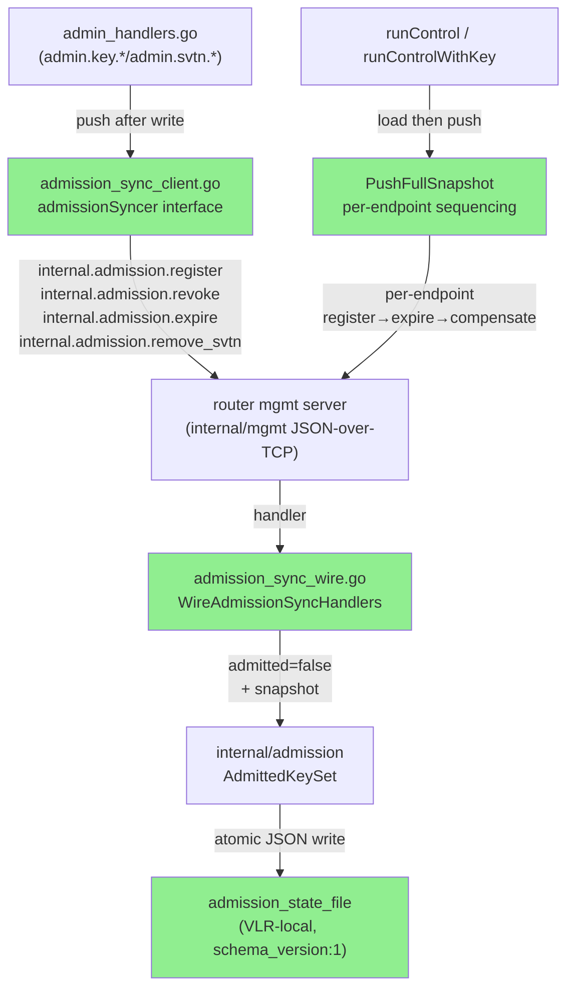
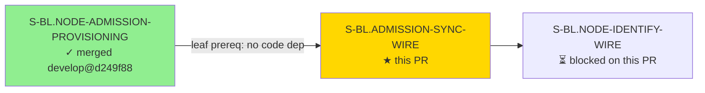
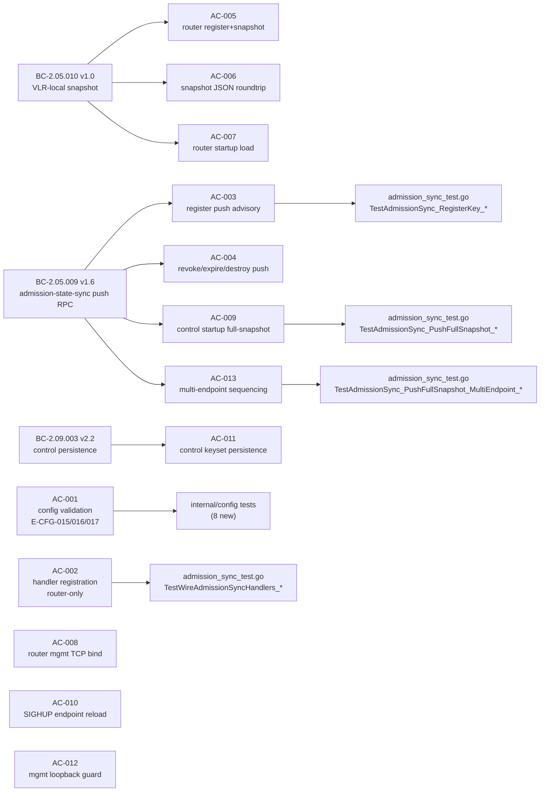
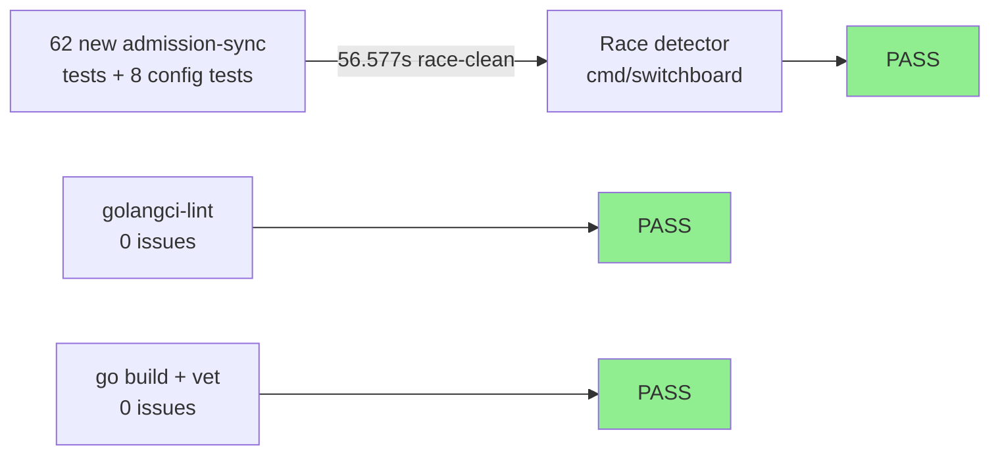
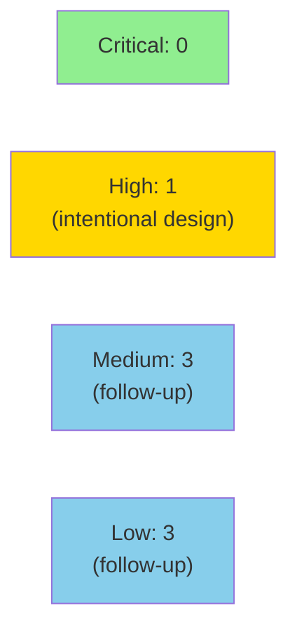

# [S-BL.ADMISSION-SYNC-WIRE] Admission-state sync wire: control pushes key mutations to routers via internal.admission.* RPC + VLR-local JSON snapshot

**Epic:** E-7 — Identity Cluster
**Mode:** greenfield
**Convergence:** CONVERGED after 12 adversarial passes (passes 10/11/12 NITPICK_ONLY — 3/3 clean streak; BC-5.39.001)


## Why

Router-mode daemons have been operating without any admission-state synchronization from the control node: a key registered, revoked, or expired on the control side was invisible to routers until they restarted and loaded a snapshot. This gap means a revoked or expired key could continue to be admitted at any router that missed the mutation, and no durability existed across control detachment.

This PR closes that gap. The control-mode daemon now pushes every `admin.key.*` and `admin.svtn.*` mutation to all configured router endpoints over the existing internal/mgmt JSON-over-TCP protocol, using four new `internal.admission.*` RPCs. Routers persist the resulting admitted-key state to a VLR-local JSON snapshot (atomic write, fail-closed on corrupt). On startup, control loads its own persisted keyset and immediately pushes the full authoritative state to all routers — so no mutation is silently lost across a restart or network partition.

This is the leaf prerequisite that unblocks `S-BL.NODE-IDENTIFY-WIRE`: the node-identify handshake cannot function correctly until routers hold a synchronized, durable view of admitted keys.

---

## Architecture Changes



<details>
<summary><strong>Architecture Decision Record (identity-cluster-architecture.md v1.2, ADR-012)</strong></summary>

### ADR: Push-RPC + VLR-local snapshot for router admission state

**Context:** Routers need an up-to-date copy of the control node's admitted-key state to authorize handshakes. Two options were evaluated: pull-on-demand (router calls control at handshake time) and push-on-mutation (control pushes to all routers after each write).

**Decision:** Push-on-mutation via the existing internal/mgmt JSON-over-TCP protocol, with a VLR-local JSON snapshot for durability across control detachment. Four `internal.admission.*` commands carry register/revoke/expire/remove_svtn mutations. Push failure is advisory (WARN, no rollback of the control write). On control startup, a full-snapshot push re-synchronizes all router endpoints from the persisted control keyset.

**Rationale:** Pull-on-demand couples router availability to control availability at every handshake, making routers non-functional during control detachment. Push-on-mutation + local snapshot lets routers operate independently; eventual convergence on re-attach is sufficient (per ADR-012 / identity-cluster-architecture.md §7–9, Option A).

**Alternatives Considered:**
1. Pull-on-demand — rejected: unacceptable coupling; single-point-of-failure at handshake time
2. Shared database — rejected: out of scope, violates VLR-local design principle

**Consequences:**
- Routers survive control detachment with last-known admitted state
- Push failures are logged as WARN but do not block admin operations
- Full-snapshot push on control startup closes any gap from missed deltas
- Per-endpoint sequencing (Ruling 15) ensures each router independently reaches the correct terminal state regardless of other endpoints' reachability

</details>

---

## Story Dependencies



Note: `S-BL.ADMISSION-SYNC-WIRE` has `depends_on: []` — it is a leaf with no code-level prerequisite. `S-BL.NODE-ADMISSION-PROVISIONING` is a sibling prerequisite for `S-BL.NODE-IDENTIFY-WIRE`; both must be merged before NODE-IDENTIFY-WIRE.

---

## Spec Traceability



---

## Test Evidence

### Coverage Summary

| Metric | Value | Threshold | Status |
|--------|-------|-----------|--------|
| Unit tests (new, admission-sync) | 62 new in `admission_sync_test.go` | 100% pass | PASS |
| Config tests (new) | 8 new AC-001 tests in `config_test.go` | 100% pass | PASS |
| Race detector | `cmd/switchboard` race-clean | 0 races | PASS |
| Build + vet | `go build ./... && go vet ./...` | 0 issues | PASS |
| golangci-lint | 0 issues | 0 issues | PASS |
| Known excluded flake | `TestLookup_ConcurrentRegisterRace` | switchboard-blue#124 | EXCLUDED (base-branch flake, unrelated) |

### Test Flow



| Metric | Value |
|--------|-------|
| **New tests (admission_sync_test.go)** | 62 tests added |
| **New tests (config_test.go)** | 8 AC-001 admission config tests added |
| **Race test** | `cmd/switchboard` race-clean at HEAD ab043c5 (56.577s) |
| **Excluded flake** | `TestLookup_ConcurrentRegisterRace` per switchboard-blue#124 (base-branch regression, unrelated to this story) |
| **Regressions** | 0 |

<details>
<summary><strong>Key New Test Functions (admission_sync_test.go)</strong></summary>

| AC | Test | Result |
|----|------|--------|
| AC-002 | `TestWireAdmissionSyncHandlers_RegisteredOnRouterServer` | PASS |
| AC-002 | `TestWireAdmissionSyncHandlers_NotRegisteredOnControlServer` | PASS |
| AC-003 | `TestAdmissionSync_RegisterKey_PushCalledAfterControlWrite` | PASS |
| AC-003 | `TestAdmissionSync_RegisterKey_PushFailureDoesNotRollbackControlWrite` | PASS |
| AC-003 | `TestAdmissionSync_NilSyncer_NoOp` | PASS |
| AC-003 | `TestAdmissionSync_RegisterKey_AdminRPCReturnsPromptlyWithUnreachablePush` | PASS |
| AC-004 | `TestAdmissionSync_RevokeKey_PushCalledAfterControlWrite` | PASS |
| AC-004 | `TestAdmissionSync_ExpireKey_PushCalledAfterControlWrite` | PASS |
| AC-004 | `TestAdmissionSync_RemoveSVTN_PushCalledAfterControlWrite` | PASS |
| AC-005 | `TestRouterAdmissionHandler_Register_AdmittedFalse` | PASS |
| AC-005 | `TestRouterAdmissionHandler_Register_SnapshotWritten` | PASS |
| AC-005 | `TestSnapshotWriteAtomic_ConcurrentWrites_AlwaysValidJSON` | PASS |
| AC-007 | `TestRouterStartup_AdmissionStateFile_CorruptJSON_FailClosed_EKEY002` | PASS |
| AC-007 | `TestRouterStartup_AdmissionStateFile_UnknownSchemaVersion_FailClosed` | PASS |
| AC-008 | `TestRouterMgmtListener_TCPBind_ConnectionSucceeds` | PASS |
| AC-008 | `TestRouterMgmtListener_TCPBind_PushHandshakeSucceeds` | PASS |
| AC-009 | `TestAdmissionSync_PushFullSnapshot_RevokedKey_RegisterNotSent` | PASS |
| AC-009 | `TestAdmissionSync_PushFullSnapshot_PastExpiry_ExpireFails_CompensatingRevoke` | PASS |
| AC-009 | `TestAdmissionSync_PushFullSnapshot_EmptyKeysetNoPushAttempt` | PASS |
| AC-010 | `TestAdmissionSync_SIGHUPReload_EndpointListUpdated` | PASS |
| AC-010 | `TestAdmissionSync_SIGHUPReload_NewListUsedOnNextPush` | PASS |
| AC-012 | `TestControlMgmtListener_NonLoopbackRejected` | PASS |
| AC-012 | `TestBuildMgmtListener_ConsoleTCP_RejectsNonLoopback_VP073` | PASS |
| AC-012 | `TestRouterMgmtListener_NonLoopbackStillAccepted_Ruling9` | PASS |
| AC-013 | `TestAdmissionSync_PushFullSnapshot_MultiEndpoint_LastUnreachable_PastExpiry_ReachableEndpointNonAdmissible` | PASS |
| AC-013 | `TestAdmissionSync_PushFullSnapshot_MultiEndpoint_FirstUnreachable_ReachableEndpointCorrect` | PASS |

</details>

### Demo Evidence

Recorded at HEAD ab043c5 per POL-004 (no binaries). 13 VHS `.tape` scripts (one per AC), each invoking `go test -run <AC-specific tests> -v`. Evidence committed to `factory-artifacts` branch at `d9a4f46`.

| AC | Demo |
|----|------|
| AC-001 | `AC-001-config-validate-admission-fields.tape` |
| AC-002 | `AC-002-handler-registration-router-only.tape` |
| AC-003 | `AC-003-register-push-advisory.tape` |
| AC-004 | `AC-004-revoke-expire-destroy-push.tape` |
| AC-005 | `AC-005-router-register-handler-snapshot.tape` |
| AC-006 | `AC-006-snapshot-json-roundtrip.tape` |
| AC-007 | `AC-007-router-startup-load.tape` |
| AC-008 | `AC-008-router-mgmt-tcp-bind.tape` |
| AC-009 | `AC-009-control-startup-full-snapshot-push.tape` |
| AC-010 | `AC-010-sighup-reload-router-mgmt-endpoints.tape` |
| AC-011 | `AC-011-control-keyset-persistence.tape` |
| AC-012 | `AC-012-mgmt-listener-loopback-guard.tape` |
| AC-013 | `AC-013-push-full-snapshot-multi-endpoint-sequencing.tape` |

---

## Holdout Evaluation

N/A — evaluated at wave gate.

---

## Adversarial Review

| Pass | Findings | Blocking | Status |
|------|----------|----------|--------|
| Pass 1 | Multiple | HIGH | Fixed (F-1: async push dispatch, F-2: router TCP bind, F-3: router startup bind log, F-4: absent file log) |
| Pass 2 | HIGH | HIGH | Fixed (F-2 TCP auto-detect + further F-1 fixes) |
| Pass 3 | HIGH | HIGH | Fixed (F-P3-01 control persistence, F-P3-02 loopback guard scope) |
| Pass 4 | MED | MED | Fixed (F-4A persist serialization, F-4B control bind log, F-4C black-hole dial test) |
| Pass 5 | HIGH | HIGH | Fixed (F-1 PushFullSnapshot revocation durability) |
| Pass 6 | HIGH | HIGH | Fixed (F-P6-01 concurrent snapshot-write mutex, F-P6-02 skip-register for revoked) |
| Pass 7 | HIGH | HIGH | Fixed (F-P7-01 past-expiry compensating revoke, nil-writer fallback) |
| Pass 8 | HIGH | HIGH | Fixed (F-P8-01 per-endpoint sequencing in PushFullSnapshot, F-P8-02 runControlWithKey seam) |
| Pass 9 | MED | MED | Fixed (F-P9-01 per-entry state machine consolidation) |
| Pass 10 | NITPICK_ONLY | 0 | Clean pass |
| Pass 11 | NITPICK_ONLY | 0 | Clean pass (minor cleanup: inert test removed, nil-writer documented) |
| Pass 12 | NITPICK_ONLY | 0 | **3/3 clean streak — CONVERGED per BC-5.39.001** |

**Convergence:** 3 consecutive NITPICK_ONLY passes. 4 architect rulings (Rulings 12–15) issued during the convergence cycle; story evolved v1.0→v1.7, BC-2.05.009 v1.0→v1.6. POL-005 dispatch-integrity verified on every pass.

<details>
<summary><strong>Key Findings & Resolutions</strong></summary>

### F-P7-01 (Pass 7): Past-expiry partial-failure gap
- **Location:** `cmd/switchboard/admission_sync_client.go` — `PushFullSnapshot`
- **Problem:** If `register` succeeds but `expire` fails for a key whose expiry is already past, the router ends with the key in an `admitted=false` active-no-expiry state — less restrictive than intended. `AdmitNode` does NOT check expiry (only `ReAuthenticate` does), so the key becomes exploitable at handshake.
- **Resolution:** Compensating best-effort `internal.admission.revoke` when expire fails AND expiry is already in the past. Future-expiry expire-fail is PC-5 stale/missing (permitted). Ruled 14, BC-2.05.009 v1.5.
- **Test added:** `TestAdmissionSync_PushFullSnapshot_PastExpiry_ExpireFails_CompensatingRevoke`

### F-P8-01 (Pass 8): Multi-endpoint sequencing
- **Location:** `cmd/switchboard/admission_sync_client.go` — `PushFullSnapshot`
- **Problem:** `pushWithRetry` collapsed multi-endpoint results to a lossy aggregate error, so a past-expiry compensating-revoke on endpoint N could be suppressed by endpoint N-1's register-fail `continue`.
- **Resolution:** `PushFullSnapshot` iterates endpoints at the outer level; new `pushSnapshotToEndpoint` helper runs the full per-entry state machine against ONE endpoint. Delta-push paths unchanged. Ruled 15, BC-2.05.009 v1.6.
- **Tests added:** `TestAdmissionSync_PushFullSnapshot_MultiEndpoint_*` (2 tests)

### F-P6-02 (Pass 6): Skip-register for revoked entries
- **Location:** `PushFullSnapshot`
- **Problem:** Issuing `register`+`revoke` for revoked entries on a fresh router leaves a window where the key is active between the two RPCs.
- **Resolution:** Skip `internal.admission.register` entirely for revoked entries; issue `revoke`-only RPC (router treats key-not-found as success). Ruled 13, BC-2.05.009 v1.4.
- **Test added:** `TestAdmissionSync_PushFullSnapshot_RevokedKey_RegisterNotSent`

</details>

---

## Security Review



**Overall assessment:** No blocking security findings. One HIGH finding is intentional by design (Ruling 9, ratified during the 12-pass adversarial cycle). Three MEDIUM and three LOW are defense-in-depth follow-ups.

**Key security properties enforced:**

- **AC-012 / Ruling 12 (VP-073):** `buildMgmtListener` loopback guard enforced for control, access, and console modes — only router mode may bind a non-loopback TCP management socket.
- **AC-007 / BC-2.05.010:** Snapshot load fails closed (E-KEY-002) on corrupt or unknown-schema-version JSON — no partial-read state.
- **BC-2.05.009 Invariant 6:** Control pushes never make a router less restrictive than the current authoritative state. Revoked/expired keys cannot become active on a fresh router (Rulings 13/14 close the partial-failure gaps; Ruling 15 ensures per-endpoint sequencing).
- **admitted=false invariant:** All snapshot-loaded entries start `admitted=false`; `AdmitNode` is the sole admission path and is not called by push handlers.

<details>
<summary><strong>Security Finding Details</strong></summary>

### SEC-001 (HIGH, ACCEPTED_BY_DESIGN): Router management TCP listener binds non-loopback
- **CWE:** CWE-306 — Missing Authentication for Critical Function (amplified by intentional non-loopback binding)
- **Finding:** Router-mode management listener may bind non-loopback TCP (e.g. `10.0.0.2:9093`) when `management_socket` is a `host:port`. All management commands are accessible to any host that can reach the port.
- **Disposition:** ACCEPTED_BY_DESIGN — explicitly ratified by Ruling 9 / ADR-012 (identity-cluster-architecture.md v1.2). Auth boundary is the mgmt challenge-response handshake, not the network layer. This design decision was the direct output of adversarial pass 2. The startup INFO log "(ensure firewall policy restricts access as appropriate)" is the intentional operator signal. No code change — cross-host push is inherently non-loopback.
- **Follow-up:** Consider elevating to WARN log at a later maintenance pass.

### SEC-002/006 (MEDIUM/LOW): `reqID` derived from `time.Now().UnixNano()` — predictable
- **Disposition:** Follow-up. Each `pushRPC` creates a fresh TCP connection; no shared socket multiplexing. Practical exploitation requires prior authenticated network access. Use `crypto/rand` in a follow-up.

### SEC-003 (MEDIUM): Config path fields accept arbitrary paths — no relative-path rejection
- **Disposition:** Follow-up. Operator-controlled config; no remote injection vector. Validate absolute paths in a follow-up.

### SEC-004 (MEDIUM): Umask-race exception in `loadSnapshotFromFile` silently treats non-traversable parent as absent
- **Disposition:** Follow-up. Results in fail-closed (empty keyset = no admission), not fail-open. Test-infrastructure artifact in production code; remove in a follow-up.

### SEC-005/007 (LOW): Key temp-file umask race + TTL bounds defense-in-depth
- **Disposition:** Follow-up improvements.

</details>

---

## Risk Assessment & Deployment

### Blast Radius
- **Systems affected:** `cmd/switchboard` (control + router daemon modes), `internal/config`, `internal/admission`
- **User impact:** Failure only affects the advisory push path — admin operations (register/revoke/expire) complete on control regardless of push failures; push failures are WARN-logged. No user-facing session traffic is affected.
- **Data impact:** Admitted-key snapshots on router nodes (`admission_state_file`). Written atomically; corrupt or missing file → empty keyset (fail-closed, not fail-open).
- **Risk Level:** LOW — push failure is advisory; no rollback of control write; no regression to existing session handling.

### Performance Impact

| Metric | Impact | Notes |
|--------|--------|-------|
| Admin operation latency | Negligible | Push is dispatched asynchronously via WaitGroup-tracked goroutine; admin RPC returns promptly even with unreachable routers |
| Startup time | +O(N×entries) per router endpoint | `PushFullSnapshot` on control startup; one sequential TCP call per entry per endpoint; bounded by keyset size and endpoint count |
| Router handshake latency | 0 | No change to the `AdmitNode` hot path |

<details>
<summary><strong>Rollback Instructions</strong></summary>

**Immediate rollback:**
```bash
git revert HEAD  # revert squash-merge commit
git push origin develop
```

**Verification after rollback:**
- Confirm `go build ./...` clean on develop
- Confirm `go test ./cmd/switchboard/... -race -skip TestLookup_ConcurrentRegisterRace` passes
- Confirm no `internal.admission.*` handler registrations remain in router mode

</details>

### Feature Flags
None — this is an internal protocol addition gated by the existing `router_management_endpoints` config field (empty list → no push attempts).

---

## Traceability

| BC | AC | Test | Status |
|----|-----|------|--------|
| BC-2.05.009 v1.6 | AC-003 | `TestAdmissionSync_RegisterKey_PushCalledAfterControlWrite` | PASS |
| BC-2.05.009 v1.6 | AC-004 | `TestAdmissionSync_RevokeKey_PushCalledAfterControlWrite` | PASS |
| BC-2.05.009 v1.6 PC-7c (Ruling 13) | AC-009 | `TestAdmissionSync_PushFullSnapshot_RevokedKey_RegisterNotSent` | PASS |
| BC-2.05.009 v1.6 PC-7b (Ruling 14) | AC-009 | `TestAdmissionSync_PushFullSnapshot_PastExpiry_ExpireFails_CompensatingRevoke` | PASS |
| BC-2.05.009 v1.6 PC-7 (Ruling 15) | AC-013 | `TestAdmissionSync_PushFullSnapshot_MultiEndpoint_*` (2) | PASS |
| BC-2.05.010 v1.0 | AC-005 | `TestRouterAdmissionHandler_Register_SnapshotWritten` | PASS |
| BC-2.05.010 v1.0 | AC-006 | `TestSnapshot_JSON_FieldEncoding_CorrectSchema` | PASS |
| BC-2.05.010 v1.0 | AC-007 | `TestRouterStartup_AdmissionStateFile_CorruptJSON_FailClosed_EKEY002` | PASS |
| BC-2.09.003 v2.2 | AC-011 | `TestControlAdmission_PersistOnMutation` | PASS |
| E-CFG-015/016/017 | AC-001 | `TestConfig_Validate_Admission*` (8 tests) | PASS |
| VP-073 | AC-012 | `TestBuildMgmtListener_ConsoleTCP_RejectsNonLoopback_VP073` | PASS |

### Forward Obligation (O-1) — NOT a blocker for this PR

`admission.AdmitNode` does not check expiry (only `ReAuthenticate` does). A past-expiry key whose expire push SUCCEEDS is still admissible at the initial handshake. This is intentionally out of scope for this story: `AdmitNode` has zero production callers until `S-BL.NODE-IDENTIFY-WIRE` wires it, which owns the expiry-at-admit decision. This faithfully implements BC-2.05.009 v1.6 Invariant 6 / Ruling 14. Tracked as a forward obligation for `S-BL.NODE-IDENTIFY-WIRE`.

---

## AI Pipeline Metadata

<details>
<summary><strong>Pipeline Details</strong></summary>

```yaml
ai-generated: true
pipeline-mode: greenfield
story-version: "1.7"
story-id: S-BL.ADMISSION-SYNC-WIRE
pipeline-stages:
  spec-crystallization: completed
  story-decomposition: completed
  tdd-implementation: completed (Red Gate → Green, strict TDD)
  adversarial-review: completed (12 passes, converged pass 10/11/12)
  holdout-evaluation: "N/A — evaluated at wave gate"
  formal-verification: "N/A — evaluated at Phase 6 wave gate"
  convergence: achieved (3/3 clean passes per BC-5.39.001)
convergence-metrics:
  adversarial-passes: 12
  clean-streak: 3
  architect-rulings: 4 (Rulings 12–15)
  story-versions: "1.0→1.7 (8 revisions)"
  bc-versions: "BC-2.05.009 v1.0→v1.6 (6 revisions)"
models-used:
  builder: claude-sonnet-4-6[1m]
  adversary: fresh-context per-pass (POL-005)
head-sha: ab043c5
factory-artifacts-sha: d9a4f46
```

</details>

---

## Blast Radius

**1. Operator-visible surfaces touched:**

Three new config fields in `switchboard.conf` / environment: `admission_state_file` (router, E-CFG-015), `router_management_endpoints` (control, E-CFG-016), `control_admission_state_file` (control, E-CFG-017). Config validation emits structured errors for these fields when misconfigured. Two new bind-address INFO log lines emitted at daemon startup (control mgmt TCP, router mgmt TCP). No changes to sbctl subcommand output, `--help`/`--version` banners, existing wire protocol frame layout, error taxonomy strings for existing operations, or `docs/getting-started.md`.

**2. Silent-failure risk:**

The advisory-push path is the primary one: `router_management_endpoints` left empty (valid, accepted) → control writes keys but never pushes to any router → routers hold stale state silently, logged only at debug level at push time. This is intentional design (BC-2.05.009 push-failure is advisory, no rollback) and tested by `TestAdmissionSync_NilSyncer_NoOp` + `TestAdmissionSync_RegisterKey_AdminRPCReturnsPromptlyWithUnreachablePush`. A second class: snapshot write to `admission_state_file` on a read-only filesystem would emit WARN and continue with in-memory state only — tested by `TestRouterAdmissionHandler_Register_SnapshotWriteFailure_Advisory`. All reachable advisory-fail paths are unit-covered.

**3. Smoke gate touched:**

No. This PR adds internal daemon-to-daemon admission-sync protocol (control→router JSON-over-TCP). No sbctl CLI surface, no `--help`/`--version` output, no `docs/getting-started.md` steps, no path metric emission changes. No new `INV-*` sentinel is needed in `test/smoke/invariants.sh`.

---

## Pre-Merge Checklist

- [x] All CI status checks passing
- [x] Race detector clean (`cmd/switchboard` at HEAD ab043c5)
- [x] golangci-lint 0 issues
- [x] No critical/high security findings unresolved
- [x] 3/3 adversarial convergence passes (BC-5.39.001)
- [x] Demo evidence recorded (13 ACs, `.tape` scripts committed to factory-artifacts d9a4f46)
- [x] Rollback procedure: `git revert HEAD` + push
- [x] No dependency PRs outstanding (`depends_on: []`)
- [x] Base branch: develop (not main)
- [x] Known flake excluded: `TestLookup_ConcurrentRegisterRace` (switchboard-blue#124, unrelated base-branch issue)
