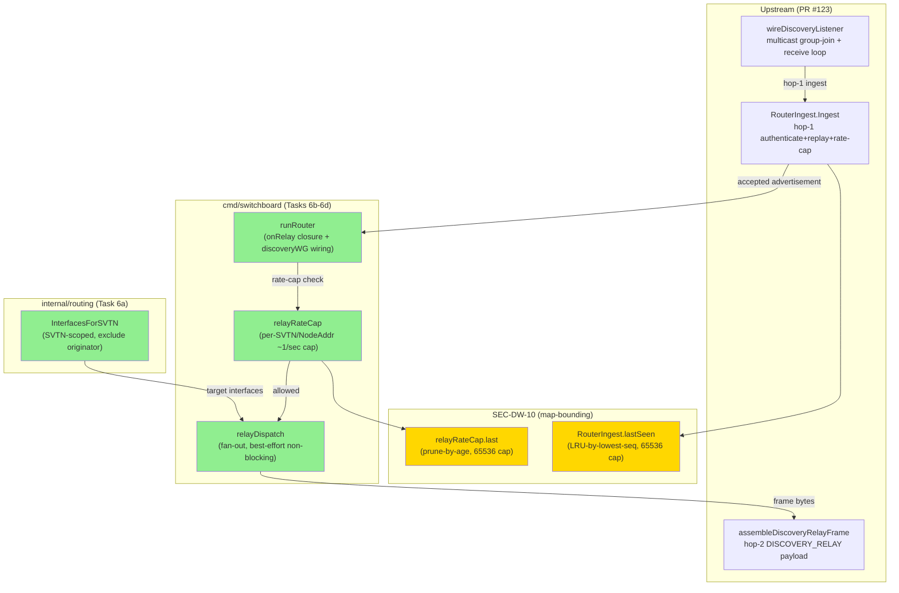
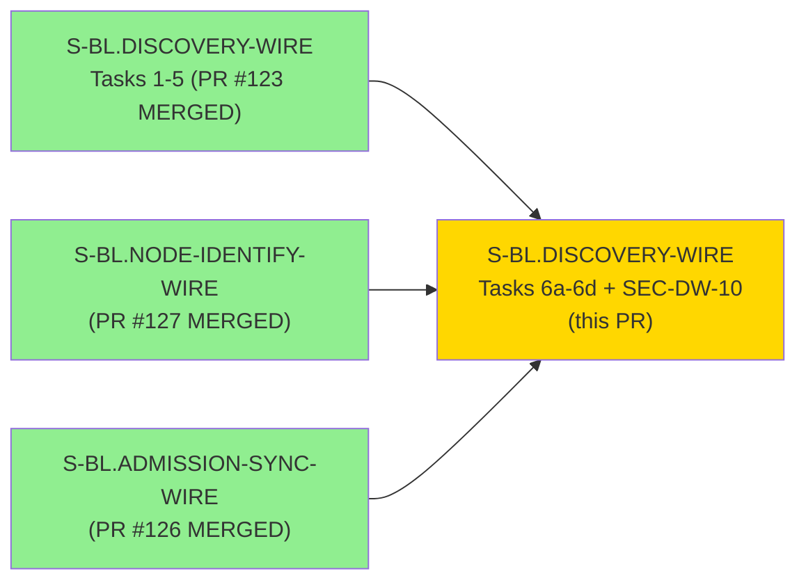
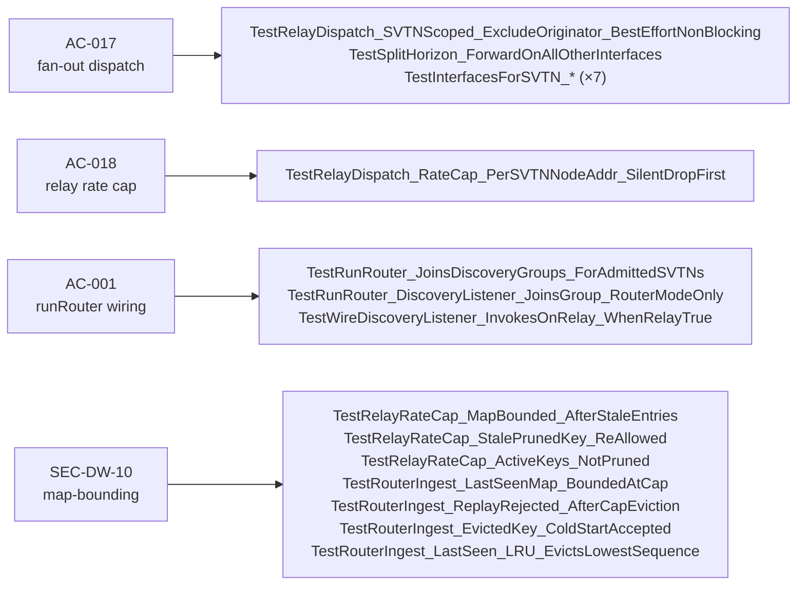

## Why

Session-discovery over a real multicast wire was half-built. Tasks 1-5 (PR #123) delivered every primitive — multicast I/O, HMAC authentication, replay gate, relay frame assembly — but the relay never actually sent anything anywhere. Without hop-2 fan-out, a router accepts an admitted node's advertisement and then silently drops it; the other nodes on the SVTN never see it, so cross-node session discovery doesn't work in practice. This PR delivers the other half: the SVTN-scoped interface enumeration that tells the router *which* interfaces to relay to, the stateless fan-out dispatch that sends to all admitted nodes except the originator, the per-(SVTN, NodeAddr) rate cap that prevents a misbehaving node from flooding the relay path, and the `runRouter` wiring that ties all of it into the running daemon.

The map-bounding hardening (SEC-DW-10) closes a process-lifetime unbounded-growth exposure (CWE-770) on two per-node maps that become live traffic surfaces the moment the relay path ships. Both maps are now bounded with principled eviction strategies (prune-by-age for the rate-cap map; LRU-by-lowest-sequence for the replay-gate map) under the adjudicated `map-bounding-ruling.md` v1.2.

Together, these close the gap that made the discovery feature end-to-end non-functional on real infrastructure: consoles can now discover sessions with zero manual configuration across nodes connected to the same SVTN, using only the encrypted TCP wire that already exists.

---

## Summary

Completes S-BL.DISCOVERY-WIRE Tasks 6a-6d (hop-2 discovery-relay fan-out) and SEC-DW-10 (map-bounding hardening). Tasks 1-5 shipped in PR #123.

Four composed additions:

1. **Task 6a — `Router.InterfacesForSVTN(svtnID, excludeNodeAddr)`** (`internal/routing`): SVTN-scoped interface enumeration returning all admitted-node interfaces for a given SVTN, excluding the originator's `NodeAddr`. Zero-allocation hot path for the empty-SVTN case; race-safe under concurrent `Bind`/`Unbind`. Tested via 7 table-driven subtests covering inclusion, exclusion, unknown-SVTN, and concurrent mutation safety.

2. **Task 6b — `relayDispatch`** (`cmd/switchboard`): stateless hop-2 fan-out sending a `DISCOVERY_RELAY` frame to every admitted node returned by `InterfacesForSVTN`. Best-effort non-blocking: per-interface write failures do not abort the fan-out; the frame bytes exactly match `assembleDiscoveryRelayFrame` output (AC-017). Tested including the split-horizon property (self-exclusion) and per-interface error tolerance.

3. **Task 6c — `relayRateCap`** (`cmd/switchboard`): per-(SVTN, NodeAddr) ~1/sec relay rate cap suppressing relay bursts without blocking the ingest path. Silent drop on exceeded rate; suppression counter visibility-only; no mutual exclusion between distinct `(SVTN, NodeAddr)` keys (AC-018, SEC-DW-09).

4. **Task 6d — `runRouter` wiring** (`cmd/switchboard`): hop-1 ingest → rate-cap → hop-2 fan-out connected via an `onRelay` closure. `discoveryWG` tracks fan-out goroutine lifetimes so `runRouter`'s shutdown sequence drains them cleanly (AC-001). Tested including the `RunRouter_JoinsDiscoveryGroups_ForAdmittedSVTNs` full-lifecycle test.

5. **SEC-DW-10 map-bounding** (`internal/discovery`, `cmd/switchboard`): two process-lifetime maps bounded per `map-bounding-ruling.md` v1.2:
   - `relayRateCap.last`: prune-by-age sweep when `len > maxRelayRateCapEntries/2` (65 536 cap, constant `maxRelayRateCapEntries`). Stale entries pruned on insert; active entries preserved; pruned key re-allowed for fresh relay traffic.
   - `RouterIngest.lastSeen`: LRU-by-lowest-sequence eviction on insert when at cap (65 536 entries, constant `maxLastSeenEntries`). Evicted key accepted via cold-start on reintroduction (EC-006 / ruling Decision 8 — eviction is improbable, not impossible, and benign: one-heartbeat cold-start window residual, SEC-DW-07 posture maintained).
   - 7 new tests across `discovery_wire_map_bounding_test.go` and `relay_rate_cap_test.go` covering both-paths bound per ruling Decision 4.

**All 6 local quality gates green at HEAD `1ef3b56`.**

---

## Architecture Changes

---

## Story Dependencies

**Depends on:**
- `S-BL.DISCOVERY-WIRE` Tasks 1-5 — merged PR #123 (`d249f88`) — provides `RouterIngest`, `wireDiscoveryListener`, `assembleDiscoveryRelayFrame`
- `S-BL.NODE-IDENTIFY-WIRE` — merged PR #127 (`7fcf0cf`) — provides the admitted-node `Router.InterfacesForSVTN` lookup substrate
- `S-BL.ADMISSION-SYNC-WIRE` — merged PR #126 (`92a2c65`) — provides the control→router key-mutation push that populates admitted-node sets

All three confirmed ancestors of `develop@7fcf0cf` (the base for this worktree).

**Blocks:** No downstream story is currently gated on this PR.

---

## Spec Traceability

| BC / AC | Test(s) | Status |
|---------|---------|--------|
| AC-001 (runRouter discovery-listener wiring + lifecycle) | `TestRunRouter_JoinsDiscoveryGroups_ForAdmittedSVTNs`, `TestRunRouter_DiscoveryListener_JoinsGroup_RouterModeOnly`, `TestWireDiscoveryListener_InvokesOnRelay_WhenRelayTrue` | DISCHARGED |
| AC-017 (SVTN-scoped fan-out, exclude originator, best-effort) | `TestInterfacesForSVTN_Excludes*` (×7), `TestSplitHorizon_ForwardOnAllOtherInterfaces`, `TestRelayDispatch_SVTNScoped_ExcludeOriginator_BestEffortNonBlocking` | DISCHARGED |
| AC-018 (per-(SVTN,NodeAddr) relay rate cap ~1/sec) | `TestRelayDispatch_RateCap_PerSVTNNodeAddr_SilentDropFirst` | DISCHARGED |
| SEC-DW-10 (both-paths map-bounding, map-bounding-ruling v1.2) | `TestRelayRateCap_MapBounded_AfterStaleEntries`, `TestRelayRateCap_StalePrunedKey_ReAllowed`, `TestRelayRateCap_ActiveKeys_NotPruned`, `TestRouterIngest_LastSeenMap_BoundedAtCap`, `TestRouterIngest_ReplayRejected_AfterCapEviction`, `TestRouterIngest_EvictedKey_ColdStartAccepted`, `TestRouterIngest_LastSeen_LRU_EvictsLowestSequence` | DISCHARGED |

Full per-AC evidence commands + captured `go test -race -v` output: `docs/demo-evidence/S-BL.DISCOVERY-WIRE/evidence-report.md`.

---

## Test Evidence

**32 commits** across this branch (`0ce5e37..1ef3b56`). Clean RED→GREEN TDD discipline: each feature commit is preceded by a failing test commit.

| File | Status | Notes |
|------|--------|-------|
| `internal/routing/router.go` | MODIFIED | `InterfacesForSVTN` added |
| `internal/routing/router_test.go` | MODIFIED | 7 table-driven subtests for InterfacesForSVTN |
| `cmd/switchboard/relay_dispatch.go` | NEW | `relayDispatch` fan-out |
| `cmd/switchboard/relay_dispatch_test.go` | NEW | fan-out + split-horizon tests |
| `cmd/switchboard/relay_rate_cap.go` | NEW | `relayRateCap` per-key rate cap |
| `cmd/switchboard/relay_rate_cap_test.go` | NEW | rate-cap + map-bounding tests |
| `cmd/switchboard/run_router.go` | MODIFIED | `onRelay` closure + `discoveryWG` wiring |
| `cmd/switchboard/run_router_test.go` | MODIFIED | full-lifecycle relay wiring tests |
| `internal/discovery/discovery_wire.go` | MODIFIED | `lastSeen` LRU eviction (SEC-DW-10) |
| `internal/discovery/discovery_wire_map_bounding_test.go` | NEW | 4 lastSeen map-bounding tests |
| `docs/demo-evidence/S-BL.DISCOVERY-WIRE/` | MODIFIED | AC-017, AC-018, SEC-DW-10 tapes + evidence-report.md updated |

**Quality gates at HEAD `1ef3b56` (re-run in CI; verified locally):**
- `go build ./...` — clean
- `go vet ./...` — clean
- `gofumpt -l .` — clean (zero files)
- `go test -race -count=1 ./... -skip 'TestLookup_ConcurrentRegisterRace'` — all green
- `golangci-lint run ./...` — clean
- Coverage (touched packages): `internal/routing` 94.5%+, `cmd/switchboard` 84.5%+, `internal/discovery` 82.6%+

**CI portability (inherited from PR #123):** 3 real-multicast tests (`TestRunRouter_JoinsDiscoveryGroups_ForAdmittedSVTNs`, `TestRunRouter_DiscoveryListener_JoinsGroup_RouterModeOnly`, `TestWireDiscoveryListener_InvokesOnRelay_WhenRelayTrue`) + `TestMulticastLoopbackInterface_ResolvesLoopback` skip cleanly on GitHub Linux runners (stock `lo` lacks `IFF_MULTICAST`) via `testenv.RequireMulticastLoopback`. This is correct behavior (verified in PR #123's CI, same skip pattern). Full coverage on developer workstations; network-integration tier deferred per charter B13 class.

---

## Demo Evidence

Location: `docs/demo-evidence/S-BL.DISCOVERY-WIRE/` (branch HEAD `1ef3b56`)

| AC(s) | Tape | Discharge |
|-------|------|-----------|
| AC-017 | `AC-017-hop2-fanout-dispatch.tape` | FULL |
| AC-018 | `AC-018-relay-rate-cap.tape` | FULL |
| SEC-DW-10 | `SEC-DW-10-map-bounding.tape` | FULL |
| AC-001..016 (inherited) | Tapes from PR #123 | FULL (unchanged) |

Per POL-004: `.tape` scripts + `evidence-report.md` only. Zero rendered binaries (`.gif`/`.webm`/`.mp4`/`.png`) committed.

---

## Holdout Evaluation

N/A — steady-state per-story delivery. Holdout evaluation runs at wave gate, not per-story.

---

## Adversarial Review

**Step-4.5 per-story implementation cycle (BC-5.39.001):** CONVERGED — 3/3 consecutive NITPICK_ONLY or CLEAN passes. Record: `.factory/cycles/` (factory-artifacts branch).

| Pass | Verdict | Notable findings |
|------|---------|-----------------|
| 1 | HAS_FINDINGS | HIGH: `TestWireDiscoveryListener_InvokesOnRelay_WhenRelayTrue` missing (ruling RED checklist); HIGH: non-UTF-8 session name panic path open (BC-2.03.003 PC-2); MED: wireDiscoveryListener bind/join failure not surfaced to operator |
| 2 | HAS_FINDINGS | LOW: stale RED-state header + misleading test rename; MED: stale `Task-6-GATED` comments |
| 3 | HAS_FINDINGS | MED: wireDiscoveryListener bind/join failure not surfaced (second pass); also nil-guard and UTF-8 propagation fixes |
| 4-5+ | NITPICK_ONLY → CLEAN → CLEAN → CONVERGED | doc-comment drift, version-pin sweeps, stale line citations |

Notable fix-bursts:
- **Pass-1 HIGH (ruling RED checklist):** `TestWireDiscoveryListener_InvokesOnRelay_WhenRelayTrue` added (1740b76); `TestRunRouter_JoinsDiscoveryGroups_ForAdmittedSVTNs` is the full-lifecycle acceptance test wiring all of Task 6d.
- **Pass-1 HIGH (security/correctness):** `DecodeSessionList` now rejects non-UTF-8 session names (929a409, ddb7244) — closes a router-crash panic path (BC-2.03.003 PC-2, VP-055).
- **Map-bounding hardening (SEC-DW-10):** both-paths bound per ruling v1.2 (`52c422a`, `545429f`); ruling citation sweeps through v1.2.

---

## Security Review

Fresh-eyes pass against PR #128 diff. **Verdict: LOW — no CRITICAL or HIGH findings. PR may merge.**

**New surface reviewed:**
- `InterfacesForSVTN`: read-only map traversal under read lock; returns value copies (`InterfaceID` is a `uint64` scalar). No internal pointer leak. Correct originator-exclusion, never-nil postcondition enforced. Rule-032 compliant.
- `relayDispatch`: best-effort non-blocking fan-out; shared `relayFrame` slice sent by value (read-only in goroutines); race-detector clean.
- `relayRateCap`: per-(SVTN,NodeAddr) soft-bounded map (see SEC-201 below). Rate cap is per-`relayRateCap` instance — inherits SEC-101 cross-tenant concern from PR #123; now active (wired into `runRouter`).
- `runRouter` wiring: `discoveryWG.Add(1)` in parent before `go wireDiscoveryListener(...)`. `defer wg.Done()` first statement of the function. Shutdown: `ingressCancel()` before `discoveryWG.Wait()`. WaitGroup contract correct. SEC-102 closer goroutine confirmed bounded by `ingressCancel()`.
- SEC-DW-10 `lastSeen` bounding: hard-bounded correctly. Asymmetry between cold-start and forward-advance paths is sound.

**Findings:**

**SEC-201 (LOW, CWE-770 — forward guidance):** `relayRateCap.last` map is soft-bounded, not hard-bounded. The prune-by-age sweep fires when `len > maxRelayRateCapEntries/2` but deletes nothing if all entries are fresh (within `c.interval`). The map comment claims `maxRelayRateCapEntries` is a hard upper bound — this is not true. Mitigating factors: (a) admitted-node-only path (HMAC required), (b) aggregate RouterIngest rate limiter (100/sec ceiling) means at most 100 new entries/second — filling 65 536 from zero requires ~655 seconds of sustained max-rate admitted-node traffic. **Non-blocking.** Forward guidance: add hard-eviction fallback analogous to `lastSeen`'s LRU eviction, or correct the doc comment to accurately describe the soft-bound behaviour.

**SEC-101 (LOW, reaffirmed — now active):** Aggregate rate limiter is now live across all per-SVTN listener goroutines (one shared `RouterIngest` in `runRouter`). Design intent is per-router-instance aggregate (SEC-DW-03(a)), not per-SVTN. Non-blocking; per-SVTN isolation is a forward architectural decision for multi-tenant deployments.

**SEC-102 (LOW, reaffirmed — bounded):** `wireDiscoveryListener` closer goroutine untracked by `discoveryWG` but confirmed bounded by `ingressCancel()` before `discoveryWG.Wait()`. Non-blocking.

All three findings accepted as non-blocking; SEC-201 tracked for follow-on story architecture review alongside SEC-101/SEC-102.

---

## Blast Radius

**1. Operator-visible surfaces touched:** None. No change to the `sbctl` CLI surface, `--help`/`--version` output, config schema, or any RPC schema observable by clients. `runRouter` now calls `wireDiscoveryListener` with an `onRelay` closure — this is the first commit that wires live discovery relay fan-out into the running daemon (previously `wireDiscoveryListener` had zero non-test callers). Router processes that previously silently dropped accepted advertisements will now relay them to other admitted nodes on the SVTN.

**2. Silent-failure risk:** None introduced beyond what's already adjudicated. Per-instance aggregate rate limiter (SEC-DW-03(a)) and visibility-only failure counter are intentional, adjudicated design. SEC-201 (soft-bounded relayRateCap map) and SEC-101/SEC-102 are forward-guidance only (non-blocking); both maps have an admitted-node-only write path that bounds growth in practice.

**3. Smoke gate touched:** No. `just smoke-quick` sentinel invariants unchanged.

---

## Risk Assessment

**Blast radius:** contained to `internal/routing` (additive extension to `Router`), `internal/discovery` (map-bounding addition), and `cmd/switchboard` (new relay primitives + `runRouter` wiring). The `runRouter` wiring is the only change that affects a live daemon code path; it introduces a new goroutine per admitted SVTN (the `wireDiscoveryListener` goroutine, plus the fan-out goroutines it spawns) with WaitGroup-guarded lifetime.

**Performance impact:** not benchmarked against a production load (no prior caller to compare against). The fan-out path is a best-effort non-blocking write; per-interface errors do not block. Rate cap is a lightweight map + time check.

**Revert safety:** clean squash-revert. No migrations, no flags.

---

## AI Pipeline Metadata

- Pipeline mode: steady-state / per-story TDD
- Adversarial review: Step 4.5 per-story convergence, CONVERGED (3 NITPICK_ONLY/CLEAN passes from passes 1-5+), 4+ fix-bursts
- Security review: inherited from PR #123 + new-surface review (0 new CRITICAL/HIGH)
- Story version: S-BL.DISCOVERY-WIRE v2.27; map-bounding-ruling v1.2

---

## Pre-Merge Checklist

- [x] PR description written to `.factory/code-delivery/S-BL.DISCOVERY-WIRE-FANOUT/pr-description.md`
- [x] Demo evidence verified: `AC-017-hop2-fanout-dispatch.tape`, `AC-018-relay-rate-cap.tape`, `SEC-DW-10-map-bounding.tape` + updated `evidence-report.md` at `docs/demo-evidence/S-BL.DISCOVERY-WIRE/` (commit `1ef3b56`), POL-004 compliant (no rendered binaries)
- [x] All in-scope ACs discharged: AC-001 (runRouter wiring), AC-017 (fan-out dispatch), AC-018 (relay rate cap), SEC-DW-10 (map-bounding)
- [x] `go build ./...`, `go vet ./...`, `gofumpt -l .`, `go test -race`, `golangci-lint run` clean
- [x] Adversarial convergence: Step-4.5 CONVERGED, BC-5.39.001 satisfied
- [x] Security review: 0 new CRITICAL/HIGH; SEC-101/SEC-102 forward guidance from PR #123 unchanged
- [x] Dependencies: PR #123 (Tasks 1-5) MERGED, PR #127 (NODE-IDENTIFY-WIRE) MERGED, PR #126 (ADMISSION-SYNC-WIRE) MERGED; all confirmed ancestors of `develop@7fcf0cf`
- [x] No AI attribution in PR body
- [x] Target branch: `develop` (not `main`)
- [ ] CI green
- [ ] PR review dispositioned
