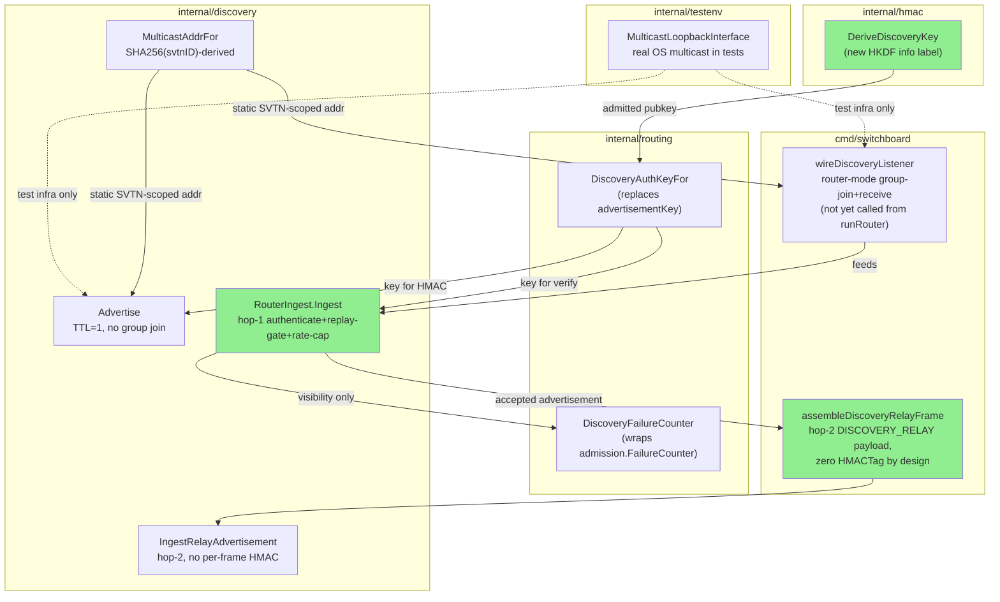
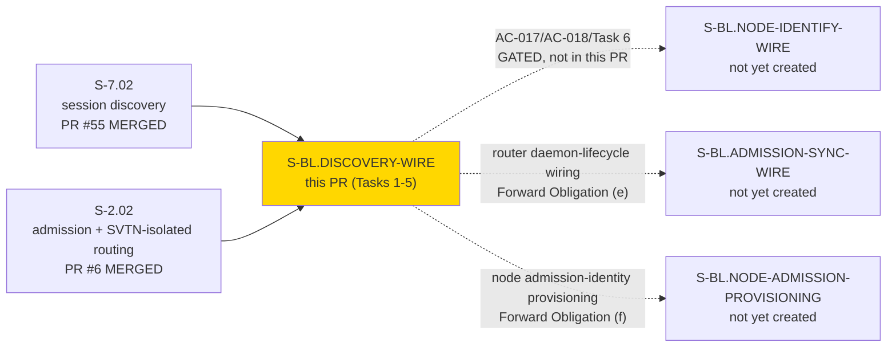

## Summary

Delivers the discovery wire boundary — UDP multicast advertisement I/O between
admitted VPN nodes and a router, admitted-node HMAC key derivation for authenticating
those advertisements, deterministic SVTN-scoped multicast address allocation, and hop-2
`DISCOVERY_RELAY` frame assembly for re-broadcasting accepted advertisements to other
nodes over the existing authenticated TCP wire.

**Scope boundary (intentional — read this before reviewing):** this PR delivers Tasks
1-5 / AC-001..AC-016 only. AC-017 (SVTN-scoped, exclude-originator, best-effort fan-out
dispatch) and AC-018 (relay-dispatch rate cap), together with Task 6 (hop-2 fan-out
dispatch), are marked `[GATED — depends_on S-BL.NODE-IDENTIFY-WIRE]` in the story spec
(`.factory/stories/S-BL.DISCOVERY-WIRE.md` v2.14) — that companion story (the
`NODE_IDENTIFY` handshake binding node identity to a live connection) does not exist
yet. The story's own Task Breakdown states plainly that Tasks 1-5 are independently
deliverable and do not depend on that story landing. Do not flag AC-017/AC-018 as
missing — they are a documented, adjudicated scope boundary (Human Gate item 3 /
Forward Obligations row (a), RESOLVED 2026-07-14), not a gap in this delivery.

Five composed changes:

1. **`internal/hmac`** — `DeriveDiscoveryKey` derives the discovery-advertisement HMAC
   key from the admitted node's pubkey via a domain-separated HKDF info label
   (`HKDFInfoDiscovery`), distinct from the existing frame-auth key derivation.
2. **`internal/routing`** — `DiscoveryAuthKeyFor` looks up a node's discovery key from
   the admitted-key set (replacing the retired `advertisementKey`); `DiscoveryFailureCounter`
   wraps the existing (reused, pre-existing) `FailureCounter` for HMAC-rejection
   visibility.
3. **`internal/discovery`** — `MulticastAddrFor` derives a static `239.h0.h1.h2`
   multicast address from `SHA256(svtnID)` (no coordination step); `Advertise` sends via
   `net.ListenUDP`+`WriteToUDP` with TTL=1 per UP+multicast-capable interface (no group
   join required to send); `RouterIngest.Ingest` is the router-side hop-1 authenticate +
   replay-gate + rate-cap ingest path; `IngestRelayAdvertisement` retires
   `ReceiveAdvertisement` as the node-side hop-2 ingest (no per-frame HMAC — trust derives
   from the connection).
4. **`internal/testenv`** — `MulticastLoopbackInterface` gives tests a real loopback
   multicast interface instead of mocking `net.Conn`, so the multicast dispatch/ingest
   round-trip is exercised against actual OS multicast behavior.
5. **`cmd/switchboard`** — `wireDiscoveryListener` is the router-mode multicast-group-join
   + receive loop (fully implemented and independently tested at function level; not yet
   called from `runRouter` — see Known Forward Obligations below);
   `assembleDiscoveryRelayFrame` builds the hop-2 `DISCOVERY_RELAY` payload from decoded
   fields (never a raw retransmission of hop-1 bytes), with a `PayloadLen` truncation guard
   (N-1 fix).

**Implementation-phase reopen (F-DWIP1-001, HIGH, security/interop):** first TDD contact
with a real `Encode`→router-`Ingest` round-trip test (pass 1 of the Step-4.5 cycle)
found the shipped `Encode`/`Decode` had regressed to deriving the discovery HMAC key
from cleartext `SVTNID` alone — the sender↔router key-derivation mismatch would have
broken interop for every genuinely admitted node, undetected because no prior test
exercised a real round-trip. Fixed by threading `nodeAdmissionPubkey []byte` through
`Encode`/`Decode` (both now route through `routing.DeriveDiscoveryKey`, confirmed
faithful to the story's already-specified symmetric design); `discovery.Config` gained
`LocalNodeAdmissionPubkey []byte`; `transmitAdvertisement` fails closed with
`ErrMissingNodeAdmissionPubkey` when empty. New regression test:
`TestDiscovery_EncodeThenRouterIngest_AcceptsRealAdmittedNode`. The security reviewer
independently re-verified this fix (see Security Review below) rather than taking the
story changelog's word for it.

**Known Forward Obligations (accepted at function level, documented in the story spec,
not blocking this PR):**
- `wireDiscoveryListener` is implemented and tested but has no caller in `runRouter` —
  the router process has no source of "which SVTN(s) am I serving" today (Forward
  Obligation row (e), gates on a not-yet-created `S-BL.ADMISSION-SYNC-WIRE`).
- `internal/discovery.New`/`Discovery.Run` (the sender/advertise daemon loop) and
  `Discovery.IngestRelayAdvertisement` have zero production callers — no running
  access-node process is wired to advertise or relay yet (Forward Obligation row (f),
  gates on a not-yet-created `S-BL.NODE-ADMISSION-PROVISIONING`).

Both obligations are pre-existing daemon-lifecycle wiring gaps independent of this PR's
Tasks 1-5 correctness — every function delivered here is fully implemented and
independently tested; nothing is stubbed.

---

## Architecture Changes

<strong>Design note: HKDF domain separation for the discovery key (F-DWIP1-001)</strong>

**Context:** the discovery-advertisement HMAC key must be derivable independently by
both the sending access node and the receiving router from data both sides already
possess, without a coordination round-trip — and it must NOT reuse the existing
frame-auth key (a key-reuse-across-purposes anti-pattern already rejected once before
this story, DRIFT-W6TBD-001/Ruling 1).

**Decision:** `DeriveDiscoveryKey` derives from the admitted node's pubkey via HKDF with
a distinct info label (`HKDFInfoDiscovery`), producing a key that is cryptographically
independent of the frame-auth key even though both derive from the same root pubkey
material.

**Rationale:** an earlier implementation pass shipped `Encode`/`Decode` deriving the key
from cleartext `SVTNID` instead — compiles, passes unit tests that don't exercise a real
round-trip, but breaks wire interop with a genuinely admitted peer and reintroduces the
exact key-reuse-adjacent anti-pattern the project had already ruled out once. No test
caught it until a real `Encode`→router-`Ingest` round-trip test was added.

**Alternatives considered:**
1. Reuse the frame-auth key directly for discovery HMACs — rejected: a compromise of one
   purpose's key compromises the other; already rejected project-wide (DRIFT-W6TBD-001).
2. Derive from `SVTNID` alone — rejected: `SVTNID` is not secret (it's on-wire cleartext
   in the outer header of every frame), so a key derived from it alone provides no
   authentication at all — this was the actual regression this fix corrects.

**Consequences:**
- `Encode`/`Decode` both gained a `nodeAdmissionPubkey []byte` parameter; every call
  site was updated to thread it through.
- `discovery.Config.LocalNodeAdmissionPubkey` is now load-bearing — its absence fails
  closed (`ErrMissingNodeAdmissionPubkey`), not silently.

---

## Story Dependencies

**Depends on:** `S-7.02` (session discovery, merged PR #55, `c54a8ad0`) and `S-2.02`
(admission + SVTN-isolated routing, merged PR #6, `a06b306`) — both confirmed ancestors
of `develop@1f25677`, which this worktree was built from
(`git merge-base --is-ancestor 1f25677 61767d1` confirms).

**Blocks:** `S-BL.NODE-IDENTIFY-WIRE` (not yet created) needs this story's hop-1
ingest/hop-2 relay-frame-assembly primitives before Task 6's fan-out dispatch can be
built on top of them.

---

## Spec Traceability

| BC / AC | Test(s) |
|---------|---------|
| AC-001 (router-mode-exclusive multicast membership) | `TestRunRouter_DiscoveryListener_JoinsGroup_RouterModeOnly` |
| AC-002 (deterministic multicast address) | `TestMulticastAddrFor_Deterministic_SHA256Derived` |
| AC-003 (sender-side TTL=1 dispatch, no group join) | `TestDiscovery_Advertise_WriteToMulticast_TTL1_NoGroupJoin` |
| AC-004 (domain-separated key derivation) | `TestDeriveDiscoveryKey_DomainSeparatedFromFrameAuthKey`, `TestDiscoveryAuthKeyFor_LookupSuccessAndMiss`, `TestDeriveDiscoveryKey_SenderRouterAgree`, `TestDiscovery_EncodeThenRouterIngest_AcceptsRealAdmittedNode`, `TestDiscovery_Advertise_MissingNodeAdmissionPubkey_FailsClosed` |
| AC-005 (fixed-offset key-selector extraction, HMAC over full body) | `TestRouterIngest_KeySelectorExtraction_FixedOffset_NoFullDecodeBeforeAuth`, `TestRouterIngest_HMACCoversFullBody_TamperInSessionListDetected`, `TestRouterIngest_ShortDatagram_RejectedBeforeLookup`, `TestRouterIngest_FullValidFrameMinimum_42Bytes` |
| AC-006 (lookup-miss/tag-mismatch indistinguishable) | `TestRouterIngest_LookupMissAndTagMismatch_IndistinguishableRejection` |
| AC-007 (node-local hop-2 relay ingest) | `TestDiscovery_IngestRelayAdvertisement_SVTNMismatch_ErrSVTNMismatch`, `TestDiscovery_IngestRelayAdvertisement_NoHMACRequired`, `TestDiscovery_IngestRelayAdvertisement_Success_RegistryReplaceOnWrite` |
| AC-008/009/010 (replay/sequence gate) | `TestVP080_DiscoveryIngest_ColdStartAcceptance`, `TestVP080_DiscoveryIngest_ReplayDiscard_ExactSequence`, `TestVP080_DiscoveryIngest_ReplayDiscard_LowerSequence`, `TestVP080_DiscoveryIngest_ReplayDiscard_NoRelaySideEffect`, `TestVP080_DiscoveryIngest_ForwardAcceptance_AdvancesState`, `TestVP080_DiscoveryIngest_RestartForwardProgress` |
| AC-011/012/013 (bounded buffer, aggregate rate cap, threshold-only logging) | `TestRouterIngest_OversizedDatagram_RejectedNoPartialParse`, `TestRouterIngest_AggregateRateCap_NotPerSource`, `TestRouterIngest_FailureCounter_VisibilityOnly_NeverGates`, `TestRouterIngest_FailureLogging_ThresholdCrossingOnly_NotPerPacket` |
| AC-014/015/016 (hop-2 relay frame assembly, zero HMACTag, re-serialized not raw) | `TestAssembleDiscoveryRelayFrame_PayloadLayout`, `TestAssembleDiscoveryRelayFrame_ZeroHMACTag`, `TestAssembleDiscoveryRelayFrame_NotRawHop1Bytes` |
| AC-017/AC-018 | **GATED** — not in this PR, see Scope boundary above |

Full per-AC evidence commands + captured `go test -race -v` output for every row above:
`docs/demo-evidence/S-BL.DISCOVERY-WIRE/evidence-report.md`.

---

## Test Evidence

**32 net-new tests** across 6 new + 3 modified test files. Diffstat: 25 files changed,
+4422/−438 across 23 commits (plus 4 follow-on commits dispositioning PR review findings
F1/F3 — see "PR Review" section below — branch tip `e5090ab`).

| File | Status | Notes |
|------|--------|-------|
| `internal/discovery/discovery_wire.go` + `discovery_wire_test.go` | NEW | 805 lines of tests |
| `cmd/switchboard/discovery_wire.go` + `discovery_wire_test.go` | NEW | router-side ingest path |
| `cmd/switchboard/discovery_relay_wire.go` + `discovery_relay_wire_test.go` | NEW | 310 lines of tests |
| `internal/routing/advertisement_hmac.go` + `advertisement_hmac_test.go` | NEW | 122 lines of tests |
| `internal/routing/discovery_failure_counter.go` | NEW | wraps existing `FailureCounter` |
| `internal/testenv/multicast_loopback.go` + `_test.go` | NEW | real loopback multicast test infra |
| `internal/discovery/discovery.go` + `discovery_test.go` | MODIFIED | `ReceiveAdvertisement` retired → `IngestRelayAdvertisement` |
| `internal/discovery/multicast_ttl.go` | NEW | TTL=1 sender-side helper |
| `internal/hmac/hmac.go` + `hmac_test.go` | MODIFIED | `DeriveDiscoveryKey` added |

**Quality gates (independently re-verified this session, HEAD `61767d1`, tests run at code HEAD `501db03`):**

- `go build ./...` — clean
- `go vet ./...` — clean
- `gofumpt -l .` — clean (zero files need formatting)
- `go test -race -count=1 ./...` — all packages green, zero `FAIL`
- Touched-package coverage: `internal/discovery` 82.6%, `internal/routing` 94.5%,
  `internal/testenv` 80.7%, `cmd/switchboard` 84.5%
- RED→green discipline: `7f36e73` (compilable stubs) → `4bc578c` (Red Gate, failing
  tests for AC-001..016) → incremental green commits through `692ff05` → 9 adversarial
  fix commits → `501db03` (converged code HEAD) → `61767d1` (demo evidence, docs-only)

---

## Demo Evidence

Location: `docs/demo-evidence/S-BL.DISCOVERY-WIRE/` (commit `61767d1`)

| AC(s) | Tape | Discharge |
|-------|------|-----------|
| AC-001 | `AC-001-router-mode-multicast-membership.tape` | FULL at function level (Ruling 4 scope note — see below) |
| AC-002/003 | `AC-002-003-multicast-addr-and-sender-dispatch.tape` | FULL |
| AC-004 | `AC-004-discovery-key-derivation.tape` | FULL |
| AC-005/006 | `AC-005-006-key-selector-hmac-fail-closed.tape` | FULL |
| AC-007 | `AC-007-node-local-relay-ingest.tape` | FULL |
| AC-008/009/010 | `AC-008-009-010-replay-sequence-gate.tape` | FULL |
| AC-011/012/013 | `AC-011-012-013-bounded-buffer-rate-cap-logging.tape` | FULL |
| AC-014/015/016 | `AC-014-015-016-relay-frame-assembly.tape` | FULL |
| AC-017/AC-018 | — | GATED, not in this PR |

**AC-001 scope note (Ruling 4, story v1.10):** `wireDiscoveryListener` is fully
implemented and independently tested at function level, but is not yet called from
`runRouter` (Forward Obligation (e) above) — the tape verifies the function in
isolation, not daemon-lifecycle behavior, per the story's own accepted disposition.

Per POL-004: `.tape` scripts + `evidence-report.md` only; verified zero rendered
binaries (`.gif`/`.webm`/`.mp4`/`.png`) committed in this diff.

---

## Holdout Evaluation

N/A — this is a steady-state per-story delivery (not a full VSDD pipeline wave); holdout
evaluation runs at wave gate, not per-story.

---

## Adversarial Review

**Per-story implementation cycle (Step 4.5, BC-5.39.001):** CONVERGED 3/3 consecutive
clean passes (passes 4/5/6 — NITPICK_ONLY → CLEAN → CLEAN), across 6 total passes and 4
fix-bursts. Record: `.factory/cycles/cycle-1/S-BL.DISCOVERY-WIRE/implementation/adversary-convergence-state.json`.

| Pass | Verdict | Findings |
|------|---------|----------|
| 1 | HAS_FINDINGS | F-DWIP1-001 (HIGH, security/interop — key-derivation mismatch), F-DWIP1-002 (LOW), F-DWIP1-003 (NITPICK, test-strength) |
| 2 | HAS_FINDINGS | F-DWIP2-001 (LOW, false-timing-comment), F-DWIP2-002 (LOW, process-gap — untested fail-closed guard) |
| 3 | HAS_FINDINGS | F-DWIP3-001 (LOW, concurrency/WaitGroup-race), F-DWIP3-002 (LOW, buffer-drift) |
| 4 | NITPICK_ONLY | N-1 (truncation guard), N-2 (test-honesty doc comment) |
| 5 | CLEAN | none |
| 6 | CLEAN | none — CONVERGED |

Notable findings:
- **F-DWIP1-001** (HIGH, security/interop) — see "Design note: HKDF domain separation"
  above. The only HIGH-severity finding across the cycle; independently re-verified by
  the security reviewer (see Security Review below), not just trusted from the story
  changelog.
- **F-DWIP3-001** (LOW, concurrency) — `wg.Add(1)` was called inside
  `wireDiscoveryListener`'s own goroutine body instead of by the caller before the `go`
  statement, opening a WaitGroup race (the classic "Add after Go" bug). Fixed by moving
  `wg.Add(1)` to the caller.
- **F-DWIP3-002** (LOW, buffer-drift) — the discovery read buffer was sized to the
  theoretical UDP maximum (65507 bytes) rather than the realistic bound implied by the
  wire contract; fixed to size against the actual contract.

---

## Security Review

**Verdict:** No CRITICAL or HIGH findings. Core cryptographic surface (HKDF domain
separation, constant-time comparison, fail-closed lookup-miss/tag-mismatch unification,
fixed-offset pre-auth parsing, buffer bounds) is sound and matches the adjudicated
design. 2 LOW findings, both forward-guidance on code paths not yet wired into any
production caller — neither blocks merge.

Independently re-verified (not re-flagged, per the story's adjudicated design):
`DeriveDiscoveryKey` derives from the admitted node's pubkey
(`internal/routing/advertisement_hmac.go:45,55`) with a distinct HKDF info label
(`HKDFInfoDiscovery`, `internal/hmac/hmac.go:36`) from the frame-auth key —
`TestDeriveDiscoveryKey_DomainSeparatedFromFrameAuthKey` empirically asserts the two
outputs differ for identical inputs; the F-DWIP1-001 fix is confirmed correct by
inspection, not just documented. `VerifyHMAC`/`VerifyAdvertisementHMAC` use
`crypto/hmac.Equal` (constant-time). `RouterIngest.Ingest` extracts the SVTNID/NodeAddr
key selector via fixed-offset slicing before any variable-length, attacker-controlled
session-list walk, with every slice access preceded by an explicit length check sized to
that exact access — no out-of-bounds slice/panic path found. Lookup-miss and
HMAC-mismatch both resolve to the identical `ErrInvalidHMACTag` sentinel with no other
observable differential. `FailureCounter` reuse doesn't reopen unbounded map growth
(pre-existing `maxTrackedSources=65536` LRU eviction, CWE-770, already mitigated).
Epoch-qualified `uint64` sequence math checked for overflow/underflow: no wraparound
reachable within the epoch range in use.

**SEC-101 (LOW, CWE-770, forward guidance):** the discovery ingest rate limiter and
`FailureCounter` are per-`RouterIngest` instance, not per-SVTN. `wireDiscoveryListener`
takes a `*discovery.RouterIngest` parameter rather than constructing one per SVTN group.
Nothing in today's API prevents a future caller from wiring one shared `RouterIngest`
across every SVTN a router hosts — if that happens, a node admitted to SVTN A could
consume the entire process-wide rate budget (100 tokens/sec) and starve legitimate
discovery traffic for an unrelated, co-hosted SVTN B. **Not a defect in this PR** —
`RouterIngest`/`wireDiscoveryListener` have zero non-test production callers today (no
daemon wiring exists yet, per Forward Obligation (e) above). Flagged as forward guidance
for whichever follow-on story wires the router daemon lifecycle: either construct one
`RouterIngest` per admitted SVTN, or explicitly adjudicate a shared-budget trade-off the
way the aggregate-vs-per-source rate-cap decision was adjudicated for this story.

**SEC-102 (LOW, CWE-772, forward guidance):** `wireDiscoveryListener`'s ctx-cancellation
closer goroutine (spawned to unblock a blocking `ReadFromUDP` on shutdown) can outlive
the read loop on a non-context socket error return path. No unbounded accumulation is
possible from a single invocation, and this is not attacker-triggerable — it requires an
actual fatal socket-level error, not datagram content. Worth a note only because a
future retry/reconnect wrapper around `wireDiscoveryListener` would leak one goroutine
per retry cycle rather than one total. **Not reachable in the shipped binary today** —
`wireDiscoveryListener` has zero non-test callers.

Full review record (agent transcript) available on request; both LOW findings are
tracked here rather than as separate GH issues since they apply to not-yet-wired code
paths that the gating follow-on stories will re-review at integration time.

---

## PR Review — pr-reviewer fresh-eyes pass (posted as COMMENTED review)

A second, independent fresh-eyes review ran against the initial PR body/diff (branch tip
`61767d1`) and posted findings as a COMMENTED review
([pull request review](https://github.com/ArcavenAE/switchboard-blue/pull/123#pullrequestreview-4701547369)
— `gh pr review --comment`; this project runs as a single GitHub identity, so a formal
APPROVE/REQUEST_CHANGES verdict is structurally unavailable, per drbothen/vsdd-factory#626.
COMMENTED + dispositioned findings + CI-green is this project's convergence record).

**Verdict at that pass: HAS_FINDINGS — 1 BLOCKING, 2 forward-guidance.** All three now
dispositioned, branch tip `e5090ab`:

| # | Severity | Finding | Disposition |
|---|----------|---------|--------------|
| F1 | **BLOCKING** | CI Quality Gate red on the Linux runner: `MulticastLoopbackInterface`'s fast path returned the named interface (`lo`) without validating it actually carried the `MULTICAST` flag — true on macOS (`lo0`) but false on stock GitHub Actions `ubuntu-latest` (`lo` is loopback-only by default). Two tests failed as a direct consequence; StepSecurity Harden-Runner also flagged the resulting real multicast-egress attempt. | **FIXED**, `025d481` + `b6d14ab`. `MulticastLoopbackInterface`'s fast path now validates UP+LOOPBACK+MULTICAST before returning (`isLoopbackMulticastCapable`), matching what its own doc comment already promised. New `RequireMulticastLoopback(t)` skip-helper added, called as the first line of every test that performs real multicast socket I/O (`TestMulticastLoopbackInterface_ResolvesLoopback`, `TestDiscovery_Advertise_WriteToMulticast_TTL1_NoGroupJoin`, `TestRunRouter_DiscoveryListener_JoinsGroup_RouterModeOnly`) — these tests now `t.Skip` with an explicit, visible reason on environments lacking a multicast-capable loopback interface (stock GitHub Linux runners) instead of failing, and the skip also means no real multicast socket I/O is attempted there, independently resolving the StepSecurity Harden-Runner audit flag. Full-fidelity coverage of these three ACs remains on developer workstations (macOS `lo0` has `MULTICAST` natively) pending a future network-integration CI tier. Empirically verified: reproduced the exact failure in a Linux container with `lo` lacking `IFF_MULTICAST` (`cat /sys/class/net/lo/flags` → `0x9`, no `0x1000` bit), confirmed the three tests skip cleanly (not fail) post-fix in that same environment, and confirmed full-suite coverage stays at 83.0% (floor is 75%). Doc note added to `docs/demo-evidence/S-BL.DISCOVERY-WIRE/evidence-report.md` (`e5090ab`). |
| F2 | LOW (forward-guidance) | SEC-DW-04/AC-013 HMAC-failure visibility logging is defeatable by NodeAddr rotation — a per-source `FailureCounter` on an attacker-controlled, unauthenticated key means a flood that rotates its declared `NodeAddr` never crosses the per-source alert threshold. | **Accepted as forward guidance, not fixed in this PR.** `RouterIngest` has zero non-test production callers today (Forward Obligation (e)); this is deferred to whichever follow-on story wires the router daemon lifecycle, alongside SEC-101 (same code path, same gating obligation). Distinct axis from SEC-101 (rate-budget partitioning) — noted for that story's architecture review. |
| F3 | NIT (forward-guidance) | `Advertise` sampled the epoch-qualified `Sequence` outside the lock that orders it — concurrent `Advertise` calls on one instance could assign a lower `Sequence` to a logically-later advertisement. | **FIXED**, `e0cdd2e`. `Advertise` now samples `d.nextSequence()` under `d.mu`, in the same critical section as the registry mutation it must stay ordered with, before calling `transmitAdvertisement(sequence, wireSessions)` (signature updated to take the pre-sampled sequence rather than sampling it itself). |

**Also verified as correct by the reviewer (re-confirmed, not just trusted):** the
F-DWIP1-001 fix (real `Encode`→`RouterIngest.Ingest` round-trip, not a re-implementation
in the test), HKDF domain separation, hop-1 fail-closed ingest ordering (rate-cap → length
floor → length ceiling → fixed-offset key-selector extraction → HMAC → replay gate under
mutex), and hop-1/hop-2 wire-layout consistency.

**StepSecurity Harden-Runner (informational, non-blocking):** was red in `audit` mode
(non-blocking by design) at the pre-fix branch tip, most likely due to the genuinely new
outbound multicast-UDP behavior this PR introduces reaching the runner's egress audit.
Resolved as a side effect of the F1 fix — the skip-before-socket-I/O pattern means no
multicast egress is attempted on runners lacking multicast-capable loopback.

---

## Blast Radius

**1. Operator-visible surfaces touched:** none. No change to the `sbctl` CLI surface,
`--help`/`--version` output, config schema, or any RPC schema observable by clients.
`wireDiscoveryListener` and the sender/relay daemon loops have zero production callers —
nothing in this PR changes the behavior of the shipped `switchboard` binary's running
daemons; it adds fully-tested, unwired primitives.

**2. Silent-failure risk:** none introduced beyond what's already adjudicated
(lookup-miss/tag-mismatch indistinguishability, aggregate-not-per-source rate cap,
visibility-only failure counter) — all intentional, adjudicated design, not accidental.

**3. Smoke gate touched:** no. `just smoke-quick` sentinel invariants unchanged.

---

## Risk Assessment

**Blast radius:** contained to `internal/discovery`, `internal/hmac`, `internal/routing`
(additive — no existing exported function signatures changed except `Encode`/`Decode`
gaining a parameter, both already unreleased/pre-wiring), `internal/testenv` (test-only),
and two new files in `cmd/switchboard`. No production daemon-lifecycle code path is
modified — everything shipped here is new, additively-tested surface with no existing
caller.

**Performance impact:** not measured — no production caller exists yet to benchmark
against. `RouterIngest.Ingest` is a synchronous authenticate+decode function with no
new goroutines per call; `wireDiscoveryListener` spawns one goroutine per invocation
(the read loop) plus one closer goroutine (see SEC-102), both scoped to the listener's
own lifetime.

**Revert safety:** `git revert` of the squash-merge commit is clean — no schema
migrations, no data-layer changes, no feature flags to unwind, and no production caller
depends on any of this PR's new code today.

---

## AI Pipeline Metadata

- Pipeline mode: steady-state / per-story TDD
- Adversarial review: Step 4.5 per-story convergence, 3/3 clean (passes 4/5/6:
  NITPICK_ONLY → CLEAN → CLEAN), 6 total passes, 4 fix-bursts
- Security review: independent fresh-eyes pass, 0 CRITICAL/HIGH, 2 LOW (both forward
  guidance on unwired code paths)
- Story version: v2.14

---

## Pre-Merge Checklist

- [x] PR description written to `.factory/code-delivery/S-BL.DISCOVERY-WIRE/pr-description.md`
- [x] Demo evidence verified: 8 tapes + `evidence-report.md` at `docs/demo-evidence/S-BL.DISCOVERY-WIRE/` (commit `61767d1`), POL-004 compliant (no rendered binaries)
- [x] All 16 in-scope ACs discharged (AC-001 through AC-016); AC-017/AC-018 correctly GATED and out of scope
- [x] 32 net-new tests, all green under `go test -race -count=1 ./...` (macOS); Linux
      CI portability fix verified empirically in a Linux container matching the runner's
      network conditions (see F1 disposition above)
- [x] `go build ./...`, `go vet ./...`, `gofumpt -l .`, `golangci-lint run ./...` clean
- [x] Adversarial convergence: Step-4.5 per-story 3/3 clean, BC-5.39.001 satisfied
- [x] Security review: 0 CRITICAL/HIGH, 2 LOW (non-blocking, forward guidance only)
- [x] Dependencies: `S-7.02` MERGED (PR #55), `S-2.02` MERGED (PR #6); both confirmed ancestors of `develop@1f25677`
- [x] PR review dispositioned (single-identity project — `reviewDecision` stays empty per drbothen/vsdd-factory#626; convergence = COMMENTED findings dispositioned + CI green, not a formal APPROVE). F1 (BLOCKING) and F3 (NIT) fixed; F2 (LOW) accepted as forward guidance alongside SEC-101/SEC-102.
- [x] Branch tip verified: `e5090ab`
- [ ] CI green
