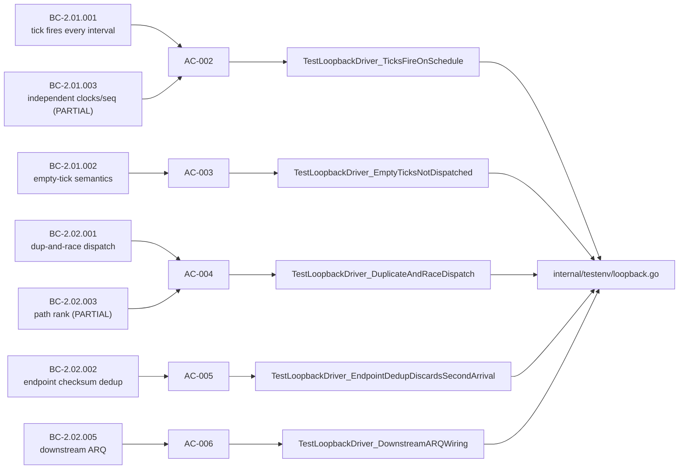
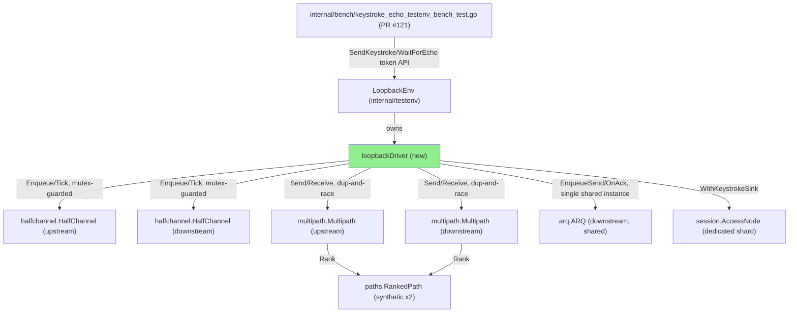
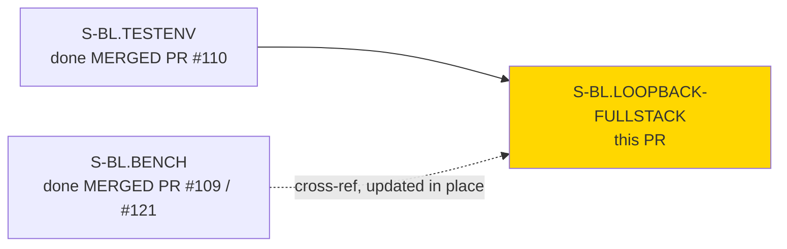

# [S-BL.LOOPBACK-FULLSTACK] Full-stack loopback testenv extension: tick-driven halfchannel + arq + multipath wiring for VP-042

**Epic:** E-1
**Mode:** feature
**Convergence:** CONVERGED after 3 adversarial passes (Step-4.5, 3/3 NITPICK_ONLY, zero product defects)

## Why

This is the first real full-stack loopback code in switchboard. It extends `internal/testenv`'s
`NewLoopback`/`LoopbackEnv` from a same-goroutine `DeliverFrame` shortcut into a tick-driven,
protocol-accurate loopback stack that actually spans `internal/halfchannel` + `internal/arq` +
`internal/multipath` + `internal/paths` — the real subsystems VP-042 (keystroke-to-echo p99 ≤ 100ms)
is supposed to measure. Before this story, the only VP-042 evidence on record (`S-BL.BENCH`, PR #109)
was an honest but admittedly inadequate lower bound: an in-process echo shortcut bypassing tick
scheduling, ARQ bookkeeping, and multipath dispatch entirely. VP-042's own changelog flagged the real
lock as "deferred to a testenv-integrated measurement post S-BL.TESTENV." This PR is that measurement.

It's worth merging now because it unblocks measured, harness-delivered latency evidence for the rest
of the -blue data-plane work, and because the risk that made this story an 8-pointer — committing to
the `arq.OnAck` call-contract topology (AC-001) — was resolved as a pre-implementation gate back on
2026-07-12 (verdict REVISED: a single shared `*arq.ARQ` instance, not the two-instance shape the
original design sketch showed) rather than discovered mid-implementation. The result: Step-4.5
adversarial convergence closed at 3/3 NITPICK_ONLY with **zero product defects**, and the VP-042
harness run this story ships captured **p99 = 52.04ms** against the **100ms NFR-001 ceiling** — a real
number from the real path, not a shortcut. All 16 in-scope acceptance criteria (AC-002..AC-017; AC-001
is a discharged pre-implementation gate with no runtime test of its own) are each demonstrated by a
passing `go test -race` run, with VHS terminal recordings + an evidence report committed under
`docs/demo-evidence/` (tape sources only, per POL-004 — no rendered binaries).

## Blast Radius

**1. Operator-visible surfaces touched:**

None. This story adds `internal/testenv`-only test/benchmark harness code (a new unexported
`loopbackDriver` type, new `LoopbackEnv` methods) plus `docs/demo-evidence/**`. No CLI flags,
`--help`/`--version` output, config-file schema, error taxonomy, log format, or wire-protocol frame
layout reaches any operator-visible surface. `internal/bench/keystroke_echo_testenv_bench_test.go` is
updated in place to the new token-based API but is itself `//go:build integration`-tagged test-only
code, never shipped in a release binary.

**2. Silent-failure risk:**

Low, and the classes we identified are each unit-covered. The new `loopbackDriver` duplicates
`session.AccessNode`/`Publisher`/`SessionAuth` construction rather than reusing `env.defaultShard`;
`AC-007`'s `TestSessionAccessNode_NoSetSinkMethod` reflection guard exists specifically to catch the
regression class "someone adds a `SetSink` escape hatch to production `session.AccessNode` to make
that duplication easier" — a regression no other existing test would catch. Every other
concurrency/error-surfacing invariant this story introduces (per-direction `HalfChannel` mutex,
upstream/downstream `failLoud`) has a dedicated `-race`-covered regression test (AC-015, AC-016,
AC-017). No production request path is touched, so there is no silent-failure surface beyond the
harness itself.

**3. Smoke gate touched:**

No. `test/smoke/invariants.sh` guards operator-visible CLI/binary behavior; this story touches none
of that surface (test-harness/library code only), so no new `INV-*` sentinel is needed.

## Scope

- New unexported `loopbackDriver` type inside `internal/testenv`, owned by `LoopbackEnv`, with its own
  dedicated `Publisher`/`SessionAuth`/`AccessNode` triple (`WithKeystrokeSink`) — never touches
  `env.defaultShard` and adds no `SetSink` escape hatch to production `session.AccessNode`.
- Upstream and downstream ticker goroutines drive `halfchannel.HalfChannel.Tick()` on independently
  configured intervals (`cfg.TickIntervalUpstream`/`TickIntervalDownstream`), each protected by its own
  mutex (`upstreamHCMu`/`downstreamHCMu`) for safe concurrent `Enqueue`+`Tick`.
- Every tick's data frame is dispatched over two synthetic `paths.RankedPath`s via `multipath.Send`
  (duplicate-and-race dispatch), with endpoint checksum dedup on receive.
- Downstream ARQ (`EnqueueSend` + `OnAck`) wired to a **single shared `*arq.ARQ` instance** per the
  AC-001-discharged call contract — the structural fix required after the original two-instance sketch
  was found to make every `OnAck` call return `(nil, nil)` forever.
- A token-based `RoundTrip` API (`SendKeystroke`/`WaitForEcho`) replaces the prior two-call
  `env.SendKeystroke`/`env.WaitForEcho` shape, isolating concurrent/stale round trips and fixing an
  `Env.CollectFrames` accumulation bug (Q5).
- Upstream and downstream delivery errors surface loud (`driver.failLoud`) in-place at their true call
  sites, never masked by `multipath.Send`'s sent-if-any-path-succeeds return semantics.
- The already-merged `internal/bench/keystroke_echo_testenv_bench_test.go` (PR #121, `4c276d9`,
  `//go:build integration`) is updated in place to the new token-based API and re-run for evidence.
- ARCH-08 v2.13's PROSPECTIVE §6.5 pos-23 import-set amendment
  (`{admission, drain, frame, outerassembler, session, upstreamdial}` →
  `{admission, arq, drain, frame, halfchannel, multipath, outerassembler, paths, session, upstreamdial}`)
  becomes final at this story's merge.

## Commit shape — frozen implementation + two docs-only commits

`HEAD` (`faf4952`) = the frozen implementation at `235bb5a` (Step-4.5 CONVERGED 3/3 NITPICK_ONLY, zero
product defects) **plus two docs-only commits**: (1) per-AC VHS demo evidence
(`docs/demo-evidence/S-BL.LOOPBACK-FULLSTACK/**`, 16 `.tape` files + `evidence-report.md`), and (2) a
review-cycle-1 factual correction to `evidence-report.md`'s AC-015 test description. No implementation
code has changed between the convergence SHA and `HEAD` — verified via
`git diff --name-only 235bb5a..HEAD` (docs/demo-evidence/** only, both commits).

## Behavioral Contract → AC → Test coverage

| BC | Subject | AC(s) | Disposition |
|----|---------|-------|-------------|
| BC-2.01.001 | Timeslice clock fires every tick regardless of data availability | AC-002 | Discharged (harness-scope) |
| BC-2.01.002 | Empty-tick frame semantics | AC-003 | Discharged (partial, harness-scope — not wire-dispatched, Non-Goals) |
| BC-2.01.003 | Independent upstream/downstream half-channel clocks + sequence spaces | AC-002 | Discharged (partial, harness-scope — clock/interval independence test-exercised; sequence-space independence by construction) |
| BC-2.02.001 | Duplicate-and-race dispatch over two fastest paths | AC-004 | Discharged |
| BC-2.02.002 | Endpoint checksum-only dedup | AC-005 | Discharged |
| BC-2.02.003 | Per-path RTT/loss tracked via keep-alive probes; paths ranked | AC-004 | Discharged (partial, harness-scope — `paths.Rank()` exercised by construction; probe-driven RTT/loss tracking out of scope) |
| BC-2.02.005 | Downstream ARQ (piggybacked ACK/SACK) | AC-006 | Discharged (downstream leg only; upstream ARQ out of scope per Q1/ARCH-03) |
| VP-042 | Keystroke-to-echo p99 ≤ 100ms | AC-013 | Harness delivered, NOT locked — p99 = 52.04ms measured; `verification_lock` flip is a separate subsequent act |

Plus 9 harness-integrity ACs guarding the implementation itself: AC-007 (dedicated shard, no
`SetSink`), AC-008 (RoundTrip token isolation), AC-009 (no leak/block on timeout), AC-010 (path
tracker active without probe), AC-011 (non-blocking pending-map diagnostic), AC-012 (ticker goroutine
join on Close), AC-014 (regression guard — round trip completes on shared ARQ instance), AC-015
(race-clean under concurrent send/echo), AC-016/AC-017 (downstream/upstream errors surface loud).

AC-001 (the `arq.OnAck` call-contract sign-off gate) was **DISCHARGED at the spec level on 2026-07-12**
— a pre-implementation design gate, not a runtime behavior with its own test; regression-guarded
indirectly by AC-006/AC-014/AC-016.

## Spec Traceability



---

## Architecture Changes



## Story Dependencies



---

## Test Evidence

### Coverage Summary

Full `internal/testenv` suite (loopback tests + pre-existing suite), run under `-race`: **PASS, exit 0,
1.820s**, 19 loopback-related test functions plus the full pre-existing `testenv`/`multicast_loopback`
suite, zero regressions.

| AC | Test(s) | Result |
|----|---------|--------|
| AC-002 | `TestNewLoopback_RejectsOutOfBoundsTickInterval`, `TestLoopbackDriver_TicksFireOnSchedule` | PASS |
| AC-003 | `TestLoopbackDriver_EmptyTicksNotDispatched` | PASS |
| AC-004 | `TestLoopbackDriver_DuplicateAndRaceDispatch` | PASS |
| AC-005 | `TestLoopbackDriver_EndpointDedupDiscardsSecondArrival` | PASS |
| AC-006 | `TestLoopbackDriver_DownstreamARQWiring` | PASS |
| AC-007 | `TestLoopbackDriver_DedicatedShard_NoDefaultShardMutation`, `TestSessionAccessNode_NoSetSinkMethod` | PASS |
| AC-008 | `TestLoopbackEnv_WaitForEcho_DoesNotConsumeOtherRoundTrips`, `TestLoopbackEnv_WaitForEcho_IgnoresStaleCollectFramesBuffer` | PASS |
| AC-009 | `TestLoopbackEnv_WaitForEcho_TimeoutThenLateArrival_NoLeak` | PASS |
| AC-010 | `TestNewLoopbackPaths_TrackersActiveWithoutProbe` | PASS |
| AC-011 | `TestLoopbackEnv_Cleanup_DiagnosticOnPendingLeak`, `TestLoopbackEnv_Cleanup_SilentWhenDrained` | PASS |
| AC-012 | `TestLoopbackEnv_TickerGoroutines_JoinOnClose` | PASS |
| AC-013 | compile-gate + `BenchmarkKeystrokeToEcho_P99` (integration-tagged) | PASS |
| AC-014 | `TestLoopbackEnv_RoundTripCompletes_SingleSharedARQInstance` | PASS |
| AC-015 | `TestLoopbackDriver_NoRaceUnderConcurrentSendEcho` (8 concurrent goroutines, each a full `SendKeystroke`+`WaitForEcho` round trip, `-race`) | PASS |
| AC-016 | `TestLoopbackDriver_OnAckError_SurfacesLoud` | PASS |
| AC-017 | `TestLoopbackDriver_UpstreamDeliveryError_SurfacesLoud` | PASS |

**All 16 in-scope ACs: PASS.** AC-001 discharged at spec level, no runtime test.

### VP-042 Benchmark (harness-delivered evidence, not a `verification_lock` flip)

```
$ go test -tags integration -run '^$' -bench 'KeystrokeToEcho' -benchtime 1x -count=1 ./internal/bench/
BenchmarkKeystrokeToEcho_P99-8   	       1	25002084041 ns/op	        52.04 p99_rtt_ms
PASS
```

**p99 = 52.04ms, under the VP-042 / NFR-001 100ms ceiling.** The separate `verification_lock` flip is
explicitly out of this story's scope (a subsequent act).

## Demo Evidence

`docs/demo-evidence/S-BL.LOOPBACK-FULLSTACK/` — 16 `.tape` files (one per in-scope AC) +
`evidence-report.md`. Each tape runs the real `go test -v -race -run <pattern>` command against
`internal/testenv` on camera and shows `PASS`. Per POL-004, only `.tape` sources and the report are
committed; rendered `.gif`/`.webm` are gitignored and regenerate locally via
`vhs docs/demo-evidence/S-BL.LOOPBACK-FULLSTACK/<file>.tape`.

---

## Holdout Evaluation

N/A — evaluated at wave gate.

---

## Adversarial Review

Step-4.5 adversarial convergence: **3/3 consecutive passes (A/B/C) NITPICK_ONLY, zero product
defects**, converged at `235bb5a`. No implementation code has changed since convergence (this PR's
delta beyond `235bb5a` is two docs-only demo-evidence commits).

**PR-review convergence (fresh-eyes pr-reviewer, separate from Step-4.5):**

| Cycle | Findings | Blocking | Suggestion | Nit | Fixed | Remaining |
|-------|----------|----------|-----------|-----|-------|-----------|
| 1 | 3 | 1 | 1 | 1 | 3 | 0 |
| 2 | 1 (new) | 0 | 0 | 1 | n/a | 0 |

Cycle 1: F1 (BLOCKING, PR body missing required `## Blast Radius` section) — fixed via PR body edit.
F2 (SUGGESTION, evidence-report.md AC-015 description factually wrong) — fixed via commit `faf4952`.
F3 (NIT, Pre-Merge Checklist didn't name Blast Radius check) — fixed via the same PR body edit.
Cycle 2: all three fixes independently re-verified against live git/CI state. One new non-blocking
NIT (N1 — two Blast Radius headings, harmless redundancy). **Verdict: CONVERGED, APPROVE-equivalent.**

---

## Security Review

**CLEAN — no CRITICAL/HIGH/MEDIUM/LOW findings.** Reviewed the actual diff against `origin/develop`:
`internal/testenv/loopback.go` (579 new lines), the `internal/testenv/testenv.go` diff,
`internal/testenv/loopback_test.go` (976 lines, 18 tests), the `internal/bench` bench-file diff, and
`docs/demo-evidence/**` (VHS tape scripts — no binaries/secrets).

Four focus areas specifically reviewed:
1. **Dedicated AccessNode/Publisher/SessionAuth triple** — real, fully-enforcing auth (not stubbed),
   structurally identical to the existing per-VP shard pattern; provably unreachable from production
   (`internal/testenv` has zero non-test importers). `AccessNode`'s default sink fails closed
   (`ErrNoKeystrokeSink`) per repo convention; the loopback driver installs a real sink, no bypass.
2. **Per-direction halfchannel mutexes** — every `upstreamHC`/`downstreamHC` call site correctly
   guarded, no bypass; fault-injection tests (AC-016/AC-017) never run a ticker goroutine concurrently
   with their manual-tick calls, so the underlying hazard is never triggered by this harness;
   `arq.ARQ`'s single-writer contract holds; no lock-ordering deadlock cycle between `sinkMu` and
   `downstreamHCMu`.
3. **RoundTrip token / `driver.pending` map** — no collision (monotonic atomic counter, not a security
   token), no leak (AC-011 diagnostic + AC-009/AC-017 tests verify drain), growth bounded by
   test/bench call volume only (no untrusted input reaches this code).
4. **Bench file update** — mechanical API-shape change (old two-call shape → new token-based
   `RoundTrip` API), no new security logic.

Two INFO-level notes only, both non-blocking: a shared `zeroSACK` package var (safe — passed by
value) and a favorable mention of the `SetSink`-absence reflection guard (AC-007). Nothing requires
a code fix before merge from a security standpoint.

---

## Risk Assessment & Deployment

### Blast Radius (repeated in narrative form here per the template's Risk Assessment slot; canonical declaration is the labeled `## Blast Radius` section above)
- **Systems affected:** `internal/testenv` only (test-harness/library code — `NewLoopback`,
  `LoopbackEnv`, new unexported `loopbackDriver`) plus one in-place update to the already-merged,
  `//go:build integration`-tagged `internal/bench/keystroke_echo_testenv_bench_test.go`. No production
  request path is touched; `session.AccessNode` gains no new mutation surface (`SetSink` explicitly
  NOT added — guarded by `TestSessionAccessNode_NoSetSinkMethod`).
- **User impact:** none — this is test/benchmark infrastructure, not shipped runtime behavior.
- **Data impact:** none.
- **Risk Level:** LOW.

### Performance Impact

| Metric | Value | Threshold | Status |
|--------|-------|-----------|--------|
| VP-042 keystroke-to-echo p99 | 52.04ms | ≤ 100ms (NFR-001) | OK |

---

## AI Pipeline Metadata

Pipeline mode: feature. Phase 3 (TDD implementation) reached Step-4.5 adversarial convergence
(3/3 NITPICK_ONLY) prior to this PR; Phase 4 (holdout) and Phase 6 (formal hardening) are evaluated at
their respective wave/phase gates, not per-PR.

---

## Pre-Merge Checklist

- [x] All CI status checks passing (`Quality Gate`, `Blast Radius / Declaration present`, CodeQL,
      Analyze (go), dependency-review, Harden-Runner)
- [x] No implementation changes since Step-4.5 convergence (docs-only demo-evidence commits only)
- [x] No critical/high security findings unresolved (security review CLEAN, two INFO-only notes)
- [x] Rollback: `git revert` of the merge commit — no feature flag, no production surface
- [x] pr-reviewer convergence recorded (COMMENTED reviews cycles 1+2 + this disposition — single-identity
      constraint, `reviewDecision` is always empty on this repo, see drbothen/vsdd-factory#626)
- [ ] All dependency PRs merged (S-BL.TESTENV already MERGED per story frontmatter `depends_on: []`,
      not blocking — pr-manager step 7 dependency check pending final confirmation)
