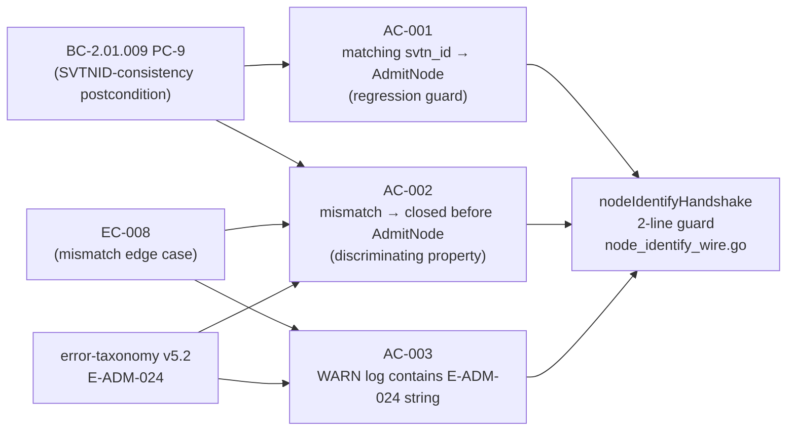
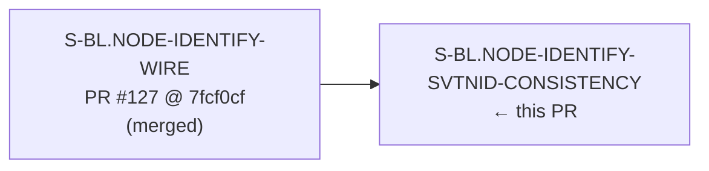
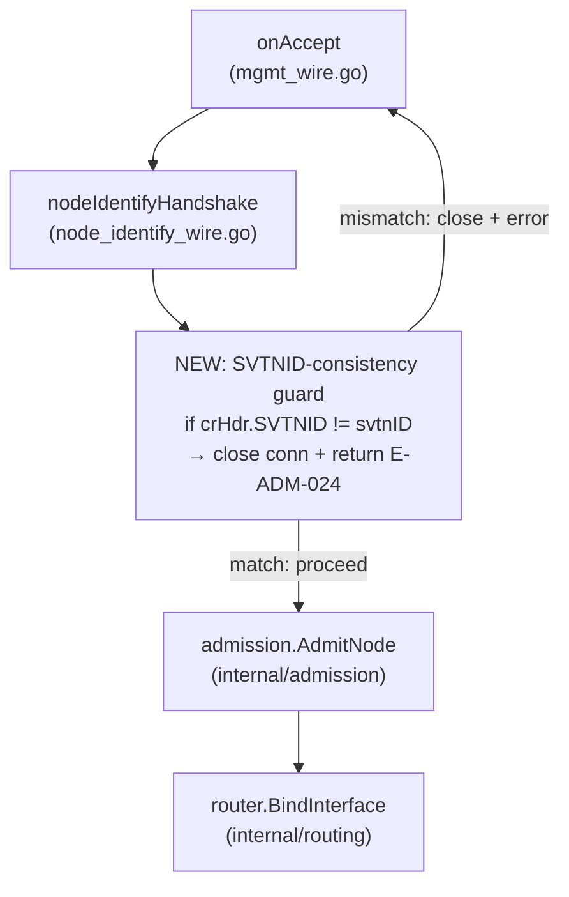

## Why

The post-merge security review of PR #127 (`S-BL.NODE-IDENTIFY-WIRE`) identified a real gap in the three-message NODE_IDENTIFY handshake: the router read the ChallengeResponse outer-header `svtn_id` but never verified it matched the `svtn_id` from the original NodeIdentify (message 1). A ChallengeResponse crafted with a different SVTN's identifier — but carrying a valid signature over the correct nonce — could have been silently accepted and bound under the wrong SVTN identity. That is a cross-SVTN credential substitution attack at the protocol layer.

This PR closes that gap. The guard is a minimal, additive, fail-closed check inserted at the exact point in `nodeIdentifyHandshake` where the risk lives: immediately after decoding the ChallengeResponse outer header, immediately before `admission.AdmitNode` is called. Two lines of Go, no new imports, zero impact on the valid path. The existing handshake success path (AC-001) continues to behave identically — the guard condition is false when the headers agree and execution falls through unchanged.

The error code (E-ADM-024) and canonical string (`"node_identify: ChallengeResponse svtn_id mismatch"`) are normatively registered in error-taxonomy v5.2 and BC-2.01.009 PC-9, authored 2026-07-19 as the direct specification artifact for this finding.

## What Changed

**`cmd/switchboard/node_identify_wire.go`** — 4 lines added to `nodeIdentifyHandshake`:

- After decoding the ChallengeResponse outer header (`crHdr`), before the `admission.AdmitNode` call:
  ```go
  if crHdr.SVTNID != svtnID {
      _ = conn.Close()
      return svtnID, [8]byte{}, errCRSVTNIDMismatch
  }
  ```
  where `errCRSVTNIDMismatch` is the package-level sentinel defined at `node_identify_wire.go:43`.
- The canonical E-ADM-024 error string is surfaced as a WARN log via `onAccept`'s dedicated `case errors.Is(hsErr, errCRSVTNIDMismatch):` arm (`mgmt_wire.go:718`), emitting at L724 (consistent with how classified errors E-ADM-022, E-ADM-003, E-ADM-001, etc. are each given a dedicated case arm).

**`cmd/switchboard/node_identify_wire_test.go`** — 2 new test functions for AC-002 and AC-003 (AC-001 is covered by the existing `TestNodeIdentifyHandshake_Success_BindingRecorded`):

- `TestNodeIdentifyHandshake_CRSVTNIDMismatch_ConnectionClosed_BeforeAdmitNode` — uses an admitted keyset (so AdmitNode would succeed on the matching path) and sends a mutated ChallengeResponse `svtn_id`; asserts connection closed, error message contains canonical E-ADM-024 string, and `LookupInterface` returns `(0, false)` (the discriminating proof that AdmitNode was never called).
- `TestNodeIdentifyHandshake_CRSVTNIDMismatch_WarnLogContainsE_ADM_024` — captures WARN log output on the mismatch path (AC-003 PC-1); asserts the canonical E-ADM-024 string appears via the dedicated `errCRSVTNIDMismatch` arm.
- `TestNodeIdentifyHandshake_CRSVTNIDMismatch_WarnLog_IncludesSVTNContextAndCode` — companion to the above (AC-003 PC-3); asserts the WARN log contains both the real non-zero svtn hex (e.g. `svtn=ab00…`) and the code literal `E-ADM-024`.

No changes to `internal/admission`, `internal/routing`, or any other package. No new imports.

## Spec Traceability



| BC Anchor | Clause | Story AC |
|-----------|--------|----------|
| BC-2.01.009 PC-9 | Before calling AdmitNode, router MUST verify ChallengeResponse outer-header `svtn_id` equals NodeIdentify outer-header `svtn_id`; mismatch closes connection (E-ADM-024) | AC-001 (success branch), AC-002 (mismatch branch) |
| BC-2.01.009 EC-008 | Connection closed with E-ADM-024 before AdmitNode is called | AC-002, AC-003 |
| error-taxonomy v5.2 E-ADM-024 | Canonical string: `"node_identify: ChallengeResponse svtn_id mismatch"`, WARN level | AC-002 (substring in error), AC-003 (substring in WARN log) |

## Story Dependencies



This story depends on `S-BL.NODE-IDENTIFY-WIRE` (PR #127), which delivered the `nodeIdentifyHandshake` function. No downstream stories are blocked by this PR.

## Test Evidence

### Per-AC Results (HEAD: `8b667cec58bb850cd704480d37248ea4a3b735f0`)

| AC | Test Function | Result |
|----|--------------|--------|
| AC-001 (regression: matching svtn_id proceeds to AdmitNode) | `TestNodeIdentifyHandshake_Success_BindingRecorded` | PASS (0.00s) |
| AC-002 (mismatch → closed before AdmitNode, `LookupInterface` returns `(0,false)`) | `TestNodeIdentifyHandshake_CRSVTNIDMismatch_ConnectionClosed_BeforeAdmitNode` | PASS (0.00s) |
| AC-003 PC-1 (mismatch path → WARN log contains E-ADM-024 canonical string) | `TestNodeIdentifyHandshake_CRSVTNIDMismatch_WarnLogContainsE_ADM_024` | PASS (0.05s) |
| AC-003 PC-3 (mismatch path → WARN log includes real svtn hex + E-ADM-024 code literal) | `TestNodeIdentifyHandshake_CRSVTNIDMismatch_WarnLog_IncludesSVTNContextAndCode` | PASS (0.05s) |

### Six-Gate Results

| Gate | Command | Result |
|------|---------|--------|
| Build | `go build ./...` | PASS — no errors |
| Vet | `go vet ./...` | PASS — no issues |
| Test | `go test ./... -count=1` | PASS — all tests green |
| Format | `gofumpt -l ./...` | PASS — empty output (no changes needed) |
| Lint | `golangci-lint run ./...` | PASS — 0 issues |
| Race detector | `go test -race ./cmd/switchboard/...` | PASS — no races detected |

## Demo Evidence

Location: `docs/demo-evidence/S-BL.NODE-IDENTIFY-SVTNID-CONSISTENCY/`

| Recording | AC Demonstrated |
|-----------|----------------|
| `AC-001-matching-svtnid-proceeds-to-admitnode.tape` | AC-001: matching svtn_id → guard does not fire, binding recorded |
| `AC-002-mismatched-svtnid-closed-before-admitnode.tape` | AC-002: mutated ChallengeResponse svtn_id → connection closed before AdmitNode |
| `AC-003-warn-log-eadm024.tape` | AC-003: WARN log surfaced via `onAccept` dedicated `case errors.Is(hsErr, errCRSVTNIDMismatch):` arm (`mgmt_wire.go:718`) containing canonical E-ADM-024 string |

Evidence format: VHS `.tape` scripts (headless daemon story — no CLI/TUI surface). Recorded against HEAD `8b667cec58bb850cd704480d37248ea4a3b735f0`. POL-004 compliant: no rendered binary artifacts committed.

## Architecture Changes



The guard is inserted at a single point in `nodeIdentifyHandshake`. The `onAccept` error dispatch adds a dedicated `case errors.Is(hsErr, errCRSVTNIDMismatch):` arm (`mgmt_wire.go:718`) that emits the E-ADM-024 WARN log including the real svtn context — consistent with the classified-error handling pattern used for E-ADM-022, E-ADM-003, E-ADM-001, etc.

## Blast Radius

**1. Operator-visible surfaces touched:**
The E-ADM-024 canonical error string (`"node_identify: ChallengeResponse svtn_id mismatch"`) is a new entry in error-taxonomy v5.2. Operators and monitoring tools that parse WARN logs from the switchboard daemon will see this string on a ChallengeResponse svtn_id mismatch (a new condition — previously these connections would not have been rejected at this point). The wire protocol frame layout is unchanged; no CLI flags, config schema, `--help`/`--version` banners, or `docs/getting-started.md` steps are touched.

**2. Silent-failure risk:**
None. The mismatch path returns the real `svtnID` captured from message 1 (not a zero value), so the operator WARN log for a cross-SVTN substitution attempt contains both the canonical E-ADM-024 string and the real svtn hex. This is verified by AC-003 PC-3 (`TestNodeIdentifyHandshake_CRSVTNIDMismatch_WarnLog_IncludesSVTNContextAndCode`), which asserts `svtn=ab00…` (the non-zero NodeIdentify svtnID) is present in the log. The valid path (`crHdr.SVTNID == svtnID`) is covered by the AC-001 regression test; the mismatch path is covered by AC-002 and AC-003 (PC-1 + PC-3) with discriminating assertions.

**3. Smoke gate touched:**
No new smoke invariant needed. This guard fires inside the TCP handshake before any operator-visible CLI surface or service-level behavior is reachable. The existing `test/smoke/invariants.sh` sentinels guard operator-facing flags and version banners; this change is entirely within the daemon's internal connection-accept loop. No `INV-*` entry or `docs/architecture.md §Smoke invariants` row is required.

## Holdout Evaluation

N/A — evaluated at wave gate. This story is a post-merge security hardening patch (3 pts, backlog wave). Holdout evaluation applies at the wave boundary, not per-patch story.

## Adversarial Review

N/A — evaluated at Phase 5 (adversarial convergence pass dispatched separately by the orchestrator as Step-4.5 after this PR is created). This section will be populated when the adversarial review result is available.

## Non-Goals (Explicitly Out of Scope)

- **ReadOuterFrame prealloc (LOW finding from PR #127 security review)** — separate drift item, not addressed here.
- **Per-IP rate limiting (LOW finding from PR #127 security review)** — separate drift item, not addressed here.
- **Changes to `internal/admission`** — BC-2.01.009 PC-9 is enforced at the wire layer before AdmitNode; the admission package is untouched.
- **Changes to `internal/routing`** — the guard prevents reaching `BindInterface` on the mismatch path; no routing changes needed.
- **New config fields or management RPCs** — none required.

## Security Review

**Verdict: APPROVE — no CRITICAL/HIGH findings.**

Drift item `SEC-NIDW-SVTNID-CONSISTENCY (MED)` from the post-merge review of PR #127. This PR directly resolves that finding. The two LOW findings (ReadOuterFrame prealloc, per-IP rate limit) from the original post-merge review are explicitly deferred per the Non-Goals section.

| Severity | Count | Details |
|----------|-------|---------|
| CRITICAL | 0 | — |
| HIGH | 0 | — |
| MEDIUM | 0 | — |
| LOW | 0 | — |

**OWASP A07/CWE-287 (authentication):** Addressed by this PR — the guard closes the cross-SVTN credential substitution attack vector.
**OWASP A01/CWE-20 (input validation):** Addressed — outer-header SVTNID on message 3 is now validated against the session-established value from message 1.
**CWE-208 (timing):** Not applicable — comparison operands are both public routing identifiers, not secrets.

## Risk Assessment & Deployment

- **Blast radius:** Minimal. Single function in `cmd/switchboard`, two lines added before an existing call site. No changes to any shared package.
- **Performance impact:** Negligible. One 16-byte array comparison on the hot path of an already-network-bound handshake. The comparison is branch-predicted correctly on the valid path (the overwhelming majority of handshakes have matching svtn_ids).
- **Regression risk:** Low. AC-001 is an explicit regression guard: the existing `TestNodeIdentifyHandshake_Success_BindingRecorded` test verifies the matching-svtn_id path is unaffected. All six quality gates pass with the race detector enabled.

## Traceability

| Requirement | Story AC | Test | Status |
|-------------|---------|------|--------|
| BC-2.01.009 PC-9 (success branch) | AC-001 | `TestNodeIdentifyHandshake_Success_BindingRecorded` | PASS |
| BC-2.01.009 PC-9 (mismatch branch) / EC-008 | AC-002 | `TestNodeIdentifyHandshake_CRSVTNIDMismatch_ConnectionClosed_BeforeAdmitNode` | PASS |
| BC-2.01.009 EC-008 / error-taxonomy v5.2 E-ADM-024 (PC-1) | AC-003 | `TestNodeIdentifyHandshake_CRSVTNIDMismatch_WarnLogContainsE_ADM_024` | PASS |
| BC-2.01.009 EC-008 / error-taxonomy v5.2 E-ADM-024 (PC-3) | AC-003 | `TestNodeIdentifyHandshake_CRSVTNIDMismatch_WarnLog_IncludesSVTNContextAndCode` | PASS |

## AI Pipeline Metadata

- **Pipeline mode:** greenfield (switchboard-blue)
- **Story points:** 3
- **Wave:** backlog (post-merge security hardening)
- **BC anchor:** BC-2.01.009 PC-9
- **Error taxonomy version:** v5.2 (E-ADM-024 added 2026-07-19)

## Pre-Merge Checklist

- [x] Dispatch integrity verified (HEAD SHA: `8b667cec58bb850cd704480d37248ea4a3b735f0`)
- [x] All 3 ACs green (evidence-report.md confirms CONVERGED)
- [x] Six-gate quality gates pass (build, vet, test, gofumpt, golangci-lint, race)
- [x] Demo evidence present (3 VHS tapes + evidence-report.md, POL-004 clean)
- [x] No AI attribution in PR description or commits
- [x] Dependency PR #127 merged before this PR
- [ ] CI checks passing (pending — CI kicked off on PR creation)
- [ ] Adversarial convergence pass (Step-4.5 — dispatched separately by orchestrator after PR creation)
