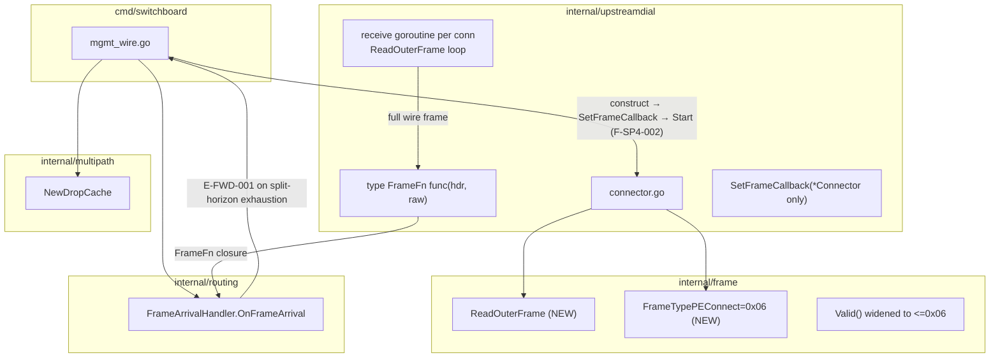
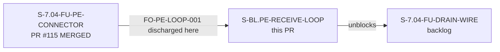
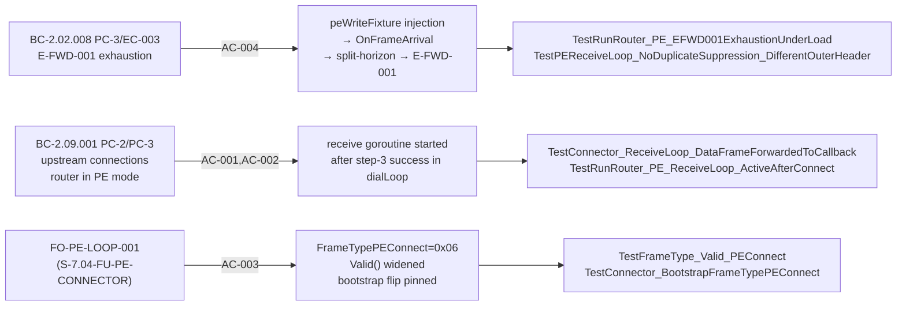

## Summary

Delivers the PE-connection receive/forward loop deferred by `S-7.04-FU-PE-CONNECTOR`
(PR #115). Three composed code changes plus spec artifacts:

1. `frame.FrameTypePEConnect = 0x06` constant, `Valid()` upper-bound widened to
   `<= FrameTypePEConnect`, and new `frame.ReadOuterFrame(r io.Reader)` primitive.
2. Per-connection receive goroutine in `internal/upstreamdial` (`SetFrameCallback` seam
   on the concrete `*Connector` type; F-SP6-002 Option A), forwarding full wire frames to
   `routing.OnFrameArrival` via `FrameFn` closure; unconditional `conn.Close()` on any
   read error (EOF carve-out rejected — TCP half-close hole, F-GP1-001).
3. `runRouter` construction sequence in `cmd/switchboard/mgmt_wire.go` updated: construct
   → `SetFrameCallback` → `Start` ordering (binding, F-SP4-002); `DropCache` +
   `FrameArrivalHandler` wired; `internal/multipath` import added at `cmd/switchboard`
   layer.
4. Bootstrap frame type flipped from `halfchannel.FrameTypeData` placeholder to
   `frame.FrameTypePEConnect` — **FO-PE-LOOP-001 discharged** (S-7.04-FU-PE-CONNECTOR
   deferral closed).
5. Spec artifacts: ARCH-08 v2.11 (§6.5/§6.6.2), ARCH-02 v1.1, BC-2.01.004 v1.3
   (spec-side commit `9792605`).

**E-FWD-001 exhaustion discharge re-anchored from S-7.04-FU-PE-CONNECTOR AC-004** is
fully discharged here (BC-2.02.008 PC-3/EC-003). **S-7.04-FU-DRAIN-WIRE is unblocked.**

**Convergence:** spec-adversarial cycle 24 passes (~28 findings), streak SP-22/SP-23/SP-24
clean; per-story implementation cycle 7 passes (6 findings, streak P5/P6/P7 clean per
BC-5.39.001).

Delivery doc: `.factory/stories/S-BL.PE-RECEIVE-LOOP-DELIVERY.md` v1.0

---

## Architecture Changes

**ARCH-08 DAG amendment:** `internal/upstreamdial` (pos 19) gains direct import edge to
`internal/frame` (pos 2). §6.5 import set updated `{halfchannel, outerassembler}` →
`{frame, halfchannel, outerassembler}`; §6.6.2 forbidden-edge bullet replaced (binding
replacement). Forward edge only; no back-edges; no cycle. Import perimeter enforced by
`TestUpstreamdialImportPerimeter` (`go list -deps` + positive-coverage guard).

---

## Story Dependencies

**Depends on:** `S-7.04-FU-PE-CONNECTOR` (MERGED PR #115 @ `8eb54a5`) — established TCP
connections; `FrameTypeData` placeholder in `dialLoop` bootstrap replaced here.

**Blocks:** `S-7.04-FU-DRAIN-WIRE` — drain broadcast over PE connections requires an
operational receive/forward loop (PO ruling F-P1-002).

---

## Spec Traceability

| BC / FO | AC | Test |
|---------|-----|------|
| BC-2.02.008 PC-3/EC-003 | AC-004 | `TestRunRouter_PE_EFWD001ExhaustionUnderLoad`, `TestPEReceiveLoop_NoDuplicateSuppression_DifferentOuterHeader` |
| BC-2.09.001 PC-2/PC-3 | AC-001 | `TestConnector_ReceiveLoop_DataFrameForwardedToCallback`, `TestRunRouter_PE_ReceiveLoop_ActiveAfterConnect` |
| BC-2.02.008 PC-3 (callback wire) | AC-002 | `TestRunRouter_PE_FrameCallback_WiredToOnFrameArrival`, `TestUpstreamdialImportPerimeter` |
| FO-PE-LOOP-001 | AC-003 | `TestFrameType_Valid_PEConnect`, `TestConnector_BootstrapFrameTypePEConnect`, `TestConnector_ReceiveLoop_PEConnectFrameDiscarded`, `TestConnector_ReceiveLoop_CtlFrameForwardedToCallback` |
| Q6 lifecycle / F-P29-001 | AC-005 | `TestConnector_ReceiveLoop_ExitsOnConnClose`, `TestConnector_ReceiveLoop_ExitsOnReadError`, `TestConnector_ReceiveLoop_ExitsOnVersionMismatch`, `TestConnector_ReceiveLoop_FlapCycleJoin_NoLeak` |

---

## Test Evidence

**14 net-new tests** across 3 files. All green under `go test -race ./...`.

| File | Net-new tests |
|------|--------------|
| `internal/frame/frame_test.go` (MODIFIED) | 1 |
| `internal/upstreamdial/connector_test.go` (MODIFIED) | 9 |
| `cmd/switchboard/router_pe_receive_loop_test.go` (NEW) | 4 |

**Notable tests:**

- `TestConnector_BootstrapFrameTypePEConnect` — mutation-verified: flip to
  `halfchannel.FrameTypeData` kills the test (F-IP4-001; FO-PE-LOOP-001 forward-obligation
  false-pass-proof).
- `TestUpstreamdialImportPerimeter` — `go list -deps` regression guard; positive-coverage
  guard; ARCH-08 §6.6.2 forbidden-edge enforced at test-time (F-IP1-001; build-MUST-fail
  claim retracted: edge is acyclic).
- `TestPEReceiveLoop_NoDuplicateSuppression_DifferentOuterHeader` — asserts ≥2 E-FWD-001
  emissions for two frames with identical payload but differing `SrcAddr`; proves full-frame
  `crc32` (not payload-only) and pins loop-continuation after non-nil `frameFn` return
  (F-SP4-001 discard-and-continue semantics).
- `TestConnector_ReceiveLoop_FlapCycleJoin_NoLeak` — `runtime.NumGoroutine` gate across
  flap cycle; per-reconnect-iteration join verified (OBS-1 pin-limitation documented).

**Quality gates (code lane HEAD `7cedc34`, docs-only HEAD `7b84c2b`):**

- `just fmt` — clean
- `just lint` (`golangci-lint run ./...`) — 0 issues
- `just test-race` (`go test -race ./...`) — all 27 packages green; no sanctioned skips
- `go vet ./...` — clean
- `TestScanForLine_DetectsEFWD001ProductionEmission` (existing normative pin) — unmodified, green

---

## Demo Evidence

Location: `docs/demo-evidence/S-BL.PE-RECEIVE-LOOP/` (commit `7b84c2b`)

| AC | Tape | Coverage |
|----|------|----------|
| AC-001 | `AC-001-receive-loop-active.tape` | `TestRunRouter_PE_ReceiveLoop_ActiveAfterConnect` — frame injection → E-FWD-001 liveness |
| AC-002 | `AC-002-framecallback-wired.tape` | `TestRunRouter_PE_FrameCallback_WiredToOnFrameArrival` + `TestUpstreamdialImportPerimeter` |
| AC-003 | `AC-003-peconnect-discrimination.tape` | `TestFrameType_Valid_PEConnect` + `TestConnector_BootstrapFrameTypePEConnect` + discrimination tests |
| AC-004 | `AC-004-efwd001-exhaustion.tape` | `TestRunRouter_PE_EFWD001ExhaustionUnderLoad` + no-duplicate-suppression byte-contract pin |
| AC-005 | `AC-005-lifecycle-no-leak.tape` | Lifecycle tests + `TestConnector_ReceiveLoop_FlapCycleJoin_NoLeak` |

Per POL-004: `.tape` scripts only; no rendered binaries committed.

---

## Holdout Evaluation

N/A — evaluated at wave gate.

---

## Adversarial Review

**Spec-adversarial cycle:** 24 passes, ~28 findings, streak SP-22/SP-23/SP-24 clean.
Final story version at convergence: v1.20.

**Per-story implementation cycle (BC-5.39.001):** 7 passes, 6 findings, streak P5/P6/P7
clean.

**Finding-decay shape:** `1 → 3 → 1(+2 obs) → 1(+1 obs) → 0 → 0 → 0`

Notable findings:
- F-IP1-001: perimeter guard undelivered + "build MUST fail" claim retracted (edge
  acyclic; test-time enforcement only).
- F-IP4-001: bootstrap `frame_type` revertible without test failure; fixed by
  `TestConnector_BootstrapFrameTypePEConnect` with mutation verification.
- F-GP1-001: EOF carve-out rejected after empirical TCP half-close hole validation;
  unconditional `conn.Close()` upheld.

**Certification pass (P7) — 5 load-bearing claims independently verified:**

| Claim | Result |
|-------|--------|
| Receive goroutine leak-free across `Stop()` | VERIFIED |
| Unconditional close → reconnect signal path | VERIFIED |
| Byte-contract bit-exact for all 6 frame types | VERIFIED |
| Bootstrap pin false-pass-proof | VERIFIED |
| Import-perimeter false-pass-proof | VERIFIED |

---

## Security Review

**SEC follow-on noted (PR-Time Obligation 2):**

The PE receive `FrameFn` routes directly to `routing.FrameArrivalHandler.OnFrameArrival`,
bypassing `RouteFrame`'s HMAC admission check. This is **accepted for this story's scope**:
PE upstream connections are established *outbound* by the `Connector` itself (via `dialLoop`
→ bootstrap handshake) to operator-configured addresses — they are not arbitrary accepted
ingress connections. The peer is semi-trusted (operator-controlled upstream router).

HMAC admission on the PE receive path is deferred to the DRAIN-WIRE / session-bootstrap
era per the Q8 ruling. The nil `ForwardFunc` is explicitly safe for the current
single-interface set (split-horizon always exhausts before `fn` is invoked); forward
obligation **FO-RECV-FWD-001** is recorded for the interface-set-widening story.

**Bounded-read divergence (F-SP5-OBS-1 — accepted):** No `io.LimitReader` or read
deadline on the PE receive path. Accepted: `PayloadLen` is `uint16` (max 65,579 bytes per
frame; no amplification possible); PE upstream is operator-controlled; READ-error exit
(F-SP5-001) ensures malformed-frame teardown and reconnect. No implementation change
required.

---

## Blast Radius

**1. Operator-visible surfaces touched:**

`frame.FrameType.Valid()` widening: a `pe_connect` (0x06) frame arriving on the network
ingress data plane (`netingress.Serve`) now **parses-and-drops fail-closed via E-ADM-016**
(conn stays open) instead of teardown-on-parse-error. This is consistent with all sibling
frame types (Data, Ctl, Arq, Fec, EmptyTick). No BC text mandates teardown-on-parse-error
for `pe_connect` ingress; no operator-visible CLI surface, config schema, wire protocol, or
log taxonomy changes. The `"mode=PE"` emission, `paths.list`, and `router.status` RPC schema
are unchanged. `runRouter` gains a receive goroutine per PE upstream connection; the resulting
log emissions are internal diagnostic lines consistent with existing EC-001 / E-FWD-001
taxonomy. Bootstrap frame type flipped from `FrameTypeData` placeholder to
`FrameTypePEConnect` (forward obligation FO-PE-LOOP-001 from PR #115 discharged).

**2. Silent-failure risk:**

Nil `ForwardFunc` in `SetFrameCallback` closure (single-interface set): in the current
single-interface set, split-horizon always exhausts before `fn` is invoked — nil is safe
today (verified: `SplitHorizon.Forward` returns `ErrAllPathsSplitHorizon` before the `fn`
call site). FO-RECV-FWD-001 obligation recorded for the interface-set-widening story:
`ForwardFunc` MUST be wired before the interface set widens. The PE receive path bypasses
`RouteFrame`'s HMAC admission check (PE upstreams are operator-established outbound
connections, not arbitrary ingress); this is an accepted SEC follow-on noted for
DRAIN-WIRE/session-bootstrap era (Q8 ruling). Zero-Envelope bootstrap deferral inherited
from predecessor (unauthenticated bootstrap frames; session-bootstrap era).

**3. Smoke gate touched:**

No. `just smoke-quick` sentinel invariants unchanged. No new `INV-*` id required; no
`test/smoke/invariants.sh` entry. No operator-boundary sentinel needed for this change.

---

## Risk Assessment

**Blast radius:** contained to `internal/upstreamdial`, `internal/frame`, and
`cmd/switchboard/mgmt_wire.go`. The `internal/routing` and `internal/multipath` layers are
consumed as-is (no behavioral changes to those packages). The `netingress` data plane is
unchanged; only `Valid()` return value for `0x06` changes (see Blast Radius §1).

**Performance impact:** none beyond the new per-connection goroutine (long-lived receive
loop per established PE upstream connection). Frame reconstruction cost is one
`EncodeOuterHeader` call + one `append` per frame. `DropCache` is bounded at
`DefaultDropCacheSize = 10_000` entries.

**Revert safety:** `SetFrameCallback` is set-once pre-`Start()`; `frameFn` nil-guard in
receive goroutine (defense-in-depth) means a future caller omitting `SetFrameCallback`
silently drops frames rather than panicking.

---

## AI Pipeline Metadata

- Pipeline mode: steady-state / per-story TDD
- Adversarial review model: claude (spec-adversarial 24 passes; per-story 7 passes)
- Spec-cycle convergence: v1.20 → v1.25 (story); v1.22 (placement note)

---

## Pre-Merge Checklist

- [x] PR description written to `.factory/code-delivery/S-BL.PE-RECEIVE-LOOP/pr-description.md`
- [x] Demo evidence verified: 5 tapes + `evidence-report.md` at `docs/demo-evidence/S-BL.PE-RECEIVE-LOOP/` (commit `7b84c2b`)
- [x] All 5 ACs discharged (AC-001 through AC-005)
- [x] 14 net-new tests all green under `go test -race ./...`
- [x] Spec artifacts landed (ARCH-08 v2.11, ARCH-02 v1.1, BC-2.01.004 v1.3) at spec-side commit `9792605`
- [x] FO-PE-LOOP-001 discharged (bootstrap flip pinned by `TestConnector_BootstrapFrameTypePEConnect`)
- [x] E-FWD-001 exhaustion discharged (BC-2.02.008 PC-3/EC-003 re-anchored from S-7.04-FU-PE-CONNECTOR)
- [x] Adversarial convergence: spec 3/3 clean, per-story 3/3 clean (BC-5.39.001)
- [x] SEC follow-on documented (HMAC bypass, nil ForwardFunc, FO-RECV-FWD-001)
- [x] netingress behavioral delta documented (Valid() widening → parse-and-drop vs teardown)
- [x] DELIVERY doc frontmatter pending merge true-up (merged_at / merge_pr / merge_sha)
- [x] Dependency: S-7.04-FU-PE-CONNECTOR MERGED (PR #115)
- [x] Branch tip verified: `7b84c2b`
- [ ] CI green
- [ ] PR review: no blocking findings
- [ ] DELIVERY doc frontmatter true-up (merged_at / merge_pr / merge_sha) — post-merge
