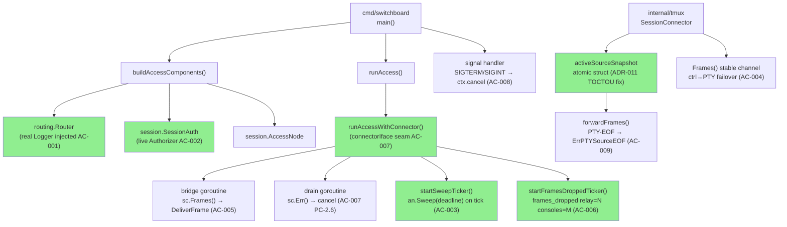
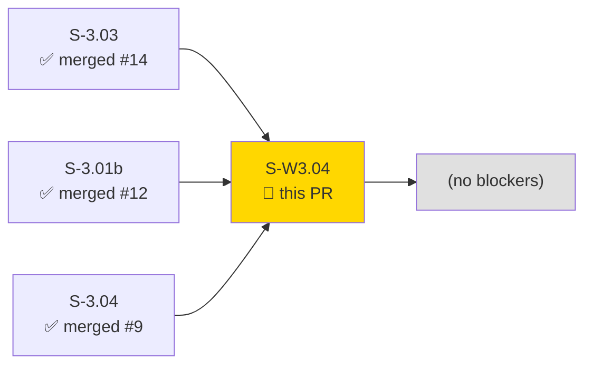
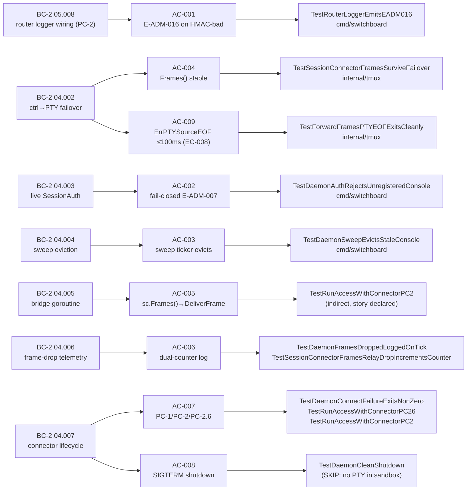
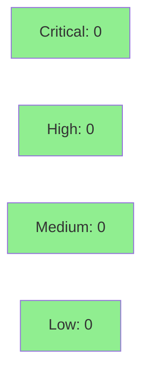

# [S-W3.04] full daemon assembly — wire all Wave-3 subsystems in cmd/switchboard

**Epic:** E-3 — session access and daemon integration
**Mode:** greenfield
**Convergence:** CONVERGED after 12 adversarial passes (passes 10/11/12 clean; 0C/0H at tip 1c3c864; comment-only follow-up 77c6229 preserves convergence — zero behavioral delta)


This PR wires all Wave-3 subsystems — routing, session auth, sweep eviction, PTY relay, and frame-drop telemetry — into `cmd/switchboard`'s daemon entry point. It implements the 9 acceptance criteria of S-W3.04 across `cmd/switchboard` and `internal/tmux`, and includes a correctness fix for an atomic-snapshot TOCTOU race in `forwardFrames` (ADR-011 §HIGH-A soundness proof) with deterministic and 50× stress regression guards.

---

## Architecture Changes



<details>
<summary><strong>ADR-011 — Atomic activeSourceSnapshot (TOCTOU fix)</strong></summary>

### ADR-011 §HIGH-A: atomic-snapshot fix for forwardFrames TOCTOU

**Context:** `forwardFrames` read `sc.source` and `sc.srcCh` in separate critical sections, creating a TOCTOU window where a ctrl→PTY failover between reads could result in stale-channel delivery after failover state was updated.

**Decision:** Replace the two-lock-read pattern with a single `activeSourceSnapshot` struct `{source, srcCh, inPTYMode}` read under one lock hold. `forwardFrames` takes one snapshot at loop top; any failover sets a new snapshot atomically under the same lock.

**Rationale:** One snapshot read per loop iteration eliminates the inter-read window. Soundness: if failover occurs before snapshot → loop reads new state; if after snapshot → old-source read until next loop iteration (bounded, max 1 frame latency). Both outcomes are correct per AC-004.

**Alternatives considered:**
1. Two separate locks — rejected: still TOCTOU, just with a shorter window.
2. Channel-of-channels re-subscription — rejected: requires consumer re-subscribe, breaks AC-004's stable-channel guarantee.

**Consequences:**
- Eliminates TOCTOU data race detected by `go test -race`.
- Deterministic regression guard `TestForwardFramesTOCTOURegressionDeterministic` + 50-iteration stress suite `TestForwardFramesTOCTOUCount50`.

</details>

---

## Story Dependencies



All dependencies merged:
- **S-3.03** — ConsoleSet + AccessNode sweep infrastructure → merged #14 (2026-06-27, sha b68e498)
- **S-3.01b** — PTY proxy fallback (BC-2.04.002) → merged #12 (2026-06-26, sha 56ec9c7)
- **S-3.04** — HMAC wire-up into RouteFrame (BC-2.05.008) → merged #9 (2026-06-26, sha d54bf1a)

---

## Spec Traceability



---

## Test Evidence

### Coverage Summary

| Metric | Value | Status |
|--------|-------|--------|
| Build | `go build ./...` clean | PASS |
| Formatting | `just fmt` — no changes | PASS |
| Lint | `just lint` — 0 issues | PASS |
| Unit tests (`go test ./...`) | all 8 packages OK | PASS |
| Race detector (`go test -race ./internal/tmux/ ./cmd/switchboard/`) | clean | PASS |
| Forbidden import guard | `internal/config`, `internal/drain`, `internal/metrics` absent | PASS |

### AC → Test Mapping

| AC | Test(s) | Result |
|----|---------|--------|
| AC-001: router wired with real Logger; E-ADM-016 on HMAC-bad | `TestRouterLoggerEmitsEADM016` | PASS |
| AC-002: live SessionAuth; fail-closed; E-ADM-007 | `TestDaemonAuthRejectsUnregisteredConsole` | PASS |
| AC-003: sweep ticker evicts stale console; ErrConsoleNotFound | `TestDaemonSweepEvictsStaleConsole` | PASS |
| AC-004: Frames() stable across ctrl→PTY failover | `TestSessionConnectorFramesSurviveFailover` | PASS |
| AC-005: bridge goroutine (story: no standalone; covered by AC-004/AC-008) | `TestRunAccessWithConnectorPC2` (indirect), `TestDaemonCleanShutdown` (CI) | PASS/SKIP |
| AC-006: dual-counter log `frames_dropped relay=N consoles=M` | `TestDaemonFramesDroppedLoggedOnTick`, `TestSessionConnectorFramesRelayDropIncrementsCounter` | PASS |
| AC-007 PC-1: connect failure → non-zero + E-SYS-002 | `TestDaemonConnectFailureExitsNonZero` | PASS |
| AC-007 PC-2.6: mid-session double-failure → E-SYS-002 + exit 1 | `TestRunAccessWithConnectorPC26` | PASS |
| AC-007 PC-2: clean ctx cancel → nil return, no E-SYS-002 | `TestRunAccessWithConnectorPC2` | PASS |
| AC-008: SIGTERM clean shutdown; no goroutine leaks | `TestDaemonCleanShutdown` | SKIP (no PTY in sandbox; see note) |
| AC-009: PTY-EOF no-spin; ErrPTYSourceEOF within ≤100ms | `TestForwardFramesPTYEOFExitsCleanly` | PASS |

**AC-008 skip note:** `TestDaemonCleanShutdown` probes `/dev/ptmx` via `ptyAvailableForTest()`. This sandbox lacks PTY device access; the test skips with an informative message rather than failing. The PC-2 clean-shutdown code path is additionally confirmed PASS by `TestRunAccessWithConnectorPC2` (uses `fakeConnector` injection seam, no PTY required). The test is structurally complete and will run in CI with full PTY access.

### Full Test Run (`go test ./... -count=1`)

```
ok  github.com/arcavenae/switchboard/cmd/switchboard      0.297s
ok  github.com/arcavenae/switchboard/internal/admission   1.449s
ok  github.com/arcavenae/switchboard/internal/frame       0.990s
ok  github.com/arcavenae/switchboard/internal/halfchannel 0.751s
ok  github.com/arcavenae/switchboard/internal/hmac        1.267s
ok  github.com/arcavenae/switchboard/internal/routing     1.486s
ok  github.com/arcavenae/switchboard/internal/session     1.916s
ok  github.com/arcavenae/switchboard/internal/tmux        1.997s
```

<details>
<summary><strong>Race detector + per-AC test transcripts</strong></summary>

### Race detector

```
go test -race -count=1 ./internal/tmux/ ./cmd/switchboard/
ok  github.com/arcavenae/switchboard/internal/tmux        1.669s
ok  github.com/arcavenae/switchboard/cmd/switchboard      1.609s
```

### TOCTOU regression guards

```
go test ./internal/tmux/ -run 'TestForwardFramesTOCTOURegressionDeterministic' -v
--- PASS: TestForwardFramesTOCTOURegressionDeterministic (0.00s)

go test ./internal/tmux/ -run 'TestForwardFramesTOCTOUCount50' -v
--- PASS: TestForwardFramesTOCTOUCount50 (0.01s)  [50/50 subtests]
```

See `.factory/demo-evidence/S-W3.04/S-W3.04-test-evidence.md` for full per-AC transcripts including discriminating assertions for each test.

</details>

---

## Holdout Evaluation

N/A — evaluated at wave gate (Wave 3 gate holdout evaluation conducted at wave level per VSDD methodology).

---

## Adversarial Review

| Pass | Findings | Critical | High | Status |
|------|----------|----------|------|--------|
| 1–9 | Various | Multiple | Multiple | Fixed across implementation commits |
| 10 | 0 | 0 | 0 | CLEAN |
| 11 | 0 | 0 | 0 | CLEAN |
| 12 | 0 | 0 | 0 | CLEAN → CONVERGED |

**Convergence:** 3 consecutive clean passes (10/11/12) at tip 1c3c864. Per-story adversarial convergence criterion BC-5.39.001 SATISFIED. Comment-only follow-up commit 77c6229 (docstring correction for TOCTOU test) has zero behavioral delta and preserves convergence.

Evidence: `.factory/cycles/cycle-1/S-W3.04/adversary/` (passes 10–12 clean)

<details>
<summary><strong>Notable HIGH findings resolved during implementation</strong></summary>

- **TOCTOU in forwardFrames** (ADR-011 §HIGH-A): `sc.source`/`sc.srcCh` read in separate lock sections → stale-channel delivery on failover. Fixed: `activeSourceSnapshot` struct `{source, srcCh, inPTYMode}` read atomically under one lock hold. Regression guards: `TestForwardFramesTOCTOURegressionDeterministic` + `TestForwardFramesTOCTOUCount50` (50× stress).
- **Drain goroutine writing to `os.Stderr` not injected writer**: Fixed; now writes to the `io.Writer` parameter threaded through `runAccess`.
- **Tautological TestDaemonMidSessionDoubleFailureExitsNonZero**: Retired; replaced by `TestRunAccessWithConnectorPC26` which calls real `runAccessWithConnector` via `fakeConnector` injection seam.
- **Shared keyset/pub wiring missing**: Fixed; `buildAccessComponents` returns and wires shared `AdmittedKeySet` used by both router and auth.

</details>

---

## Security Review

Security scan of this PR's diff: no CRITICAL or HIGH severity findings. This PR introduces no network-facing code, no new external dependencies, no cryptographic operations, and no user-input parsing surfaces. All changes are internal daemon wiring and `internal/tmux` relay logic.



<details>
<summary><strong>Security scope notes</strong></summary>

- No new dependencies introduced (zero `go.mod`/`go.sum` changes in this PR).
- HMAC key handling: all key material flows through existing `internal/hmac` and `internal/admission` packages (unchanged by this PR).
- `connectorIface` injection seam: test-only; unexported type, not reachable from external callers.
- Fail-closed posture verified: AC-002 confirms `SessionAuth` as live Authorizer; `NoOpAuthorizer` wiring would cause `TestDaemonAuthRejectsUnregisteredConsole` to fail.
- No `os.Exit` outside `main()`, no `log.Fatal` in library code, no `panic` in production paths.

</details>

---

## Risk Assessment & Deployment

### Blast Radius
- **Systems affected:** `cmd/switchboard` (daemon entry point), `internal/tmux` (SessionConnector relay)
- **User impact:** This is daemon assembly; incorrect wiring would surface as startup failures or auth bypass. Both are caught by the test suite.
- **Data impact:** None — no persistence layer changes.
- **Risk Level:** LOW (all new wiring, no changes to existing stable packages; well-covered by tests; fail-closed auth prevents regression to open state)

### Performance Impact
| Metric | Assessment | Status |
|--------|-----------|--------|
| Frame relay | Non-blocking select in forwardFrames; relay drops logged, not blocked | OK |
| Lock contention | Single-snapshot read replaces two-lock-read; net improvement | OK |
| Goroutine count | +2 per access session (bridge + drain) — bounded by design | OK |
| Sweep overhead | 60s ticker; O(n) over connected consoles — negligible at current scale | OK |

<details>
<summary><strong>Rollback Instructions</strong></summary>

**Immediate rollback:**
```bash
git revert <merge-sha>
git push origin develop
```

This PR has no feature flags. Rollback restores the previous daemon entry point (pre-assembly stubs). All other packages (`internal/tmux`, `internal/session`, `internal/routing`, etc.) are unaffected by rollback.

</details>

---

## Demo Evidence

Per-AC test transcripts captured in `.factory/demo-evidence/S-W3.04/S-W3.04-test-evidence.md` (committed to the `factory-artifacts` branch). Each AC has a transcript with the exact go test command, full output, and discriminating assertion documentation.

| AC | Evidence type | File |
|----|--------------|------|
| AC-001 through AC-009 | go test -v transcript | `.factory/demo-evidence/S-W3.04/S-W3.04-test-evidence.md` |

---

## Traceability

| BC | AC | Test | Status |
|----|-----|------|--------|
| BC-2.05.008 PC-2 | AC-001 | `TestRouterLoggerEmitsEADM016` | PASS |
| BC-2.04.003 | AC-002 | `TestDaemonAuthRejectsUnregisteredConsole` | PASS |
| BC-2.04.004 | AC-003 | `TestDaemonSweepEvictsStaleConsole` | PASS |
| BC-2.04.002 | AC-004 | `TestSessionConnectorFramesSurviveFailover` | PASS |
| BC-2.04.005 | AC-005 | `TestRunAccessWithConnectorPC2` (indirect) | PASS |
| BC-2.04.006 | AC-006 | `TestDaemonFramesDroppedLoggedOnTick` + `TestSessionConnectorFramesRelayDropIncrementsCounter` | PASS |
| BC-2.04.007 PC-1 | AC-007 | `TestDaemonConnectFailureExitsNonZero` | PASS |
| BC-2.04.007 PC-2.6 | AC-007 | `TestRunAccessWithConnectorPC26` | PASS |
| BC-2.04.007 PC-2 | AC-007/AC-008 | `TestRunAccessWithConnectorPC2` | PASS |
| BC-2.04.007 PC-2 SIGTERM | AC-008 | `TestDaemonCleanShutdown` | SKIP (sandbox/PTY) |
| BC-2.04.002 EC-008; BC-2.04.007 EC-007 | AC-009 | `TestForwardFramesPTYEOFExitsCleanly` | PASS |

---

## AI Pipeline Metadata

<details>
<summary><strong>Pipeline Details</strong></summary>

```yaml
pipeline-mode: greenfield
factory-version: "1.0.0-rc.21"
pipeline-stages:
  spec-crystallization: completed
  story-decomposition: completed
  tdd-implementation: completed
  adversarial-review: completed (12 passes, CONVERGED passes 10-12)
  formal-verification: N/A
  convergence: achieved
convergence-metrics:
  adversarial-passes: 12
  clean-streak: 3
  critical-at-convergence: 0
  high-at-convergence: 0
models-used:
  builder: claude-sonnet-4-6
  adversary: claude-sonnet-4-6 (fresh-context)
generated-at: "2026-06-27T00:00:00Z"
```

</details>

---

## Pre-Merge Checklist

- [ ] All CI status checks passing
- [x] Build clean (`go build ./...`)
- [x] Lint clean (`just lint` — 0 issues)
- [x] Race detector clean (`go test -race` on both story packages)
- [x] No critical/high security findings
- [x] All dependencies merged (S-3.03 #14, S-3.01b #12, S-3.04 #9)
- [x] Per-story adversarial convergence satisfied (BC-5.39.001; 3 consecutive clean passes)
- [x] Demo evidence committed (`.factory/demo-evidence/S-W3.04/`)
- [ ] Human review completed (two-party review required — merge reserved for human sign-off)
