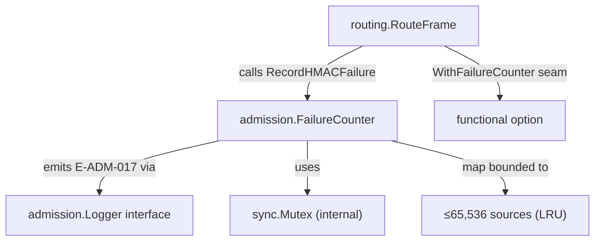
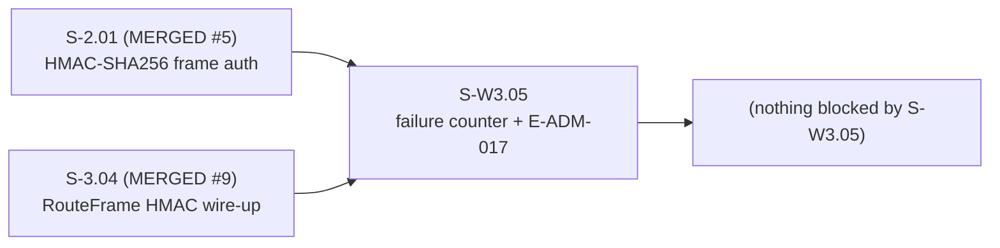
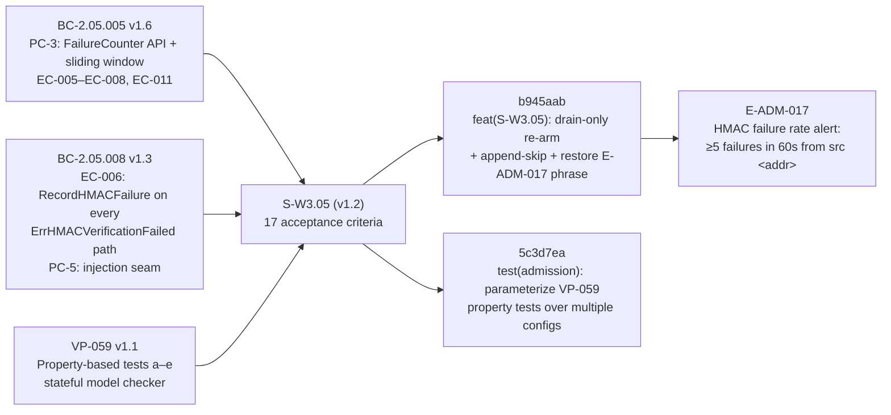

## S-W3.05: Per-Source HMAC Failure Counter and E-ADM-017 Admission Alert

**Story:** S-W3.05 — per-source HMAC failure counter and admission alert (BC-2.05.005 PC-3)
**Story spec version:** v1.2
**Epic:** E-2 / Wave 3 (P0 FIX-NOW gate blocker F-2)
**Base branch:** develop

---

## Summary

Implements `admission.FailureCounter` — a per-source sliding-window HMAC failure tracker
that emits a structured E-ADM-017 alert when any source exceeds 5 failures within a 60-second
window. Wires `FailureCounter` into `routing.RouteFrame` via a `WithFailureCounter` injection
seam, ensuring both HMAC failure paths (no forwarding entry + tag mismatch) call
`RecordHMACFailure` and trigger the alert under sustained attack.

Key behavioral properties implemented:

- Sliding-window trimming with inclusive boundary (strictly-less-than eviction)
- Drain-only re-arm hysteresis: alert fires once per threshold crossing; re-arms only when
  the window fully drains (no premature re-arm on partial drain)
- Append-skip: per-source slice capped at threshold entries to bound memory under high-rate
  attack (CWE-770 / EC-011)
- LRU-bounded source map: ≤65,536 tracked sources with dead-key eviction
- Race-safe under concurrent `RecordHMACFailure` calls (mutex-guarded)

---

## Architecture Changes

New files:
- `internal/admission/failure_counter.go` — `FailureCounter` type + `NewFailureCounter`
- `internal/admission/failure_counter_test.go` — AC-001–008, AC-010
- `internal/admission/failure_counter_adversarial_test.go` — AC-004, AC-011–016
- `internal/admission/failure_counter_property_test.go` — AC-017 (VP-059 a–e)
- `internal/routing/routing_hmac_counter_test.go` — AC-009

Modified files:
- `internal/routing/route_frame.go` — `WithFailureCounter` option + `RecordHMACFailure` calls

---

## Story Dependencies

Dependencies S-2.01 and S-3.04 are confirmed merged on `develop`.

---

## Spec Traceability

| Contract | Version | Clauses Covered |
|----------|---------|----------------|
| BC-2.05.005 | v1.6 | PC-3 (sliding window, FailureCounter), EC-005–EC-008, EC-011 (append-skip) |
| BC-2.05.008 | v1.3 | EC-006 (RecordHMACFailure on every ErrHMACVerificationFailed), PC-5 (injection seam) |
| VP-059 | v1.1 | Properties a–e; stateful model checker; 3 configs × 5 subtests |
| E-ADM-017 | error-taxonomy v2.0 | Canonical: `E-ADM-017 HMAC failure rate alert: ≥5 failures in 60s from src <addr>` |

---

## Acceptance Criteria Coverage

All 17 ACs pass. Full per-AC breakdown with test names in demo evidence.

| AC | Description | Verdict |
|----|-------------|---------|
| AC-001 | `FailureCounter` constructor fields and signature | PASS |
| AC-002 | Sliding-window trimming (stale entries evicted, inclusive boundary) | PASS |
| AC-003 | E-ADM-017 emitted at threshold (exactly once per crossing) | PASS |
| AC-004 | Hysteresis/drain-only re-arm; no premature re-arm; re-arms after full drain | PASS |
| AC-005 | Hysteresis: re-fires after window fully expires | PASS |
| AC-006 | Below threshold (N−1 failures): no alert | PASS |
| AC-007 | Multi-source isolation: two srcAddrs counted independently | PASS |
| AC-008 | Boundary entry kept (strictly-less-than trim) | PASS |
| AC-009 | `WithFailureCounter` injection seam; both failure paths call `RecordHMACFailure`; success: 0 calls | PASS |
| AC-010 | Concurrent calls race-safe; `Timestamps()` returns copy | PASS |
| AC-011 | Memory cap: ≤65,536 tracked sources (LRU eviction) | PASS |
| AC-012 | Dead-key eviction after drain; `firedAt` cleared | PASS |
| AC-013 | Constructor panics on invalid args (`threshold<1` or `windowDuration≤0`) | PASS |
| AC-014 | Sustained attack re-fires periodically (not permanently silent) | PASS |
| AC-015 | E-ADM-017 canonical format: both "E-ADM-017" and "HMAC failure rate alert:" present | PASS |
| AC-016 | Append-skip: per-source slice bounded at threshold under high-rate attack | PASS |
| AC-017 | VP-059 v1.1 property-based tests: properties a–e, stateful model, 3 configs | PASS |

---

## Test Evidence

**Pre-push verification (branch tip 5c3d7ea; SEC-001 fix at f6038d2, re-verified):**

| Check | Result |
|-------|--------|
| `just fmt` | Clean (no diff) |
| `just lint` (golangci-lint) | 0 issues |
| `just test` (`go test ./... -v`) | 8/8 packages PASS |
| `go test -race -count=1 ./internal/admission/ ./internal/routing/` | PASS (11.2s + 1.7s, race-free) |

**Test suites:**

| File | Package | ACs |
|------|---------|-----|
| `internal/admission/failure_counter_test.go` | `admission_test` | AC-001–008, AC-010 |
| `internal/admission/failure_counter_adversarial_test.go` | `admission_test` | AC-004, AC-011–016 |
| `internal/admission/failure_counter_property_test.go` | `admission_test` | AC-017 (VP-059 a–e) |
| `internal/routing/routing_hmac_counter_test.go` | `routing_test` | AC-009 |

---

## Demo Evidence

**Evidence type:** Go test transcripts (project standing preference)
**Location:** `.factory/demo-evidence/S-W3.05-demo-evidence.md`
**Coverage:** 17/17 ACs verified, race-clean

Notable transcript excerpts:

- `TestFailureCounter_EmitsEADM017AtThreshold` — canonical E-ADM-017 phrase confirmed: `"E-ADM-017 HMAC failure rate alert: ≥5 failures in 60s from src deadbeef01020304"`
- `TestRouteFrame_FiveConsecutiveFailures_TriggersEADM017` — end-to-end RouteFrame → FailureCounter → E-ADM-017 path verified
- `TestFailureCounter_ConcurrentCallsRaceSafe` — 10 goroutines, fire-once confirmed, `go test -race` passes
- `TestFailureCounter_HighRateAttackBoundedSlice` — 10,000 extra calls; `len(Timestamps)==5` (append-skip bound holds)
- `TestFailureCounter_PropertiesABCD` / `PropertyE_MemoryBound` — VP-059 stateful model, 3 configs, 66,536 adversarial sources

---

## Adversarial Convergence

**Status: CONVERGED** — 3 consecutive clean passes (07, 08, 09) on 2026-06-27.
Zero CRITICAL findings. Zero HIGH findings across all three passes.

| Pass | Lens | C | H | M | L | Verdict |
|------|------|---|---|---|---|---------|
| 07 | spec-conformance + anti-tautology | 0 | 0 | 0 | 3 | CONVERGED |
| 08 | concurrency + memory/resource-bounds | 0 | 0 | 0 | 2 | CONVERGED |
| 09 | integration + RouteFrame wiring | 0 | 0 | 0 | 3 | CONVERGED |

Passes 01–06 were NOT_CONVERGED. Blocking findings resolved in fix loop (b945aab, 5c3d7ea).
Full convergence record: `.factory/cycles/cycle-1/S-W3.05/adversary/CONVERGENCE.md`

**Deferred LOW findings** (post-wave cosmetic, none blocking):
- Iteration count comment (10k vs 1M placeholder)
- Sub-second window precision (outside configured range)
- Re-arm partial redundancy note (harmless)
- Stale TrackedSourceCount() comment in test
- Routing e2e full-canonical-phrase assertion via RouteFrame (folded into S-W3.04)
- Stale Red-Gate test comment (pre-v1.6 fired map[string]bool)

---

## Security Review

Security review completed on PR diff. One HIGH finding (SEC-001) was identified and fixed
before merge in commit f6038d2. No CRITICAL findings. All other findings are MEDIUM or below
and advisory (see full report in review).

**SEC-001 (HIGH — FIXED f6038d2):** Nil logger guard added in `NewFailureCounter`. Previously,
a nil logger deferred the panic to first alert emission (non-deterministic). Now panics
immediately at construction, consistent with the existing guards for `threshold` and
`windowDuration`. Test `TestNewFailureCounter_PanicsOnNilLogger` added.

Additional security-class items addressed by implementation:

- **CWE-770 (uncontrolled resource consumption):** Per-source slice capped at `threshold`
  entries (append-skip, AC-016). LRU-bounded source map ≤65,536 entries (AC-011).
- **CWE-362 (concurrent access):** All internal state guarded by `sync.Mutex`.
  `Timestamps()` returns a copy — no internal pointer leak (AC-010).
- **CWE-117 (log injection):** `srcAddr` is always `fmt.Sprintf("%x", hdr.SrcAddr)` at the
  current call site — 16-char lowercase hex, no control characters possible.
- **Memory bounds under adversarial load:** VP-059 property E verifies 66,536 adversarial
  sources stay within `capacity + threshold` bound (AC-017).

---

## Risk Assessment

| Dimension | Assessment |
|-----------|-----------|
| Blast radius | `internal/admission` (new type) + `internal/routing` (additive functional option) — no breaking changes to existing callers |
| Performance impact | One mutex lock per HMAC failure (infrequent hot path); append-skip bounds worst-case allocation |
| Rollback | `WithFailureCounter` is opt-in; omitting the option restores previous behavior exactly |

---

## Pre-Merge Checklist

- [x] fmt clean
- [x] lint 0 issues
- [x] all tests pass
- [x] race detector clean (admission + routing)
- [x] demo evidence: 17/17 ACs, test transcripts
- [x] adversarial convergence: 3 clean passes, zero CRITICAL/HIGH
- [x] dependencies merged: S-2.01 (#5), S-3.04 (#9)
- [x] no AI attribution in commits or PR body
- [x] all commits SSH-signed
- [ ] PR review approved
- [ ] CI checks passing
