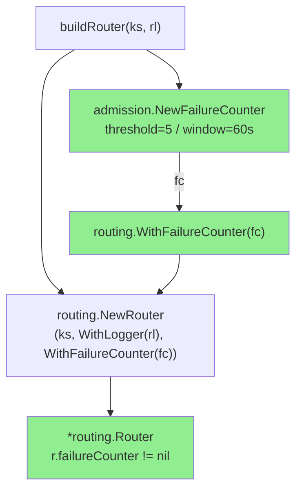
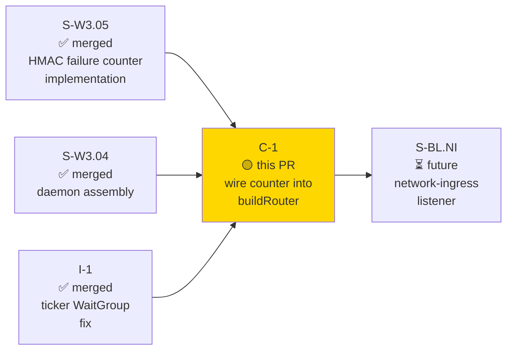
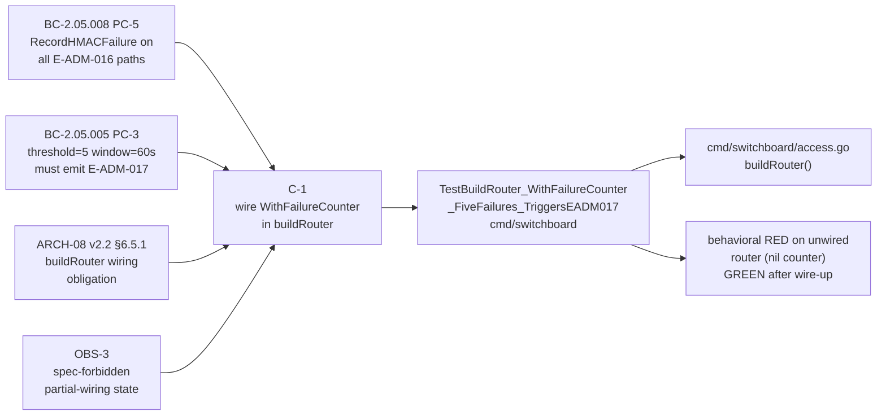
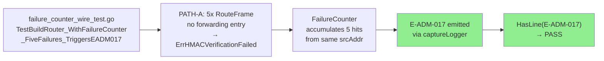
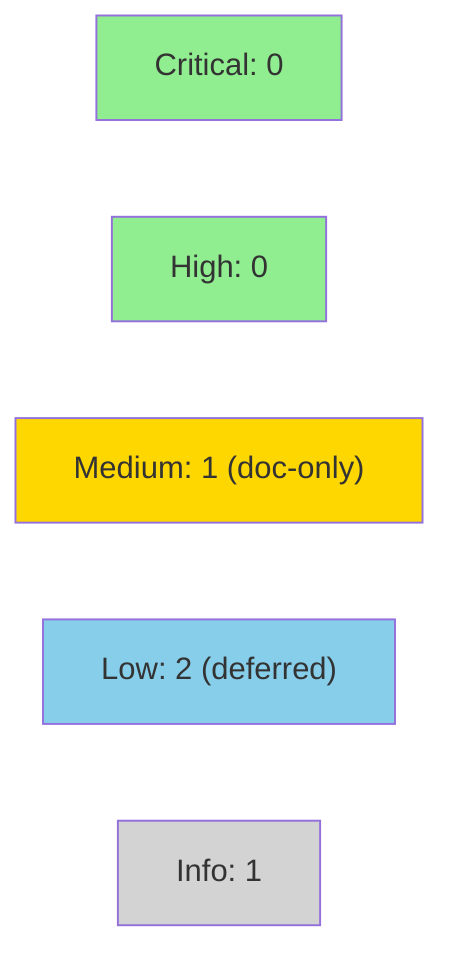

# [C-1] wire HMAC failure counter into buildRouter

**Epic:** Wave 3 — access-node daemon hardening
**Mode:** feature
**Convergence:** CONVERGED — TDD red→green, lint 0, race clean, orchestrator-verified


`buildRouter` in `cmd/switchboard/access.go` now constructs
`admission.NewFailureCounter(threshold=5, window=60s)` and wires it into the
router via `routing.WithFailureCounter`. This resolves the spec-forbidden
partial-wiring state flagged by ARCH-08 v2.2 §6.5.1 (tracked deferral
C-1-W3P1-defer) and clears OBS-3. The live network-ingress LISTENER that feeds
`RouteFrame` from the network remains deferred to story S-BL.NI; the counter
itself is no longer deferred.

---

## Architecture Changes



<details>
<summary><strong>Architecture Decision Record</strong></summary>

### ADR: Wire FailureCounter at daemon construction (not deferred to S-BL.NI)

**Context:** ARCH-08 v2.2 §6.5.1 lists `WithFailureCounter` as a required
wiring obligation for `buildRouter`. The Wave 3 Pass 1 work tracked a deferral
(`C-1-W3P1-defer`) on the premise that the network-ingress listener drove the
counter's utility. The Wave 3 adversarial pass identified this as OBS-3: the
spec-forbidden partial-wiring state (router constructed without `failureCounter`)
must be closed even before the ingress listener lands.

**Decision:** Wire `admission.NewFailureCounter(5, 60s, rl)` inside `buildRouter`
now. The counter is dormant-but-present in Wave 3 (no live frames arrive via the
network ingress path yet). The listener defers to S-BL.NI remain unchanged.

**Rationale:** ARCH-08 v2.2 §6.5.1 is unambiguous. The architect ruling confirmed
that the spec obligation covers the wiring, not the ingress path. Leaving
`r.failureCounter == nil` violates BC-2.05.008 PC-5 on any code path that calls
`RouteFrame`.

**Alternatives Considered:**
1. Continue deferring to S-BL.NI — rejected because it leaves the spec-forbidden
   partial-wiring state open and violates ARCH-08 §6.5.1.
2. Add a feature flag — rejected because the counter has no observable side effects
   in Wave 3 (no ingress traffic) and no flag infrastructure exists yet.

**Consequences:**
- Clears OBS-3; closes tracked deferral C-1-W3P1-defer.
- Counter is dormant until S-BL.NI lands; no behavioural regression risk.
- `stdLogger` satisfies both `routing.Logger` and `admission.Logger` (both are
  `interface{ Log(string) }`), so no new types are required.

</details>

---

## Story Dependencies



---

## Spec Traceability



---

## Test Evidence

### Coverage Summary

| Metric | Value | Status |
|--------|-------|--------|
| Unit tests (cmd/switchboard) | all pass | PASS |
| Race detector | clean | PASS |
| Lint (golangci-lint) | 0 issues | PASS |
| Format (gofumpt) | clean | PASS |
| TDD red→green | behavioral (non-tautological) | PASS |

### TDD Red→Green Validation

The test `TestBuildRouter_WithFailureCounter_FiveFailures_TriggersEADM017` is
behaviorally discriminating (non-tautological): it calls `buildAccessComponents`
— the same production construction path the daemon uses — and does NOT construct
its own router with `WithFailureCounter`.

**RED** (before this PR): `buildRouter` calls `routing.NewRouter(ks,
routing.WithLogger(rl))` only; `r.failureCounter == nil`;
`RecordHMACFailure` is never called; `E-ADM-017` never fires; assertion fails.

**GREEN** (this PR): `buildRouter` constructs
`admission.NewFailureCounter(5, 60*time.Second, rl)` and passes it via
`routing.WithFailureCounter(fc)`; after 5 PATH-A failures the counter emits
`E-ADM-017` via the injected logger; `captureLogger.HasLine("E-ADM-017")` is
true.

### Test Flow



<details>
<summary><strong>Detailed Test Results</strong></summary>

### New Tests (This PR)

| Test | File | Result |
|------|------|--------|
| `TestBuildRouter_WithFailureCounter_FiveFailures_TriggersEADM017` | `cmd/switchboard/failure_counter_wire_test.go` | PASS |

### Seam Used

`buildAccessComponents` accepts a `routerLogger routing.Logger` parameter
(introduced by FIX 2 for AC-001). `captureLogger` satisfies both
`routing.Logger` and `admission.Logger` (both are `interface{ Log(string) }`),
so the same instance captures both `E-ADM-016` and `E-ADM-017` lines.

### Test Strategy

PATH-A (no forwarding-table entry for source SVTN/address pair) produces
`ErrHMACVerificationFailed` without requiring a valid HMAC key. A fixed
`[8]byte` source address is used for all 5 calls so `FailureCounter`
accumulates 5 counts under the same key. All calls are synchronous and
complete well within the 60-second window — no sleep or clock injection needed.

</details>

---

## Holdout Evaluation

N/A — evaluated at wave gate (Wave 3 wave-gate complete).

---

## Adversarial Review

N/A — evaluated at Phase 5 (Wave 3 adversarial pass complete). OBS-3 (the
partial-wiring finding that drives this change) was the direct output of that
pass.

---

## Security Review



**Verdict: APPROVED.** No CRITICAL or HIGH findings.

<details>
<summary><strong>Security Scan Details</strong></summary>

| ID | Severity | CWE | Title | Action |
|----|----------|-----|-------|--------|
| SEC-001 | MEDIUM | CWE-117 | Source address logged without sanitization documentation | Doc-only; `%x` encoding already prevents newline injection; note for future structured-log migration |
| SEC-002 | LOW | CWE-1188 | Fixed threshold/window — no runtime reconfiguration path | Accepted deferral; revisit at Wave 4 config loading |
| SEC-003 | LOW | CWE-617 | `panic` on invalid constructor args (future config risk) | No action now; flag for Wave 4 config integration |
| SEC-004 | INFO | CWE-532 | Shared logger instance (informational) | No action; revisit when structured logging lands |

**Analysis:** This change adds no new network surface, no new auth paths, no
external calls, no new data serialization. The `%x` encoding of `SrcAddr` before
passing to `RecordHMACFailure` prevents direct log injection. `FailureCounter`
already caps tracked sources at 65536 (CWE-770 mitigation), uses `sync.Mutex`
for all state, and appends outside the lock to bound slice growth.

</details>

---

## Risk Assessment & Deployment

### Blast Radius
- **Systems affected:** `cmd/switchboard` daemon only; `internal/admission` and
  `internal/routing` packages are unchanged.
- **User impact:** None in Wave 3 — the counter is dormant until S-BL.NI lands
  and live frames arrive via network ingress. No observable behaviour change.
- **Data impact:** None.
- **Risk Level:** LOW

### Performance Impact

| Metric | Notes |
|--------|-------|
| Counter allocation | One `admission.FailureCounter` allocated at daemon startup — negligible |
| Per-frame overhead | Zero — no frames arrive via network ingress in Wave 3 |
| Memory | One counter struct (small fixed footprint) |

<details>
<summary><strong>Rollback Instructions</strong></summary>

**Immediate rollback:**
```bash
git revert c5e3083
git push origin develop
```

**Verification after rollback:**
- `just test` passes
- `buildRouter` no longer calls `routing.WithFailureCounter`
- `TestBuildRouter_WithFailureCounter_FiveFailures_TriggersEADM017` fails (red gate restored)

</details>

### Feature Flags
None — no flag infrastructure exists in Wave 3; counter is dormant (no ingress traffic).

---

## Traceability

| Contract | Story AC | Test | Status |
|----------|---------|------|--------|
| BC-2.05.008 PC-5 (RecordHMACFailure on E-ADM-016 paths) | C-1 | `TestBuildRouter_WithFailureCounter_FiveFailures_TriggersEADM017` | PASS |
| BC-2.05.005 PC-3 (threshold=5/window=60s → E-ADM-017) | C-1 | `TestBuildRouter_WithFailureCounter_FiveFailures_TriggersEADM017` | PASS |
| ARCH-08 v2.2 §6.5.1 (buildRouter wiring obligation) | C-1 | behavioral red→green | PASS |
| OBS-3 (clear partial-wiring state) | C-1 | counter != nil post-construction | PASS |
| error-taxonomy v2.2 E-ADM-017 (canonical alert format) | C-1 | `HasLine("E-ADM-017")` | PASS |

<details>
<summary><strong>Full VSDD Contract Chain</strong></summary>

```
BC-2.05.008 PC-5 → C-1 AC → TestBuildRouter_WithFailureCounter_FiveFailures_TriggersEADM017
  → cmd/switchboard/access.go:buildRouter() → TDD-RED-GREEN → PASS

BC-2.05.005 PC-3 → C-1 AC → same test (5-failure threshold assertion)
  → admission.NewFailureCounter(5, 60s) wired in buildRouter → PASS

ARCH-08 v2.2 §6.5.1 → C-1 obligation → buildRouter + WithFailureCounter
  → routing.Router.failureCounter != nil → PASS

OBS-3 → C-1 resolution → counter constructed and wired → PASS
```

</details>

---

## AI Pipeline Metadata

<details>
<summary><strong>Pipeline Details</strong></summary>

```yaml
ai-generated: true
pipeline-mode: feature
factory-version: "1.0.0-rc.21"
pipeline-stages:
  spec-crystallization: completed (Wave 3)
  story-decomposition: completed (Wave 3)
  tdd-implementation: completed (c5e3083)
  holdout-evaluation: N/A (wave gate)
  adversarial-review: completed (Wave 3 pass — OBS-3 identified)
  formal-verification: skipped
  convergence: achieved
models-used:
  builder: claude-sonnet-4-6
  adversary: N/A (wave-level pass pre-completed)
generated-at: "2026-06-27"
```

</details>

---

## Pre-Merge Checklist

- [ ] All CI status checks passing
- [x] TDD red→green behavioral test present and passing
- [x] Race detector clean
- [x] Lint 0 issues
- [x] Format (gofumpt) clean
- [x] Security review completed (no critical/high findings; 1 MEDIUM doc-only, 2 LOW deferred)
- [ ] PR reviewer approval (0 blocking findings)
- [x] No AI attribution in commits or PR description
- [x] Rollback procedure documented
- [x] No feature flag required (dormant counter, no observable behaviour)
