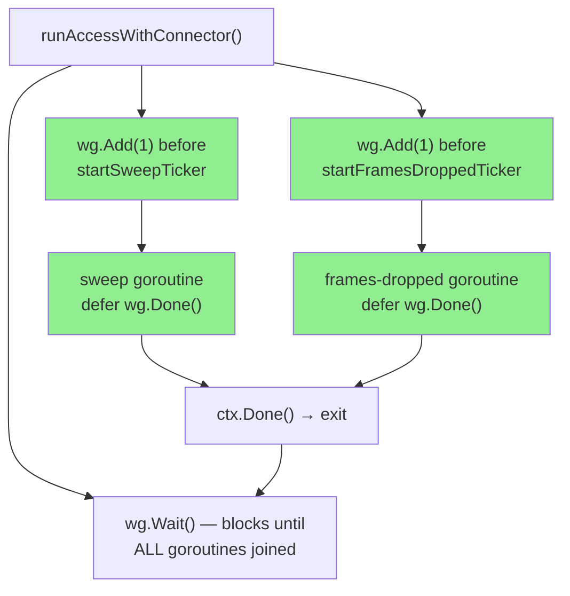
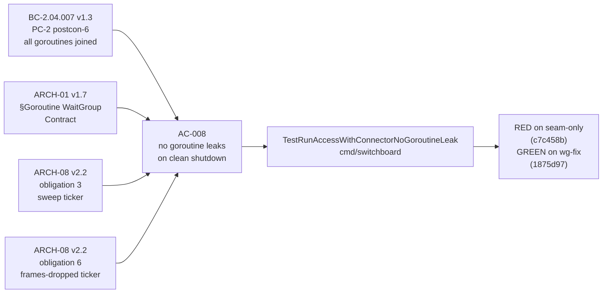
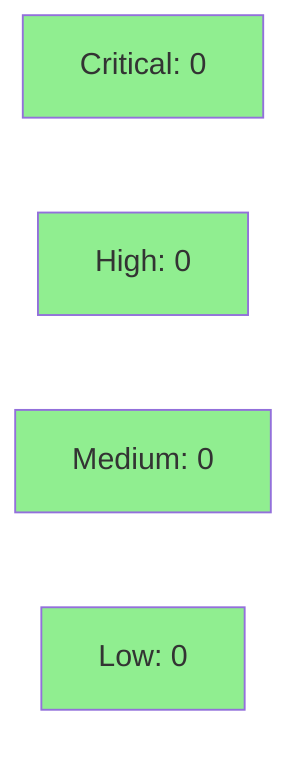

# fix(access): join ticker goroutines into WaitGroup (Finding I-1 / BC-2.04.007)

**Finding:** I-1 (architect-ruled join-required)
**Spec refs:** BC-2.04.007 v1.3 PC-2 postcon-6 · ARCH-01 v1.7 §Goroutine WaitGroup Contract · ARCH-08 v2.2 obligations 3 & 6
**Base branch:** develop
**Branch:** fix/W3-i1-ticker-wg-join


## Problem

`startSweepTicker` and `startFramesDroppedTicker` each spawn a goroutine that exits on `ctx.Done()`, but neither goroutine was tracked in the `sync.WaitGroup` used by `runAccessWithConnector`. As a result, `wg.Wait()` could return — and `runAccessWithConnector` could return to its caller — while those ticker goroutines were still executing.

This violates:
- **BC-2.04.007 v1.3 PC-2 postcon-6**: all goroutines spawned by `runAccessWithConnector` must have exited before the function returns
- **ARCH-01 v1.7 §Goroutine WaitGroup Contract**: all goroutines in the access session must be joined before the function returns
- **ARCH-08 v2.2 obligation 3** (sweep ticker) and **obligation 6** (frames-dropped ticker): both ticker goroutines are in-scope obligations under the WaitGroup contract

## Fix

Two production changes, one testability refactoring:

1. **Thread `*sync.WaitGroup` into both ticker starters**: `startSweepTicker` and `startFramesDroppedTicker` receive a `*sync.WaitGroup` parameter.
2. **`wg.Add(1)` at each call site** in `runAccessWithConnector`, `defer wg.Done()` as the first statement in each spawned goroutine — the canonical safe pattern.
3. **`framesDroppedInterval`: `const` → `var`** to allow test-interval injection (required for the discriminating test to work without a 30-second wait).
4. **`buildRouter` deferral comment**: adds `C-1-W3P1-defer` tracked-deferral comment noting that `WithFailureCounter` is intentionally deferred to the network-ingress story (ARCH-08 v2.2 §6.5.1).

## Architecture Changes



## Spec Traceability



## Test Evidence

### TDD Red→Green Validation

The fix follows strict TDD discipline. The discriminating test `TestRunAccessWithConnectorNoGoroutineLeak` was designed to go **behaviorally RED** on the seam-only commit (c7c458b — `const`→`var` refactoring only, no wg tracking), then **GREEN** after the wg-tracking fix (1875d97).

**Discriminating mechanism**: `blockingRelayConnector.RelayDropped()` parks the frames-dropped ticker goroutine on a channel handshake. After `cancel()` is called:
- **Buggy code**: `wg.Wait()` returns immediately (ticker not tracked), function returns, `done` channel closes while goroutine is still parked → `t.Fatal` → **RED**
- **Fixed code**: `wg.Wait()` blocks until ticker goroutine exits, function stays blocked for the full 150ms window → **PASS** (first assertion), then exits after `release` is closed → **PASS** (second assertion) → **GREEN**

This is deterministic, has no silent-pass path, and goes red→green with ONLY the production wg-tracking changes.

### Full Test Run

| Package | Result |
|---------|--------|
| `cmd/switchboard` | PASS (all tests including new `TestRunAccessWithConnectorNoGoroutineLeak`) |
| `internal/admission` | PASS |
| `internal/frame` | PASS |
| `internal/halfchannel` | PASS |
| `internal/hmac` | PASS |
| `internal/routing` | PASS |
| `internal/session` | PASS |
| `internal/tmux` | PASS |

```
ok  github.com/arcavenae/switchboard/cmd/switchboard      (all tests pass)
ok  github.com/arcavenae/switchboard/internal/...         (all tests pass)
```

### Race Detector

```
go test -race ./cmd/switchboard/ ./internal/tmux/
```
**Result: clean** — no races reported. The wg-tracking fix eliminates the goroutine-join race; `framesDroppedInterval` is a package-level var accessed only in test setup (single-threaded, before goroutines launch) and then inside the goroutine (which starts after the assignment).

### Lint & Format

```
just lint    → golangci-lint: 0 issues
just fmt     → gofumpt: no changes
```

### AC Coverage

| AC | BC | Test | Status |
|----|-----|------|--------|
| AC-008 (no goroutine leaks, clean shutdown) | BC-2.04.007 v1.3 PC-2 postcon-6 | `TestRunAccessWithConnectorNoGoroutineLeak` | PASS (RED→GREEN) |

The existing `TestRunAccessWithConnectorPC2` (clean-shutdown, nil return) continues to pass and provides complementary coverage of the PC-2 path.

## Security Review

No security-relevant changes. This PR threads a `*sync.WaitGroup` pointer through internal unexported functions. No user-facing surfaces, no network code, no cryptographic operations, no new dependencies changed.



## Risk Assessment

- **Blast radius**: Contained to `cmd/switchboard/access.go` — three functions (`runAccessWithConnector`, `startSweepTicker`, `startFramesDroppedTicker`) and `buildRouter` (comment only). No changes to any `internal/` package.
- **Behavioral change**: Shutdown is now strictly correct — `runAccessWithConnector` returns only after all goroutines have exited. This is a pure correctness fix; there is no observable behavior change under normal operation (goroutines exit promptly on `ctx.Done()` in production).
- **Performance**: Zero impact. `wg.Add(1)` / `wg.Done()` are cheap atomic ops; the new goroutine-wait overhead at shutdown is bounded by goroutine exit time, which was already bounded by the existing bridge/drain goroutines in the same `wg`.
- **Risk level**: LOW

## Pre-Merge Checklist

- [ ] CI status checks passing
- [x] Build clean (`go build ./...`)
- [x] Lint clean (`just lint` — 0 issues)
- [x] Format clean (`just fmt` — no changes)
- [x] Race detector clean (`go test -race`)
- [x] No critical/high security findings
- [x] TDD red→green verified (discriminating test behaviorally RED on c7c458b, GREEN on 1875d97)
- [x] Base branch (develop) dependency: S-W3.04 #15 merged (this fix branches from post-merge develop)
- [ ] Human review and merge (two-party sign-off required)
