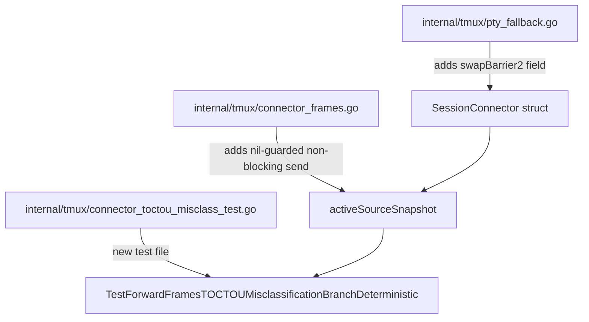
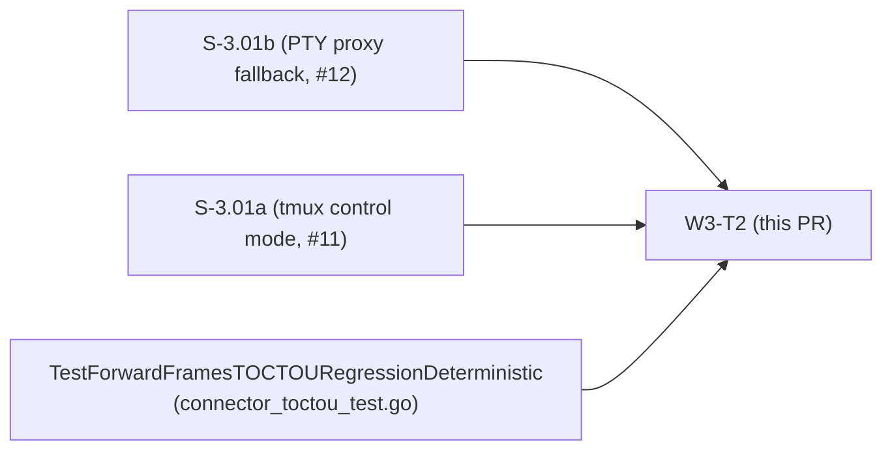
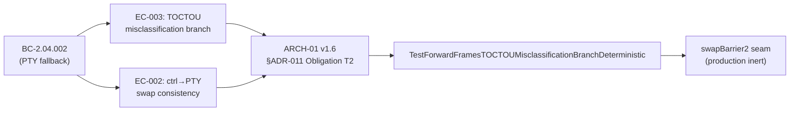

## Summary

Adds `TestForwardFramesTOCTOUMisclassificationBranchDeterministic` — a deterministic regression detector for the ADR-011 v1.6 TOCTOU misclassification branch (`srcCh==prevSrcCh && inPTY==true`), fulfilling ARCH-01 v1.6 §ADR-011 Obligation T2.

This complements the existing probabilistic `TestForwardFramesTOCTOUCount50` by targeting the specific second-relay-iteration branch that the prior deterministic test (`TestForwardFramesTOCTOURegressionDeterministic`) never reaches (on first iteration `prevSrcCh` is nil, so the misclassification branch is structurally unreachable).

## Architecture Changes

**Changed files (3):**
- `internal/tmux/pty_fallback.go` — adds `swapBarrier2 chan struct{}` field to `SessionConnector` (test-only seam; nil in production)
- `internal/tmux/connector_frames.go` — adds nil-guarded non-blocking send on `swapBarrier2` in `activeSourceSnapshot()`, after the single `sc.mu` hold, before `swapBarrier` may block
- `internal/tmux/connector_toctou_misclass_test.go` — new test file (352 lines); deterministic misclassification-branch test

**No production behaviour change.** The `swapBarrier2` field is only ever assigned in `_test.go` files; the nil-guard + non-blocking send path in production code is provably inert (see Seam Review below).

## Story Dependencies

This PR depends on the ADR-011 v1.6 fix already merged in #12 (S-3.01b). No story is blocked by this PR.

## Spec Traceability

**BC → AC → Test chain:**
- BC-2.04.002 EC-003 (TOCTOU misclassification: `srcCh==prevSrcCh && inPTY==true` after ctrl→PTY swap) → ARCH-01 v1.6 §ADR-011 Obligation T2 → `TestForwardFramesTOCTOUMisclassificationBranchDeterministic`
- BC-2.04.002 EC-002 (snapshot consistency during ctrl→PTY swap) → same test (exercises second relay iteration)

## Test Evidence

| Metric | Value |
|--------|-------|
| New test | `TestForwardFramesTOCTOUMisclassificationBranchDeterministic` |
| Red-gate verification | FAILS 5/5 against buggy two-lock scratch form |
| Green-gate verification | PASSES 10/10 against fixed atomic-snapshot form (production) |
| Full tmux package | green, `-race` clean |
| Full suite | green, 0 lint warnings |

**Red-gate rationale:** The buggy form positions `swapBarrier` between two separate `sc.mu` acquisitions (lock1: reads `sc.active`; lock2: reads `sc.inPTYMode`). With `swapBarrier2` signalling after lock1, the test triggers the ctrl→PTY swap before lock2 runs, guaranteeing `inPTYMode=true` from lock2. This produces the misclassifying `{ctrl.frames, inPTY=true}` snapshot and deterministically fires `ErrPTYSourceEOF`.

**Fixed form:** `activeSourceSnapshot()` reads all three fields (`active`, `srcCh`, `inPTYMode`) under a single `sc.mu` hold. `swapBarrier2` fires after the lock is released with an already-consistent snapshot (`inPTY=false` if active was still ctrl). The swap completes; the relay loops and picks up `{pty.frames, inPTY=true}` on the next iteration; the PTY frame is delivered. Test passes.

## Holdout Evaluation

N/A — evaluated at wave gate.

## Adversarial Review

N/A — evaluated at Phase 5.

## Security Review

No security-relevant changes. The `swapBarrier2` field is:
- A `chan struct{}` assigned only in test files
- Never reachable from any public API or user input
- Nil-guarded with a non-blocking send; cannot cause goroutine leak or deadlock

No OWASP, injection, auth, or input-validation concerns apply to this change.

## swapBarrier2 Seam Review

**Status: SEAM REVIEW: APPROVE**

The `swapBarrier2` seam was subjected to a focused code-reviewer seam review prior to this PR. Key findings:

1. **Provably inert in production:** The field is a struct field in `SessionConnector`; its zero value is `nil`. It is never assigned outside of `_test.go` files. In production, the nil-guard `if sc.swapBarrier2 != nil` is always false; the `select` block is never entered.
2. **No goroutine leak risk:** The send is non-blocking (`select { case sc.swapBarrier2 <- struct{}{}: default: }`). Even if somehow non-nil in production, no goroutine would block.
3. **Write-before-Connect race-safe:** Tests assign `swapBarrier2` before calling `sc.Connect()`, which is the only path that starts goroutines reading the field. The assignment happens-before the goroutine start.
4. **Three LOW comment-hygiene findings** from the seam review were applied to the commit.

Reviewers: the seam inertness claim is verifiable via `grep -rn swapBarrier2 internal/tmux/` — all assignments appear in `_test.go` files; the production path contains only the nil-guarded read.

## Risk Assessment

| Dimension | Assessment |
|-----------|------------|
| Blast radius | Minimal — test-only seam; production code path is provably inert (nil-guarded) |
| Performance impact | None — nil-guard is a single pointer comparison, never evaluated to true in production |
| Rollback | Trivial — revert 3 files; zero behaviour change in production |
| Concurrency | Safe — write-before-Connect ordering; non-blocking send; see seam review |

## AI Pipeline Metadata

| Field | Value |
|-------|-------|
| Pipeline mode | Feature (wave-3 test obligation) |
| Story ID | W3-T2 |
| Branch | `test/W3-t2-deterministic-misclassification` |
| Commit | ea49f24 |

## Pre-Merge Checklist

- [x] PR description matches actual diff (3 files: pty_fallback.go, connector_frames.go, connector_toctou_misclass_test.go)
- [x] All ACs covered: T2 obligation satisfied (deterministic misclassification-branch detector)
- [x] Traceability chain complete: BC-2.04.002 EC-003/EC-002 → ADR-011 T2 → test → seam
- [x] Seam review completed and APPROVE verdict applied
- [x] Red-gate verified (5/5 fails against buggy form)
- [x] Green-gate verified (10/10 passes against fixed form)
- [x] Full suite green, `-race` clean, lint 0
- [x] No AI attribution in commit or PR description
- [x] Commit signed (SSH)
- [ ] CI passing (pending push)
- [ ] pr-reviewer approval (pending)
