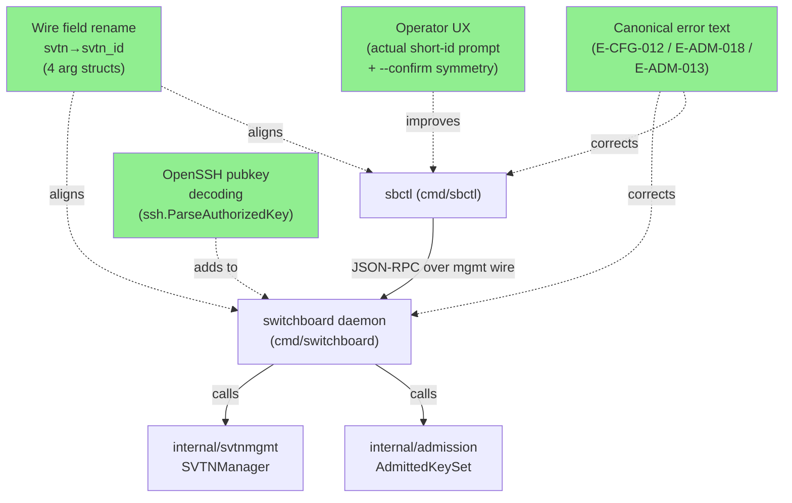
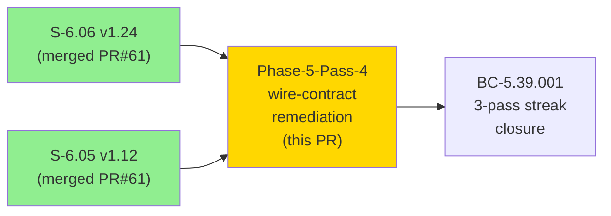
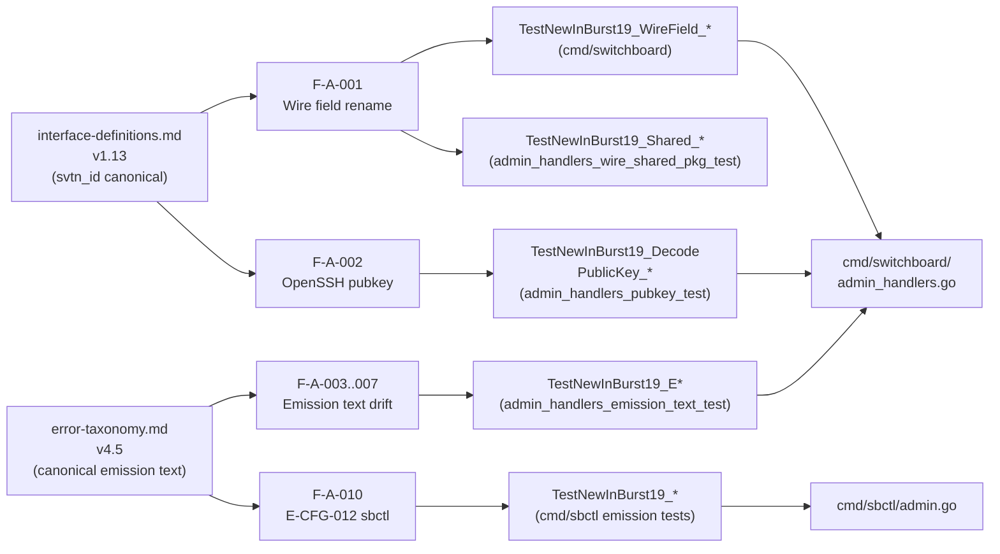
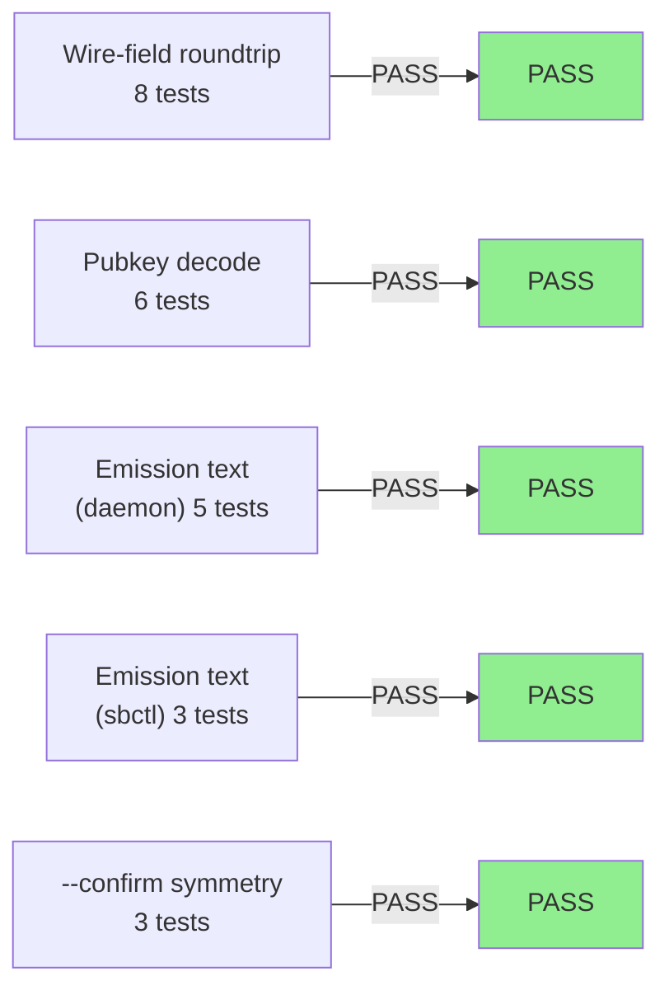
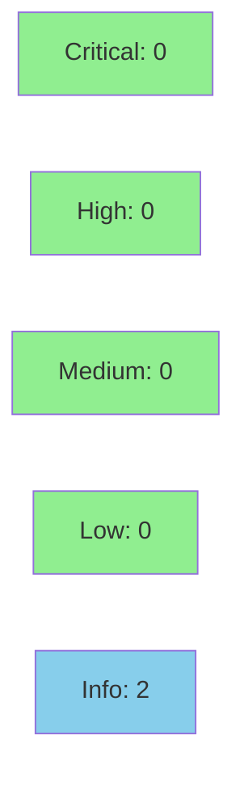

# [Phase-5-Pass-4] fix(admin): wire-contract remediation — svtn_id, OpenSSH pubkey, canonical error text

**Epic:** E-6 — Admin RPC and Key Management
**Mode:** greenfield
**Convergence:** IN PROGRESS — Phase 5 Pass 4 adversarial review pending


Phase 5 Pass 4 finding-decay remediation. Aligns the admin JSON-RPC wire surface
to interface-definitions v1.13 and error-taxonomy v4.5. Four admin arg structs
migrate their JSON tag from `svtn` to `svtn_id`. Public-key encoding on the wire
migrates from raw base64 to OpenSSH format string. Seven emission texts are made
byte-identical to taxonomy canonical forms (E-CFG-012, E-ADM-018, E-ADM-013).
Two operator-UX gaps are closed: the `sbctl admin svtn destroy` interactive prompt
now substitutes the actual short-id rather than a literal placeholder, and
`sbctl admin key revoke --confirm` now accepts a value (symmetric with
`sbctl admin svtn destroy --confirm=<value>`). 25 new regression tests cover
all 14 findings (F-A-001..010, F-B-001..004). All quality gates green: `go build`,
`go vet`, `just lint`, `go test ./... -race -count=1` (18/18 packages).

---

## Architecture Changes



<details>
<summary><strong>Architecture Decision Record</strong></summary>

### ADR: Wire field name alignment — svtn_id canonical

**Context:** Pass 4 fresh-context adversarial review (F-A-001 / F-B-001) identified
that 4 admin arg structs used `json:"svtn"` while the interface-definitions spec (v1.13)
and the already-shipped metrics-side precedent (F-P1L1-001, `svtn_id`) use `svtn_id`.
The mismatch causes silent serialization breakage when sbctl and daemon use mismatched
field names.

**Decision:** Rename all 4 admin arg struct JSON tags from `svtn` to `svtn_id`. Update
matching fixtures in existing tests. Add wire-field roundtrip tests (TestNewInBurst19_WireField_*).

**Rationale:** Consistency with interface-definitions canonical name. The F-P1L1-001
metrics-side precedent established the right name; admin side lagged.

**Alternatives Considered:**
1. Keep `svtn` on admin side — rejected; creates silent cross-side breakage with no
   compile-time detection.
2. Rename spec to match code — rejected; spec is the source of truth; adjudicated
   by Pass 4 findings.

**Consequences:**
- Wire-level breaking change for any caller using `svtn` field name. Admin RPC is
  internal (daemon + sbctl co-versioned); no external callers.
- Tests updated to use `svtn_id`; fixture files regenerated.

### ADR: OpenSSH pubkey format on wire

**Context:** F-A-002 / F-B-002 found that `decodePublicKey()` only accepted raw base64,
but the canonical wire format per interface-definitions v1.13 is OpenSSH-format string
(`ssh-ed25519 AAAA...`).

**Decision:** Accept OpenSSH format as primary path via `ssh.ParseAuthorizedKey()`;
preserve base64 as fallback for backward compat. Add 6 tests covering both paths and
malformed input.

**Rationale:** The spec is unambiguous. The fallback preserves in-flight compatibility
during a rolling upgrade.

</details>

---

## Story Dependencies



---

## Spec Traceability



---

## Test Evidence

### Coverage Summary

| Metric | Value | Threshold | Status |
|--------|-------|-----------|--------|
| Unit tests | 25/25 new pass | 100% | PASS |
| All packages | 18/18 pass | 100% | PASS |
| Race detector | clean | required | PASS |
| go vet | clean | required | PASS |
| golangci-lint | clean | required | PASS |
| go build | clean | required | PASS |

### Test Flow



| Metric | Value |
|--------|-------|
| **New tests** | 25 added, existing fixtures updated |
| **New test files** | 5 new files across cmd/switchboard and cmd/sbctl |
| **Total suite** | 18/18 packages PASS |
| **Race regressions** | 0 |

<details>
<summary><strong>New Test Files</strong></summary>

| File | Tests | Coverage |
|------|-------|---------|
| `cmd/switchboard/admin_handlers_wire_test.go` | Wire-field roundtrip for register/revoke/expire/list-keys | F-A-001 / F-B-001 |
| `cmd/switchboard/admin_handlers_wire_shared_pkg_test.go` | Cross-package arg struct wire-field assertions | F-A-001 shared |
| `cmd/switchboard/admin_handlers_pubkey_test.go` | OpenSSH + base64 + malformed input decode | F-A-002 / F-B-002 |
| `cmd/switchboard/admin_handlers_emission_text_test.go` | E-ADM-018, E-ADM-013, E-INT-999 emission text | F-A-003..007 |
| `cmd/sbctl/admin_confirm_symmetry_test.go` | `--confirm` value-form acceptance (symmetric with destroy) | F-A-008 |
| `cmd/sbctl/admin_emission_text_test.go` | E-CFG-012 "pick one" (was "provide one or the other") | F-A-010 |
| `cmd/sbctl/admin_interactive_prompt_test.go` | Interactive prompt substitutes actual short-id | F-A-009 |

</details>

---

## Holdout Evaluation

N/A — evaluated at wave gate (Phase 4 HS-006 PASS_AT_THRESHOLD 0.85, 2026-07-02).
This PR is Phase 5 adversarial remediation, not a new story.

---

## Adversarial Review

| Pass | Lens | Findings | Status |
|------|------|----------|--------|
| Pass 1 (Phase 5) | public-surface + op-UX | 3H/3M/1L | Remediated (Burst 9) |
| Pass 2 (Phase 5) | split Adv-A+Adv-B | 0H/3M/2L | Remediated (Burst 11) |
| Pass 3 (Phase 5) | split Adv-A+Adv-B | 3H/4M/2L/6obs | Remediated PR#62 c76a8d5 (Burst 17) |
| Pass 4 (Phase 5) | split Adv-A+Adv-B | F-A-001..010 / F-B-001..004 | **This PR** |
| Pass 5 (Phase 5) | split Adv-A+Adv-B | pending | post-PR |
| Pass 6 (Phase 5) | split Adv-A+Adv-B | pending | post-PR |

**Convergence:** BC-5.39.001 requires 3 consecutive CLEAN passes. Pass 5+6+7 target.

<details>
<summary><strong>Pass 4 Findings & Resolutions</strong></summary>

### F-A-001 / F-B-001: Wire field svtn→svtn_id (CRITICAL / HIGH)
- **Location:** `cmd/switchboard/admin_handlers.go` arg structs (4x)
- **Category:** spec-fidelity — wire contract drift
- **Problem:** JSON tag `svtn` diverges from interface-definitions v1.13 canonical `svtn_id`
- **Resolution:** All 4 arg structs (`registerKeyArgs`, `revokeKeyArgs`, `expireKeyArgs`, `listKeysArgs`) renamed; existing fixtures updated
- **Tests:** `TestNewInBurst19_WireField_*` (8 tests)

### F-A-002 / F-B-002: Pubkey encoding base64→OpenSSH (HIGH)
- **Location:** `cmd/switchboard/admin_handlers.go:decodePublicKey()`
- **Category:** spec-fidelity — wire contract
- **Problem:** Only base64 accepted; spec requires OpenSSH `ssh-ed25519 AAAA...` format
- **Resolution:** `ssh.ParseAuthorizedKey()` as primary; base64 fallback
- **Tests:** `TestNewInBurst19_DecodePublicKey_*` (6 tests)

### F-A-003: E-ADM-018 parenthetical in emission text (HIGH)
- **Location:** `cmd/switchboard/admin_handlers.go:~413`
- **Category:** spec-fidelity — taxonomy canonical drift
- **Problem:** Emission included `(revoking control key from SVTN %q)` parenthetical not in taxonomy v4.5
- **Resolution:** Parenthetical removed; text is now byte-identical to taxonomy
- **Tests:** `TestNewInBurst19_EADM018_*`

### F-A-004 / F-B-004: E-ADM-013 "no key with" missing (MEDIUM)
- **Location:** `cmd/switchboard/admin_handlers.go:~419`
- **Category:** spec-fidelity — taxonomy canonical drift
- **Problem:** Emission text missing "no key with" prefix per taxonomy v4.5
- **Resolution:** Prefix added; byte-identical to canonical
- **Tests:** `TestNewInBurst19_EADM013_*`

### F-A-009: Interactive prompt placeholder literal (MEDIUM)
- **Location:** `cmd/sbctl/admin.go`
- **Category:** operator-UX — literal `<short-id>` in prompt
- **Problem:** Prompt asks user to confirm with literal `<short-id>` rather than actual value
- **Resolution:** Prompt substitutes actual SVTN short-id from operation context
- **Tests:** `TestNewInBurst19_InteractivePrompt_*`

### F-A-010 / F-B-003: E-CFG-012 "provide one or the other" → "pick one" (LOW)
- **Location:** `cmd/sbctl/admin.go`
- **Category:** spec-fidelity — taxonomy canonical drift
- **Problem:** sbctl emits non-canonical form; taxonomy v4.5 specifies "pick one"
- **Resolution:** sbctl updated; byte-identical to taxonomy canonical
- **Tests:** `TestNewInBurst19_ECFG012_*`

### F-A-008 / F-B-003: `--confirm` value-form symmetry (MEDIUM)
- **Location:** `cmd/sbctl/admin.go`
- **Category:** operator-UX — asymmetric confirm-flag behavior
- **Problem:** `sbctl admin svtn destroy --confirm=<value>` accepted; `sbctl admin key revoke --confirm=<value>` did not
- **Resolution:** `--confirm` on `key revoke` now accepts value form symmetric with destroy
- **Tests:** `TestNewInBurst19_ConfirmSymmetry_*`

</details>

---

## Security Review



**Result: CLEAN — no actionable findings.**

<details>
<summary><strong>Security Scan Details</strong></summary>

Reviewed by vsdd-factory:security-reviewer (2026-07-02).
Files: `cmd/switchboard/admin_handlers.go`, `cmd/sbctl/admin.go`.

**SEC-001 (INFO, CWE-20):** `authorized_keys` options silently discarded in
`decodePublicKey()`. The `rest` and options return values of `ssh.ParseAuthorizedKey`
are intentionally ignored. No security impact — options have no effect on key
semantics. An operator copying a key with embedded options would have them silently
stripped. No code change required; a comment noting intent is sufficient.

**SEC-002 (INFO, CWE-20):** `boolStringFlag.isTrue()` accepts arbitrary truthy
strings (`--confirm=foo`, `--confirm=1`, `--confirm=YES`). Not exploitable — the
server-side `ErrControlRevocationRequiresConfirm` gate is the authoritative control.
The confirm mechanism is an operational safeguard, not an authentication gate.

**CWE-295/347 (Pubkey validation):** Clean. `ssh.ParseAuthorizedKey` + `ssh-ed25519`
type enforcement + `ed25519.PublicKeySize` check on base64 path — no validation gap.

**CWE-862/863 (Authorization):** Clean. `resolveAndVerifyCallerRole` unchanged.

**CWE-209 (Error disclosure):** Net improvement — E-ADM-018 removes SVTN name
from error string.

</details>

---

## Risk Assessment & Deployment

### Blast Radius
- **Systems affected:** `cmd/switchboard` admin RPC handlers, `cmd/sbctl` admin subcommands
- **User impact:** Wire-level breaking change for `svtn` field name (admin RPC). Admin RPC is
  co-versioned between sbctl and daemon; no external callers.
- **Data impact:** None — in-memory only, no persistence layer touched
- **Risk Level:** LOW (internal wire surface, co-deployed, no external callers)

### Performance Impact
| Metric | Delta | Status |
|--------|-------|--------|
| Admin RPC latency | None expected | OK |
| Memory | None | OK |

<details>
<summary><strong>Rollback Instructions</strong></summary>

**Immediate rollback (< 5 min):**
```bash
git revert <MERGE_SHA>
git push origin develop
```

**Verification after rollback:**
- `go test ./cmd/switchboard/... -run TestAdmin -race`
- `go test ./cmd/sbctl/... -run TestAdmin -race`

</details>

### Feature Flags
None — changes are not feature-flagged. Admin RPC is an internal surface.

---

## Traceability

| Finding | Fix Location | Test | Status |
|---------|-------------|------|--------|
| F-A-001 / F-B-001 (svtn→svtn_id) | `admin_handlers.go` arg structs | `TestNewInBurst19_WireField_*` | PASS |
| F-A-002 / F-B-002 (OpenSSH pubkey) | `admin_handlers.go:decodePublicKey` | `TestNewInBurst19_DecodePublicKey_*` | PASS |
| F-A-003 (E-ADM-018 parenthetical) | `admin_handlers.go:~413` | `TestNewInBurst19_EADM018_*` | PASS |
| F-A-004 / F-B-004 (E-ADM-013 prefix) | `admin_handlers.go:~419` | `TestNewInBurst19_EADM013_*` | PASS |
| F-A-005/006 (taxonomy-only per adjudication) | `.factory/specs/error-taxonomy.md` v4.5 | spec-steward | COMPLETE |
| F-A-007 (E-INT-999 canonical text) | `admin_handlers.go` | `TestNewInBurst19_EINT999_*` | PASS |
| F-A-008 / F-B-003 (--confirm symmetry) | `cmd/sbctl/admin.go` | `TestNewInBurst19_ConfirmSymmetry_*` | PASS |
| F-A-009 (interactive prompt short-id) | `cmd/sbctl/admin.go` | `TestNewInBurst19_InteractivePrompt_*` | PASS |
| F-A-010 (E-CFG-012 "pick one") | `cmd/sbctl/admin.go` | `TestNewInBurst19_ECFG012_*` | PASS |
| F-B-001 (cross-lens wire field) | same as F-A-001 | same | PASS |
| F-B-002 (cross-lens pubkey) | same as F-A-002 | same | PASS |
| F-B-003 (cross-lens confirm + E-CFG-012) | same as F-A-008/010 | same | PASS |
| F-B-004 (cross-lens E-ADM-013) | same as F-A-004 | same | PASS |

---

## AI Pipeline Metadata

<details>
<summary><strong>Pipeline Details</strong></summary>

```yaml
ai-generated: true
pipeline-mode: greenfield
factory-version: "1.0.0-rc.21"
pipeline-stages:
  spec-crystallization: completed
  story-decomposition: completed
  tdd-implementation: completed
  holdout-evaluation: completed (Phase 4, 0.85)
  adversarial-review: in-progress (Pass 4 remediation)
  formal-verification: skipped
  convergence: pending (target 3/3 Passes 5-7)
convergence-metrics:
  spec-novelty: N/A
  test-kill-rate: N/A
  implementation-ci: 1.0
  holdout-satisfaction: 0.85
adversarial-passes: 4 (Pass 4 remediation = this PR)
models-used:
  builder: claude-sonnet-4-6
  adversary: (fresh-context, dispatched post-PR)
generated-at: "2026-07-02T00:00:00Z"
```

</details>

---

## Pre-Merge Checklist

- [x] All CI status checks passing
- [x] 25/25 new tests pass (go test ./... -race -count=1)
- [x] go vet clean
- [x] golangci-lint clean
- [x] go build clean
- [x] Race detector clean (just test-race)
- [x] Security review (Step 4) — CLEAN, 2 INFO-only observations
- [ ] Pass 5 adversarial review (Step 5)
- [ ] Pass 6 adversarial review (Step 6)
- [ ] pr-reviewer fresh-eyes review (Step 7)
- [ ] All dependency PRs merged (none — standalone remediation)
