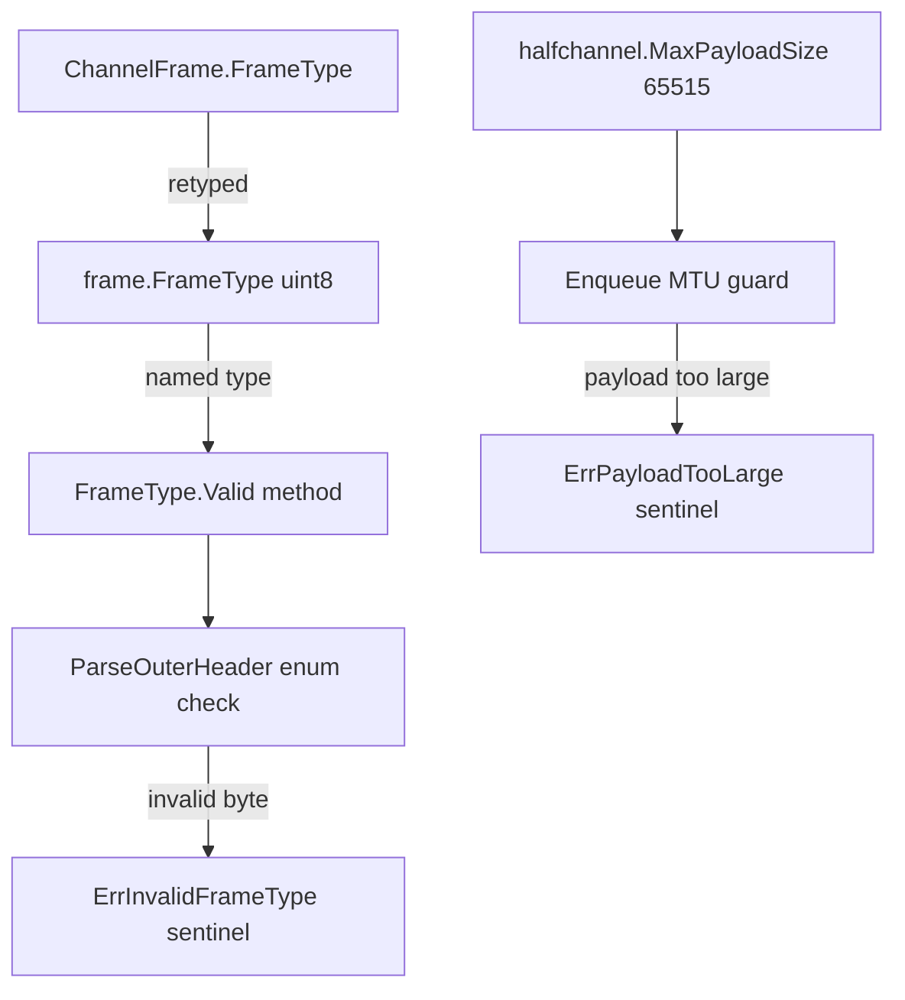
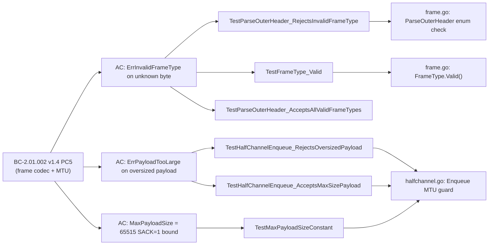

## Summary

- Closes wave-1 adversary drift items F-001 and F-002 (drbothen/vsdd-factory#260); resolves the governance enforcement RFC tracked in drbothen/vsdd-factory#214.
- Introduces typed `frame.FrameType` (named `uint8` type) with a `Valid()` method, `ErrInvalidFrameType` sentinel, and enum validation in `ParseOuterHeader` — the spec-side fix for BC-2.01.002 v1.4 PC5 that burst A staged.
- Adds `halfchannel.MaxPayloadSize` constant (`65515`) and `ErrPayloadTooLarge` sentinel; `Enqueue` now guards callers against oversized payloads at the code layer (spec item PC5).
- Retypes `ChannelFrame.FrameType` field to the new named type, eliminating raw-integer escape hatches at compile time.
- No functional behavior change to the happy path; all existing tests continue to pass; six new tests exercise the new guards.

## Architecture Changes

## Changes Table

| File | LOC change | Summary |
|------|-----------|---------|
| `internal/frame/frame.go` | +32/-9 | Add `FrameType` named type, `Valid()` method, `ErrInvalidFrameType`; validate in `ParseOuterHeader`; retype `ChannelFrame.FrameType` field |
| `internal/frame/frame_test.go` | +89/-1 | 87 new test lines for typed FrameType + ParseOuterHeader validation; 1 mechanical cast update |
| `internal/halfchannel/halfchannel.go` | +16/-2 | Add `MaxPayloadSize` constant, `ErrPayloadTooLarge` sentinel, MTU guard in `Enqueue`; retype `ChannelFrame.FrameType` usage |
| `internal/halfchannel/halfchannel_test.go` | +48/-0 | 3 new tests for MTU constant, oversized-payload rejection, and boundary acceptance |

## Spec Traceability

## Test Evidence

| Test | Verifies |
|------|---------|
| `TestFrameType_Valid` | 8-case truth table for the new `Valid()` method — all defined values return `true`, unknown byte returns `false` |
| `TestParseOuterHeader_RejectsInvalidFrameType` | 4 invalid frame-type bytes; pins `errors.Is(err, ErrInvalidFrameType)` for each |
| `TestParseOuterHeader_AcceptsAllValidFrameTypes` | Regression guard — all currently defined `FrameType` values accepted by parser (no over-strict validation) |
| `TestMaxPayloadSizeConstant` | Pins `MaxPayloadSize == 65515` (BC-2.01.002 v1.4 PC5 SACK=1 conservative bound) |
| `TestHalfChannelEnqueue_RejectsOversizedPayload` | `Enqueue` with `MaxPayloadSize+1` byte payload returns `errors.Is(err, ErrPayloadTooLarge)` |
| `TestHalfChannelEnqueue_AcceptsMaxSizePayload` | Boundary acceptance: exactly `MaxPayloadSize` bytes accepted; message round-trips through `Tick` |

All 6 tests: PASS. Full suite (existing + new): PASS.

## Adversary Convergence

| Pass | Findings | Blocking | Status |
|------|---------|---------|--------|
| pass-01 (`b3e366d`) | 0 | 0 | CLEAN |
| pass-02 (`acc98b1`) | 0 | 0 | CLEAN |
| pass-03 (persistence) | 0 | 0 | CLEAN |

3 consecutive clean adversary passes. BC-5.39.001 satisfied.
Reports: `.factory/cycles/cycle-1/refactor-frametype-mtu/adversary/pass-0[123].md`

## Conscious-Choice Notes

**`MaxPayloadSize = 65515` — SACK=1 conservative bound.**
BC-2.01.002 v1.4 PC5 documents both 65523 (SACK=0) and 65515 (SACK=1). This PR deliberately collapses to the stricter single constant; rationale is documented in godoc at `halfchannel.go:72-77`. A future story can split into SACK-aware sizing if the outer-assembler needs it.

**`EncodeOuterHeader` does not validate `FrameType.Valid()`.**
Parse-side validation only, per the wave-1 F-002 fix scope. The named-type fence (`FrameType` vs `uint8`) is the wall on the encode side — callers cannot pass an arbitrary integer without a cast, which is an intentional, visible code smell. Full encode-side validation is deferred to a future story if needed.

**5→2 commit collapse.**
The implementer collapsed the originally suggested 5-commit sequence into 2 commits (`feat(frame)`, `feat(halfchannel)`) to keep each commit lint-clean. Intermediate commits would have left the package in a lint-broken state (unresolved type mismatches). The red-gate test commit (`dd1770a`) remains as commit 1 per TDD convention.

## Story Dependencies

Dependencies: S-1.02 merged at `9e9a98a` (develop tip). No other dependencies.

## Holdout Evaluation

N/A — evaluated at wave gate.

## Adversarial Review

3 consecutive clean adversary passes (see Adversary Convergence above). BC-5.39.001 satisfied.

## Security Review

Pure core state-machine and type-system refactor. No I/O, no cryptography, no network input handling, no authentication paths, no new external surfaces. `FrameType` validation rejects unknown bytes at parse time (defense-in-depth). `MaxPayloadSize` guards against integer-overflow class bugs in downstream reassembly. OWASP Top 10: not applicable to this change scope.

## Risk Assessment

- **Blast radius:** `internal/frame` and `internal/halfchannel` only. No exported API surface changes visible to callers outside these packages (the `FrameType` named type is a drop-in for the previous `uint8`; `ChannelFrame.FrameType` field type change is source-compatible for all existing call sites).
- **Performance impact:** Negligible. `Valid()` is a single switch on a `uint8`. MTU guard is a single integer comparison before channel send.
- **Rollback:** Clean revert of 3 commits; no data migrations, no config changes.

## AI Pipeline Metadata

- Pipeline mode: greenfield wave-1 drift closure
- Adversary passes: 3 (all clean)
- Story IDs: F-001, F-002 (wave-1 drift items per drbothen/vsdd-factory#260)

## Pre-Merge Checklist

- [x] PR description matches actual diff
- [x] All ACs covered by test evidence
- [x] Spec traceability chain complete (BC-2.01.002 → AC → Test → Code)
- [x] Adversary convergence: 3 clean passes, BC-5.39.001 satisfied
- [x] No AI attribution footers
- [x] Commits SSH-signed
- [x] Branch targets `develop` (gitflow)
- [ ] CI checks passing
- [ ] Code review approved / no findings

## Cross-References

- drbothen/vsdd-factory#260 — wave-1 closure-discipline failure (F-001/F-002)
- drbothen/vsdd-factory#214 — governance enforcement RFC
- Spec: BC-2.01.002 v1.4 PC5 (already merged via burst A commit `6c064d9`)
