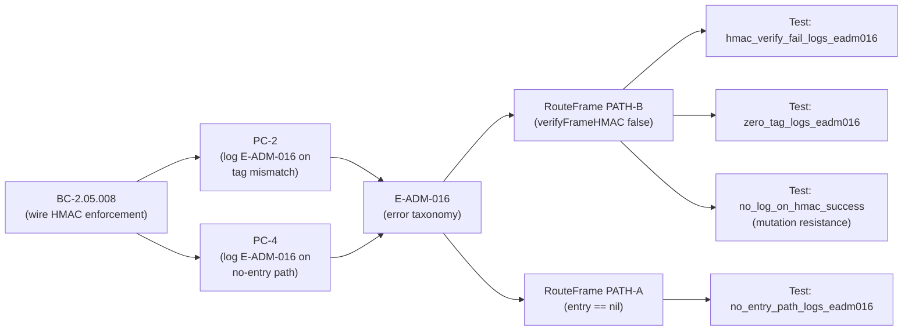
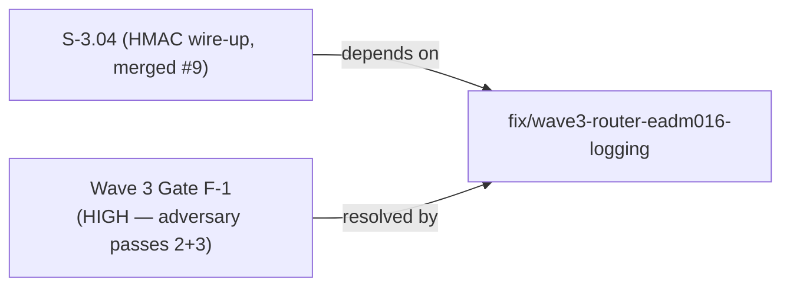
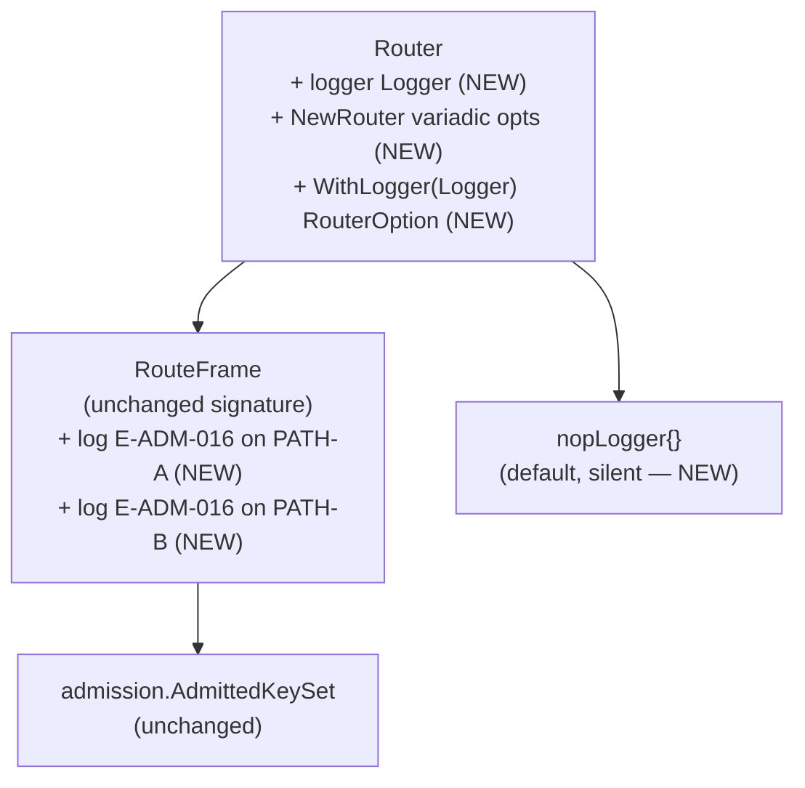

## Problem

Wave 3 integration gate finding F-1 (rated HIGH by two independent adversary passes,
passes 2 and 3): `RouteFrame` correctly dropped forged/unverifiable HMAC frames and
returned `ErrHMACVerificationFailed`, but never emitted the mandatory E-ADM-016 log
record. This left BC-2.05.008 PC-2's observability postcondition unimplemented and
untested — a P0 security contract gap on the wire-HMAC path.

**Affected behavioral contract:** BC-2.05.008 PC-2 (and PC-4 conservative extension)
**Error taxonomy entry:** E-ADM-016 — wire HMAC verification failed at RouteFrame
**Gate:** Wave 3 integration gate, F-1
**Severity:** HIGH (confirmed by adversary passes 2 and 3)

## Fix

Two signed commits off `develop` @ b68e498:

### c5d1c17 — feat(routing): add Logger injection and E-ADM-016 logging to RouteFrame

- Added `Logger` interface and `RouterOption`/`WithLogger` functional option to the
  `routing` package, mirroring the `tmux.Logger`/`tmux.WithLogger` pattern from
  `internal/tmux/pty_fallback.go`.
- `NewRouter` is now variadic-options (`NewRouter(ks, opts ...RouterOption)`) —
  fully backward compatible; existing callers pass no options and get `nopLogger`.
- `RouteFrame` now emits the canonical E-ADM-016 message before returning
  `ErrHMACVerificationFailed` on both failure paths:
  - **PATH-A** (no forwarding-table entry, auth key unavailable): `"wire HMAC
    verification failed at RouteFrame: auth key unavailable for SVTN <hex> from src
    <hex> (E-ADM-016)"`
  - **PATH-B** (tag mismatch from `verifyFrameHMAC`): `"wire HMAC verification
    failed at RouteFrame: tag mismatch for SVTN <hex> from src <hex> (E-ADM-016)"`
- Control flow unchanged. Success path does not log. Returned sentinel
  (`ErrHMACVerificationFailed`) unchanged.

### 3abe0b9 — test(routing): assert E-ADM-016 logged at RouteFrame on HMAC failure (BC-2.05.008 PC-2)

New test file `internal/routing/routing_log_test.go` with 4 tests:

| Test | Path | Assertion |
|------|------|-----------|
| `Test_BC_2_05_008_hmac_verify_fail_logs_eadm016` | PATH-B (tag mismatch) | 1 log record, contains E-ADM-016 + canonical message + svtn_id hex + src_addr hex |
| `Test_BC_2_05_008_zero_tag_logs_eadm016` | PATH-B EC-001 (zero tag) | same assertions |
| `Test_BC_2_05_008_no_entry_path_logs_eadm016` | PATH-A (no forwarding entry) | same assertions |
| `Test_BC_2_05_008_no_log_on_hmac_success` | success path | E-ADM-016 NOT logged (mutation resistance) |

## Test Evidence

All checks green on branch `fix/wave3-router-eadm016-logging`:

```
just test   — PASS (8 packages)
just lint   — 0 issues
go test -race ./internal/routing/... ./internal/session/... — PASS (race detector clean)
```

The 4 new tests in `routing_log_test.go` all pass. The mutation-resistance test
(`Test_BC_2_05_008_no_log_on_hmac_success`) confirms the success path emits no
spurious E-ADM-016 records.

> **Demo evidence policy:** per operator standing preference, VHS/terminal recordings
> are waived. Demo evidence for this fix is the test transcript above (new
> `routing_log_test.go` assertions passing under `just test` and `go test -race`).

## Traceability





## Architecture Changes

The `Router` struct gains one field (`logger Logger`) and `NewRouter` accepts
variadic `RouterOption`. No exported type signatures removed. No control-flow
changes. No new dependencies (all stdlib + internal/frame, internal/hmac,
internal/admission — already imported).



## Risk Assessment

- **Blast radius:** `internal/routing` only. No public API changes. `NewRouter`
  signature is backward compatible (variadic opts). All existing callers unaffected.
- **Performance:** nopLogger is a no-op struct with no heap allocation. Success path
  unchanged. HMAC-failure path (already returning an error) gains a single
  `fmt.Sprintf` call — negligible for an error path.
- **Security posture:** strictly additive. Improves observability on the HMAC
  rejection path with no change to the fail-closed enforcement logic.

## Pre-Merge Checklist

- [x] `just fmt` — gofumpt clean
- [x] `just lint` — 0 issues
- [x] `just test` — all 8 packages pass
- [x] `go test -race` — routing + session race-clean
- [x] No AI attribution in commits or PR body
- [x] All commits signed
- [x] BC-2.05.008 PC-2 postcondition covered by test
- [x] BC-2.05.008 PC-4 postcondition covered by test (conservative)
- [x] Mutation-resistance test confirms no spurious logging on success path
- [x] `NewRouter` backward compatible (variadic opts, existing callers unaffected)
- [ ] CI green (pending)
- [ ] PR review approved (pending)
