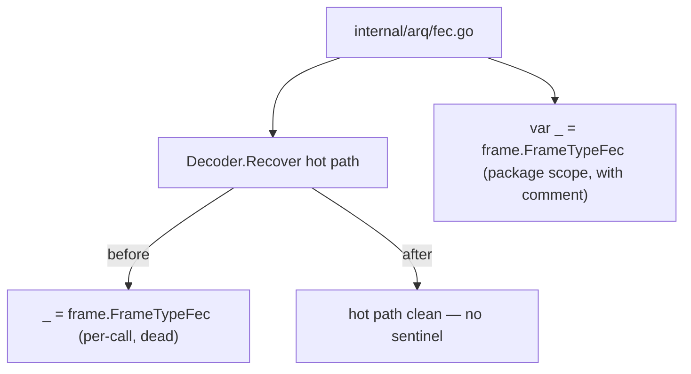
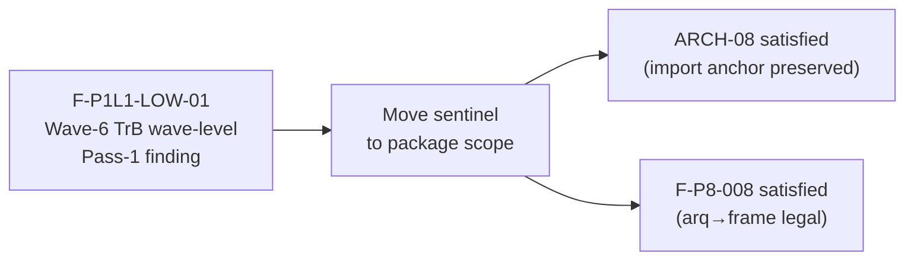

## Summary

Remove the dead `_ = frame.FrameTypeFec` sentinel from the `Decoder.Recover` hot path and relocate it to a package-scope `var` declaration with an explanatory comment.

This is a pure hygiene change — no behavioural or API modification.

**Wave-6 Tranche B wave-level finding:** F-P1L1-LOW-01 (Pass-1 Level-1 low-severity) identified that the per-call `_ = frame.FrameTypeFec` assignment inside `Decoder.Recover` was dead work on every invocation of the hot path. The constant is not used at call-site — it exists solely to keep the `internal/frame` import live (ARCH-08; F-P8-008). Executing it inside the function body on every `Recover` call added noise to the hot path and obscured intent.

The fix moves the sentinel to a single package-scope `var _ = frame.FrameTypeFec` with a doc comment that explains *why* the anchor exists. This is idiomatic Go: package-level blank-identifier anchors are the standard pattern for compile-time import anchoring.

## Architecture Changes

## Story / Finding Traceability

## Diff Summary

| File | Change |
|------|--------|
| `internal/arq/fec.go` | Remove 4-line `_ = frame.FrameTypeFec` block from `Decoder.Recover`; add `var _ = frame.FrameTypeFec` at package scope with explanatory comment |

## Test Evidence

All 18 packages green — `just test` output:

- `internal/arq` tests pass (FEC encode/recover, group boundary, single-loss scenarios)
- No new tests required: this is a structural move with no behavioural change
- `just fmt` clean (gofumpt)
- `just lint` zero issues (golangci-lint)
- `just test-race` clean (race detector)

## Security Review

N/A — no auth, input handling, or network path changes. Pure import-anchor relocation.

## Risk Assessment

| Dimension | Assessment |
|-----------|------------|
| Blast radius | Minimal — single file, single package, dead-code removal |
| Performance impact | Neutral to positive — removes one no-op assignment per `Recover` call |
| Breaking change | None — no API surface change |
| Rollback risk | Trivial — single commit, squash-mergeable |

## Dependencies

None. This branch has no upstream PRs.

## Pre-Merge Checklist

- [x] `just fmt` clean
- [x] `just lint` zero warnings
- [x] `just test` all 18 packages green
- [x] Signed commit
- [x] No AI attribution / Co-Authored-By trailers
- [x] Branch based on develop HEAD 91d5675
- [x] PR description references finding F-P1L1-LOW-01

## AI Pipeline Metadata

- Pipeline mode: hygiene / wave-6-tranche-b pass-1 finding resolution
- Model: us.anthropic.claude-sonnet-4-6
- Autonomy level: auto-merge on CI green (no merge-config.yaml — default Level 4)
