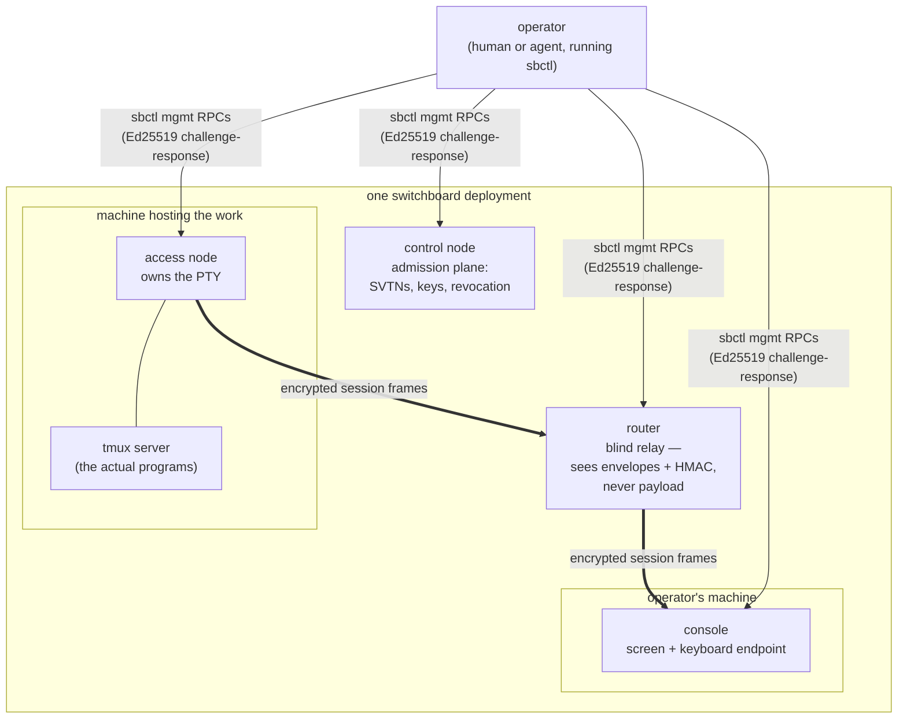
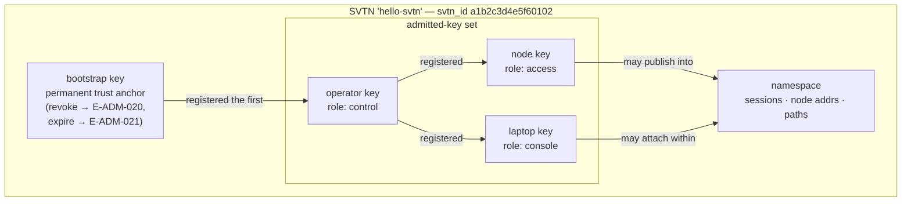
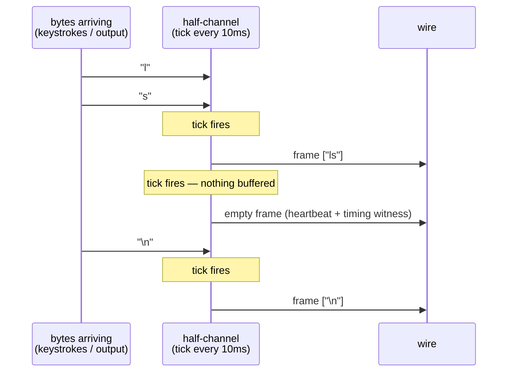
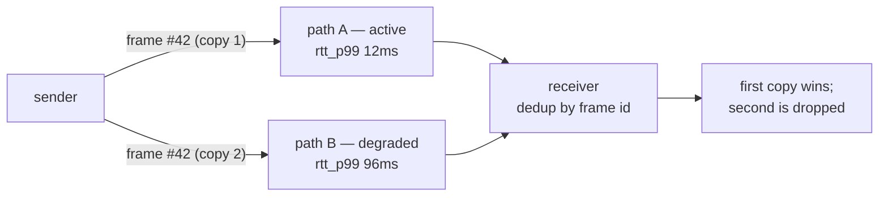
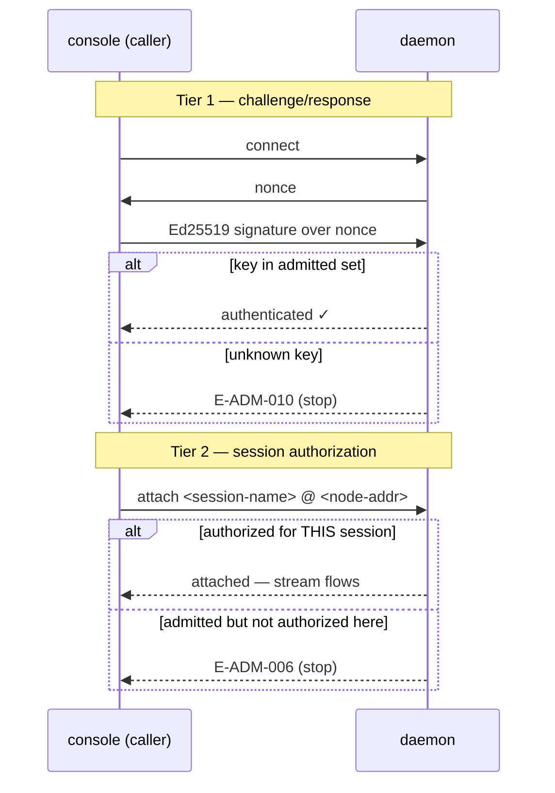
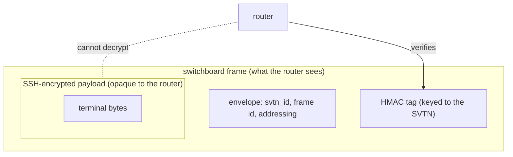

# Switchboard Architecture

A high-level operator-oriented tour of how Switchboard is built. For
the CLI surface, see [docs/sbctl.md](sbctl.md); for the error taxonomy
see [docs/errors.md](errors.md).

---

## The problem

Two people (or an operator and an unattended agent) want to share a
tmux session over the network with:

- **Low latency** for keystrokes;
- **Multi-path resilience** — the connection survives one link going
  bad;
- **End-to-end encryption** — the transport intermediary cannot read
  the content;
- **Explicit trust** — who can see, drive, or manage the session is
  spelled out in named roles, not implicit from network position.

Switchboard is the transport plane. tmux is the session substrate; SSH
is the encryption; Switchboard glues them together with routing and
admission.

---

## The pieces

**Terminology.** Two vocabularies describe the same things at different
levels, and the docs use both:

- A **daemon** is one long-running instance of the `switchboard`
  binary, started in one of four modes: `switchboard access`,
  `switchboard console`, `switchboard control`, or `switchboard
  router`. "Daemon" is the *process-level* word — the thing you start,
  stop, send SIGTERM, and point `sbctl --target` at.
- **Node** and **router** are the *protocol-level* words for the roles
  those processes play in an SVTN. "The access node" and "the access
  daemon" are the same running process, viewed from the network's
  perspective and the operator's shell respectively.
- **sbctl** is not a daemon — it's a short-lived CLI that connects to
  one daemon's management socket, performs one operation, and exits.

There are two kinds of process, both from the same `switchboard` binary:

Management (thin arrows) and session traffic (thick arrows) are
different planes: every daemon serves a management socket that sbctl
authenticates to, while session frames flow only access → router →
console. The control node participates in no session traffic at all.

### Nodes

**Access node** — publishes a local tmux session over the network.
Terminates SSH on both sides; the access node owns the PTY that tmux is
attached to.

**Console** — the interactive terminal endpoint. Runs on the operator's
laptop (or in a container, or under a headless agent runtime); receives
the terminal stream, sends keystrokes upstream.

**Control node** — runs the admission plane: registering keys,
creating SVTNs, revoking access. Purely a management surface — it does
not carry session traffic.

### Routers

Routers relay encrypted frames between nodes. They are **blind relays**:
they see frame envelopes and HMAC tags, but never the SSH-encrypted
payload. A single router binary supports three deployment modes:

| Mode | Role |
|------|------|
| **E** — Edge-local | Runs alongside a node on a single LAN. Fast path for two-machine setups. |
| **PE** — Provider Edge | Production router: connects nodes and peers with other routers. Runs on a jump host or in a datacenter. |
| **P** — Provider Core | Router-to-router only forwarding. Theoretical for now; not yet built. |

The mode is inferred at startup from the config file's
`upstream_routers:` field — an empty list means E, any entry means PE.

Nodes never talk to each other directly. Every frame passes through a
router — even in the E deployment, where the router happens to live on
the same LAN.

---

## SVTNs — Switched Virtual Networks

An **SVTN** is Switchboard's unit of trust and routing scope. It owns:

- A **bootstrap key** — set at creation, a permanent control-role trust
  anchor. Cannot be revoked or expired (`E-ADM-020`, `E-ADM-021`).
- An **admitted-key set** — the keys that are currently allowed to
  admit, drive, or observe traffic in this SVTN.
- A **namespace** for sessions, node addresses, and paths.

SVTNs are created via `sbctl admin svtn create --name=<...>`. The
returned `svtn_id` (hex, 8 bytes) is what appears in wire frames; the
name is what appears on operator commands (see the
[CLI reference](sbctl.md#sbctl-admin-svtn-create)).

Admission is role-based:

| Role | What it can do |
|------|----------------|
| `control` | Register keys, revoke keys, expire keys, destroy the SVTN, invoke management RPCs. |
| `console` | Attach to a session, receive terminal output, send keystrokes. Cannot register or revoke keys. |
| `access` | Publish a session. |

Role checks happen at two layers — an admission gate (are you in the
key set at all?) and an authority gate (does your role permit this
operation?). Role escalation is prevented by a cross-check against the
stored role at register time (`E-ADM-019`).

---

## Timeslice framing

Two design goals pull in different directions: keystrokes want tiny
frames delivered immediately, terminal output wants large frames
delivered efficiently. Switchboard reconciles them with **timeslice
framing** — "the bus leaves on time, full or not."

- Each direction (upstream, downstream) has its own clock.
- When a tick fires, whatever bytes are ready get bundled into one frame
  and sent.
- If nothing is ready, an empty frame is sent (heartbeat + timing
  witness).

This gives:

- Predictable jitter — the frame cadence is stable regardless of load.
- Cheap heartbeats — an empty frame doubles as liveness probe.
- Symmetric routing — every frame carries the same envelope shape.

---

## Asymmetric half-channels

Upstream and downstream traffic have different profiles:

| Channel | Content | Loss tolerance | Ordering |
|---------|---------|-----------------|----------|
| Upstream | Keystrokes | Loss-intolerant | Strict FIFO |
| Downstream | Terminal output | Bursty; screen state can be re-synced | Loose |

They are handled by **half-channel** state machines with independent
clocks, buffers, and retransmission policies. The console never blocks
its downstream receiver on upstream progress and vice versa.

---

## Multi-path routing

When more than one path is available between two nodes, Switchboard runs
a **duplicate-and-race** strategy:

- The sender emits the same frame on every viable path.
- The receiver deduplicates by frame id.
- Path quality is tracked (RTT, p99 RTT, loss) and surfaced via `sbctl paths list`.

Paths carry a status:

- `active` — currently used for forwarding.
- `degraded` — reachable but under-performing; kept as a backup.
- `failed` — reserved for a future release; MUST NOT appear in v0.1.0-rc.1.

Path metrics stabilize once ≥10 RTT samples have been collected. Before
that, `rtt_p99_ms` is emitted as the sentinel string `"pending"`
(see BC-2.06.003 EC-003 in the source specs).

---

## Admission tiers

Two admission checks happen for every session attach:

**Tier 1 — challenge/response.** The daemon issues a nonce; the caller
signs it with their private key; the daemon verifies the signature
against the SVTN's admitted-key set. Nonce replay is prevented
(`E-ADM-008`).

**Tier 2 — session authorization.** Even a fully-admitted console must
be authorized for the specific `<session-name>` on the specific
`<node-addr>` it wants to attach to. Failure emits `E-ADM-006`.

Read-only console attachment is possible — the upstream can reject
write operations without dropping the session, surfacing `E-ADM-007`
(degraded, session continues).

---

## Wire security

Every frame carries an HMAC tag keyed to the SVTN. Verification lives
inside the router and inside each receiving node. Failures are logged
and dropped (`E-ADM-002`, `E-ADM-016`). A sliding-window rate check
raises `E-ADM-017` (degraded) when a single source hits an HMAC failure
threshold — designed to surface active tampering without opening a
denial-of-service vector.

The SSH end-to-end tunnel is nested inside the Switchboard transport.
Routers verify the HMAC of the outer frame; they never see, decrypt, or
touch the SSH payload.

---

## Where the code lives

Internal packages, roughly by layer:

| Package | Layer |
|---------|-------|
| `internal/frame` | Frame encode/decode, header parsing. |
| `internal/hmac` | HMAC primitive. |
| `internal/admission` | Tier 1 admission gate, admitted-key set. |
| `internal/session` | Tier 2 session authorization, session lifecycle. |
| `internal/halfchannel` | Timeslice clock, upstream/downstream state machines. |
| `internal/paths` | Path ranking, RTT/loss metrics, keep-alive probes. |
| `internal/multipath` | Duplicate-and-race dispatch; receiver dedup. |
| `internal/discovery` | Presence advertisement, session enumeration. |
| `internal/routing` | Router path selection, HMAC gate. |
| `internal/svtnmgmt` | SVTN lifecycle and admitted-key state. |
| `internal/config` | Config file parsing, validation, reload. |
| `internal/metrics` | Quality-indicator computation, path metrics storage. |

The `cmd/switchboard/` entrypoint dispatches to daemon subcommands
(`router`, `access`, `console`, `control`); `cmd/sbctl/` is the
operator CLI.

---

## What's in v0.1.0-rc.1

The current MVP scope is **nodes + E router on a single LAN** —
proving out the edge protocol and user experience before tackling
multi-hop networking. Wire protocol, admission tiers, timeslice
framing, half-channels, path metrics, and the full admin key/svtn
lifecycle are all present. See [docs/sbctl.md — Unimplemented verbs
(PENDING)](sbctl.md#unimplemented-verbs-pending) for the verbs that
are spec-defined but not yet wired.

---

## Smoke invariants

Stratified smoke harness. Three tiers cover different failure classes
at different cadences; each tier is independently runnable and reports
to its own timestamped `.smoke/<UTC>/report.jsonl`. Total wall-clock:
Tier 1 <10s, Tier 2 ~30s, Tier 3 ~10s.

### Tiers

| Tier | Recipe | Cadence | Script | Budget |
|---|---|---|---|---|
| 1 | `just smoke-quick` | Every PR (Quality Gate job) | `test/smoke/invariants.sh` | <10s |
| 2 | `just smoke` | Nightly + on-demand | `test/smoke/tier2-daemon.sh` | ~30s |
| 3 | `just smoke-tutorial` | Nightly + on-demand | `test/smoke/tier3-tutorial.sh` | ~10s |

Tier 1 is the sentinel gate (INV-1..INV-10) — cheap enough to run on
every PR, catches operator-boundary regressions before they merge.
Tier 2 exercises daemon lifecycle against a live process — too slow
for per-PR, but the class of regressions it catches (SIGTERM hangs,
stale-socket restart, sbctl auth-taxonomy) matters enough for a
nightly cadence. Tier 3 replays the getting-started tutorial's bash
blocks — regression harness for the drift class caught in task #171.

### Contract rules

1. **Behavioral only.** Every assertion checks exit code, stream
   direction (stdout vs stderr), or substring presence. Cosmetic diffs
   — exact whitespace, exact ordering, colour codes, timestamp format
   — are forbidden. Reviewers reject cosmetic sentinels in PR review.
2. **Paired docs.** New invariants require a paired update to this
   section. An invariant without a documented rationale is a phantom
   assertion.
3. **Fail loud, fail fast.** A Tier 1 failure blocks merge. On failure,
   CI uploads the JSONL report as an artifact (`smoke-report`, 7-day
   retention) for post-mortem.
4. **Isolated.** Each tier runs in a fresh `mktemp -d` tmpdir with
   `trap` cleanup. Nothing touches `~/.switchboard`, `~/.sbctl`, or
   any user state.
5. **Exit codes (Tier 1 & 2).** `0` = all-pass. `1` = regression (one
   or more assertions failed). `2` = harness itself is broken (binary
   missing, tmpdir unwritable). CI distinguishes "smoke found a bug"
   from "smoke can't run."
6. **Exit codes (Tier 3).** `0` = clean pass, no expected-fails. `1` =
   unexpected regression. `2` = harness broken. `3` = reserved for a
   future re-emergent expected-fail; currently unused, since
   S-BL.ROUTER-RUNTIME landed and no known Tier-3 gates remain open.
7. **Degrade explicitly.** When a probe cannot be established, tiers
   emit `TIER<N>-SKIP` with a reason string rather than inventing a
   fake pass or a bare `sleep 1`. SKIPs are visible in the JSONL
   report.

### Tier 1 sentinels

| ID | Behavior asserted | Guards against |
|---|---|---|
| INV-1 | `switchboard --help` exits 0, stdout non-empty, stderr empty | BC-2.07.002 EC-003 Ruling A regression: `--help` printed a diagnostic to stderr and exited 1 pre-PR #77 |
| INV-2 | `switchboard --version` exits 0, stdout starts with `switchboard ` | S3-class regression: version banner is a hardcoded literal instead of `args[0]`-derived basename |
| INV-3 | `sbctl --help` exits 0, stdout non-empty, stderr empty | Same class as INV-1 for sbctl |
| INV-4 | `sbctl --version` exits 0, stdout starts with `sbctl ` | O3-class regression: `sbctl --version` flag was missing entirely pre-PR #77 |
| INV-5 | `sbctl` (no args) exits 2, stderr contains `available subcommands:` | interface-definitions.md §174 usage-error contract |
| INV-6 | `sbctl <unknown-subcommand>` exits 2, stderr contains `unknown subcommand` | interface-definitions.md §174 unknown-subcommand contract |
| INV-7 | For each of `access | router | console | control`: `switchboard  --help` exits 0 with non-empty stdout, short-circuiting before any I/O | Subcommand-scoped help regressions — daemon subcommands that try to open sockets before parsing `--help` |
| INV-8 | Both `--version` banners contain the CI-injected `${VERSION}` substring | Missing `-ldflags "-X main.version=..."` wiring — the task #163 sbctl-a packaging defect at pre-merge time |
| INV-9 | `switchboard control --config <valid>` emits no `E-CFG-*` code on stderr before termination | Config parser regressions that reject well-formed configs — the false-positive side of the taxonomy contract |
| INV-10 | `switchboard control --config <missing-tick_interval>` exits non-zero with stderr containing both `E-CFG-001` and `tick_interval` | task #171 drift class: getting-started §2 shipped without `tick_interval` and only the daemon's error text told the operator what was wrong. Asserts the *locate-the-defect* signal survives |

INV-8 is SKIPPED if `VERSION` is not exported (local-dev contract).
`just smoke-quick` stamps a timestamped `VERSION` automatically; CI
stamps `smoke-ci-${GITHUB_SHA::7}`.

INV-9 and INV-10 use fixtures at `test/smoke/testdata/` rather than
`internal/config/testdata/`. The smoke harness is deliberately not
coupled to internal test fixtures owned by unit tests — the smoke
contract is between the operator and the built binary.

### Tier 2 assertions

`test/smoke/tier2-daemon.sh` runs the daemon in `control` mode (Unix
socket; access mode requires a PTY unavailable in most CI hosts) and
asserts the shared main.go signal-handling and config-load path.

| ID | Behavior asserted | Guards against |
|---|---|---|
| T2-1 | Daemon starts with valid config; socket file appears within 5s | Startup regressions — daemon hangs before bind, or exits during config validation for a config that unit tests say is valid |
| T2-2 | SIGTERM produces exit 0 (clean shutdown via `signal.NotifyContext`) or 143 within 3s of send | Signal-handling regression — daemon ignores SIGTERM, or drain loop hangs past its budget |
| T2-3 | Second daemon on the same socket path becomes ready within 5s, or refuses with a taxonomy code (no panic, no hang) | Stale-socket restart hazard — Go's `net` package doesn't unlink on close; a daemon that neither unlinks-before-bind nor refuses-cleanly is a foot-gun |
| T2-4 | `sbctl --target=<sock> sessions list` against a running daemon returns a taxonomy code (`E-ADM-*`/`E-CFG-*`/`E-NET-*`), NOT a Go panic or bare "connection refused" | interface-definitions.md §174 error-taxonomy contract on the sbctl side — guarantees operators see a stable code, not a stack trace |

### Tier 3 assertions

`test/smoke/tier3-tutorial.sh` extracts fenced blocks from
`docs/getting-started.md` via awk and asserts against them.

| ID | Behavior asserted | Guards against |
|---|---|---|
| T3-2-extract | Router yaml block is extractable from §2 by literal awk pattern | Documentation-format regression — someone edits the tutorial to use a code fence variant awk can't find |
| T3-2-config | Extracted tutorial router config parse+validates cleanly (no `E-CFG-*` on stderr) | task #171 drift class at the *tutorial* boundary — the config in the doc must actually work, not just look like it works |
| T3-2-router | `switchboard router --config <tutorial-config>` binds mgmt socket + data listener and shuts down cleanly on SIGTERM (S-BL.ROUTER-RUNTIME). A regression to "not implemented" now fails the tier | Router runtime regression — the story replaced the "not implemented" stub with a real mgmt-plane + data-listener wiring; the tier guards against a revert |
| T3-4-taxonomy | `sbctl` with no target/auth exits non-zero with a taxonomy message, no Go panic | The "Common pitfalls" section's promise that every error carries a stable code |

Summary line format: `Tier 3: <N> passed, <M> expected-failed, <K> unexpected-failed`.

### Spec assertions (Plan D)

`test/smoke/spec-runner.sh` executes `test/smoke/spec-assertions.json`
— a machine-readable catalog projecting spec acceptance criteria into
behavioral assertions. Where Tier 1 sentinels are hand-written bash
guarding *shipped fixes*, spec assertions are data guarding *spec
claims*: each entry cites its BC/AC anchor, restates the claim in
prose, and declares the expected behavior (exit code, stream
emptiness, substring presence, or a `jq` predicate over JSON output).
Adding spec coverage = adding a JSON entry; no new shell. Runs on
every PR alongside Tier 1 (`just smoke-spec`; <5s).

Assertion vocabulary: `exit`, `stdout_empty`, `stderr_empty`,
`stdout_contains`, `stderr_contains`, `stderr_contains_2`,
`stdout_jq`, `stderr_jq`. Same contract rules as the tiers —
behavioral only, never cosmetic.

Expected-fail entries carry `expected_fail: "<issue> — <reason>"`. A
failing expected-fail reports XFAIL and does not fail the run; a
*passing* expected-fail reports XPASS and FAILS the run — the fixing
PR must remove the annotation (same discipline that closed the
Tier 3 #144 gate once S-BL.ROUTER-RUNTIME landed). SPEC-2 and
SPEC-4 were expected-fail on issue #89 (error-path double-print
broke whole-stream JSON parse) — found by this harness's first
run, which was the validation the pattern needed. The single-print
contract was landed and the annotations were removed; both entries
are now required-pass.

| ID | Anchor | Claim |
|---|---|---|
| SPEC-1 | BC-2.06.003 AC-006 / BC-2.07.003 | daemon-unreachable exits 1 with `E-NET-001` on stderr, stdout clean |
| SPEC-2 | BC-2.06.003 AC-006 / S-6.05 envelope | `--json` unreachable error is one machine-parseable envelope (`.ok==false`, `.error.code=="E-NET-001"`) |
| SPEC-3 | S-5.02 F-M1 / E-CFG-010 | `router status --target=` exits 2 with `E-CFG-010` on stderr |
| SPEC-4 | S-5.02 F-M1 / S-6.05 envelope | `--json` usage error still emits the envelope |
| SPEC-5 | BC-2.09.003 E-CFG-004 | nonexistent `--config` exits 1 with `E-CFG-004` + offending path on stderr |

### Adding a new invariant

1. Confirm the assertion is behavioral, not cosmetic.
2. Pick the right tier by cost and cadence. Tier 1 for cheap
   binary-boundary checks; Tier 2 for anything requiring a live
   daemon; Tier 3 for tutorial-derived assertions. If the assertion
   restates a spec AC's claim verbatim, prefer a spec-assertions.json
   entry over a bespoke sentinel.
3. Add the check to the appropriate script following its existing
   pattern (`run_capture` → conditional → `emit`) — or, for spec
   assertions, add the JSON entry with its BC/AC anchor.
4. Add a row to the table above with the guarded-against defect class.
5. If the invariant guards a specific PR-shipped fix, cite the PR
   number in the script comment.

Every invariant must trace back to a concrete regression it prevents.
No speculative sentinels.

### Historical context

Plan A (INV-1..INV-8, task #175, PR merged 2026-07-04) was designed
by a BMAD party-mode session in response to four operator-boundary
regressions caught by manual tutorial-walk smoke on the same day
(S1/S3/O1/O3 in `.factory/STATE.md` drift register). The sentinels
would have blocked all three fixes shipping without a pre-merge gate.

Plan B (this section — INV-9/INV-10 Tier 1 extension + Tier 2 daemon
lifecycle + Tier 3 tutorial walk, task #176) stratifies by cost and
cadence so nightly-only assertions don't block PRs and cheap
sentinels don't wait on daemon startup.

---

## Further reading

- [docs/getting-started.md](getting-started.md) — spin up an SVTN and connect.
- [docs/sbctl.md](sbctl.md) — full CLI reference.
- [docs/errors.md](errors.md) — error taxonomy.
- `.factory/specs/` — behavioral contracts, verification properties, and PRD supplements (spec-side canonical sources).
