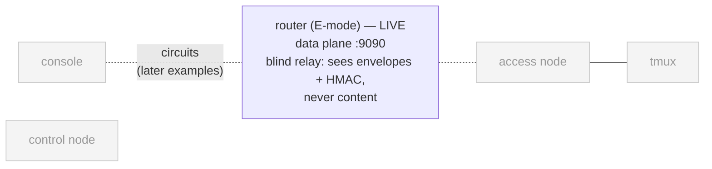
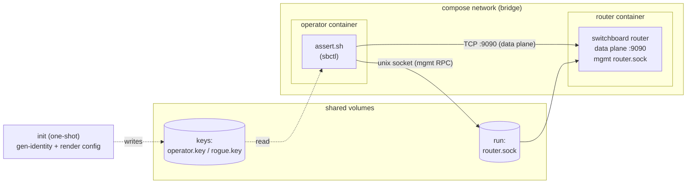
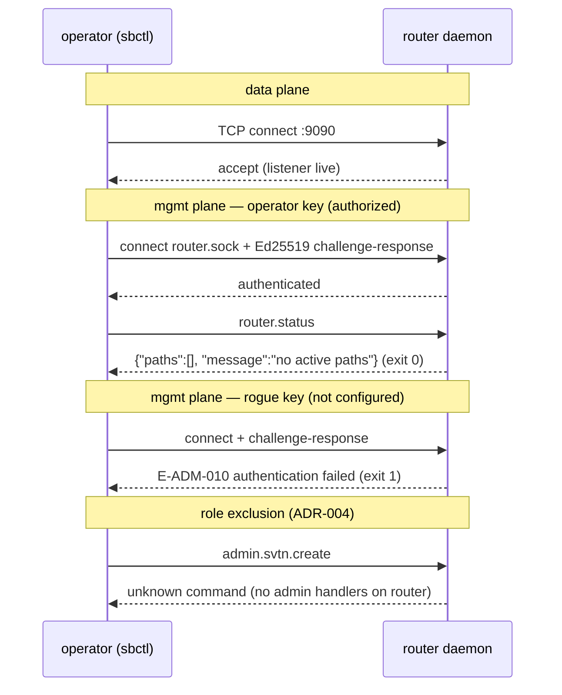

# 01 — hello-router

The smallest functional proof: one router daemon in E-mode, one operator
container asserting the management plane from a **separate network
namespace** — the single-host analog of "operator machine reaches the
router over the LAN".

Uses the **published alpha binaries** downloaded from GitHub Releases
(no source build). Pin a different release with
`SWITCHBOARD_RELEASE=<tag> docker compose build`.

## Topology

### The network view

This example stands up **only the carrier** — the road, before any
cars. One router in E-mode, alone: the blind relay every later example
routes circuits through. Everything grey arrives further up the ladder;
no session traffic flows in this lab.



Two things are proven at this rung: the **data-plane listener** is
reachable from another network namespace (the "second machine on the
LAN" property — the road exists), and the router **refuses to be
anything but a carrier** — it registers no `admin.*` handlers at all
(role exclusion). The other half of the lab is proving the management
plane fails closed, and there, operating `sbctl` *is* the objective.

### Ground level — the compose plumbing



The operator container lives in its **own network namespace** — reaching the
router's TCP listener is the single-host analog of a second machine on
the LAN. The management plane crosses a shared unix-socket volume.

## Transaction under test



## What it proves

| Assertion | Claim |
|---|---|
| `DATA-PLANE-TCP` | The data-plane listener (`listen_addr: 0.0.0.0:9090`) is reachable across network namespaces. |
| `MGMT-AUTH-STATUS` | Ed25519 challenge-response with a configured operator key succeeds and `router status` answers with the documented empty state. |
| `MGMT-PATHS-LIST` / `MGMT-JSON` | `paths list` works; `--json` emits valid JSON (piped through `jq`). |
| `AUTH-ROGUE-DENIED` | A key *not* in `authorized_operator_keys` is rejected with `E-ADM-010` — auth fails closed with a stable taxonomy code. |
| `ADMIN-NOT-ON-ROUTER` | Router daemons register no `admin.*` handlers (ADR-004 role exclusion). |

## Setup + run

```bash
cd examples/01-hello-router
docker compose up --build --exit-code-from operator
```

Exit code 0 = all assertions passed. Tear down with
`docker compose down -v` (the `-v` clears the generated keys/config
volumes so the next run regenerates them).

## Things to try

- **Watch the router logs:** `docker compose logs router` — the daemon
  logs its listen address, management socket, drain/keepalive defaults,
  and `mode=E` on stderr.
- **Run sbctl by hand:**
  ```bash
  docker compose run --rm operator bash
  sbctl --target=/run/switchboard/router.sock --key=/keys/operator.key router status
  sbctl --json --target=/run/switchboard/router.sock --key=/keys/operator.key paths list | jq
  ```
- **Break the config on purpose:** edit `init.sh` to drop
  `tick_interval`, `docker compose down -v && docker compose up`, and
  watch the router fail fast with `E-CFG-001 ... outside allowed range` —
  the exhaustive config-validation contract.
- **Probe the error taxonomy:** point sbctl at a dead socket path and
  observe `E-NET-001 daemon unreachable` — stable codes, never a Go panic.

## Key-format note

Two key formats are involved (see `_shared/gen-identity.sh`): the daemon
wants SPKI `PUBLIC KEY` PEM in `authorized_operator_keys`; sbctl wants an
**OpenSSH-format** private key. Feeding sbctl the PKCS#8 PEM fails with
`E-CFG-010 ... (got ed25519.PrivateKey)` — a known alpha quirk (pointer
vs value type assertion in the key loader).
