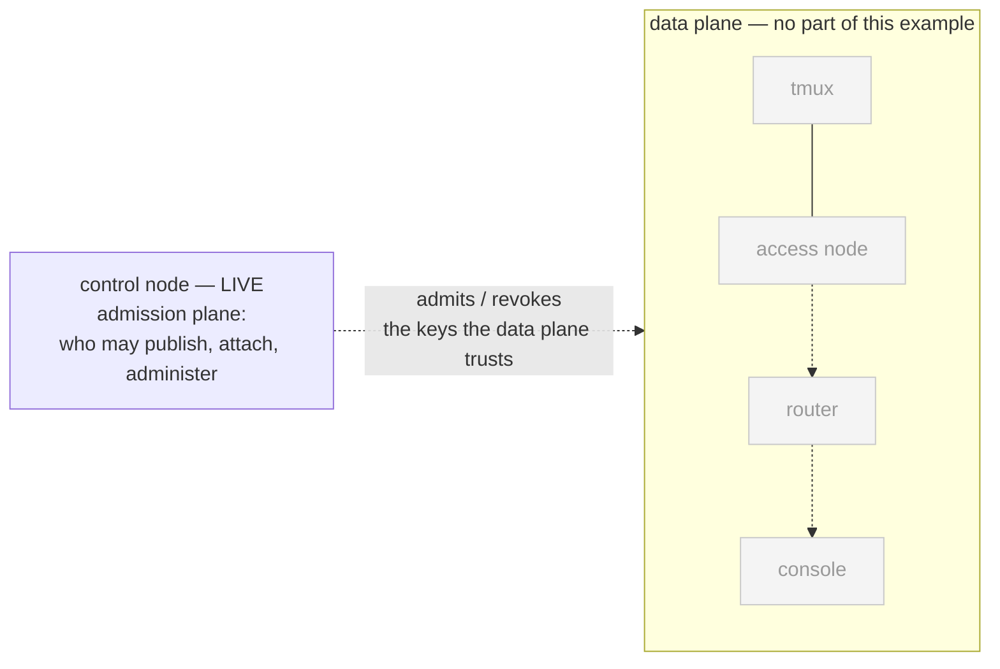
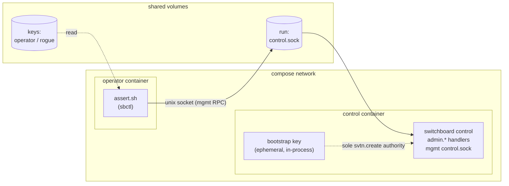
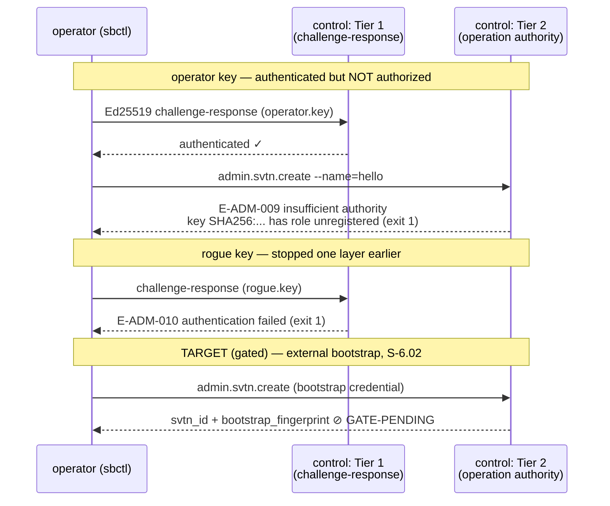

# 02 — admin-fails-closed

One **control-mode** daemon — the only daemon mode that registers
`admin.*` handlers (ADR-004 role exclusion) — and an operator proving the
authority model fails closed at both layers.

## Topology

### The network view

The control node is the **SVTN operator's desk** — the admission plane
that decides who is in the network at all. It carries no session
traffic, ever: the data plane (grey) exists entirely apart from it.
This lab is deliberately about *operating* that desk, so unlike most
examples, `sbctl` is the star here rather than a footnote.



### Ground level — the compose plumbing



## Transaction under test



The proof hinges on *which* refusal comes back: `E-ADM-010` means the
caller never got past authentication; `E-ADM-009` means authentication
succeeded and the **authority check** refused — two different layers,
two different codes.

## The two-layer model this example makes visible

1. **Layer 1 — management authentication.** Every sbctl call performs an
   Ed25519 challenge-response. Keys listed in `authorized_operator_keys`
   pass; anything else is `E-ADM-010 authentication failed`.
2. **Layer 2 — operation authority.** Passing layer 1 does not grant
   admin authority. `admin svtn create` is **bootstrap-only**: the sole
   authorized key is the daemon's own in-process key, which is ephemeral
   in this alpha (generated at startup, never written to disk). An
   authenticated operator gets
   `E-ADM-009: insufficient authority ... has role unregistered`.

The interesting consequence, asserted here: **in this alpha no external
caller can create an SVTN at all.** The `getting-started.md` §3 bootstrap
walkthrough is target behavior for rc.1 (persistent bootstrap-key wiring,
S-6.02). The `SVTN-CREATE-TARGET` assertion encodes that target as a
*gated check*: it reports `GATE-PENDING` today and flips to `GATE-PASS`
the day the wiring lands (run with `GATED=1` to make pending gates fail —
useful in CI once the feature ships).

## Setup + run

```bash
cd examples/02-admin-fails-closed
docker compose up --build --exit-code-from operator
docker compose down -v
```

## Things to try

- **Read the denial like an auditor:** the E-ADM-009 message carries the
  caller's key fingerprint (`SHA256:...`) and its resolved role — enough
  to answer "who tried what" from logs alone.
- **Prove layer separation:** run the same `admin svtn create` with
  `--key=/keys/rogue.key` and compare the codes — E-ADM-010 (layer 1)
  vs E-ADM-009 (layer 2). Two different refusals, two different layers.
- **Try the trust-anchor guards:** `admin key revoke` against the
  bootstrap key of a hypothetical SVTN is permanently forbidden
  (E-ADM-020/E-ADM-021) — the trust anchor cannot be removed even by
  a control key.
