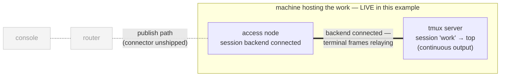
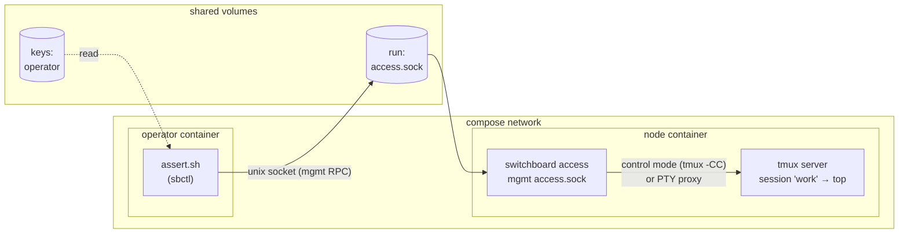
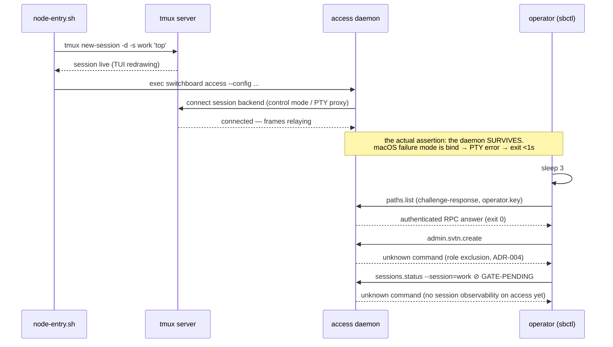

# 03 — tmux-access-node

One **access-mode** daemon co-located with a real tmux server whose
session runs `top` — a live TUI producing continuous output. This is the
node side of the switchboard story: the daemon that connects to a local
tmux and (eventually) publishes its sessions to the network.

## Topology

### The network view

This is the **far side of the internet** — the machine hosting the
work. The segment proven live here is the one where the terminal bytes
are born: a real tmux server with a real TUI redrawing, and the access
daemon holding a live connection to it. Publishing those sessions
toward the router (dotted) waits on the network connector.



### Ground level — the compose plumbing



## Transaction under test



## Why this example earns its place

Access mode **cannot be exercised on a stock macOS dev machine**: the
PTY-proxy fallback dies on `/dev/ttysNN` permissions
(`fatal: cannot connect to session backend`), which is why the repo's own
tier-2 smoke substitutes control mode. A Linux container has a normal
`/dev/pts`, so this compose file is the first place the access daemon's
session-backend connection runs for real. `DAEMON-SURVIVES` holds the
claim for several seconds — the macOS failure mode is bind → PTY error →
exit within a second, so surviving with the backend connected is the
actual proof.

## What it proves / what's gated

| Assertion | Claim |
|---|---|
| `DAEMON-SURVIVES` | Access daemon starts against a live tmux server and stays up (session backend connected). |
| `MGMT-PATHS-LIST` | The daemon's own management plane answers authenticated RPCs. |
| `ADMIN-NOT-ON-ACCESS` | Role exclusion: no `admin.*` handlers on access daemons (ADR-004). |
| `SESSIONS-VISIBLE` *(gated)* | TARGET: the published `work` session is observable via the management plane. No RPC exposes publications on the access daemon in this alpha. |

## Setup + run

```bash
cd examples/03-tmux-access-node
docker compose up --build --exit-code-from operator
docker compose down -v
```

## Things to try

- **Watch top actually running:**
  ```bash
  docker compose exec node tmux attach -t work    # detach: Ctrl-b d
  ```
- **Watch the daemon's view:** `docker compose logs node` — see whether
  the connector used tmux control mode or fell back to the PTY proxy.
- **Add more sessions:** `docker compose exec node tmux new -d -s logs
  'watch -n1 date'` then check the daemon logs for publication activity.
- **Kill tmux out from under the daemon:**
  `docker compose exec node tmux kill-server` — observe the
  mid-session backend-failure handling (`E-SYS-002`, daemon exits
  non-zero; compose restarts nothing by design, so the failure is
  visible).
