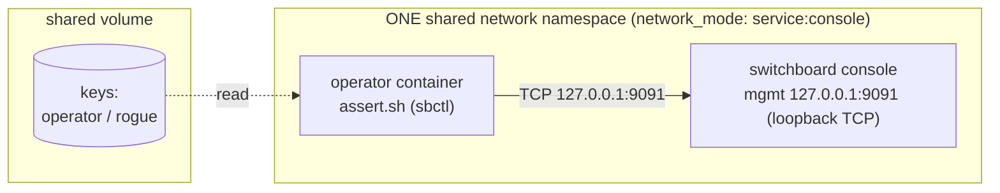
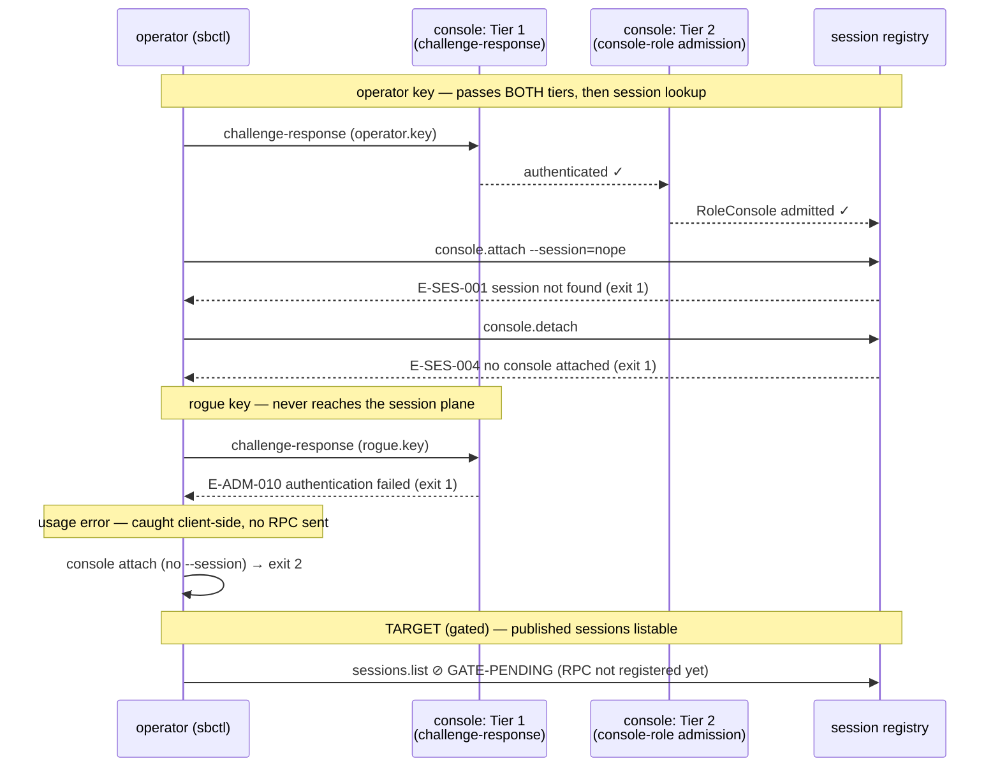

# 04 — console-surface

One **console-mode** daemon — the operator-facing side that will attach
to remote tmux sessions — and an operator exercising its session-plane RPC
surface (`console attach / detach / switch`, `sessions status`).

## Topology



Unlike examples 01–03 there is no unix-socket volume: console
management sockets are **loopback TCP only** (`E-CFG-008`), so the
operator container joins the console's namespace. Read the pair of
services as **one operator laptop**: in a real deployment the console
daemon and sbctl run on the same machine — the console is the
operator's window into remote sessions, sbctl is the operator's
control of it.

## Transaction under test



Reaching `E-SES-*` (rather than `E-ADM-010`) is itself the proof that
both admission tiers passed — the refusal depth tells you how far the
call traveled.

## The networking wrinkle this example teaches

Console management sockets are **loopback TCP only** (`E-CFG-008`
rejects non-loopback binds; unix paths are not accepted in console
mode — default is `127.0.0.1:9091`). A operator in its own network
namespace can't reach loopback in another container, so the operator runs
with `network_mode: "service:console"` — it shares the console's
namespace, exactly like a second terminal on the operator's laptop.

## What it proves / what's gated

| Assertion | Claim |
|---|---|
| `ATTACH-UNKNOWN-SESSION` | `console attach` answers `E-SES-001` for unknown sessions — proving Tier-1 (challenge-response) **and** Tier-2 (console-role admission) both passed to reach the session plane. |
| `DETACH-NOT-ATTACHED` | `console detach` with nothing attached → `E-SES-004`. |
| `SESSIONS-STATUS-UNKNOWN` | `sessions status` uses the same stable taxonomy. |
| `ROGUE-DENIED` | Unconfigured keys stop at Tier 1 with `E-ADM-010`. |
| `ATTACH-REQUIRES-SESSION` | Usage errors are client-side (exit 2), never sent as RPCs. |
| `SESSIONS-LIST-TARGET` *(gated)* | TARGET: published sessions from access nodes are listable and attachable. Requires the access→router→console connector (not wired in this alpha; `sessions.list` is not yet a registered RPC). |

## Setup + run

```bash
cd examples/04-console-surface
docker compose up --build --exit-code-from operator
docker compose down -v
```

## Things to try

- **See both refusal layers:** compare
  `--key=/keys/rogue.key console attach --session=x` (`E-ADM-010`,
  Tier 1) with `--key=/keys/operator.key console attach --session=x`
  (`E-SES-001`, past both tiers). Same command, different depth of
  refusal.
- **Try `console switch`:** same taxonomy; switch to an unknown session
  is also `E-SES-001`.
- **Bind violation:** change `management_socket` in `init.sh` to
  `0.0.0.0:9091`, `docker compose down -v && up`, and watch the daemon
  refuse to start with `E-CFG-008` — the loopback constraint is
  enforced at startup, not documented-and-hoped.
