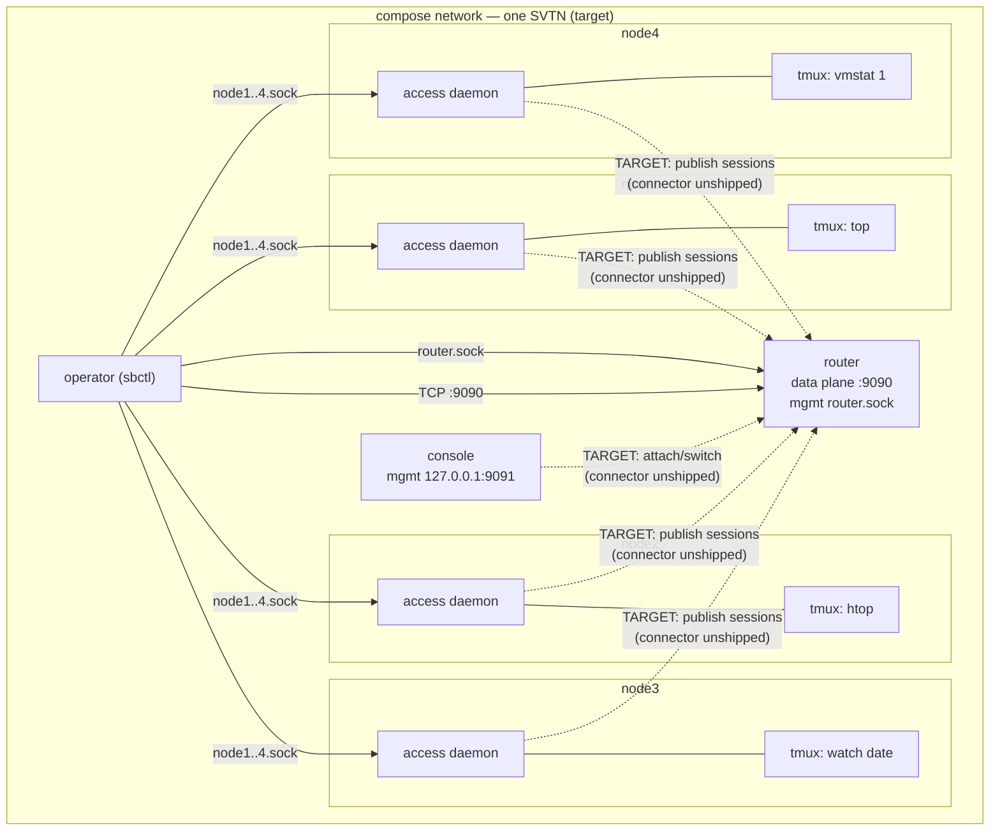
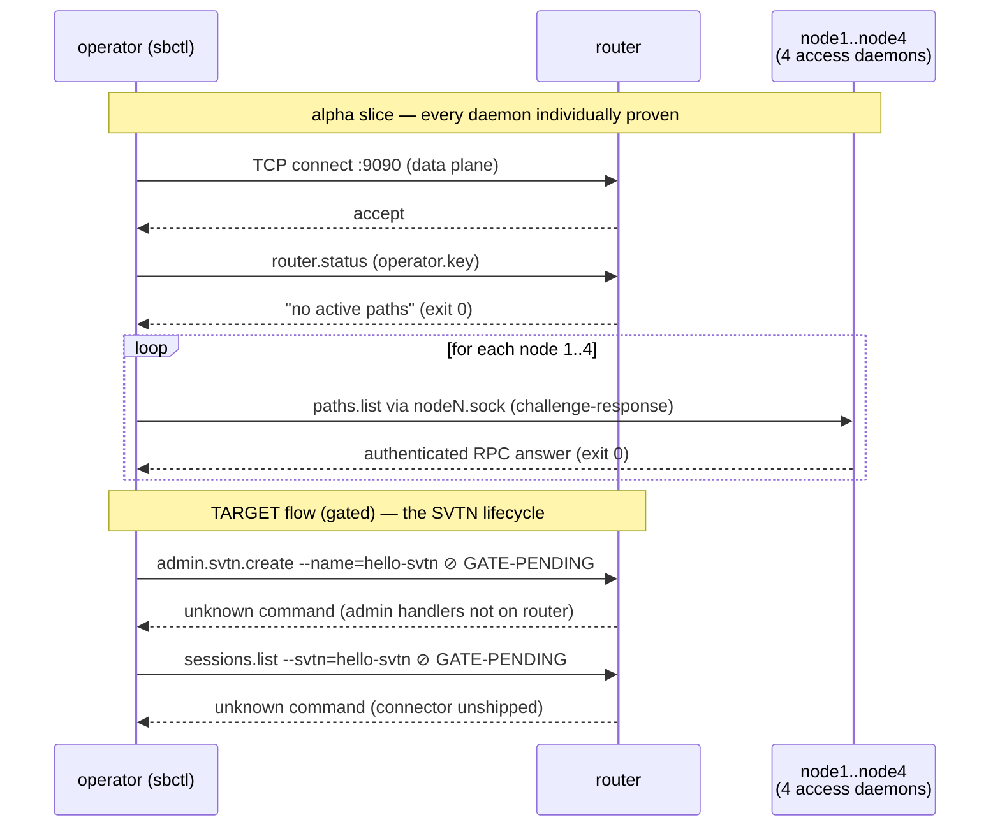

# 05 — four-nodes-one-svtn

The target topology of the getting-started tutorial, at full width: one
router, **four access nodes** each hosting a different live program in
tmux, and **one console** — seven containers on one compose network.

| Node | Program | Why |
|---|---|---|
| node1 | `top` | classic full-screen TUI, constant redraws |
| node2 | `htop` | heavier TUI (colors, meters, per-cell updates) |
| node3 | `watch -n1 date` | full-screen refresh on an interval |
| node4 | `vmstat 1` | scrolling line output (non-TUI contrast case) |

## Topology



Solid lines run today; dashed lines are the target data flow the gated
checks wait for. The management sockets (`nodeN.sock`, `router.sock`)
share one `run:` volume with the operator.

## Transaction under test



## What it proves today

- All seven services come up and **stay** up: per-node compose
  healthchecks require the tmux session alive *and* the access daemon's
  management socket present, and the operator only starts when every
  daemon is healthy. Four access daemons each holding a live session
  backend is the widest access-mode exercise the alpha has had.
- The operator completes an authenticated management round-trip to the
  router and **each of the four nodes** (five key-based
  challenge-responses against five separate daemons).
- The router's data plane is reachable from the operator's namespace.

## What's gated (the point of the example)

The SVTN lifecycle this topology exists for — `admin svtn create`,
registering node/console keys, `sessions list` showing `node1..node4`,
console attach/switch across nodes — needs two pieces the alpha hasn't
shipped: an external bootstrap path for `svtn.create` (S-6.02) and the
access→router→console connector. Those assertions run as *gated checks*:
`GATE-PENDING` today, `GATE-PASS` the day the wiring lands, hard
failures under `GATED=1` (CI mode for the post-connector world). This
compose file is intended to become the acceptance test for that
milestone without changing shape.

## Setup + run

```bash
cd examples/05-four-nodes-one-svtn
docker compose up --build --exit-code-from operator
docker compose down -v
```

## Things to try

- **Tour the fleet:** `docker compose exec node2 tmux attach -t node2`
  (htop; detach with Ctrl-b d), then the same for node1/3/4 — four
  different programs running under four different access daemons.
- **Simulate a node failure:** `docker compose exec node3 tmux
  kill-server` and watch node3's healthcheck flip to unhealthy while
  the other six services stay green — per-node blast radius.
- **Ask every daemon who it is:** loop `sbctl --target=/run/switchboard/nodeN.sock
  --key=/keys/operator.key paths list` from `docker compose run --rm operator bash`.
- **Preview the future:** run with `GATED=1 docker compose up ...` to
  see exactly which target behaviors the alpha still refuses — the
  same list a release manager would check before calling the connector
  milestone done.
