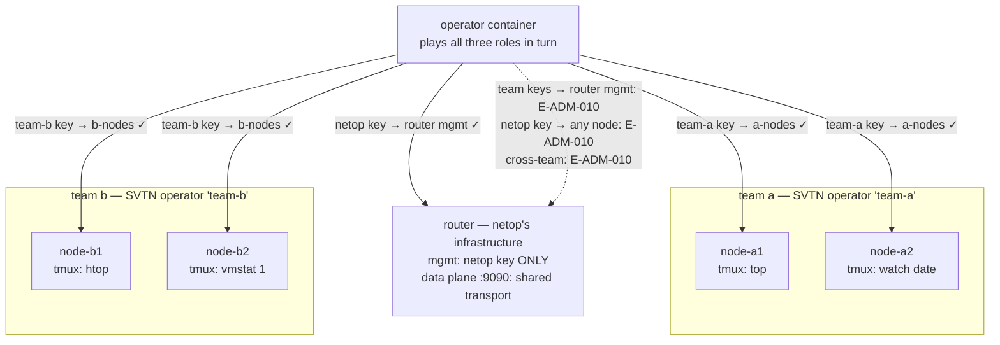
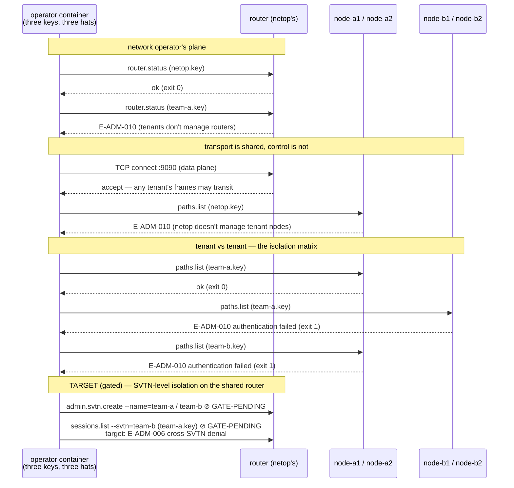

# 06 — two-svtn-isolation

One shared router, two teams with two access nodes each, and **three
disjoint identities**. The claims under test:

1. *Tenants cannot operate each other's infrastructure* — team A's key
   opens nothing of team B's, and vice versa.
2. *Tenant and network-operator authority don't overlap* — the teams
   cannot manage the router; the network operator cannot manage the
   teams' nodes. Sharing transport does not mean sharing control.

## The roles in play

Role vocabulary per the domain spec's ubiquitous language (see
[docs/architecture.md — Who runs what](../../docs/architecture.md#who-runs-what--the-two-sides-of-the-trust-boundary)):

| Identity | Role | Administers |
|---|---|---|
| `netop` | **network operator** — provides the router infrastructure | the router |
| `team-a` | **SVTN operator** for team a | node-a1, node-a2 |
| `team-b` | **SVTN operator** for team b | node-b1, node-b2 |

This is the spec's trust boundary made runnable — *"the network
operator provides infrastructure; the customer holds the data keys"*
(carrier-grade content separation). The router is `netop`'s machine;
the tenants get its **data plane** (frame transport) but are strangers
to its **management plane**.

## Topology



## Transaction under test — the authority matrix



## What it proves today — authority by key, per plane

The operator container runs the *same commands* wearing each of the
three identities. Every off-role call is refused with
`E-ADM-010 authentication failed` — a hard, taxonomy-coded denial at
the Ed25519 challenge-response layer. The full matrix:

| key \ target | router mgmt | a-nodes | b-nodes | router data plane |
|---|---|---|---|---|
| `netop` | ✓ | ✗ | ✗ | ✓ (transport) |
| `team-a` | ✗ | ✓ | ✗ | ✓ (transport) |
| `team-b` | ✗ | ✗ | ✓ | ✓ (transport) |

This is isolation *by key configuration*, per daemon — the mechanism
the alpha actually ships.

## What's gated — SVTN-level isolation

The stronger claim in the example's name — two **SVTNs** on one router,
where team A's console cannot even *see* team B's sessions
(`E-ADM-006` on cross-SVTN access) — needs external `svtn.create` and
the network connector, both unshipped. Encoded as gated checks
(`GATE-PENDING` today; `GATED=1` makes them hard failures once the
milestone lands). When they flip, this compose file becomes the
acceptance test for multi-tenancy on a shared router.

## Setup + run

```bash
cd examples/06-two-svtn-isolation
docker compose up --build --exit-code-from operator
docker compose down -v
```

## Things to try

- **Wear one hat at a time:** `docker compose run --rm operator bash`,
  then walk the matrix by hand: `sbctl --target=/run/switchboard/b1.sock
  --key=/keys/team-a.key paths list` — watch the denial; swap the key
  and watch it pass. Try `netop.key` against the router, then against
  a node.
- **Verify the denial is auth-layer, not transport-layer:** the
  connection *opens* (no E-NET-001) and then authentication fails —
  the daemon is reachable but refuses you. Different failure depth than
  a firewall.
- **Grant cross-team access deliberately:** add team-b's PEM to
  `access-a1.yaml` in `init.sh`, re-up, and watch `B-DENIED-ON-A1`
  fail — the isolation is exactly as strong as the key list, which is
  the point.
