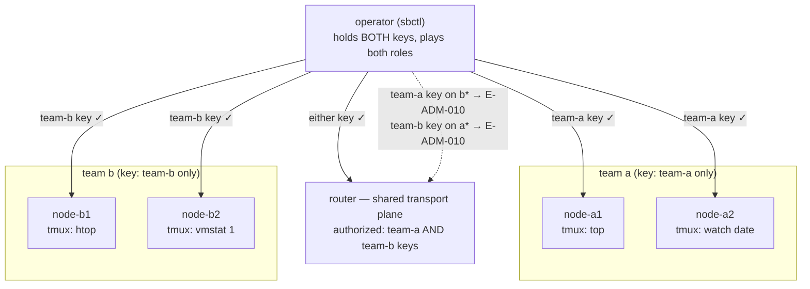
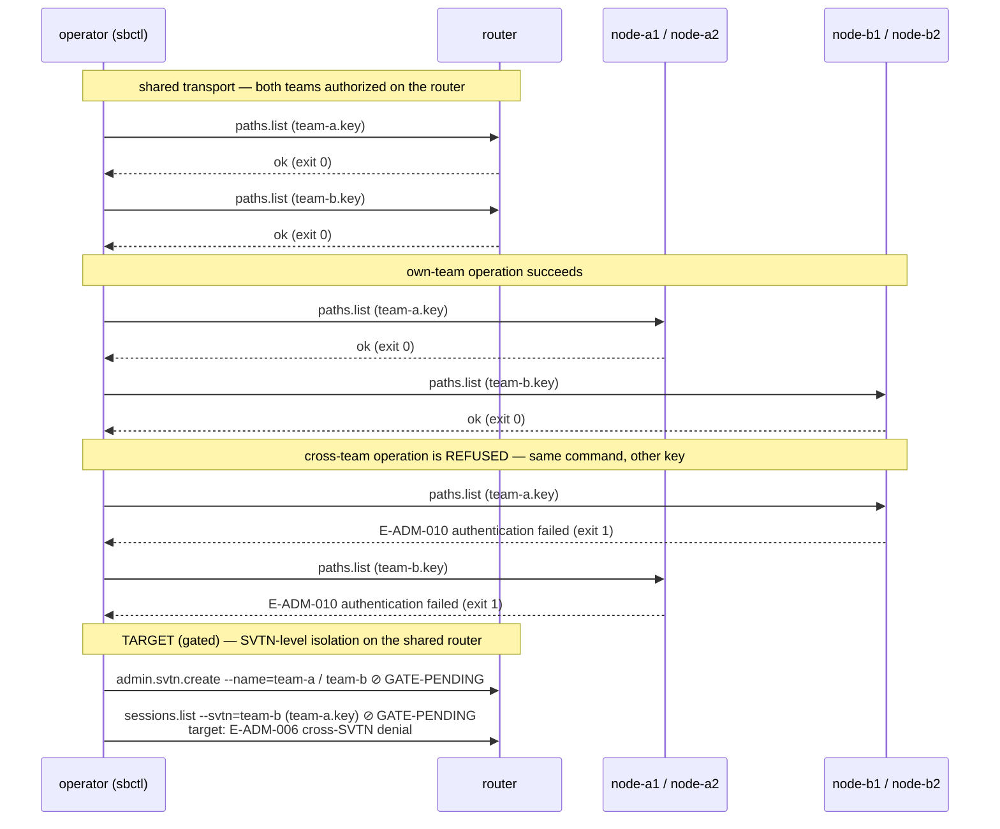

# 06 — two-svtn-isolation

One shared router, two teams with two access nodes each, and **disjoint
operator keys**. The claim under test: *team A cannot operate team B's
infrastructure, and vice versa* — while both share the same transport
plane.

## Topology



## Transaction under test — the isolation matrix



## What it proves today — the isolation matrix

The operator runs the *same command* against all four nodes with both
keys. Own-team calls succeed; cross-team calls are refused with
`E-ADM-010 authentication failed` — a hard, taxonomy-coded denial at the
Ed25519 challenge-response layer, not an unadvertised absence. The
router accepts both teams, demonstrating that sharing transport does not
imply sharing operational authority.

This is isolation *by key configuration*, per daemon. It is the
mechanism the alpha actually ships.

## What's gated — SVTN-level isolation

The stronger claim in the example's name — two **SVTNs** on one router,
where team A's console cannot even *see* team B's sessions
(`E-ADM-006` on cross-SVTN access) — needs external `svtn.create` and
the network connector, both unshipped. Encoded as gated checks
(`GATE-PENDING` today; `GATED=1` makes them hard failures once the
milestone lands). When they flip, this compose file becomes the
acceptance test for multi-tenancy on a shared router.

## Setup + run

```bash
cd examples/06-two-svtn-isolation
docker compose up --build --exit-code-from operator
docker compose down -v
```

## Things to try

- **Be team A for a while:** `docker compose run --rm operator bash`, then
  walk the matrix by hand: `sbctl --target=/run/switchboard/b1.sock
  --key=/keys/team-a.key paths list` — watch the denial; swap the key
  and watch it pass.
- **Verify the denial is auth-layer, not transport-layer:** the
  connection *opens* (no E-NET-001) and then authentication fails —
  the daemon is reachable but refuses you. Different failure depth than
  a firewall.
- **Grant cross-team access deliberately:** add team-b's PEM to
  `access-a1.yaml` in `init.sh`, re-up, and watch `B-DENIED-ON-A1`
  fail — the isolation is exactly as strong as the key list, which is
  the point.
