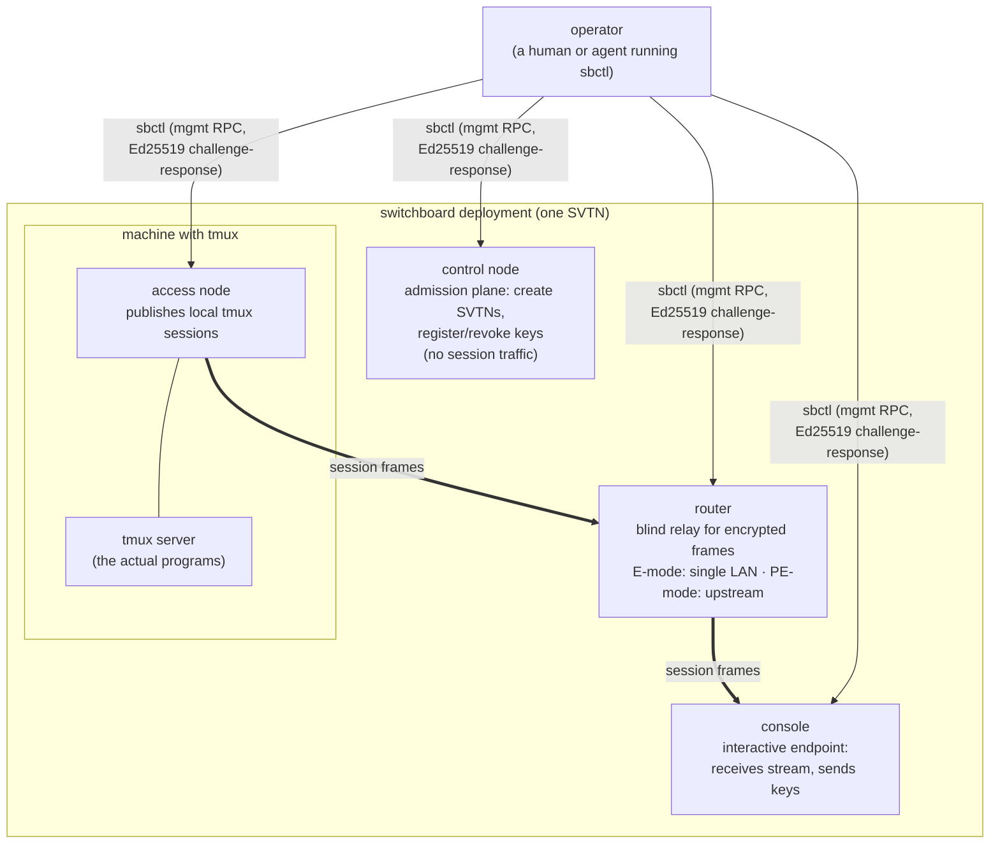

# Switchboard Examples

A ladder of docker-compose proofs of functionality, from a single router
to multi-team topologies. Each example is self-contained: a README with
setup, use, and things to try; a compose file; and an operator container
whose exit code is the verdict (`docker compose up --build
--exit-code-from operator`).

**The examples install the published alpha binaries** from GitHub
Releases inside the containers — they prove the shipped artifacts, not
the working tree. Pin a release with
`SWITCHBOARD_RELEASE=<tag> docker compose build` (default is the tag the
examples were last verified against; see `_shared/Dockerfile`).

## The components

Switchboard is a transport plane for tmux sessions: tmux is the session
substrate, SSH is the encryption, switchboard adds routing and
admission (see [docs/architecture.md](../docs/architecture.md)). One
`switchboard` binary runs in four modes; `sbctl` is the operator CLI
that speaks to any of them over their management sockets.

Two words that appear everywhere, defined once:

- **daemon** — one long-running instance of the `switchboard` binary
  in one of its four modes (`access`, `console`, `control`, `router`).
  The process-level word: the thing a container starts, a healthcheck
  watches, and `sbctl --target` connects to. "Access node" and "access
  daemon" are the same process seen from the protocol level and the
  process level.
- **operator** — the human (or agent) who administers and uses the
  deployment, holding private keys and running `sbctl`. In these
  examples, also the name of the compose service that stands in for
  the operator's machine (see "Harness roles" below).



| Component | What it is | Where it appears in the examples |
|---|---|---|
| **router** | Blind relay for encrypted session frames — sees envelopes and HMAC tags, never payload. E-mode (no upstreams) in all examples. | 01, 05, 06 |
| **access node** | Publishes a local tmux session over the network. Owns the PTY; runs where the programs run. | 03, 05, 06 |
| **console** | The interactive terminal endpoint — the operator's screen and keyboard for remote sessions. | 04, 05 |
| **control node** | The admission plane: creating SVTNs, registering/revoking keys. Management only, no session traffic. | 02 |
| **SVTN** | *Switched Virtual Network* — switchboard's unit of trust and routing scope: a bootstrap trust anchor, an admitted-key set, and a namespace for sessions and paths. | gated checks in 05, 06 |
| **sbctl** | The operator CLI. Authenticates to any daemon's management socket with an Ed25519 key and issues RPCs (`router status`, `sessions list`, `console attach`, `admin ...`). | every example |

### Harness roles (not switchboard concepts)

Two compose services exist only to make the examples self-running:

- **`init`** — a one-shot container that generates the run's Ed25519
  identities and renders daemon configs into shared volumes. In real
  life this is you, provisioning keys.
- **`operator`** — a container standing in for **the operator's
  machine**: it runs `sbctl` plus the example's `assert.sh` and its
  exit code is the example's verdict. It holds the operator private
  keys, exactly as your laptop would. When a README says "the operator
  asserts…", read it as "a person at a terminal runs sbctl and checks…".

## The ladder

| Example | Topology | Proves |
|---|---|---|
| [01-hello-router](01-hello-router/) | router + operator | daemon lifecycle, cross-namespace data plane, authenticated mgmt RPC, fail-closed auth, role exclusion |
| [02-admin-fails-closed](02-admin-fails-closed/) | control + operator | two-layer authority model; `svtn.create` bootstrap-only; stable denial taxonomy |
| [03-tmux-access-node](03-tmux-access-node/) | access + tmux(`top`) + operator | access daemon survives with a live session backend — **not testable on macOS dev machines** |
| [04-console-surface](04-console-surface/) | console + operator (shared netns) | session-plane RPC surface, two-tier admission, loopback-only console mgmt |
| [05-four-nodes-one-svtn](05-four-nodes-one-svtn/) | router + 4 nodes (top/htop/watch/vmstat) + console + operator | the target single-SVTN topology at full width; gated SVTN lifecycle |
| [06-two-svtn-isolation](06-two-svtn-isolation/) | router + 2×2 team nodes + operator | teams with disjoint keys cannot operate each other; gated SVTN-level isolation |

## Current-alpha honesty: gated checks

The getting-started tutorial targets v0.1.0-rc.1. Two pieces of the
distributed story are not wired in the current alpha:

1. **External SVTN bootstrap** — `admin svtn create` is bootstrap-only
   and the daemon's bootstrap key is ephemeral/in-process (persistent
   key wiring is S-6.02), so no external caller can create an SVTN yet.
2. **The network connector** — no daemon dials another daemon yet.
   Access nodes connect to *local* tmux; routers listen; consoles idle.
   Sessions cannot traverse access→router→console.

Assertions that depend on those pieces are **gated checks**
(`check_gated` in `_shared/harness.sh`): they report `GATE-PENDING`
today, flip to `GATE-PASS` when the feature lands, and become hard
failures under `GATED=1`. The topology examples (05, 06) are designed to
turn into the acceptance tests for the connector milestone without
changing shape.

## Layout

```
examples/
  _shared/          Dockerfile (fetches release binaries), gen-identity.sh,
                    harness.sh (check / check_gated / summary)
  NN-<name>/        README.md, docker-compose.yml, init.sh (keys+configs),
                    assert.sh (the operator's proof), node-entry.sh (where nodes exist)
```

Conventions:

- **Identities** are generated per run into a compose volume by
  `_shared/gen-identity.sh` — an OpenSSH-format private key for
  `sbctl --key` and an SPKI PEM for `authorized_operator_keys` (the two
  formats are not interchangeable in this alpha; see the script header).
- **Unix management sockets** are shared with the operator container
  via a `run:` volume; console mgmt is loopback-TCP-only, so in the
  console examples the operator container joins the console's network
  namespace (`network_mode: "service:console"`) instead.
- **Assertions** are behavioral only — exit codes and substrings
  (taxonomy codes like `E-ADM-010`), never byte-exact output, matching
  the discipline in `test/smoke/`.
- **Teardown** is `docker compose down -v`; the `-v` clears generated
  keys and configs.
