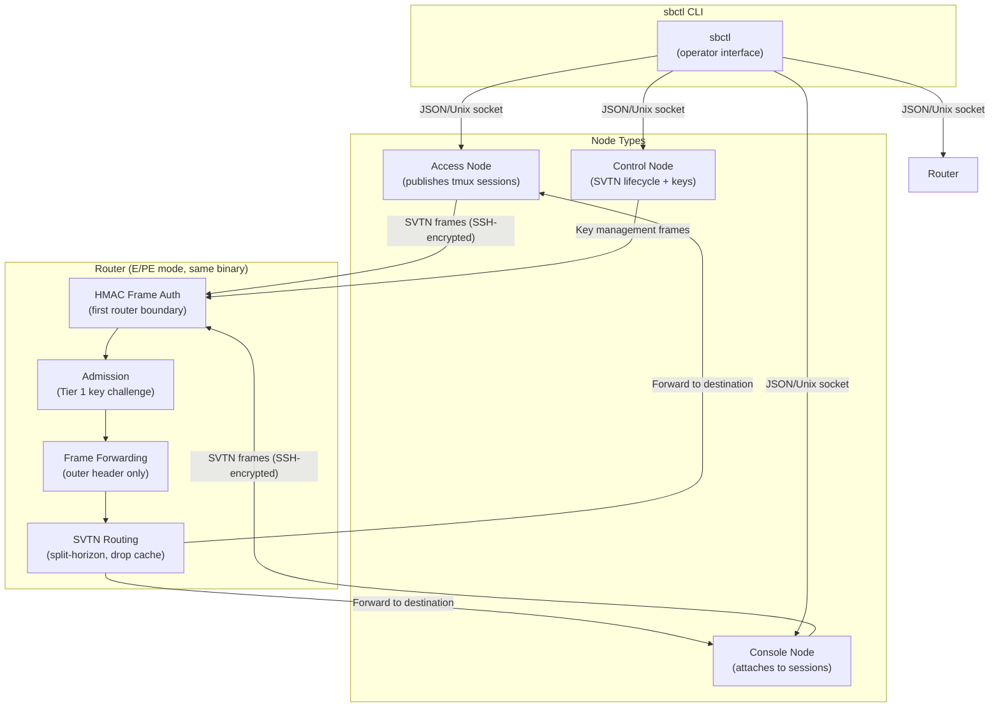

# ARCH-00: System Overview

## Product Mission

Switchboard is a **session network** — a switched virtual terminal network (SVTN)
whose only cargo is terminal sessions. It replaces the duct-tape of SSH tunnels,
relay-based tools, and general-purpose VPNs with a purpose-built network layer
that provides latency-optimized multi-path routing, cryptographic two-tier
admission, session quality monitoring, and carrier-grade content separation.

Single static Go binary. Three deployment modes. Five minutes to first session.

## Architectural Principles

1. **Routers are blind relays.** A router sees only outer-header metadata: version,
   frame type, SVTN ID, destination address, source address, length, HMAC. Session
   content is SSH-encrypted end-to-end between nodes; no router holds or derives
   session keys. (DI-001, elem-ssh-end-to-end-encryption)

2. **No direct node-to-node communication.** All traffic flows node→router→node.
   Admission control is at routers; bypassing a router bypasses admission. (DI-004,
   elem-node-router-architecture)

3. **Timeslice clock fires whether or not there is data.** The bus leaves on time,
   full or not. Empty-tick frames are liveness signals. Skipping an empty tick is a
   defect, not an optimization. (DI-008, elem-timeslice-framing)

4. **Session identity is cryptographic, not address-based.** Node address =
   hash(SVTN-ID, public-key). IP changes are transparent to the session. (BC-2.01.006)

5. **Purity discipline.** Core algorithms (frame encoding, HMAC, path ranking,
   half-channel state machines) are pure-core: deterministic, no I/O, no globals.
   Formal verification operates here. I/O is isolated to effectful shell packages.

6. **Progressive complexity.** E router MVP requires no external infrastructure.
   Same binary graduates to PE by config change. P is a separate build target.
   (elem-single-binary-three-modes, elem-mvp-scope-single-lan)

## Scope-Phase Topology

```
E Router Phase (MVP)          PE Router Phase           P Router Phase (future)
────────────────────          ─────────────────         ──────────────────────
Single LAN                    Multi-site                 Provider core
One binary                    Same binary               Separate build target
Nodes + E router              + upstream PE routers     Router-to-router only
No external infra             + NAT traversal           No node connections
No session discovery          + Multicast discovery     Not in scope
```

The architecture is designed for all three phases but built for E first.
Phase-gated BCs are marked P0 (E), P1 (PE), P2 (advanced E/PE).

## System Architecture Diagram



## Deployment Topology

`deployment_topology: single-service` — one binary, one tech stack, one release
artifact. E and PE router modes are runtime configuration. P router is a separate
build target (`go build -tags providercore`) but is out of MVP scope.

## Risk Mitigations (HIGH-impact R-NNN)

| Risk | Architecture Mitigation |
|------|------------------------|
| R-001 (content separation) | Router code has no channel header parser; inner payload is opaque bytes. CI scan enforces this. NFR-005 is a gate. |
| R-002 (framing latency) | Tick interval is tunable 5–50ms; Phase 3 benchmark validates each rate against 100ms p99 target. Framing overhead measurable independently. |
| R-003 (GC jitter) | Hot path avoids heap allocation (pre-allocated frame buffers). `runtime/metrics` monitoring. GC tuning via GOGC/GOMEMLIMIT. Escape hatch documented. |
| R-005 (version incompatibility) | Version field is byte 0 of the 44-byte header; checked before any other parsing. Major version mismatch = E-PRT-001 clean rejection. |

## ASM Validation Status

| ASM | Architecture Decision |
|-----|----------------------|
| ASM-001 (tick latency) | Validated in Phase 3; architecture allows any tick interval in [5ms, 50ms] |
| ASM-002 (GC jitter) | Mitigated by pre-allocated buffer pools; verified in Phase 3 benchmarks |
| ASM-006 (SSH key format) | Ed25519 OpenSSH keypairs assumed; no PQC migration required in MVP |
