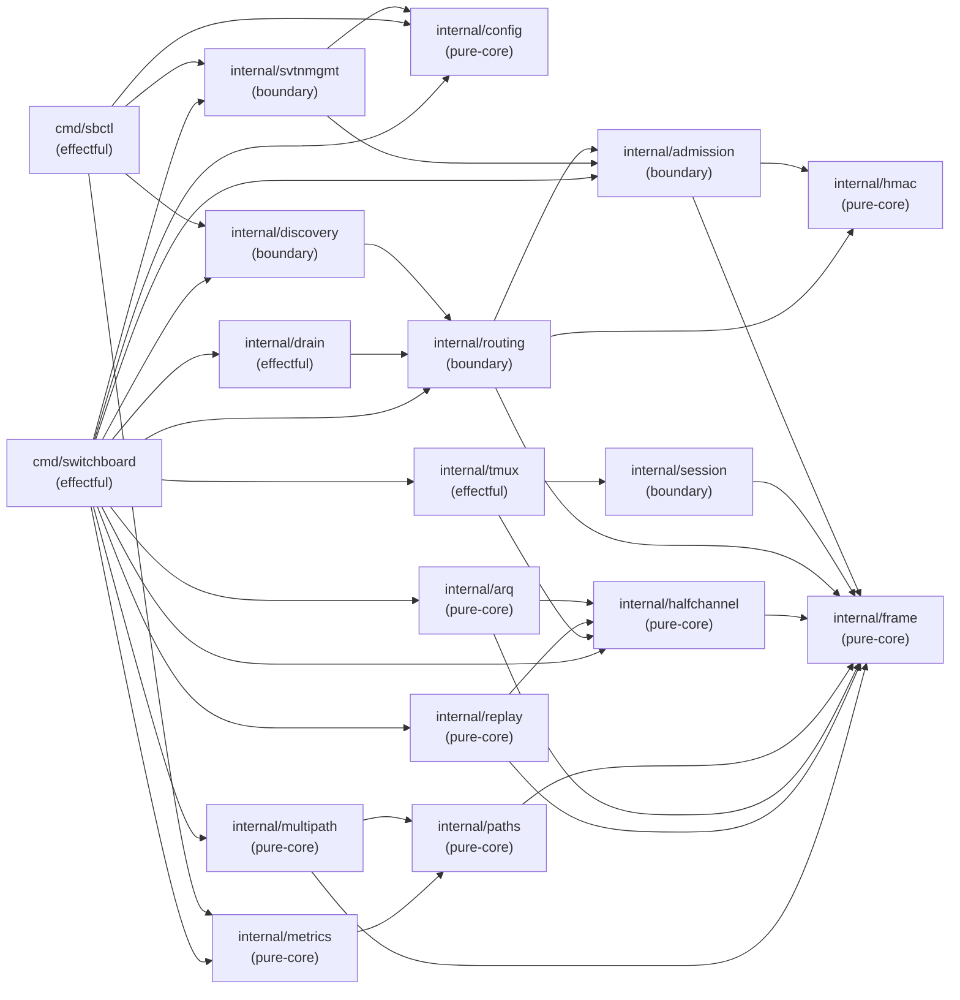

# ARCH-08: Dependency Graph

## Module Dependency DAG

> **Scope.** This document describes the **target architecture** of the
> complete Switchboard product — all packages planned across all waves of
> delivery. References below to packages such as `internal/session`,
> `internal/tmux`, `internal/paths`, `internal/arq`, `internal/replay`,
> `internal/multipath`, `internal/metrics`, `internal/discovery`,
> `internal/svtnmgmt`, `internal/drain`, `internal/config`, and the `sbctl`
> binary describe **planned** components, not committed code. For the
> authoritative list of packages currently present on the `develop` branch,
> consult §6.5 (current import positions). Section §6.6 tracks the
> wave-by-wave delivery plan for upcoming packages.

Import direction convention: `A → B` means package A imports package B (A depends on B).
**No cycles.** Any cycle is an architecture violation per SOUL.md #11.



> **Mermaid layer groupings vs. import-order positions:** The Mermaid diagram above
> groups packages into named layers (Layer 0: Foundation, Layer 1: Security, etc.)
> for visual readability by functional domain. These groupings do **not** represent
> strict import-order positions. The authoritative topological positions are in
> §6.5 (packages present on develop) and §6.6 (planned Wave 3+ packages). In
> particular, `internal/session` is shown in the Mermaid "Layer 1: Security" group
> alongside `internal/admission` and `internal/routing` because it is a security
> boundary module — but its import-order position is 6 (§6.6), above admission (4)
> and routing (5), because it imports `{frame, admission}`. Always consult §6.5/§6.6
> for import-ordering decisions; consult the Mermaid only for functional domain context.
> (Finding F-W3-M-004 from consistency-validator Wave-3 audit.)

## Topological Order (root → leaf)

Packages listed root-first. Any package may only import packages earlier in this list.

```
1.  internal/config         (no internal imports)
2.  internal/frame          (no internal imports)
3.  internal/hmac           (no internal imports)
4.  internal/admission      (imports: frame, hmac)
5.  internal/routing        (imports: frame, hmac, admission)
6.  internal/session        (imports: frame, admission)
7.  internal/halfchannel    (imports: frame)
8.  internal/paths          (imports: frame)
9.  internal/arq            (imports: frame, halfchannel)
10. internal/replay         (imports: frame, halfchannel)
11. internal/multipath      (imports: frame, paths)
12. internal/metrics        (imports: paths)
13. internal/tmux           (imports: halfchannel, session)
14. internal/discovery      (imports: routing)
15. internal/svtnmgmt       (imports: admission, config)
16. internal/drain          (imports: routing)
17. cmd/sbctl               (imports: metrics, discovery, svtnmgmt, config)
18. cmd/switchboard         (imports: all above)
```

## Cycle-Freeness Verification

Mental topological sort: no package in positions 1–16 imports any package at a higher
position. Verification:

- `internal/routing` imports `admission` (position 4) — OK (routing is 5, admission is 4).
- `internal/tmux` imports `session` (position 6) — OK (tmux is 13, session is 6).
- `internal/discovery` imports `routing` (position 5) — OK (discovery is 14, routing is 5).
- `cmd/sbctl` imports `svtnmgmt` (position 15) — OK (sbctl is 17, svtnmgmt is 15).
- No back-edges. DAG is acyclic.

## Boundary Violation Rules

The following import patterns are **forbidden**:

| Forbidden Pattern | Reason |
|------------------|--------|
| `internal/routing` → `internal/tmux` | Router must not import session-content code |
| `internal/frame` → any other internal | Frame is a leaf; importing would create a cycle |
| `internal/hmac` → any other internal | HMAC is a leaf |
| Any package → `cmd/sbctl` | Commands are effectful tops; never imported by library code |
| Any package → `cmd/switchboard` | main is the top; never imported |

These are enforced by `go vet` (import cycle detection) and lint rules. Any CI
failure from import cycles is a P0 blocker.

## Notes on Deliberate Coupling

- `internal/routing` imports `internal/admission` because routing decisions depend
  on the admitted node set (SVTN partition). This is intentional — routing and
  admission are tightly coupled at the router boundary.
- `internal/session` is imported by both `internal/tmux` (access node enforces
  Tier 2) and `cmd/sbctl` (console control). The session package is a pure
  authorization boundary, not an I/O package, so this coupling is clean.

## §6 Import Constraints

The dependency graph in §§1–5 is a hard contract on import direction. The
following constraints apply to every Go file under `internal/`. This section
codifies what the compiler and `go vet` already enforce structurally and what
the consistency-validator audits at every wave gate.

### §6.1 Topological ordering (Wave-2 baseline — see §6.5 for current state)

Each package occupies a fixed position in the DAG. A package at position N may
only import packages at positions 1..N-1. The table below covers all `internal/`
packages present on `develop` at Wave-2 close (f35e836). For the live Wave-3
state (including `internal/session` and `internal/tmux`), consult §6.5.

| Position | Package | Allowed imports | Classification |
|----------|---------|-----------------|----------------|
| 1 | `internal/frame` | ∅ (stdlib only) | pure-core |
| 2 | `internal/hmac` | ∅ (stdlib only) | pure-core |
| 3 | `internal/halfchannel` | {frame} | pure-core |
| 4 | `internal/admission` | {frame, hmac} | boundary |
| 5 | `internal/routing` | {frame, hmac, admission} | boundary |

Positions 6 and above are reserved for packages introduced in later waves; they
must be declared here before their first commit (see §6.4).

Verified against `grep -rn "switchboard/internal" --include="*.go" internal/ | grep -v _test.go`
at f35e836. No deviations found.

### §6.2 Forbidden edges

- `internal/frame` MUST NOT import any other `internal/` package.
- `internal/hmac` MUST NOT import any other `internal/` package.
- `internal/halfchannel` MUST NOT import `internal/admission` or `internal/routing`.
- `internal/admission` MUST NOT import `internal/routing`.
- No package may import a package at a higher position than itself.

### §6.3 Enforcement

- `go vet ./...` (run via `just lint`) catches cyclic imports at build time.
  Any import-cycle failure is a P0 CI blocker.
- The consistency-validator audits positional drift at every wave gate, verifying
  that no import edge exists outside the allowed set declared in §6.1.
- The adversary will flag any new import edge not declared in §6.1 as a finding
  requiring an explicit §6.4 declaration before the wave gate passes.

### §6.4 Adding a new internal package

New packages must, before their first commit to any branch:

1. Declare their position (1..N) in this section, extending the §6.1 table.
2. Declare their classification (pure-core vs boundary) per ARCH-09.
3. List their allowed imports explicitly in the §6.1 table.
4. Pass the consistency-validator check at the wave gate.

Undeclared packages discovered at the wave gate are an architecture violation.

### §6.5 Current import positions (post-Wave-3 S-3.01a, develop @ `43208ab`)

The following packages are present in `internal/` on develop. Positions are
strict — position N may import packages at positions 1..N-1 only.

| Position | Package | Allowed imports | Classification | Wave |
|----------|---------|-----------------|----------------|------|
| 1 | `internal/frame` | ∅ (stdlib only) | pure-core | Wave 1 |
| 2 | `internal/hmac` | ∅ (stdlib only) | pure-core | Wave 2 (S-2.01) |
| 3 | `internal/halfchannel` | {frame} | pure-core | Wave 1 |
| 4 | `internal/admission` | {frame, hmac} | boundary | Wave 2 (S-2.02 + S-1.03) |
| 5 | `internal/routing` | {frame, hmac, admission} | boundary | Wave 2 (S-2.02) |
| 6 | `internal/session` | {frame, admission} (upstream.go + fanout.go import frame; session.go imports admission) | boundary | Wave 3 (S-3.01a) |
| 7 | `internal/tmux` | {halfchannel, session} | effectful (PTY, child process) | Wave 3 (S-3.01a) |

This table is authoritative for the develop branch. Any package not listed
above does NOT exist in the codebase.

Verified against `ls internal/` and
`grep -rn "switchboard/internal" --include="*.go" internal/ | grep -v _test.go`
at 43208ab. No deviations found.

### §6.6 Planned positions (Wave 4+ prospective)

Positions 6 and 7 (`internal/session` and `internal/tmux`) were previously
planned here. They shipped in Wave 3 (S-3.01a, PR #11, merged 2026-06-26 at
`43208ab`) and are now listed in §6.5.

No packages are currently planned for positions 8+. Future waves will register
new positions here before their first commit, per the §6.4 protocol.

**Additional forbidden edges (carried forward from Wave 3):**
- `internal/session` MUST NOT import `internal/routing`.
  Session-level authorization state is managed within `internal/session` itself;
  routing is a peer layer, not a dependency.
- `internal/tmux` MUST NOT import `internal/admission` or `internal/routing`.
  Tmux is a pure I/O shell; all policy is in `internal/session`.

---

## Changelog

| Version | Date | Change |
|---------|------|--------|
| 1.0 | 2026-06-23 | Initial dependency graph, topological order, and boundary violation rules |
| 1.1 | 2026-06-25 | Added §6 Import Constraints (§§6.1–6.4) — explicit codification of DAG positions, forbidden edges, enforcement mechanism, and new-package protocol; prompted by Wave-2 gate audit finding WAVE-2-MED-001 |
| 1.2 | 2026-06-25 | Added §6.5: extended topological table declaring Wave 3 packages (`internal/session` at position 6, `internal/tmux` at position 13); backfilled all Wave 1–2 packages for completeness; additional forbidden edges for session and tmux |
| 1.3 | 2026-06-25 | Corrected §6.5: replaced hallucinated 16-package table (paths, arq, replay, multipath, metrics, tmux, discovery, svtnmgmt, drain, config, session not on develop) with the 5 packages actually present on develop at d8d7ae6; moved Wave 3 prospective packages (session, tmux) to new §6.6 as PLANNED; corrected session allowed imports to {frame, admission} per S-3.03 SessionAuth requirement |
| 1.4 | 2026-06-25 | Added §1 scope callout making the target-architecture-vs-current-state contract explicit: §§1–5 describe planned target architecture; §6.5 is authoritative for packages currently on develop; §6.6 tracks wave-by-wave delivery plan |
| 1.5 | 2026-06-25 | Added prose note after Mermaid diagram clarifying that Mermaid layer groupings reflect functional domain, not import-order positions; §6.5/§6.6 are authoritative for import ordering (consistency-validator finding F-W3-M-004) |
| 1.6 | 2026-06-26 | Promoted `internal/session` (pos 6) and `internal/tmux` (pos 7) from §6.6 PLANNED to §6.5 CURRENT following S-3.01a merge (PR #11, 43208ab); §6.6 updated to Wave 4+ planning placeholder |
| 1.7 | 2026-06-26 | WG3-H-003: Reconcile all topological position references to the correct ordering (admission=4, routing=5, session=6). Fix Topological Order section (session was incorrectly at 5, routing at 6). Fix Cycle-Freeness section (tmux→session now references position 6). Fix §6.5 session annotation to reflect actual imports: upstream.go+fanout.go import frame; session.go imports admission |
