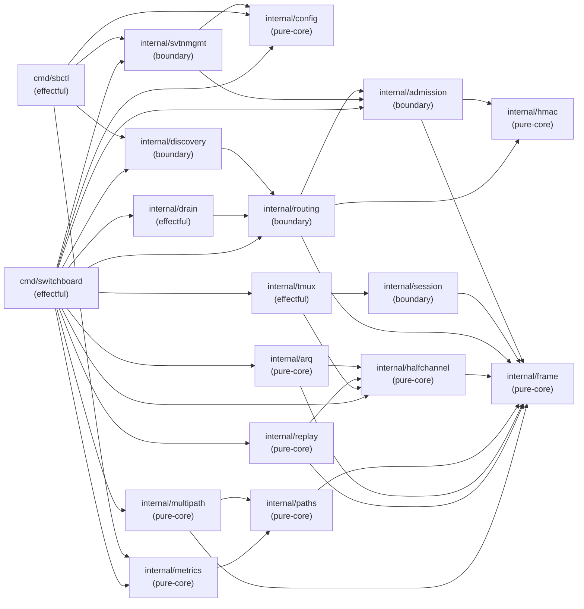

# ARCH-08: Dependency Graph

## Module Dependency DAG

> **Scope.** This document describes the **target architecture** of the
> complete Switchboard product — all packages planned across all waves of
> delivery. References below to packages such as `internal/session`,
> `internal/tmux`, `internal/paths`, `internal/arq`, `internal/replay`,
> `internal/multipath`, `internal/metrics`, `internal/discovery`,
> `internal/svtnmgmt`, `internal/drain`, `internal/config`, and the `sbctl`
> binary describe **planned** components, not committed code. For the
> authoritative list of packages currently present on the `develop` branch,
> consult §6.5 (current import positions). Section §6.6 tracks the
> wave-by-wave delivery plan for upcoming packages.

Import direction convention: `A → B` means package A imports package B (A depends on B).
**No cycles.** Any cycle is an architecture violation per SOUL.md #11.



> **Mermaid layer groupings vs. import-order positions:** The Mermaid diagram above
> groups packages into named layers (Layer 0: Foundation, Layer 1: Security, etc.)
> for visual readability by functional domain. These groupings do **not** represent
> strict import-order positions. The authoritative topological positions are in
> §6.5 (packages present on develop) and §6.6 (planned Wave 3+ packages). In
> particular, `internal/session` is shown in the Mermaid "Layer 1: Security" group
> alongside `internal/admission` and `internal/routing` because it is a security
> boundary module — but its import-order position is 6 (§6.6), above admission (4)
> and routing (5), because it imports `{frame, admission}`. Always consult §6.5/§6.6
> for import-ordering decisions; consult the Mermaid only for functional domain context.
> (Finding F-W3-M-004 from consistency-validator Wave-3 audit.)

## Topological Order (root → leaf)

Packages listed root-first. Any package may only import packages earlier in this list.

```
1.  internal/config         (no internal imports)
2.  internal/frame          (no internal imports)
3.  internal/hmac           (no internal imports)
4.  internal/admission      (imports: frame, hmac)
5.  internal/routing        (imports: frame, hmac, admission)
6.  internal/session        (imports: frame, admission)
7.  internal/halfchannel    (imports: frame)
8.  internal/paths          (imports: frame)
9.  internal/arq            (imports: frame, halfchannel)
10. internal/replay         (imports: frame, halfchannel)
11. internal/multipath      (imports: frame, paths)
12. internal/metrics        (imports: paths)
13. internal/tmux           (imports: halfchannel, session)
14. internal/discovery      (imports: routing)
15. internal/svtnmgmt       (imports: admission, config)
16. internal/drain          (imports: routing)
17. cmd/sbctl               (imports: metrics, discovery, svtnmgmt, config)
18. cmd/switchboard         (imports: all above)
```

## Cycle-Freeness Verification

Mental topological sort: no package in positions 1–16 imports any package at a higher
position. Verification:

- `internal/routing` imports `admission` (position 4) — OK (routing is 5, admission is 4).
- `internal/tmux` imports `session` (position 6) — OK (tmux is 13, session is 6).
- `internal/discovery` imports `routing` (position 5) — OK (discovery is 14, routing is 5).
- `cmd/sbctl` imports `svtnmgmt` (position 15) — OK (sbctl is 17, svtnmgmt is 15).
- No back-edges. DAG is acyclic.

## Boundary Violation Rules

The following import patterns are **forbidden**:

| Forbidden Pattern | Reason |
|------------------|--------|
| `internal/routing` → `internal/tmux` | Router must not import session-content code |
| `internal/frame` → any other internal | Frame is a leaf; importing would create a cycle |
| `internal/hmac` → any other internal | HMAC is a leaf |
| Any package → `cmd/sbctl` | Commands are effectful tops; never imported by library code |
| Any package → `cmd/switchboard` | main is the top; never imported |

These are enforced by `go vet` (import cycle detection) and lint rules. Any CI
failure from import cycles is a P0 blocker.

## Notes on Deliberate Coupling

- `internal/routing` imports `internal/admission` because routing decisions depend
  on the admitted node set (SVTN partition). This is intentional — routing and
  admission are tightly coupled at the router boundary.
- `internal/session` is imported by both `internal/tmux` (access node enforces
  Tier 2) and `cmd/sbctl` (console control). The session package is a pure
  authorization boundary, not an I/O package, so this coupling is clean.

## §6 Import Constraints

The dependency graph in §§1–5 is a hard contract on import direction. The
following constraints apply to every Go file under `internal/`. This section
codifies what the compiler and `go vet` already enforce structurally and what
the consistency-validator audits at every wave gate.

### §6.1 Topological ordering (Wave-2 baseline — see §6.5 for current state)

Each package occupies a fixed position in the DAG. A package at position N may
only import packages at positions 1..N-1. The table below covers all `internal/`
packages present on `develop` at Wave-2 close (f35e836). For the live Wave-3
state (including `internal/session` and `internal/tmux`), consult §6.5.

| Position | Package | Allowed imports | Classification |
|----------|---------|-----------------|----------------|
| 1 | `internal/frame` | ∅ (stdlib only) | pure-core |
| 2 | `internal/hmac` | ∅ (stdlib only) | pure-core |
| 3 | `internal/halfchannel` | {frame} | pure-core |
| 4 | `internal/admission` | {frame, hmac} | boundary |
| 5 | `internal/routing` | {frame, hmac, admission} | boundary |

Positions 6 and above are reserved for packages introduced in later waves; they
must be declared here before their first commit (see §6.4).

Verified against `grep -rn "switchboard/internal" --include="*.go" internal/ | grep -v _test.go`
at f35e836. No deviations found.

### §6.2 Forbidden edges

- `internal/frame` MUST NOT import any other `internal/` package.
- `internal/hmac` MUST NOT import any other `internal/` package.
- `internal/halfchannel` MUST NOT import `internal/admission` or `internal/routing`.
- `internal/admission` MUST NOT import `internal/routing`.
- No package may import a package at a higher position than itself.

### §6.3 Enforcement

- `go vet ./...` (run via `just lint`) catches cyclic imports at build time.
  Any import-cycle failure is a P0 CI blocker.
- The consistency-validator audits positional drift at every wave gate, verifying
  that no import edge exists outside the allowed set declared in §6.1.
- The adversary will flag any new import edge not declared in §6.1 as a finding
  requiring an explicit §6.4 declaration before the wave gate passes.

### §6.4 Adding a new internal package

New packages must, before their first commit to any branch:

1. Declare their position (1..N) in this section, extending the §6.1 table.
2. Declare their classification (pure-core vs boundary) per ARCH-09.
3. List their allowed imports explicitly in the §6.1 table.
4. Pass the consistency-validator check at the wave gate.

Undeclared packages discovered at the wave gate are an architecture violation.

### §6.5 Current import positions (develop @ `62e38d3` + 1 prospective pre-code registration (story branch), 24 positions — 23 present on develop + 1 prospective)

> **cmd/switchboard position-18 note (S-4.00 daemon assembly):** `cmd/switchboard`
> occupies position 18 — the top leaf that imports every layer beneath it. As of
> develop @ b68e498, `cmd/switchboard/main.go` is a version-printing stub that wires
> none of the Wave-3 subsystems. Story **S-4.00** (daemon assembly) places position 18
> fully in scope: it wires the six obligations listed below. Position 18 is now
> **ACTIVE** — see §6.5.1 for the S-4.00 wiring specification. ADR-011 documents
> the SessionConnector.Frames() API decision and the FramesDropped surfacing strategy.

#### §6.5.1 S-4.00 daemon-assembly wiring obligations for cmd/switchboard

The following six wiring obligations make up the full-daemon scope of S-4.00. Each
maps to a buildability tier (see §6.6 feasibility register):

| # | Obligation | Packages used | Buildability |
|---|-----------|---------------|-------------|
| 1 | Inject real `routing.Logger` into `NewRouter` via `WithLogger` so `RouteFrame` E-ADM-016 paths write to `os.Stderr` (or a `log.New` sink) in production builds. **Wave-3 data-path clarification (v2.0):** The `routing.Router` constructed by obligation 1 is NOT in the Wave-3 frame data path — there is no network-ingress listener wired in S-W3.04. The router is constructed with a live logger so that (a) it is non-nil and non-noop in the binary, and (b) AC-001's `TestRouterLoggerEmitsEADM016` can call `RouteFrame` on the returned `*routing.Router` instance directly to verify E-ADM-016 emission. **The router instance returned by `buildRouter` MUST NOT be discarded** (`_ = buildRouter(keys)` is wrong); it MUST be assigned to a named variable and passed to the AC-001 test via the exported test surface or a package-level accessor. Additionally, `buildRouter` MUST receive the **same** `*admission.AdmittedKeySet` used by `buildAccessNode` — both must share one keyset instance so AC-001 can register a key, call `buildRouter(keys).RouteFrame(...)`, and observe the E-ADM-016 log without a separate keyset. The network-ingress wiring (router in live data path) is deferred to a future story. | `internal/routing` (exists) | BUILDABLE NOW |
| 2 | Construct `admission.AdmittedKeySet`, `session.Publisher`, `session.SessionAuth`, then wire `NewAccessNode(pub, auth, WithKeystrokeSink(sc))` replacing the nil/NoOp defaults | `internal/admission`, `internal/session` (both exist) | BUILDABLE NOW |
| 3 | Instantiate Sweep eviction `time.Ticker` in `main()` and call `accessNode.Sweep(deadline)` on each tick. **I-1 wg-join clarification (v2.2):** `startSweepTicker` MUST accept a `*sync.WaitGroup`, call `wg.Add(1)` before launching its goroutine, and call `defer wg.Done()` inside. This ensures BC-2.04.007 PC-2 postcondition 6 ("no goroutines leaked — verified by test with `t.Cleanup` + short timeout") is deterministically verifiable: the test's `wg.Wait()` blocks until the sweep ticker goroutine has exited, not just until ctx is cancelled. | `internal/session` (exists); `time.Ticker` stdlib | BUILDABLE NOW |
| 4 | Pipe `SessionConnector.Frames()` → `accessNode.DeliverFrame()` in a goroutine after `sc.Connect(ctx)` succeeds. Requires `SessionConnector.Frames()` API to be pinned (drift W3-R2-M4); see ADR-011 for the chosen design. **Testability refinement (v2.1):** `runAccess` is split into a thin constructor wrapper + `runAccessWithConnector(ctx, stderr, connectorIface)` where `connectorIface` covers `Connect/Frames/Err/Close/RelayDropped`. Tests inject a `fakeConnector` to exercise PC-2 (clean) and PC-2.6 (mid-session double-failure → exit 1) end-to-end through the production function. See ARCH-01 ADR-011 Amendment v1.5 §HIGH-B. | `internal/tmux` (exists); ADR-011 (new) | BUILDABLE NOW after ADR-011 pins API |
| 5 | Replace `NoOpAuthorizer` with live `*SessionAuth` (drift W3-M-3; fail-open closed) | `internal/session` (exists) | BUILDABLE NOW (done by obligation 2 above) |
| 6 | Surface `accessNode.FramesDropped()` counter via periodic structured log line (drift W3-R2-M3) — no metrics endpoint or sbctl needed. **I-1 wg-join clarification (v2.2):** `startFramesDroppedTicker` MUST accept a `*sync.WaitGroup`, call `wg.Add(1)` before launching its goroutine, and call `defer wg.Done()` inside. Same rationale as obligation 3: BC-2.04.007 PC-2 postcondition 6 requires deterministic leak verification via wg-join, not race-prone timeout-without-join. | `internal/session` (exists); `log` / `fmt` stdlib | BUILDABLE NOW |

**No hard blockers.** All six obligations are buildable using only packages present
on develop @ b68e498. `internal/config`, `internal/drain`, and `internal/metrics`
(Wave 4+) are NOT imported by S-4.00 — see §6.6 feasibility register for
detailed rationale.

> **C-1 RESOLVED — FailureCounter wiring (PR #20, commit 418de54, 2026-06-27):**
> `buildRouter` in `cmd/switchboard/access.go` now constructs
> `admission.NewFailureCounter(hmacFailureThreshold=5, hmacFailureWindow=60s, logger)`
> and wires `routing.WithFailureCounter(fc)` alongside `routing.WithLogger(rl)`.
> The partial-wiring concern raised in the Wave-3 wave-level adversarial pass-1 is
> closed. Both E-ADM-016 (per-failure log, BC-2.05.008 PC-5) and E-ADM-017
> (per-source HMAC failure-rate alert at threshold=5/window=60s, BC-2.05.005 PC-3)
> are now wired into the production router. Verified by
> `TestBuildRouter_WithFailureCounter_FiveFailures_TriggersEADM017`, which drives
> the production `buildAccessComponents` path and confirms E-ADM-017 fires after
> 5 PATH-A HMAC failures. Finding OBS-3 is resolved.
>
> **Only remaining deferral at this boundary:** The network-ingress LISTENER — the
> daemon does not yet bind or accept inbound network frames. This is tracked as
> story S-BL.NI. Until S-BL.NI lands, `RouteFrame` has no live non-test caller in
> `cmd/switchboard`; the counter and logger are wired and correct but neither event
> code fires in production. No partial-wiring obligation remains outstanding for the
> failure counter itself.

The following packages are present in `internal/` on develop. Positions are
strict — position N may import packages at positions 1..N-1 only.

| Position | Package | Allowed imports (switchboard-internal only) | Classification | Wave / Story |
|----------|---------|---------------------------------------------|----------------|--------------|
| 1 | `internal/config` | ∅ (stdlib only) | pure-core | Wave 4 (S-6.01) |
| 2 | `internal/frame` | ∅ (stdlib only) | pure-core | Wave 1 |
| 3 | `internal/hmac` | ∅ (stdlib only) | pure-core | Wave 2 (S-2.01) |
| 4 | `internal/admission` | {frame, hmac} | boundary | Wave 2 (S-2.02 + S-1.03) |
| 5 | `internal/halfchannel` | {frame} | pure-core | Wave 1 |
| 6 | `internal/session` | {admission, frame} (session.go→admission; upstream.go+fanout.go→frame) | boundary | Wave 3 (S-3.01a) |
| 7 | `internal/tmux` | {halfchannel, session} | effectful (PTY, child process) | Wave 3 (S-3.01a) |
| 8 | `internal/outerassembler` | {frame, halfchannel, hmac} | pure-core | Wave 7 (S-BL.OA, PR #96, e520e04) |
| 9 | `internal/arq` | {frame} | pure-core | Wave 4 (S-4.03) |
| 10 | `internal/arqsend` | {arq, frame, halfchannel, outerassembler} | pure-core (composition) | Wave 7 (S-BL.ARQ-TX, PR #98, b75a2f2) |
| 11 | `internal/paths` | ∅ (stdlib only) | pure-core | Wave 4 (S-4.01) |
| 12 | `internal/metrics` | {paths} | pure-core | Wave 5 (S-5.01) |
| 13 | `internal/replay` | ∅ (stdlib only) | pure-core | Wave 4 (S-4.02) |
| 14 | `internal/multipath` | {paths} | pure-core | Wave 4 (S-4.01) |
| 15 | `internal/svtnmgmt` | {admission} | boundary | Wave 5 (S-6.02) |
| 16 | `internal/drain` | ∅ (stdlib only) | effectful | Wave 7 (S-7.04, PR #101) |
| 17 | `internal/routing` | {admission, frame, hmac, multipath} | boundary | Wave 2 (S-2.02); routing→multipath edge added Wave 4 (S-4.04) |
| 18 | `internal/netingress` | {frame} | boundary | Wave 7 (S-BL.NI, PR #94, b8ed015) |
| 19 | `internal/upstreamdial` | {frame, halfchannel, outerassembler} (**PROSPECTIVE** — aligned to implementation at cee8e8b pre-merge; final machine-verification at merge. halfchannel pos 5, outerassembler pos 8 — both below 19, no back-edges. frame direct import added by S-BL.PE-RECEIVE-LOOP (pos 2 → pos 19, forward edge, no cycle; frame.ReadOuterFrame + frame.FrameTypePEConnect in connector.go). Historical note: v2.6 had listed {frame, outerassembler} prematurely; adversary pass-1 F-P1-001 corrected that (no direct import existed at that time); the direct frame edge is now real as of this story.) | effectful (network I/O) | Wave 7 (S-7.04-FU-PE-CONNECTOR) |
| 20 | `internal/mgmt` | {metrics} | boundary (effectful — socket I/O, crypto) | Wave 5 (S-W5.01); see ARCH-12 |
| 21 | `internal/discovery` | {routing} | boundary | Wave 5+ (S-5.02) |
| 22 | `internal/svtnmgmttest` | {svtnmgmt} | test helper | Wave 5 (S-6.02) |
| 23 | `internal/testenv` | {admission, drain, frame, outerassembler, session, upstreamdial} (updated at story branch 51ecd44 pre-merge — S-7.04-FU-PE-CONNECTOR added outerassembler + upstreamdial edges; final machine-verification at merge; previously machine-derived at 62e38d3) | test helper (composition root — importable by _test files only) | steady-state (S-BL.TESTENV, PR #110, 62e38d3) |
| 24 | `internal/bench` | production imports: ∅; xtest imports: {admission, frame, session} + {sort, testing, time} stdlib (machine-derived via `go list -f '{{.ImportPath}} IMPORTS={{.Imports}} XTESTIMPORTS={{.XTestImports}}' ./internal/bench` at 62e38d3) | test-only benchmark harness (xtest package `bench_test`) — imported by nothing | steady-state (S-BL.BENCH, PR #109, cd67394) |

This table is authoritative for the develop branch. Any `internal/` package not
listed above does NOT exist in the codebase.

> **Position numbering note:** Position values 1–24 form a strictly increasing
> topological order. Several positions differ from the §6.6.2 prospective table
> written at Wave-3 close (2026-06-27) because four packages shipped after that
> table was frozen (outerassembler, arqsend, netingress, mgmt), routing gained a
> new import (multipath, added by S-4.04), and config was registered at position 1
> by S-6.01. Position 19 was inserted (v2.6) for the prospective `internal/upstreamdial`
> registration, shifting former positions 19–22 to 20–23. The §6.6.2 prospective
> entries that have shipped are pruned in §6.6.2 below. Story files that cite
> earlier position numbers remain correct if the package they reference existed at
> that story's wave — the positions only shift here to accommodate the full
> 24-position table (23 on develop + 1 prospective).
>
> **Positions 23 and 24 — test-only leaves (Option A ruling, v2.10):** Both
> `internal/testenv` (pos 23) and `internal/bench` (pos 24) are test-only leaves
> that import no production-import neighbors; the ordinal ordering between them is
> arbitrary and not topologically constrained. `internal/testenv` is designated the
> _test-only composition root_ because it has the broadest import-allowance — it
> imports 6 internal packages (including the prospective `internal/upstreamdial`).
> That "composition root" designation refers to import-allowance breadth, not
> ordinal supremacy. `internal/bench` is a narrow xtest leaf importing only
> {admission, frame, session}; it was appended at 24 (F-P9-001, pass-9 ruling)
> rather than inserted at 23 to preserve the 49c9370 code anchor and all story/
> placement-note references to positions ≤ 23 unchanged.

> **Enforcement history note (phase-7 audit F-004):** Enforcement actions such as
> the PR #104 session→metrics import HOLD were evaluated against §6.6.2 prospective
> positions and dispatch memory while §6.5 was frozen at 7 packages. This refresh
> closes that gap: §6.5 is now the single authoritative source for all 23 packages
> on develop (at 62e38d3) + 1 prospective. (v2.6 note: position 19 `internal/upstreamdial`
> is a prospective pre-code registration per Q4 placement note binding; it was not
> present at 0516f3a. Position 23 `internal/testenv` merged at 62e38d3, registered in
> v2.5. Position 24 `internal/bench` was on develop since PR #109 (cd67394) but was
> not registered until F-P9-001 (v2.10).)

Verified via `go list -f '{{.ImportPath}} {{.Imports}}' ./internal/...` at develop
`62e38d3` (HEAD as of testenv merge, S-BL.TESTENV). All 23 packages present at that
commit enumerated and import sets confirmed (`go list ./internal/...` → 23 packages,
including `internal/bench` registered as position 24 per F-P9-001 v2.10); the
topological order is machine-derived and acyclic. Position 19 (`internal/upstreamdial`)
is a prospective pre-code registration (v2.6) — its import set is PROSPECTIVE (not yet
machine-verified, aligned to story branch HEAD 51ecd44 per v2.8 F-P7-002 correction).

#### §6.5.2 S-4.00 import set for cmd/switchboard

When S-4.00 is complete, `cmd/switchboard` will import:

```
internal/admission      (AdmittedKeySet construction)
internal/frame          (OuterHeader — used in startFramesBridge to construct frame.OuterHeader
                          delivered to AccessNode.DeliverFrame; DAG position 2, leaf, no forbidden edge)
internal/routing        (NewRouter, WithLogger)
internal/session        (Publisher, SessionAuth, AccessNode, NewAccessNode, WithKeystrokeSink)
internal/tmux           (ControlMode, PTYProxy, SessionConnector, NewSessionConnector, WithControlModeFactory)
internal/halfchannel    (HalfChannel, for ControlMode / PTYProxy construction)
```

> **v2.1 note:** `internal/frame` is added to this import set (finding from
> S-W3.04 adversarial convergence pass-2 — MEDIUM ruling). `access.go`'s
> `startFramesBridge` already imports `internal/frame` for `frame.OuterHeader`
> (used when delivering frames to `AccessNode.DeliverFrame`). `internal/frame` is a
> foundation-layer leaf at DAG position 2 (no internal imports); adding it here
> introduces no new edges not already present in the target DAG (§§1–5), and no
> forbidden edge per §6.2. The FORBIDDEN set is unchanged.

Packages NOT imported by S-4.00 (deferred to later waves):
- `internal/config` — no file-based config loading in S-4.00; construction parameters are hardcoded or supplied via CLI flags
- `internal/drain` — graceful-drain lifecycle is a Wave 4+ story
- `internal/metrics` — no HTTP metrics endpoint; FramesDropped is surfaced via structured log only
- `cmd/sbctl` — never imported (top leaf; CLI tool)

> **EC-005 wording (accepted Wave-4 follow-up, v2.1):** The comment in
> `access.go` stating "CI enforces this structurally" overstates current
> enforcement. The real guard is that `internal/config`, `internal/drain`, and
> `internal/metrics` do not exist on develop — the compiler refuses the import.
> A durable `go list` CI assertion that explicitly forbids these edges even after
> the packages land in Wave 4+ does not yet exist. See ARCH-01 ADR-011 Amendment
> v1.5 §EC-005 for the accepted follow-up scope. Story-writer MUST correct the
> comment before the S-W3.04 gate.

This import set is consistent with ARCH-08 §§1–5 (no new edges introduced that
are not already in the target DAG), and introduces no forbidden edges per §6.2.

### §6.6 Planned positions (Wave 4+ prospective)

Positions 6 and 7 (`internal/session` and `internal/tmux`) were previously
planned here. They shipped in Wave 3 (S-3.01a, PR #11, merged 2026-06-26 at
`43208ab`) and are now listed in §6.5.

#### §6.6.1 S-4.00 feasibility register (daemon assembly buildability)

This register documents, for each of the six S-4.00 wiring obligations, whether
a required package/API exists on develop or not, and the resolution.

| Obligation | Required package or API | On develop? | Resolution |
|-----------|------------------------|-------------|-----------|
| (1) Router Logger injection | `routing.WithLogger` — exists in `routing.go` | YES | No action needed |
| (2) SessionAuth as Authorizer | `session.NewSessionAuth()`, `session.NewAccessNode(pub, auth, ...)` — all exist | YES | No action needed |
| (3) Sweep timer | `accessNode.Sweep(deadline)` — exists; `time.Ticker` stdlib | YES | No action needed |
| (4) SessionConnector.Frames() → DeliverFrame bridge | `ControlMode.Frames()` and `PTYProxy.Frames()` exist; `SessionConnector` has NO `Frames()` method yet | NO — but see resolution | ADR-011 pins the design: add `SessionConnector.Frames()` returning a forwarding channel that is re-plumbed on ctrl→PTY swap; this is a small addition to `internal/tmux/pty_fallback.go`, fully within S-4.00 scope. NOT a hard blocker — it requires one new exported method, not a new package. |
| (5) Replace NoOpAuthorizer | Satisfied by obligation (2) — `NewAccessNode` accepts `Authorizer`; `*SessionAuth` implements it | YES | No action needed |
| (6) FramesDropped structured log | `accessNode.FramesDropped()` exists; `log`/`fmt` stdlib | YES | No action needed |
| Future: config file loading | `internal/config` — NOT on develop | NOT on develop | DEFERRED to Wave 4+. S-4.00 hardcodes sweep deadline and uses CLI flags for any tuning needed. |
| Future: graceful drain | `internal/drain` — NOT on develop | NOT on develop | DEFERRED to Wave 4+. S-4.00 uses `os/signal` + `context.WithCancel` for a clean-exit signal only. |
| Future: /metrics HTTP endpoint | `internal/metrics` — NOT on develop | NOT on develop | DEFERRED to Wave 4+. S-4.00 surfaces FramesDropped as a structured log line on a ticker. |
| Future: sbctl CLI surface | `cmd/sbctl` — NOT on develop | NOT on develop | DEFERRED to Wave 4+. Not imported by cmd/switchboard. |

**HARD BLOCKER: NONE.** The one gap (SessionConnector.Frames()) is resolved by
adding a single exported method to `internal/tmux` within S-4.00 scope. No
future-wave package must be pulled forward.

#### §6.6.2 Post-Wave-7 prospective positions (Wave 8+)

All packages from the original Wave-3 prospective table (paths, arq, replay, multipath,
metrics, config, discovery, svtnmgmt, drain, outerassembler, arqsend, netingress, mgmt)
have shipped and are now listed in §6.5. Future waves register new positions here before
their first commit, per the §6.4 protocol.

Currently no prospective-only positions are registered. The next package to ship registers
here first.

**Additional forbidden edges (carried forward):**
- `internal/upstreamdial` MUST NOT import `internal/drain`, `internal/routing`,
  `internal/testenv`, or any package at positions 20–23. Allowed imports are
  `{frame, halfchannel, outerassembler}` only (positions 2, 5 and 8). Nothing may import
  `internal/upstreamdial` except `cmd/switchboard`, `internal/testenv` (the _test-only
  composition root at position 23), and `_test` files — it is an effectful leaf in
  the connectivity layer. Cycle-freeness: all allowed imports (frame pos 2, halfchannel pos 5,
  outerassembler pos 8) are below position 19; no back-edges. `internal/testenv` at
  position 23 importing upstreamdial at position 19 is lawful (23 > 19). (Per
  placement note Q4 forbidden edges and ARCH-08 §6.4 constraint requirement; import
  set corrected from v2.6 {frame, outerassembler} per adversary pass-1 F-P1-001
  (no direct frame import existed then); frame direct import re-added by
  S-BL.PE-RECEIVE-LOOP (frame.ReadOuterFrame + frame.FrameTypePEConnect in
  connector.go); permitted-importers updated per adversary pass-7 F-P7-002.)
- `internal/session` MUST NOT import `internal/routing`.
  Session-level authorization state is managed within `internal/session` itself;
  routing is a peer layer, not a dependency.
- `internal/tmux` MUST NOT import `internal/admission` or `internal/routing`.
  Tmux is a pure I/O shell; all policy is in `internal/session`.
- `internal/routing` MUST NOT import `internal/session`, `internal/tmux`,
  `internal/mgmt`, or any package above position 14.
  Routing is a data-plane boundary layer; management-plane and effectful I/O
  packages are above it in the DAG.
- `internal/mgmt` MUST NOT import any data-plane package (routing, multipath, arq,
  arqsend, replay, paths, halfchannel, session, tmux, netingress, discovery, svtnmgmt).
  See ARCH-12 §Package DAG Constraints.

---

## Changelog

| Version | Date | Change |
|---------|------|--------|
| 1.0 | 2026-06-23 | Initial dependency graph, topological order, and boundary violation rules |
| 1.1 | 2026-06-25 | Added §6 Import Constraints (§§6.1–6.4) — explicit codification of DAG positions, forbidden edges, enforcement mechanism, and new-package protocol; prompted by Wave-2 gate audit finding WAVE-2-MED-001 |
| 1.2 | 2026-06-25 | Added §6.5: extended topological table declaring Wave 3 packages (`internal/session` at position 6, `internal/tmux` at position 13); backfilled all Wave 1–2 packages for completeness; additional forbidden edges for session and tmux |
| 1.3 | 2026-06-25 | Corrected §6.5: replaced hallucinated 16-package table (paths, arq, replay, multipath, metrics, tmux, discovery, svtnmgmt, drain, config, session not on develop) with the 5 packages actually present on develop at d8d7ae6; moved Wave 3 prospective packages (session, tmux) to new §6.6 as PLANNED; corrected session allowed imports to {frame, admission} per S-3.03 SessionAuth requirement |
| 1.4 | 2026-06-25 | Added §1 scope callout making the target-architecture-vs-current-state contract explicit: §§1–5 describe planned target architecture; §6.5 is authoritative for packages currently on develop; §6.6 tracks wave-by-wave delivery plan |
| 1.5 | 2026-06-25 | Added prose note after Mermaid diagram clarifying that Mermaid layer groupings reflect functional domain, not import-order positions; §6.5/§6.6 are authoritative for import ordering (consistency-validator finding F-W3-M-004) |
| 1.6 | 2026-06-26 | Promoted `internal/session` (pos 6) and `internal/tmux` (pos 7) from §6.6 PLANNED to §6.5 CURRENT following S-3.01a merge (PR #11, 43208ab); §6.6 updated to Wave 4+ planning placeholder |
| 1.7 | 2026-06-26 | WG3-H-003: Reconcile all topological position references to the correct ordering (admission=4, routing=5, session=6). Fix Topological Order section (session was incorrectly at 5, routing at 6). Fix Cycle-Freeness section (tmux→session now references position 6). Fix §6.5 session annotation to reflect actual imports: upstream.go+fanout.go import frame; session.go imports admission |
| 1.8 | 2026-06-26 | F-04 drift fix: update §6.5 heading and verification SHA from 43208ab (S-3.01a) to b68e498 (HEAD after S-3.01b #12, S-3.02 #13, S-3.03 #14); note import set unchanged through S-3.03 |
| 1.9 | 2026-06-27 | S-4.00 daemon assembly: register cmd/switchboard position 18 as ACTIVE SCOPE; add §6.5.1 (six wiring obligations + buildability tiers), §6.5.2 (S-4.00 import set, deferred packages), §6.6.1 (feasibility register with HARD BLOCKER: NONE ruling), §6.6.2 (Wave 4+ prospective positions). ADR-011 (SessionConnector.Frames()) pointer added. |
| 2.0 | 2026-06-27 | §6.5.1 obligation 1 clarified: router is constructed-but-not-yet-in-data-path in Wave 3 (no network-ingress listener). `buildRouter` return value MUST be assigned (not discarded). `buildRouter` MUST receive the same `*admission.AdmittedKeySet` instance as `buildAccessNode` (single shared keyset). AC-001 verification targets the returned router instance directly — it is non-tautological because it exercises the real `RouteFrame` → `verifyFrameHMAC` → logger path. Per S-W3.04 adversarial convergence adjudication. |
| 2.1 | 2026-06-27 | (MEDIUM) §6.5.2 import set: `internal/frame` added (OuterHeader carrier in `startFramesBridge`; DAG position 2 leaf; no forbidden edge). (HIGH-B) §6.5.1 obligation 4 note: `runAccess` injection seam — split into `runAccess` + `runAccessWithConnector(connectorIface)`; tests inject `fakeConnector` for PC-2/PC-2.6 end-to-end. (EC-005) §6.5.2 note: "CI enforces structurally" wording overstated; accepted Wave-4 follow-up. Per S-W3.04 adversarial convergence pass-2. |
| 2.2 | 2026-06-27 | Wave-3 wave-level adversarial pass-1 C-1/I-1 adjudication. C-1 TRACKED-DEFER: `routing.WithFailureCounter` wiring deferred to the future network-ingress story; TRACKED-DEFER note added after obligation table mandating that E-ADM-016 and E-ADM-017 MUST be wired together when `RouteFrame` enters the live data path; orchestrator MUST register a follow-up story/STATE drift item. I-1 wg-join: obligations 3 and 6 updated to require `startSweepTicker` and `startFramesDroppedTicker` to accept `*sync.WaitGroup` and track the goroutine with `wg.Add(1)` / `defer wg.Done()` so BC-2.04.007 PC-2 postcon-6 no-goroutine-leak assertion is deterministic. |
| 2.3 | 2026-06-27 | C-1 RESOLVED: `routing.WithFailureCounter(fc)` (threshold=5, window=60s) wired in `buildRouter` alongside `routing.WithLogger` — PR #20 (commit 418de54). Partial-wiring concern closed; BC-2.05.008 PC-5 and BC-2.05.005 PC-3 both satisfied. OBS-3 resolved. Only remaining deferral is the network-ingress listener (S-BL.NI). |
| 2.9 | 2026-07-07 | F-P8-001 (adversary pass-8, LOW [process-gap]): §6.5 cardinality trued — header updated to "develop @ 62e38d3 + 1 prospective pre-code registration (story branch), 23 positions — 22 present on develop + 1 prospective"; numbering-note range corrected 1–22 → 1–23; "22-position table" corrected to "23-position table (22 on develop + 1 prospective)"; SHA anchor advanced to 62e38d3. PLUS full-artifact arithmetic/cross-reference sweep: enforcement-history note "all 21 packages at develop 0516f3a" updated to "all 22 packages on develop (at 62e38d3)"; verification tail "All 21 packages" at 0516f3a updated to "All 22 packages" at 62e38d3. Sweep found no further discrepancies (Mermaid omission of post-Wave-3 packages is pre-existing documented limitation; §6.6.2 position references 5, 8, 19, 23 all consistent with v2.9 table; §6.5.1 obligation table and §6.6.1 feasibility register carry no independent package counts). |
| 2.8 | 2026-07-07 | F-P7-002 (adversary pass-7, LOW [process-gap]): position-23 (`internal/testenv`) import set corrected from `{admission, drain, frame, session}` to `{admission, drain, frame, outerassembler, session, upstreamdial}`. S-7.04-FU-PE-CONNECTOR added outerassembler (pos 8) and upstreamdial (pos 19) as testenv imports; both are below position 23 — edges are lawful and acyclic. Pending-marker updated to 51ecd44 (story branch HEAD, pre-merge). §6.6.2 upstreamdial forbidden-edges note updated: `internal/testenv` added to the set of permitted importers alongside `cmd/switchboard` and `_test` files (testenv imports upstreamdial at pos 19 < 23 — lawful). Renumber-neighbor blast-radius class: story updated upstreamdial (pos 19) but not the neighbor row at pos 23 that was mutated by the same story's imports. |
| 2.7 | 2026-07-07 | F-P1-001 (adversary pass-1, HIGH): position-19 import set corrected from `{frame, outerassembler}` to `{halfchannel, outerassembler}`. Implementation at cee8e8b imports `halfchannel` directly (ChannelFrame, FrameTypeData, FrameTypeEmptyTick); `frame` is not imported directly. halfchannel is DAG position 5 (pure-core); edge is acyclic and lawful. §6.6.2 forbidden-edges cycle-freeness note updated to "positions 5 and 8" (was "positions 2 and 8"). PROSPECTIVE marker retained with alignment note. |
| 2.6 | 2026-07-07 | `internal/upstreamdial` registered at position 19 per S-7.04-FU-PE-CONNECTOR placement note Q4 (pre-code registration, binding ruling); positions 19–22 renumbered 20–23. Import set `{frame, outerassembler}` PROSPECTIVE pending first merge. Deviation from v2.5 same-burst-as-merge precedent is explicitly authorized by placement note Q4 binding ruling. |
| 2.5 | 2026-07-06 | `internal/testenv` registered at position 22 per §6.4 protocol (same-burst-as-merge registration — closes the F-005 gap class at the source). Import set machine-derived: `go list -f '{{.Imports}}' ./internal/testenv/` at 62e38d3 → {admission, drain, frame, session}. Constraint: nothing imports testenv except _test files. |
| 2.10 | 2026-07-07 | F-P9-001 (adversary pass-9): `internal/bench` (position 24) registered — omitted from develop census since PR #109 (cd67394, S-BL.BENCH). Ruling: Option A — append at position 24 after testenv (low blast-radius; testenv "composition root" refers to import-allowance breadth, not ordinal supremacy; ordinal between two test-only leaves is arbitrary; renumber-neighbor blast-radius class has already produced 4 straggler findings, so B rejected). bench: production imports ∅; xtest imports {admission(4), frame(2), session(6), sort, testing, time} (machine-derived). §6.5 header: "24 positions — 23 present on develop + 1 prospective". Position-numbering note: range 1–24; "24-position table (23 on develop + 1 prospective)". Enforcement-history note: "all 23 packages on develop (at 62e38d3)". Verification statement: "All 23 packages". Qualifying note added explaining positions 23/24 both as test-only leaves and testenv as composition-root-by-import-allowance-not-ordinal. Census command: `go list ./internal/...` at 62e38d3 → 23 packages (no other unregistered packages surfaced). |
| 2.11 | 2026-07-11 | S-BL.PE-RECEIVE-LOOP: §6.5 pos-19 (`internal/upstreamdial`) import set updated `{halfchannel, outerassembler}` → `{frame, halfchannel, outerassembler}` (direct `frame` edge re-added per F-SP12-001; the F-P1-001 correction "frame not imported directly" was accurate at cee8e8b but superseded by this story's legitimate direct edge); §6.5 parenthetical reconciled (historical F-P1-001 context preserved with supersession note); §6.6.2 upstreamdial forbidden-edges bullet updated per F-SP13-001: cycle-freeness gains `frame` (pos 2) alongside `halfchannel` (pos 5) and `outerassembler` (pos 8); F-P1-001 "positions 5 and 8" clause updated to "positions 2, 5, and 8"; F-P7-002 `internal/testenv` permitted-importer clause preserved. Refs: S-BL.PE-RECEIVE-LOOP placement note v1.10–v1.11 + F-SP12-001/F-SP13-001 + code commit c316aed. |
| 2.4 | 2026-07-06 | Phase-7 audit remediation F-004/F-005/F-006. §6.5 refreshed from 7 packages (frozen at Wave-3) to all 21 packages present at develop 0516f3a, derived via `go list -f '{{.ImportPath}} {{.Imports}}' ./internal/...`. Registered 4 previously-unregistered packages: `internal/mgmt` (Wave 5, S-W5.01, pos 19 at time of registration — renumbered to 20 in v2.6; see ARCH-12), `internal/netingress` (Wave 7, S-BL.NI PR #94, pos 18), `internal/outerassembler` (Wave 7, S-BL.OA PR #96, pos 8), `internal/arqsend` (Wave 7, S-BL.ARQ-TX PR #98, pos 10). Routing position updated to 17 (routing→multipath edge added by S-4.04; multipath must precede routing). §6.6.2 prospective table pruned — all prospective packages have shipped. New enforcement-history note explaining that PR #104 HOLD ran on stale §6.5. Wave annotation: config=S-6.01, drain=S-7.04, svtnmgmttest added. |
