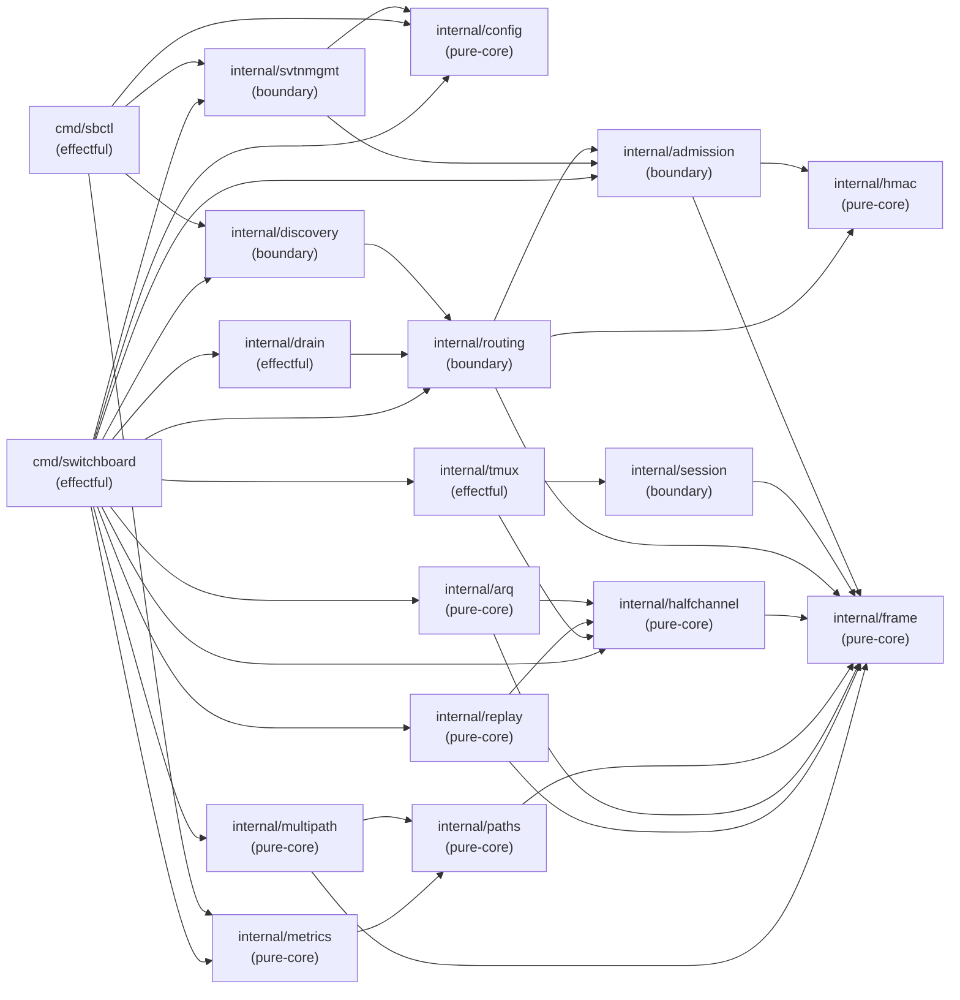

# ARCH-08: Dependency Graph

## Module Dependency DAG

> **Scope.** This document describes the **target architecture** of the
> complete Switchboard product — all packages planned across all waves of
> delivery. References below to packages such as `internal/session`,
> `internal/tmux`, `internal/paths`, `internal/arq`, `internal/replay`,
> `internal/multipath`, `internal/metrics`, `internal/discovery`,
> `internal/svtnmgmt`, `internal/drain`, `internal/config`, and the `sbctl`
> binary describe **planned** components, not committed code. For the
> authoritative list of packages currently present on the `develop` branch,
> consult §6.5 (current import positions). Section §6.6 tracks the
> wave-by-wave delivery plan for upcoming packages.

Import direction convention: `A → B` means package A imports package B (A depends on B).
**No cycles.** Any cycle is an architecture violation per SOUL.md #11.



> **Mermaid layer groupings vs. import-order positions:** The Mermaid diagram above
> groups packages into named layers (Layer 0: Foundation, Layer 1: Security, etc.)
> for visual readability by functional domain. These groupings do **not** represent
> strict import-order positions. The authoritative topological positions are in
> §6.5 (packages present on develop) and §6.6 (planned Wave 3+ packages). In
> particular, `internal/session` is shown in the Mermaid "Layer 1: Security" group
> alongside `internal/admission` and `internal/routing` because it is a security
> boundary module — but its import-order position is 6 (§6.6), above admission (4)
> and routing (5), because it imports `{frame, admission}`. Always consult §6.5/§6.6
> for import-ordering decisions; consult the Mermaid only for functional domain context.
> (Finding F-W3-M-004 from consistency-validator Wave-3 audit.)

## Topological Order (root → leaf)

Packages listed root-first. Any package may only import packages earlier in this list.

```
1.  internal/config         (no internal imports)
2.  internal/frame          (no internal imports)
3.  internal/hmac           (no internal imports)
4.  internal/admission      (imports: frame, hmac)
5.  internal/routing        (imports: frame, hmac, admission)
6.  internal/session        (imports: frame, admission)
7.  internal/halfchannel    (imports: frame)
8.  internal/paths          (imports: frame)
9.  internal/arq            (imports: frame, halfchannel)
10. internal/replay         (imports: frame, halfchannel)
11. internal/multipath      (imports: frame, paths)
12. internal/metrics        (imports: paths)
13. internal/tmux           (imports: halfchannel, session)
14. internal/discovery      (imports: routing)
15. internal/svtnmgmt       (imports: admission, config)
16. internal/drain          (imports: routing)
17. cmd/sbctl               (imports: metrics, discovery, svtnmgmt, config)
18. cmd/switchboard         (imports: all above)
```

## Cycle-Freeness Verification

Mental topological sort: no package in positions 1–16 imports any package at a higher
position. Verification:

- `internal/routing` imports `admission` (position 4) — OK (routing is 5, admission is 4).
- `internal/tmux` imports `session` (position 6) — OK (tmux is 13, session is 6).
- `internal/discovery` imports `routing` (position 5) — OK (discovery is 14, routing is 5).
- `cmd/sbctl` imports `svtnmgmt` (position 15) — OK (sbctl is 17, svtnmgmt is 15).
- No back-edges. DAG is acyclic.

## Boundary Violation Rules

The following import patterns are **forbidden**:

| Forbidden Pattern | Reason |
|------------------|--------|
| `internal/routing` → `internal/tmux` | Router must not import session-content code |
| `internal/frame` → any other internal | Frame is a leaf; importing would create a cycle |
| `internal/hmac` → any other internal | HMAC is a leaf |
| Any package → `cmd/sbctl` | Commands are effectful tops; never imported by library code |
| Any package → `cmd/switchboard` | main is the top; never imported |

These are enforced by `go vet` (import cycle detection) and lint rules. Any CI
failure from import cycles is a P0 blocker.

## Notes on Deliberate Coupling

- `internal/routing` imports `internal/admission` because routing decisions depend
  on the admitted node set (SVTN partition). This is intentional — routing and
  admission are tightly coupled at the router boundary.
- `internal/session` is imported by both `internal/tmux` (access node enforces
  Tier 2) and `cmd/sbctl` (console control). The session package is a pure
  authorization boundary, not an I/O package, so this coupling is clean.

## §6 Import Constraints

The dependency graph in §§1–5 is a hard contract on import direction. The
following constraints apply to every Go file under `internal/`. This section
codifies what the compiler and `go vet` already enforce structurally and what
the consistency-validator audits at every wave gate.

### §6.1 Topological ordering (Wave-2 baseline — see §6.5 for current state)

Each package occupies a fixed position in the DAG. A package at position N may
only import packages at positions 1..N-1. The table below covers all `internal/`
packages present on `develop` at Wave-2 close (f35e836). For the live Wave-3
state (including `internal/session` and `internal/tmux`), consult §6.5.

| Position | Package | Allowed imports | Classification |
|----------|---------|-----------------|----------------|
| 1 | `internal/frame` | ∅ (stdlib only) | pure-core |
| 2 | `internal/hmac` | ∅ (stdlib only) | pure-core |
| 3 | `internal/halfchannel` | {frame} | pure-core |
| 4 | `internal/admission` | {frame, hmac} | boundary |
| 5 | `internal/routing` | {frame, hmac, admission} | boundary |

Positions 6 and above are reserved for packages introduced in later waves; they
must be declared here before their first commit (see §6.4).

Verified against `grep -rn "switchboard/internal" --include="*.go" internal/ | grep -v _test.go`
at f35e836. No deviations found.

### §6.2 Forbidden edges

- `internal/frame` MUST NOT import any other `internal/` package.
- `internal/hmac` MUST NOT import any other `internal/` package.
- `internal/halfchannel` MUST NOT import `internal/admission` or `internal/routing`.
- `internal/admission` MUST NOT import `internal/routing`.
- No package may import a package at a higher position than itself.

### §6.3 Enforcement

- `go vet ./...` (run via `just lint`) catches cyclic imports at build time.
  Any import-cycle failure is a P0 CI blocker.
- The consistency-validator audits positional drift at every wave gate, verifying
  that no import edge exists outside the allowed set declared in §6.1.
- The adversary will flag any new import edge not declared in §6.1 as a finding
  requiring an explicit §6.4 declaration before the wave gate passes.

### §6.4 Adding a new internal package

New packages must, before their first commit to any branch:

1. Declare their position (1..N) in this section, extending the §6.1 table.
2. Declare their classification (pure-core vs boundary) per ARCH-09.
3. List their allowed imports explicitly in the §6.1 table.
4. Pass the consistency-validator check at the wave gate.

Undeclared packages discovered at the wave gate are an architecture violation.

### §6.5 Current import positions (post-Wave-3 S-3.03, develop @ `b68e498`)

> **cmd/switchboard position-18 note (S-4.00 daemon assembly):** `cmd/switchboard`
> occupies position 18 — the top leaf that imports every layer beneath it. As of
> develop @ b68e498, `cmd/switchboard/main.go` is a version-printing stub that wires
> none of the Wave-3 subsystems. Story **S-4.00** (daemon assembly) places position 18
> fully in scope: it wires the six obligations listed below. Position 18 is now
> **ACTIVE** — see §6.5.1 for the S-4.00 wiring specification. ADR-011 documents
> the SessionConnector.Frames() API decision and the FramesDropped surfacing strategy.

#### §6.5.1 S-4.00 daemon-assembly wiring obligations for cmd/switchboard

The following six wiring obligations make up the full-daemon scope of S-4.00. Each
maps to a buildability tier (see §6.6 feasibility register):

| # | Obligation | Packages used | Buildability |
|---|-----------|---------------|-------------|
| 1 | Inject real `routing.Logger` into `NewRouter` via `WithLogger` so `RouteFrame` E-ADM-016 paths write to `os.Stderr` (or a `log.New` sink) in production builds. **Wave-3 data-path clarification (v2.0):** The `routing.Router` constructed by obligation 1 is NOT in the Wave-3 frame data path — there is no network-ingress listener wired in S-W3.04. The router is constructed with a live logger so that (a) it is non-nil and non-noop in the binary, and (b) AC-001's `TestRouterLoggerEmitsEADM016` can call `RouteFrame` on the returned `*routing.Router` instance directly to verify E-ADM-016 emission. **The router instance returned by `buildRouter` MUST NOT be discarded** (`_ = buildRouter(keys)` is wrong); it MUST be assigned to a named variable and passed to the AC-001 test via the exported test surface or a package-level accessor. Additionally, `buildRouter` MUST receive the **same** `*admission.AdmittedKeySet` used by `buildAccessNode` — both must share one keyset instance so AC-001 can register a key, call `buildRouter(keys).RouteFrame(...)`, and observe the E-ADM-016 log without a separate keyset. The network-ingress wiring (router in live data path) is deferred to a future story. | `internal/routing` (exists) | BUILDABLE NOW |
| 2 | Construct `admission.AdmittedKeySet`, `session.Publisher`, `session.SessionAuth`, then wire `NewAccessNode(pub, auth, WithKeystrokeSink(sc))` replacing the nil/NoOp defaults | `internal/admission`, `internal/session` (both exist) | BUILDABLE NOW |
| 3 | Instantiate Sweep eviction `time.Ticker` in `main()` and call `accessNode.Sweep(deadline)` on each tick. **I-1 wg-join clarification (v2.2):** `startSweepTicker` MUST accept a `*sync.WaitGroup`, call `wg.Add(1)` before launching its goroutine, and call `defer wg.Done()` inside. This ensures BC-2.04.007 PC-2 postcondition 6 ("no goroutines leaked — verified by test with `t.Cleanup` + short timeout") is deterministically verifiable: the test's `wg.Wait()` blocks until the sweep ticker goroutine has exited, not just until ctx is cancelled. | `internal/session` (exists); `time.Ticker` stdlib | BUILDABLE NOW |
| 4 | Pipe `SessionConnector.Frames()` → `accessNode.DeliverFrame()` in a goroutine after `sc.Connect(ctx)` succeeds. Requires `SessionConnector.Frames()` API to be pinned (drift W3-R2-M4); see ADR-011 for the chosen design. **Testability refinement (v2.1):** `runAccess` is split into a thin constructor wrapper + `runAccessWithConnector(ctx, stderr, connectorIface)` where `connectorIface` covers `Connect/Frames/Err/Close/RelayDropped`. Tests inject a `fakeConnector` to exercise PC-2 (clean) and PC-2.6 (mid-session double-failure → exit 1) end-to-end through the production function. See ARCH-01 ADR-011 Amendment v1.5 §HIGH-B. | `internal/tmux` (exists); ADR-011 (new) | BUILDABLE NOW after ADR-011 pins API |
| 5 | Replace `NoOpAuthorizer` with live `*SessionAuth` (drift W3-M-3; fail-open closed) | `internal/session` (exists) | BUILDABLE NOW (done by obligation 2 above) |
| 6 | Surface `accessNode.FramesDropped()` counter via periodic structured log line (drift W3-R2-M3) — no metrics endpoint or sbctl needed. **I-1 wg-join clarification (v2.2):** `startFramesDroppedTicker` MUST accept a `*sync.WaitGroup`, call `wg.Add(1)` before launching its goroutine, and call `defer wg.Done()` inside. Same rationale as obligation 3: BC-2.04.007 PC-2 postcondition 6 requires deterministic leak verification via wg-join, not race-prone timeout-without-join. | `internal/session` (exists); `log` / `fmt` stdlib | BUILDABLE NOW |

**No hard blockers.** All six obligations are buildable using only packages present
on develop @ b68e498. `internal/config`, `internal/drain`, and `internal/metrics`
(Wave 4+) are NOT imported by S-4.00 — see §6.6 feasibility register for
detailed rationale.

> **C-1 RESOLVED — FailureCounter wiring (PR #20, commit 418de54, 2026-06-27):**
> `buildRouter` in `cmd/switchboard/access.go` now constructs
> `admission.NewFailureCounter(hmacFailureThreshold=5, hmacFailureWindow=60s, logger)`
> and wires `routing.WithFailureCounter(fc)` alongside `routing.WithLogger(rl)`.
> The partial-wiring concern raised in the Wave-3 wave-level adversarial pass-1 is
> closed. Both E-ADM-016 (per-failure log, BC-2.05.008 PC-5) and E-ADM-017
> (per-source HMAC failure-rate alert at threshold=5/window=60s, BC-2.05.005 PC-3)
> are now wired into the production router. Verified by
> `TestBuildRouter_WithFailureCounter_FiveFailures_TriggersEADM017`, which drives
> the production `buildAccessComponents` path and confirms E-ADM-017 fires after
> 5 PATH-A HMAC failures. Finding OBS-3 is resolved.
>
> **Only remaining deferral at this boundary:** The network-ingress LISTENER — the
> daemon does not yet bind or accept inbound network frames. This is tracked as
> story S-BL.NI. Until S-BL.NI lands, `RouteFrame` has no live non-test caller in
> `cmd/switchboard`; the counter and logger are wired and correct but neither event
> code fires in production. No partial-wiring obligation remains outstanding for the
> failure counter itself.

The following packages are present in `internal/` on develop. Positions are
strict — position N may import packages at positions 1..N-1 only.

| Position | Package | Allowed imports | Classification | Wave |
|----------|---------|-----------------|----------------|------|
| 1 | `internal/frame` | ∅ (stdlib only) | pure-core | Wave 1 |
| 2 | `internal/hmac` | ∅ (stdlib only) | pure-core | Wave 2 (S-2.01) |
| 3 | `internal/halfchannel` | {frame} | pure-core | Wave 1 |
| 4 | `internal/admission` | {frame, hmac} | boundary | Wave 2 (S-2.02 + S-1.03) |
| 5 | `internal/routing` | {frame, hmac, admission} | boundary | Wave 2 (S-2.02) |
| 6 | `internal/session` | {frame, admission} (upstream.go + fanout.go import frame; session.go imports admission) | boundary | Wave 3 (S-3.01a) |
| 7 | `internal/tmux` | {halfchannel, session} | effectful (PTY, child process) | Wave 3 (S-3.01a) |

This table is authoritative for the develop branch. Any package not listed
above does NOT exist in the codebase.

Verified against `ls internal/` and
`grep -rn "switchboard/internal" --include="*.go" internal/ | grep -v _test.go`
at b68e498 (HEAD after S-3.01b #12, S-3.02 #13, S-3.03 #14). Import set
unchanged through S-3.03 — no new internal packages introduced since S-3.01a.

#### §6.5.2 S-4.00 import set for cmd/switchboard

When S-4.00 is complete, `cmd/switchboard` will import:

```
internal/admission      (AdmittedKeySet construction)
internal/frame          (OuterHeader — used in startFramesBridge to construct frame.OuterHeader
                          delivered to AccessNode.DeliverFrame; DAG position 2, leaf, no forbidden edge)
internal/routing        (NewRouter, WithLogger)
internal/session        (Publisher, SessionAuth, AccessNode, NewAccessNode, WithKeystrokeSink)
internal/tmux           (ControlMode, PTYProxy, SessionConnector, NewSessionConnector, WithControlModeFactory)
internal/halfchannel    (HalfChannel, for ControlMode / PTYProxy construction)
```

> **v2.1 note:** `internal/frame` is added to this import set (finding from
> S-W3.04 adversarial convergence pass-2 — MEDIUM ruling). `access.go`'s
> `startFramesBridge` already imports `internal/frame` for `frame.OuterHeader`
> (used when delivering frames to `AccessNode.DeliverFrame`). `internal/frame` is a
> foundation-layer leaf at DAG position 2 (no internal imports); adding it here
> introduces no new edges not already present in the target DAG (§§1–5), and no
> forbidden edge per §6.2. The FORBIDDEN set is unchanged.

Packages NOT imported by S-4.00 (deferred to later waves):
- `internal/config` — no file-based config loading in S-4.00; construction parameters are hardcoded or supplied via CLI flags
- `internal/drain` — graceful-drain lifecycle is a Wave 4+ story
- `internal/metrics` — no HTTP metrics endpoint; FramesDropped is surfaced via structured log only
- `cmd/sbctl` — never imported (top leaf; CLI tool)

> **EC-005 wording (accepted Wave-4 follow-up, v2.1):** The comment in
> `access.go` stating "CI enforces this structurally" overstates current
> enforcement. The real guard is that `internal/config`, `internal/drain`, and
> `internal/metrics` do not exist on develop — the compiler refuses the import.
> A durable `go list` CI assertion that explicitly forbids these edges even after
> the packages land in Wave 4+ does not yet exist. See ARCH-01 ADR-011 Amendment
> v1.5 §EC-005 for the accepted follow-up scope. Story-writer MUST correct the
> comment before the S-W3.04 gate.

This import set is consistent with ARCH-08 §§1–5 (no new edges introduced that
are not already in the target DAG), and introduces no forbidden edges per §6.2.

### §6.6 Planned positions (Wave 4+ prospective)

Positions 6 and 7 (`internal/session` and `internal/tmux`) were previously
planned here. They shipped in Wave 3 (S-3.01a, PR #11, merged 2026-06-26 at
`43208ab`) and are now listed in §6.5.

#### §6.6.1 S-4.00 feasibility register (daemon assembly buildability)

This register documents, for each of the six S-4.00 wiring obligations, whether
a required package/API exists on develop or not, and the resolution.

| Obligation | Required package or API | On develop? | Resolution |
|-----------|------------------------|-------------|-----------|
| (1) Router Logger injection | `routing.WithLogger` — exists in `routing.go` | YES | No action needed |
| (2) SessionAuth as Authorizer | `session.NewSessionAuth()`, `session.NewAccessNode(pub, auth, ...)` — all exist | YES | No action needed |
| (3) Sweep timer | `accessNode.Sweep(deadline)` — exists; `time.Ticker` stdlib | YES | No action needed |
| (4) SessionConnector.Frames() → DeliverFrame bridge | `ControlMode.Frames()` and `PTYProxy.Frames()` exist; `SessionConnector` has NO `Frames()` method yet | NO — but see resolution | ADR-011 pins the design: add `SessionConnector.Frames()` returning a forwarding channel that is re-plumbed on ctrl→PTY swap; this is a small addition to `internal/tmux/pty_fallback.go`, fully within S-4.00 scope. NOT a hard blocker — it requires one new exported method, not a new package. |
| (5) Replace NoOpAuthorizer | Satisfied by obligation (2) — `NewAccessNode` accepts `Authorizer`; `*SessionAuth` implements it | YES | No action needed |
| (6) FramesDropped structured log | `accessNode.FramesDropped()` exists; `log`/`fmt` stdlib | YES | No action needed |
| Future: config file loading | `internal/config` — NOT on develop | NOT on develop | DEFERRED to Wave 4+. S-4.00 hardcodes sweep deadline and uses CLI flags for any tuning needed. |
| Future: graceful drain | `internal/drain` — NOT on develop | NOT on develop | DEFERRED to Wave 4+. S-4.00 uses `os/signal` + `context.WithCancel` for a clean-exit signal only. |
| Future: /metrics HTTP endpoint | `internal/metrics` — NOT on develop | NOT on develop | DEFERRED to Wave 4+. S-4.00 surfaces FramesDropped as a structured log line on a ticker. |
| Future: sbctl CLI surface | `cmd/sbctl` — NOT on develop | NOT on develop | DEFERRED to Wave 4+. Not imported by cmd/switchboard. |

**HARD BLOCKER: NONE.** The one gap (SessionConnector.Frames()) is resolved by
adding a single exported method to `internal/tmux` within S-4.00 scope. No
future-wave package must be pulled forward.

#### §6.6.2 Post-Wave-3 prospective positions (Wave 4+)

Future waves will register new positions here before their first commit, per the
§6.4 protocol. Anticipated Wave 4+ additions (informational; subject to story
decomposition):

| Position (prospective) | Package | Wave |
|------------------------|---------|------|
| 8 | `internal/paths` | Wave 4 |
| 9 | `internal/arq` | Wave 4 |
| 10 | `internal/replay` | Wave 4 |
| 11 | `internal/multipath` | Wave 4 |
| 12 | `internal/metrics` | Wave 4+ |
| 13 | `internal/config` | Wave 4 |
| 14 | `internal/discovery` | Wave 5+ |
| 15 | `internal/svtnmgmt` | Wave 5+ |
| 16 | `internal/drain` | Wave 5+ |
| 17 | `cmd/sbctl` | Wave 5+ |

**Additional forbidden edges (carried forward from Wave 3):**
- `internal/session` MUST NOT import `internal/routing`.
  Session-level authorization state is managed within `internal/session` itself;
  routing is a peer layer, not a dependency.
- `internal/tmux` MUST NOT import `internal/admission` or `internal/routing`.
  Tmux is a pure I/O shell; all policy is in `internal/session`.

---

## Changelog

| Version | Date | Change |
|---------|------|--------|
| 1.0 | 2026-06-23 | Initial dependency graph, topological order, and boundary violation rules |
| 1.1 | 2026-06-25 | Added §6 Import Constraints (§§6.1–6.4) — explicit codification of DAG positions, forbidden edges, enforcement mechanism, and new-package protocol; prompted by Wave-2 gate audit finding WAVE-2-MED-001 |
| 1.2 | 2026-06-25 | Added §6.5: extended topological table declaring Wave 3 packages (`internal/session` at position 6, `internal/tmux` at position 13); backfilled all Wave 1–2 packages for completeness; additional forbidden edges for session and tmux |
| 1.3 | 2026-06-25 | Corrected §6.5: replaced hallucinated 16-package table (paths, arq, replay, multipath, metrics, tmux, discovery, svtnmgmt, drain, config, session not on develop) with the 5 packages actually present on develop at d8d7ae6; moved Wave 3 prospective packages (session, tmux) to new §6.6 as PLANNED; corrected session allowed imports to {frame, admission} per S-3.03 SessionAuth requirement |
| 1.4 | 2026-06-25 | Added §1 scope callout making the target-architecture-vs-current-state contract explicit: §§1–5 describe planned target architecture; §6.5 is authoritative for packages currently on develop; §6.6 tracks wave-by-wave delivery plan |
| 1.5 | 2026-06-25 | Added prose note after Mermaid diagram clarifying that Mermaid layer groupings reflect functional domain, not import-order positions; §6.5/§6.6 are authoritative for import ordering (consistency-validator finding F-W3-M-004) |
| 1.6 | 2026-06-26 | Promoted `internal/session` (pos 6) and `internal/tmux` (pos 7) from §6.6 PLANNED to §6.5 CURRENT following S-3.01a merge (PR #11, 43208ab); §6.6 updated to Wave 4+ planning placeholder |
| 1.7 | 2026-06-26 | WG3-H-003: Reconcile all topological position references to the correct ordering (admission=4, routing=5, session=6). Fix Topological Order section (session was incorrectly at 5, routing at 6). Fix Cycle-Freeness section (tmux→session now references position 6). Fix §6.5 session annotation to reflect actual imports: upstream.go+fanout.go import frame; session.go imports admission |
| 1.8 | 2026-06-26 | F-04 drift fix: update §6.5 heading and verification SHA from 43208ab (S-3.01a) to b68e498 (HEAD after S-3.01b #12, S-3.02 #13, S-3.03 #14); note import set unchanged through S-3.03 |
| 1.9 | 2026-06-27 | S-4.00 daemon assembly: register cmd/switchboard position 18 as ACTIVE SCOPE; add §6.5.1 (six wiring obligations + buildability tiers), §6.5.2 (S-4.00 import set, deferred packages), §6.6.1 (feasibility register with HARD BLOCKER: NONE ruling), §6.6.2 (Wave 4+ prospective positions). ADR-011 (SessionConnector.Frames()) pointer added. |
| 2.0 | 2026-06-27 | §6.5.1 obligation 1 clarified: router is constructed-but-not-yet-in-data-path in Wave 3 (no network-ingress listener). `buildRouter` return value MUST be assigned (not discarded). `buildRouter` MUST receive the same `*admission.AdmittedKeySet` instance as `buildAccessNode` (single shared keyset). AC-001 verification targets the returned router instance directly — it is non-tautological because it exercises the real `RouteFrame` → `verifyFrameHMAC` → logger path. Per S-W3.04 adversarial convergence adjudication. |
| 2.1 | 2026-06-27 | (MEDIUM) §6.5.2 import set: `internal/frame` added (OuterHeader carrier in `startFramesBridge`; DAG position 2 leaf; no forbidden edge). (HIGH-B) §6.5.1 obligation 4 note: `runAccess` injection seam — split into `runAccess` + `runAccessWithConnector(connectorIface)`; tests inject `fakeConnector` for PC-2/PC-2.6 end-to-end. (EC-005) §6.5.2 note: "CI enforces structurally" wording overstated; accepted Wave-4 follow-up. Per S-W3.04 adversarial convergence pass-2. |
| 2.2 | 2026-06-27 | Wave-3 wave-level adversarial pass-1 C-1/I-1 adjudication. C-1 TRACKED-DEFER: `routing.WithFailureCounter` wiring deferred to the future network-ingress story; TRACKED-DEFER note added after obligation table mandating that E-ADM-016 and E-ADM-017 MUST be wired together when `RouteFrame` enters the live data path; orchestrator MUST register a follow-up story/STATE drift item. I-1 wg-join: obligations 3 and 6 updated to require `startSweepTicker` and `startFramesDroppedTicker` to accept `*sync.WaitGroup` and track the goroutine with `wg.Add(1)` / `defer wg.Done()` so BC-2.04.007 PC-2 postcon-6 no-goroutine-leak assertion is deterministic. |
| 2.3 | 2026-06-27 | C-1 RESOLVED: `routing.WithFailureCounter(fc)` (threshold=5, window=60s) wired in `buildRouter` alongside `routing.WithLogger` — PR #20 (commit 418de54). Partial-wiring concern closed; BC-2.05.008 PC-5 and BC-2.05.005 PC-3 both satisfied. OBS-3 resolved. Only remaining deferral is the network-ingress listener (S-BL.NI). |
