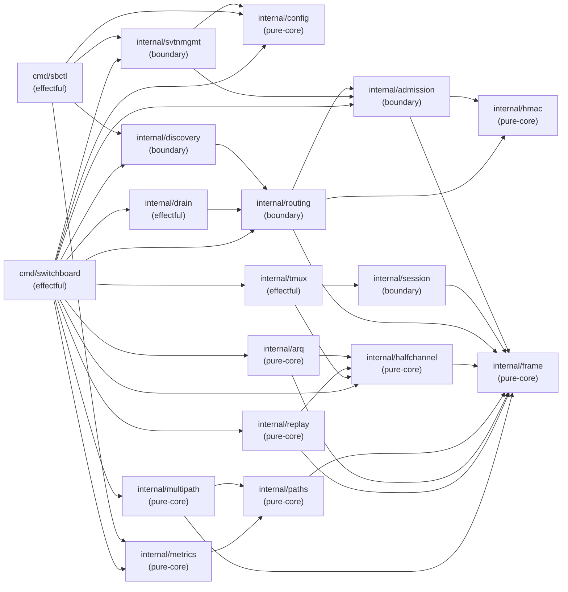

# ARCH-08: Dependency Graph

## Module Dependency DAG

Import direction convention: `A → B` means package A imports package B (A depends on B).
**No cycles.** Any cycle is an architecture violation per SOUL.md #11.



## Topological Order (root → leaf)

Packages listed root-first. Any package may only import packages earlier in this list.

```
1.  internal/config         (no internal imports)
2.  internal/frame          (no internal imports)
3.  internal/hmac           (no internal imports)
4.  internal/admission      (imports: frame, hmac)
5.  internal/session        (imports: frame)
6.  internal/routing        (imports: frame, hmac, admission)
7.  internal/halfchannel    (imports: frame)
8.  internal/paths          (imports: frame)
9.  internal/arq            (imports: frame, halfchannel)
10. internal/replay         (imports: frame, halfchannel)
11. internal/multipath      (imports: frame, paths)
12. internal/metrics        (imports: paths)
13. internal/tmux           (imports: halfchannel, session)
14. internal/discovery      (imports: routing)
15. internal/svtnmgmt       (imports: admission, config)
16. internal/drain          (imports: routing)
17. cmd/sbctl               (imports: metrics, discovery, svtnmgmt, config)
18. cmd/switchboard         (imports: all above)
```

## Cycle-Freeness Verification

Mental topological sort: no package in positions 1–16 imports any package at a higher
position. Verification:

- `internal/routing` imports `admission` (position 4) — OK (routing is 6, admission is 4).
- `internal/tmux` imports `session` (position 5) — OK (tmux is 13, session is 5).
- `internal/discovery` imports `routing` (position 6) — OK (discovery is 14, routing is 6).
- `cmd/sbctl` imports `svtnmgmt` (position 15) — OK (sbctl is 17, svtnmgmt is 15).
- No back-edges. DAG is acyclic.

## Boundary Violation Rules

The following import patterns are **forbidden**:

| Forbidden Pattern | Reason |
|------------------|--------|
| `internal/routing` → `internal/tmux` | Router must not import session-content code |
| `internal/frame` → any other internal | Frame is a leaf; importing would create a cycle |
| `internal/hmac` → any other internal | HMAC is a leaf |
| Any package → `cmd/sbctl` | Commands are effectful tops; never imported by library code |
| Any package → `cmd/switchboard` | main is the top; never imported |

These are enforced by `go vet` (import cycle detection) and lint rules. Any CI
failure from import cycles is a P0 blocker.

## Notes on Deliberate Coupling

- `internal/routing` imports `internal/admission` because routing decisions depend
  on the admitted node set (SVTN partition). This is intentional — routing and
  admission are tightly coupled at the router boundary.
- `internal/session` is imported by both `internal/tmux` (access node enforces
  Tier 2) and `cmd/sbctl` (console control). The session package is a pure
  authorization boundary, not an I/O package, so this coupling is clean.
